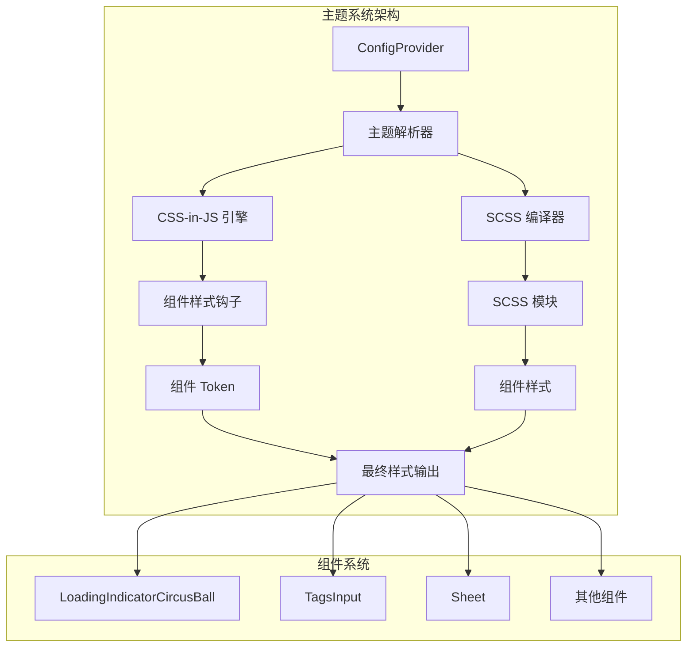
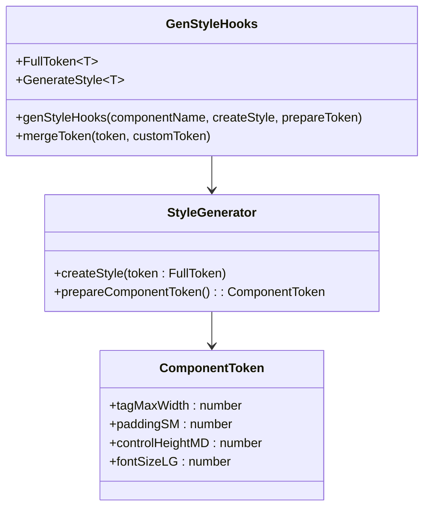
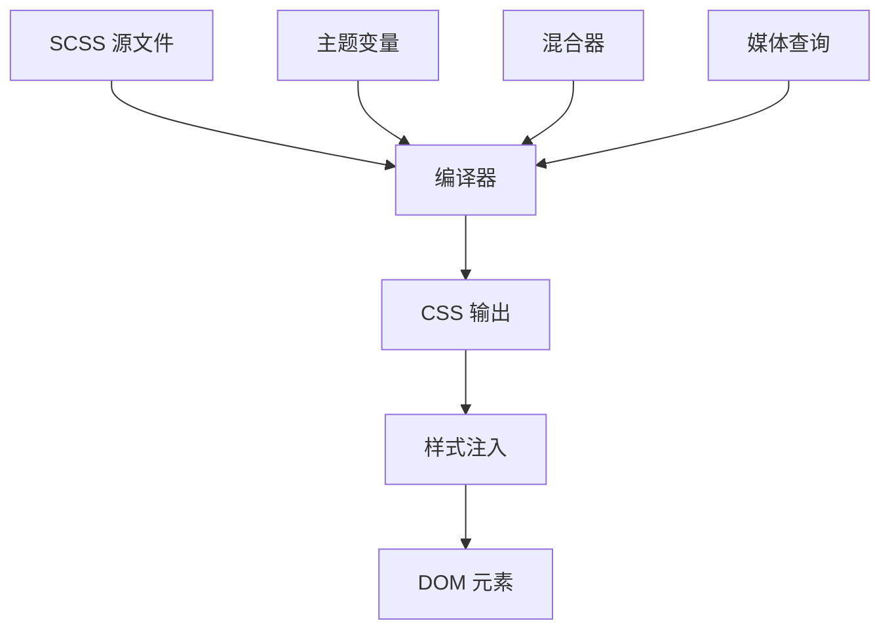
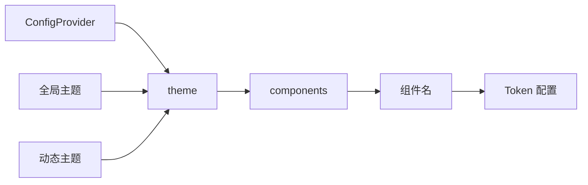
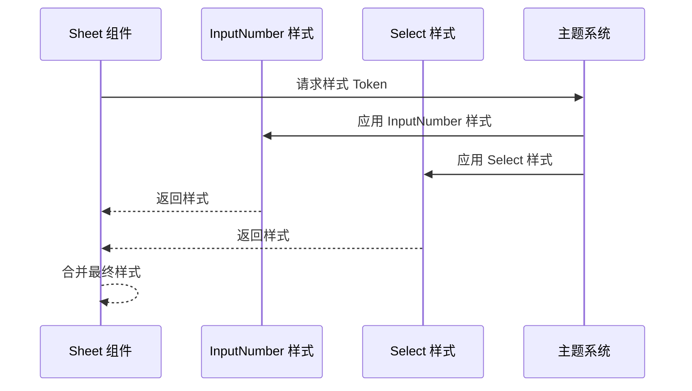
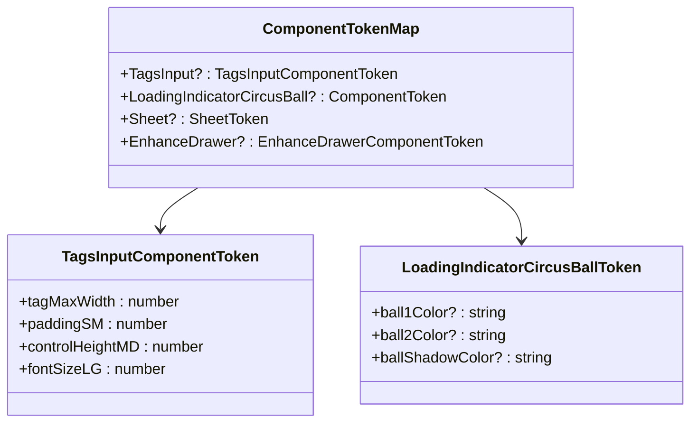

# 主题与定制化

<cite>
**本文档引用的文件**
- [package.json](file://package.json)
- [src/typings.d.ts](file://src/typings.d.ts)
- [src/index.ts](file://src/index.ts)
- [src/LoadingIndicatorCircusBall/index.tsx](file://src/LoadingIndicatorCircusBall/index.tsx)
- [src/LoadingIndicatorCircusBall/index.module.scss](file://src/LoadingIndicatorCircusBall/index.module.scss)
- [src/LoadingIndicatorCircusBall/useStyle.ts](file://src/LoadingIndicatorCircusBall/useStyle.ts)
- [src/LoadingIndicatorCircusBall/demo/theme-customization.tsx](file://src/LoadingIndicatorCircusBall/demo/theme-customization.tsx)
- [src/TagsInput/style/index.ts](file://src/TagsInput/style/index.ts)
- [src/TagsInput/index.md](file://src/TagsInput/index.md)
- [src/Sheet/style/index.ts](file://src/Sheet/style/index.ts)
- [src/Sheet/style/inputNumberStyle.ts](file://src/Sheet/style/inputNumberStyle.ts)
- [src/Sheet/style/selectStyle.ts](file://src/Sheet/style/selectStyle.ts)
</cite>

## 目录
1. [简介](#简介)
2. [项目架构概览](#项目架构概览)
3. [CSS-in-JS 主题系统](#css-in-js-主题系统)
4. [SCSS 样式系统](#scss-样式系统)
5. [ConfigProvider 主题配置](#configprovider-主题配置)
6. [组件主题定制详解](#组件主题定制详解)
7. [类型系统扩展](#类型系统扩展)
8. [最佳实践指南](#最佳实践指南)
9. [故障排除](#故障排除)
10. [总结](#总结)

## 简介

antd-ext 是一个基于 Ant Design 的扩展组件库，提供了丰富的主题定制能力。该项目采用现代化的主题系统，同时支持 CSS-in-JS 和 SCSS 两种样式解决方案，为开发者提供了灵活且强大的主题定制选项。

核心特性：
- **双引擎支持**：同时支持 CSS-in-JS 和 SCSS 样式系统
- **类型安全**：完整的 TypeScript 类型定义
- **组件级定制**：每个组件都支持独立的主题配置
- **ConfigProvider 集成**：无缝集成 Ant Design 的主题系统

## 项目架构概览

antd-ext 项目采用模块化架构，每个组件都有独立的样式管理和主题定制能力。



**图表来源**
- [src/LoadingIndicatorCircusBall/useStyle.ts](file://src/LoadingIndicatorCircusBall/useStyle.ts#L1-L345)
- [src/TagsInput/style/index.ts](file://src/TagsInput/style/index.ts#L1-L175)
- [src/Sheet/style/index.ts](file://src/Sheet/style/index.ts#L1-L32)

**章节来源**
- [src/index.ts](file://src/index.ts#L1-L7)
- [package.json](file://package.json#L1-L93)

## CSS-in-JS 主题系统

antd-ext 使用 `@ant-design/cssinjs` 库作为主要的 CSS-in-JS 解决方案，提供了强大的动态样式生成能力。

### 核心架构



**图表来源**
- [src/TagsInput/style/index.ts](file://src/TagsInput/style/index.ts#L1-L175)
- [src/LoadingIndicatorCircusBall/useStyle.ts](file://src/LoadingIndicatorCircusBall/useStyle.ts#L1-L345)

### 样式生成流程

1. **Token 准备阶段**：定义组件的默认设计令牌
2. **样式生成阶段**：根据 Token 生成最终样式
3. **样式应用阶段**：将样式注入到 DOM 中

**章节来源**
- [src/TagsInput/style/index.ts](file://src/TagsInput/style/index.ts#L1-L175)
- [src/LoadingIndicatorCircusBall/useStyle.ts](file://src/LoadingIndicatorCircusBall/useStyle.ts#L1-L345)

## SCSS 样式系统

除了 CSS-in-JS，antd-ext 还支持传统的 SCSS 样式系统，为开发者提供更多选择。

### SCSS 架构设计



**图表来源**
- [src/LoadingIndicatorCircusBall/index.module.scss](file://src/LoadingIndicatorCircusBall/index.module.scss#L1-L164)

### SCSS 特性

- **模块化**：每个组件都有独立的 SCSS 模块
- **变量系统**：支持 SCSS 变量和混合器
- **响应式设计**：内置响应式断点系统
- **动画支持**：完整的 CSS 动画支持

**章节来源**
- [src/LoadingIndicatorCircusBall/index.module.scss](file://src/LoadingIndicatorCircusBall/index.module.scss#L1-L164)

## ConfigProvider 主题配置

antd-ext 完全兼容 Ant Design 的 ConfigProvider，支持通过 `theme.components` 配置项进行主题定制。

### 基本配置结构



**图表来源**
- [src/LoadingIndicatorCircusBall/demo/theme-customization.tsx](file://src/LoadingIndicatorCircusBall/demo/theme-customization.tsx#L1-L30)

### 支持的组件主题配置

| 组件名 | Token 类型 | 主要配置项 | 默认值 |
|--------|------------|------------|--------|
| LoadingIndicatorCircusBall | Color Tokens | ball1Color, ball2Color, ballShadowColor | 内置配色方案 |
| TagsInput | Size & Spacing | tagMaxWidth, paddingSM, controlHeightMD | Ant Design 设计令牌 |
| Sheet | Layout Tokens | 无特殊配置 | 基于 Table 样式 |

**章节来源**
- [src/LoadingIndicatorCircusBall/demo/theme-customization.tsx](file://src/LoadingIndicatorCircusBall/demo/theme-customization.tsx#L1-L30)
- [src/TagsInput/index.md](file://src/TagsInput/index.md#L126-L145)

## 组件主题定制详解

### LoadingIndicatorCircusBall 主题定制

LoadingIndicatorCircusBall 组件提供了丰富的颜色定制选项：

#### 可配置的 Token

| Token 名称 | 类型 | 默认值 | 说明 |
|------------|------|--------|------|
| ball1Color | string | '#397BF9' | 第一个球体的颜色 |
| ball2Color | string | '#F4B400' | 第二个球体的颜色 |
| ball3Color | string | '#EEEEEE' | 第三个球体的颜色 |
| ball4Color | string | '#00A656' | 第四个球体的颜色 |
| ball5Color | string | '#E3746B' | 第五个球体的颜色 |
| ballShadowColor | string | 'rgba(0, 0, 0, 0.1)' | 球体阴影颜色 |

#### 使用示例

```typescript
// 基本主题定制
<ConfigProvider
  theme={{
    components: {
      LoadingIndicatorCircusBall: {
        ball1Color: '#1890ff',
        ball2Color: '#52c41a',
        ball3Color: '#faad14',
        ball4Color: '#f5222d',
        ball5Color: '#722ed1',
        ballShadowColor: 'rgba(0, 0, 0, 0.2)',
      },
    },
  }}
>
  {/* 组件内容 */}
</ConfigProvider>
```

**章节来源**
- [src/LoadingIndicatorCircusBall/useStyle.ts](file://src/LoadingIndicatorCircusBall/useStyle.ts#L15-L28)
- [src/LoadingIndicatorCircusBall/demo/theme-customization.tsx](file://src/LoadingIndicatorCircusBall/demo/theme-customization.tsx#L1-L30)

### TagsInput 主题定制

TagsInput 组件支持更细粒度的尺寸和间距定制：

#### 可配置的 Token

| Token 名称 | 类型 | 默认值 | 说明 |
|------------|------|--------|------|
| tagMaxWidth | number | 100 | 标签最大宽度 |
| paddingSM | number | 4 | 小尺寸内边距 |
| paddingMD | number | 6 | 中等尺寸内边距 |
| paddingLG | number | 8 | 大尺寸内边距 |
| marginSM | number | 4 | 小尺寸外边距 |
| marginMD | number | 6 | 中等尺寸外边距 |
| marginLG | number | 8 | 大尺寸外边距 |
| controlHeightSM | number | 24 | 小尺寸高度 |
| controlHeightMD | number | 32 | 中等尺寸高度 |
| controlHeightLG | number | 40 | 大尺寸高度 |
| fontSizeSM | number | 12 | 小尺寸字体大小 |
| fontSizeMD | number | 14 | 中等尺寸字体大小 |
| fontSizeLG | number | 16 | 大尺寸字体大小 |

**章节来源**
- [src/TagsInput/style/index.ts](file://src/TagsInput/style/index.ts#L10-L40)
- [src/TagsInput/index.md](file://src/TagsInput/index.md#L126-L145)

### Sheet 组件样式定制

Sheet 组件通过组合其他组件的样式实现定制：

#### 样式覆盖策略



**图表来源**
- [src/Sheet/style/index.ts](file://src/Sheet/style/index.ts#L1-L32)
- [src/Sheet/style/inputNumberStyle.ts](file://src/Sheet/style/inputNumberStyle.ts#L1-L24)
- [src/Sheet/style/selectStyle.ts](file://src/Sheet/style/selectStyle.ts#L1-L26)

**章节来源**
- [src/Sheet/style/index.ts](file://src/Sheet/style/index.ts#L1-L32)
- [src/Sheet/style/inputNumberStyle.ts](file://src/Sheet/style/inputNumberStyle.ts#L1-L24)
- [src/Sheet/style/selectStyle.ts](file://src/Sheet/style/selectStyle.ts#L1-L26)

## 类型系统扩展

antd-ext 通过 TypeScript 扩展了 Ant Design 的类型系统，确保主题定制的类型安全。

### 类型扩展架构



**图表来源**
- [src/typings.d.ts](file://src/typings.d.ts#L24-L33)

### 类型定义文件

src/typings.d.ts 文件扩展了 Ant Design 的类型系统：

#### 主要扩展点

1. **组件 Token 映射**：为每个组件定义对应的 Token 类型
2. **本地化接口扩展**：支持组件级别的本地化配置
3. **主题配置类型**：确保 ConfigProvider 的 theme.components 配置类型安全

**章节来源**
- [src/typings.d.ts](file://src/typings.d.ts#L1-L34)

## 最佳实践指南

### 1. 选择合适的样式系统

- **CSS-in-JS**：适合需要动态主题切换的应用
- **SCSS**：适合静态主题或需要复杂样式逻辑的场景
- **混合使用**：根据具体需求选择最适合的方案

### 2. 主题命名规范

```typescript
// 推荐的 Token 命名
interface CustomComponentToken {
  primaryColor: string;        // 主色调
  secondaryColor: string;      // 辅助色
  borderRadius: number;        // 圆角半径
  spacingUnit: number;         // 间距单位
  fontFamily: string;          // 字体族
}
```

### 3. 性能优化建议

- **避免过度嵌套**：减少样式选择器的复杂度
- **合理使用缓存**：利用 CSS-in-JS 的样式缓存机制
- **按需加载**：只加载实际使用的主题配置

### 4. 兼容性考虑

- **向后兼容**：保持现有主题配置的兼容性
- **渐进增强**：新功能不影响旧版本的使用
- **浏览器支持**：确保主题在目标浏览器中的表现一致

## 故障排除

### 常见问题及解决方案

#### 1. 主题配置不生效

**问题描述**：配置了主题但样式没有改变

**解决方案**：
- 检查 ConfigProvider 的层级是否正确
- 确认 Token 名称拼写正确
- 验证组件是否支持该 Token

#### 2. 类型错误

**问题描述**：TypeScript 报告类型错误

**解决方案**：
- 检查 src/typings.d.ts 是否正确导入
- 确认组件的 Token 接口定义完整
- 重启开发服务器

#### 3. SCSS 编译失败

**问题描述**：SCSS 文件无法正常编译

**解决方案**：
- 检查 SCSS 语法是否正确
- 确认依赖包版本兼容性
- 查看构建工具的配置

**章节来源**
- [src/LoadingIndicatorCircusBall/useStyle.ts](file://src/LoadingIndicatorCircusBall/useStyle.ts#L328-L335)

## 总结

antd-ext 提供了一个强大而灵活的主题定制系统，通过 CSS-in-JS 和 SCSS 两种方式满足不同场景的需求。项目的核心优势包括：

1. **双重引擎支持**：CSS-in-JS 提供动态主题能力，SCSS 提供传统样式管理
2. **类型安全保障**：完整的 TypeScript 类型定义确保开发体验
3. **组件级定制**：每个组件都可以独立进行主题配置
4. **Ant Design 集成**：无缝集成现有的 Ant Design 生态系统

通过合理的主题配置和类型系统扩展，开发者可以轻松创建符合品牌特色的用户界面，同时保持代码的可维护性和扩展性。