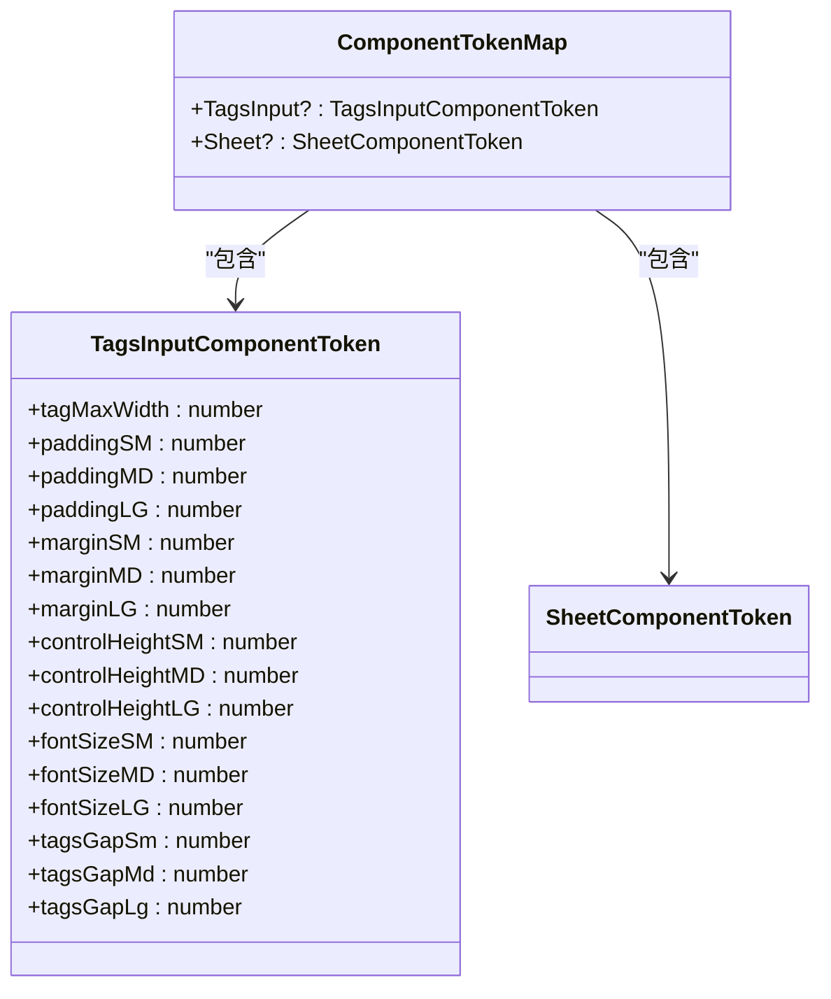
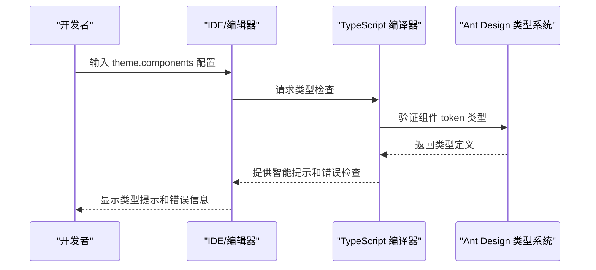
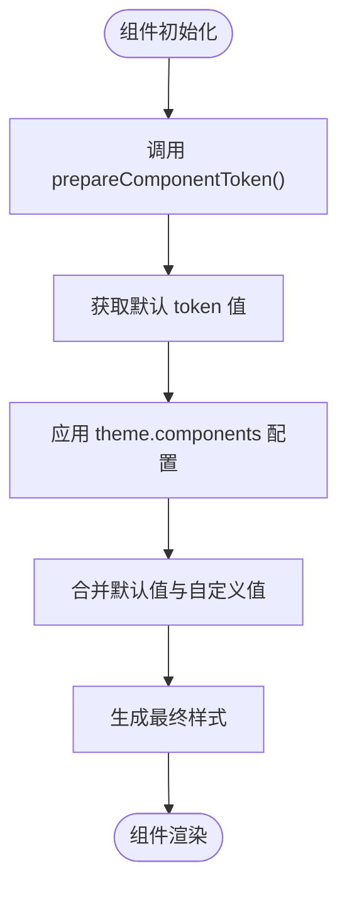

# 主题变量配置

<cite>
**本文档引用的文件**
- [src/typings.d.ts](file://src/typings.d.ts)
- [src/TagsInput/style/index.ts](file://src/TagsInput/style/index.ts)
- [src/Sheet/style/index.ts](file://src/Sheet/style/index.ts)
- [src/TagsInput/index.md](file://src/TagsInput/index.md)
</cite>

## 目录
1. [简介](#简介)
2. [主题变量配置机制](#主题变量配置机制)
3. [ComponentToken 接口定义](#componenttoken-接口定义)
4. [类型安全的主题配置](#类型安全的主题配置)
5. [全局主题配置示例](#全局主题配置示例)
6. [prepareComponentToken 函数](#preparecomponenttoken-函数)

## 简介
本文档详细说明了如何通过 ConfigProvider 的 theme.components 配置项来定制 antd-ext 组件的主题变量。重点介绍 TagsInput 和 Sheet 组件的 ComponentToken 接口定义方式，以及如何覆盖 tagMaxWidth、paddingSM、controlHeightMD 等设计 token。结合类型系统实现类型安全的主题配置，并提供实际的 TypeScript 示例代码。

## 主题变量配置机制
antd-ext 组件库支持通过 ConfigProvider 的 theme.components 配置项进行主题定制。开发者可以在应用的根级别统一配置各个组件的主题变量，这些配置将向下传递并应用于所有对应的组件实例。

主题配置遵循 Ant Design 的设计系统规范，使用 design token 的方式来定义组件的视觉属性。通过这种方式，可以实现一致的设计语言和灵活的主题定制能力。

**Section sources**
- [src/TagsInput/index.md](file://src/TagsInput/index.md#L126-L145)

## ComponentToken 接口定义

### TagsInput 组件的 ComponentToken
TagsInput 组件定义了丰富的主题变量，允许开发者精细控制组件的外观。这些变量在 `src/TagsInput/style/index.ts` 文件中通过 ComponentToken 接口进行定义：

```typescript
export interface ComponentToken {
  /** 标签最大宽度 */
  tagMaxWidth: number;
  /** 小尺寸内边距 */
  paddingSM: number;
  /** 中等尺寸内边距 */
  paddingMD: number;
  /** 大尺寸内边距 */
  paddingLG: number;
  /** 小尺寸外边距 */
  marginSM: number;
  /** 中等尺寸外边距 */
  marginMD: number;
  /** 大尺寸外边距 */
  marginLG: number;
  /** 小尺寸高度 */
  controlHeightSM: number;
  /** 中等尺寸高度 */
  controlHeightMD: number;
  /** 大尺寸高度 */
  controlHeightLG: number;
  /** 小尺寸字体大小 */
  fontSizeSM: number;
  /** 中等尺寸字体大小 */
  fontSizeMD: number;
  /** 大尺寸字体大小 */
  fontSizeLG: number;
  tagsGapSm: number;
  tagsGapMd: number;
  tagsGapLg: number;
}
```

这些 token 覆盖了组件的尺寸、间距、字体等关键视觉属性，提供了全面的定制能力。

### Sheet 组件的 ComponentToken
与 TagsInput 不同，Sheet 组件的 ComponentToken 接口为空：

```typescript
export interface ComponentToken {}
```

这是因为 Sheet 组件本质上是对 Ant Design Table 组件的封装，主要通过继承和组合的方式复用现有样式，而不是定义新的设计 token。



**Diagram sources**
- [src/TagsInput/style/index.ts](file://src/TagsInput/style/index.ts#L10-L40)
- [src/Sheet/style/index.ts](file://src/Sheet/style/index.ts#L9-L10)

**Section sources**
- [src/TagsInput/style/index.ts](file://src/TagsInput/style/index.ts#L10-L40)
- [src/Sheet/style/index.ts](file://src/Sheet/style/index.ts#L9-L10)

## 类型安全的主题配置
为了实现类型安全的主题配置，antd-ext 通过扩展 Ant Design 的类型系统来支持自定义组件的 theme 配置。这一机制在 `src/typings.d.ts` 文件中实现：

```typescript
declare module 'antd/es/theme/interface/components' {
  interface ComponentTokenMap {
    TagsInput?: TagsInputComponentToken;
    EnhanceDrawer?: EnhanceDrawerComponentToken;
    EnhancedSelect?: EnhanceSelectComponentToken;
    EnhanceTable?: EnhanceTableComponentToken;
    Sheet?: SheetToken;
  }
}
```

通过这种模块声明合并（module augmentation）的技术，将自定义组件的 token 类型注入到 Ant Design 的核心类型系统中。这样，当开发者在 ConfigProvider 的 theme 配置中使用这些组件时，TypeScript 编译器能够提供完整的类型检查和智能提示。

这种设计确保了主题配置的类型安全性，避免了拼写错误和无效的配置项，同时提供了良好的开发体验。



**Diagram sources**
- [src/typings.d.ts](file://src/typings.d.ts#L24-L32)

**Section sources**
- [src/typings.d.ts](file://src/typings.d.ts#L24-L32)

## 全局主题配置示例
以下 TypeScript 代码演示了如何在项目中全局配置 TagsInput 组件的主题变量：

```typescript
import { ConfigProvider } from 'antd';
import { TagsInput } from '@byte.n/antd-ext';

function App() {
  return (
    <ConfigProvider
      theme={{
        components: {
          TagsInput: {
            tagMaxWidth: 120,
            paddingSM: 6,
            paddingMD: 8,
            paddingLG: 10,
            controlHeightSM: 28,
            controlHeightMD: 36,
            controlHeightLG: 44,
            fontSizeSM: 14,
            fontSizeMD: 16,
            fontSizeLG: 18,
          },
        },
      }}
    >
      <TagsInput />
    </ConfigProvider>
  );
}
```

在这个示例中，通过 ConfigProvider 的 theme 配置项，为 TagsInput 组件设置了自定义的主题变量。这些配置将应用于应用中所有 TagsInput 组件实例，确保了一致的视觉风格。

**Section sources**
- [src/TagsInput/index.md](file://src/TagsInput/index.md#L126-L145)

## prepareComponentToken 函数
prepareComponentToken 函数用于提供组件主题变量的默认值。在 `src/TagsInput/style/index.ts` 文件中，该函数的实现如下：

```typescript
const prepareComponentToken: GetDefaultToken<'TagsInput'> = () => ({
  tagMaxWidth: 100,
  paddingSM: 4,
  paddingMD: 6,
  paddingLG: 8,
  marginSM: 4,
  marginMD: 6,
  marginLG: 8,
  controlHeightSM: 24,
  controlHeightMD: 32,
  controlHeightLG: 40,
  fontSizeSM: 12,
  fontSizeMD: 14,
  fontSizeLG: 16,
  tagsGapLg: 6,
  tagsGapMd: 4,
  tagsGapSm: 2,
});
```

这个函数返回一个包含所有主题变量默认值的对象。当开发者没有在 theme 配置中指定某个变量时，系统将使用这里定义的默认值。这种设计确保了组件在没有自定义配置时也能正常显示，同时为开发者提供了清晰的默认设计参考。

prepareComponentToken 函数与 genStyleHooks 一起使用，构成了 antd-ext 组件主题系统的核心机制。



**Diagram sources**
- [src/TagsInput/style/index.ts](file://src/TagsInput/style/index.ts#L147-L166)

**Section sources**
- [src/TagsInput/style/index.ts](file://src/TagsInput/style/index.ts#L147-L166)