# CSS-in-JS 样式定制

<cite>
**本文档中引用的文件**
- [src/LoadingIndicatorCircusBall/useStyle.ts](file://src/LoadingIndicatorCircusBall/useStyle.ts)
- [src/LoadingIndicatorCircusBall/index.tsx](file://src/LoadingIndicatorCircusBall/index.tsx)
- [src/LoadingIndicatorCircusBall/demo/theme-customization.tsx](file://src/LoadingIndicatorCircusBall/demo/theme-customization.tsx)
- [src/Sheet/style/index.ts](file://src/Sheet/style/index.ts)
- [src/Sheet/style/inputNumberStyle.ts](file://src/Sheet/style/inputNumberStyle.ts)
- [src/Sheet/style/selectStyle.ts](file://src/Sheet/style/selectStyle.ts)
- [src/TagsInput/style/index.ts](file://src/TagsInput/style/index.ts)
- [src/hooks/useComponentFactory.tsx](file://src/hooks/useComponentFactory.tsx)
- [src/typings.d.ts](file://src/typings.d.ts)
- [package.json](file://package.json)
</cite>

## 目录
1. [简介](#简介)
2. [项目架构概览](#项目架构概览)
3. [核心样式系统](#核心样式系统)
4. [createStyle 函数详解](#createstyle-函数详解)
5. [主题令牌系统](#主题令牌系统)
6. [useStyle 钩子机制](#usestyle-钩子机制)
7. [组件样式注册](#组件样式注册)
8. [ConfigProvider 主题定制](#configprovider-主题定制)
9. [实际应用示例](#实际应用示例)
10. [SCSS 对比分析](#scss-对比分析)
11. [最佳实践建议](#最佳实践建议)
12. [总结](#总结)

## 简介

antd-ext 是一个基于 Ant Design 的扩展组件库，采用了先进的 CSS-in-JS 样式定制方案。该项目充分利用了 Ant Design 内置的主题系统，通过 `@ant-design/cssinjs` 库实现了动态样式生成、主题切换和样式隔离等功能。本文档将深入解析 antd-ext 如何基于 Ant Design 的 theme/internal 模块构建强大的样式定制能力。

## 项目架构概览

antd-ext 项目采用模块化架构设计，每个组件都有独立的样式模块和主题配置：

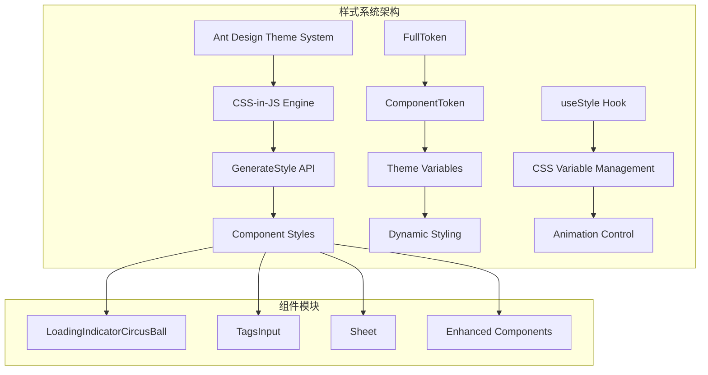

**图表来源**
- [src/LoadingIndicatorCircusBall/useStyle.ts](file://src/LoadingIndicatorCircusBall/useStyle.ts#L1-L345)
- [src/Sheet/style/index.ts](file://src/Sheet/style/index.ts#L1-L33)

**章节来源**
- [src/LoadingIndicatorCircusBall/useStyle.ts](file://src/LoadingIndicatorCircusBall/useStyle.ts#L1-L50)
- [src/Sheet/style/index.ts](file://src/Sheet/style/index.ts#L1-L33)

## 核心样式系统

antd-ext 的样式系统建立在 Ant Design 的 CSS-in-JS 基础之上，主要包含以下核心概念：

### 核心依赖包

项目依赖的关键包包括：
- `@ant-design/cssinjs`: 提供 CSS-in-JS 功能的核心引擎
- `antd/es/theme/internal`: Ant Design 内部主题系统的 API

### 核心类型定义

系统定义了几个关键类型来管理样式和主题：

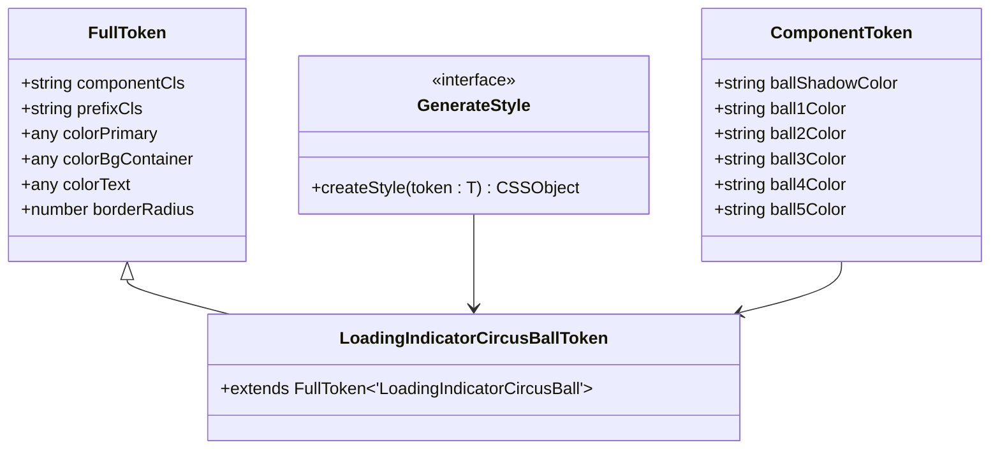

**图表来源**
- [src/LoadingIndicatorCircusBall/useStyle.ts](file://src/LoadingIndicatorCircusBall/useStyle.ts#L1-L30)
- [src/TagsInput/style/index.ts](file://src/TagsInput/style/index.ts#L10-L40)

**章节来源**
- [src/LoadingIndicatorCircusBall/useStyle.ts](file://src/LoadingIndicatorCircusBall/useStyle.ts#L1-L30)
- [src/TagsInput/style/index.ts](file://src/TagsInput/style/index.ts#L1-L40)

## createStyle 函数详解

`createStyle` 是 antd-ext 样式系统的核心函数，它定义了组件的样式逻辑并返回 CSS-in-JS 对象。

### 函数签名和参数

`createStyle` 使用泛型类型 `GenerateStyle<T>`，其中 `T` 必须是 `FullToken` 的子类型：

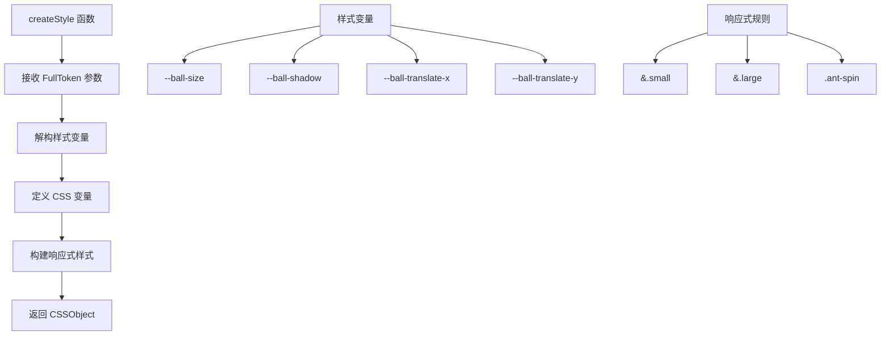

**图表来源**
- [src/LoadingIndicatorCircusBall/useStyle.ts](file://src/LoadingIndicatorCircusBall/useStyle.ts#L33-L326)

### 样式生成流程

样式生成遵循以下流程：

1. **参数解构**: 从 `FullToken` 中提取必要的样式变量
2. **CSS 变量定义**: 定义组件专用的 CSS 自定义属性
3. **响应式设计**: 支持 small、default、large 三种尺寸
4. **动画配置**: 定义关键帧动画和过渡效果
5. **嵌套选择器**: 处理复杂的组件内部结构

### 样式对象结构

返回的 CSSObject 遵循特定的结构模式：

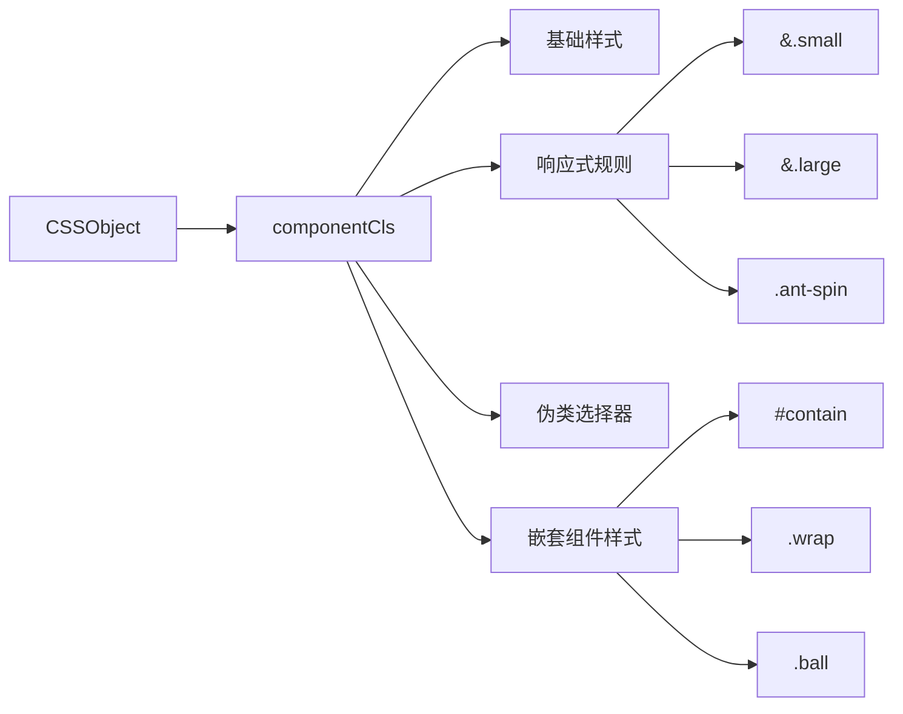

**图表来源**
- [src/LoadingIndicatorCircusBall/useStyle.ts](file://src/LoadingIndicatorCircusBall/useStyle.ts#L46-L325)

**章节来源**
- [src/LoadingIndicatorCircusBall/useStyle.ts](file://src/LoadingIndicatorCircusBall/useStyle.ts#L33-L326)

## 主题令牌系统

antd-ext 实现了完整的主题令牌系统，支持通过 `ComponentToken` 扩展 Ant Design 的默认主题。

### ComponentToken 接口设计

每个组件都定义了自己的 `ComponentToken` 接口：

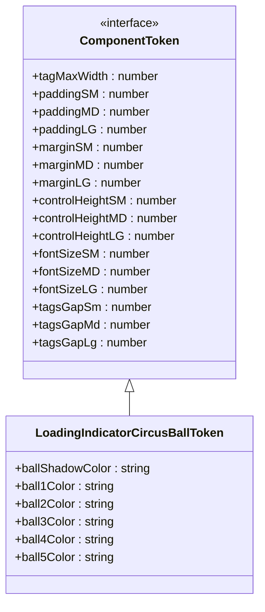

**图表来源**
- [src/TagsInput/style/index.ts](file://src/TagsInput/style/index.ts#L10-L40)
- [src/LoadingIndicatorCircusBall/useStyle.ts](file://src/LoadingIndicatorCircusBall/useStyle.ts#L15-L28)

### FullToken 和 ComponentToken 关系

系统通过类型继承建立了完整的令牌层次结构：

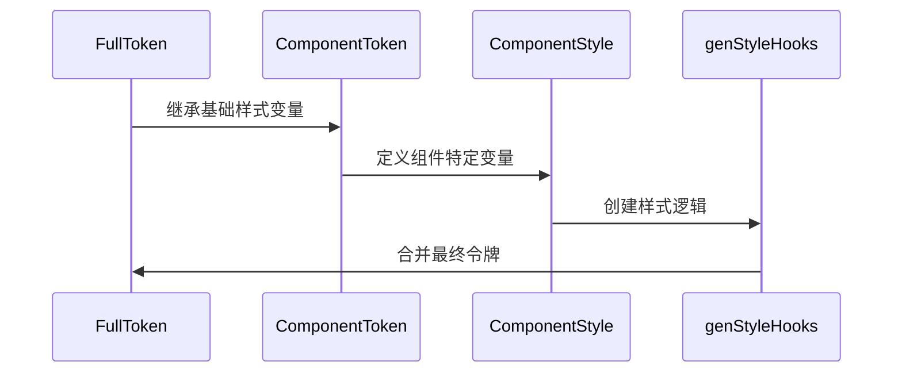

**图表来源**
- [src/LoadingIndicatorCircusBall/useStyle.ts](file://src/LoadingIndicatorCircusBall/useStyle.ts#L30-L31)
- [src/TagsInput/style/index.ts](file://src/TagsInput/style/index.ts#L42-L43)

### 默认令牌配置

每个组件都有预设的默认令牌值：

| 组件 | 默认值 | 用途 |
|------|--------|------|
| LoadingIndicatorCircusBall.ballShadowColor | 'rgba(0, 0, 0, 0.1)' | 阴影颜色 |
| LoadingIndicatorCircusBall.ball1Color | '#397BF9' | 第一个球体颜色 |
| TagsInput.tagMaxWidth | 100 | 标签最大宽度 |
| TagsInput.paddingMD | 6 | 中等尺寸内边距 |

**章节来源**
- [src/LoadingIndicatorCircusBall/useStyle.ts](file://src/LoadingIndicatorCircusBall/useStyle.ts#L328-L335)
- [src/TagsInput/style/index.ts](file://src/TagsInput/style/index.ts#L148-L166)

## useStyle 钩子机制

`useStyle` 钩子是 antd-ext 样式系统的核心执行器，负责将样式逻辑转换为实际的 CSS 类名和变量。

### 钩子工作原理

```mermaid
flowchart TD
A[useStyle Hook] --> B[接收 prefixCls]
B --> C[调用 genStyleHooks]
C --> D[生成 CSS 变量类名]
C --> E[生成哈希标识符]
D --> F[返回 [hashId, cssVarCls]]
G[样式注入] --> H[CSS 变量]
G --> I[全局样式]
G --> J[组件级样式]
```

**图表来源**
- [src/LoadingIndicatorCircusBall/index.tsx](file://src/LoadingIndicatorCircusBall/index.tsx#L18-L19)

### 动画参数动态控制

在 `LoadingIndicatorCircusBall` 组件中，`useStyle` 钩子与 CSS 变量结合实现了动画参数的动态控制：

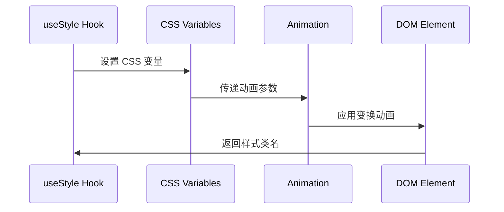

**图表来源**
- [src/LoadingIndicatorCircusBall/useStyle.ts](file://src/LoadingIndicatorCircusBall/useStyle.ts#L49-L54)

### 样式应用流程

样式应用遵循以下步骤：

1. **钩子调用**: 组件初始化时调用 `useStyle`
2. **类名生成**: 生成唯一的 CSS 类名和变量类名
3. **样式注入**: 将样式注入到 DOM 中
4. **变量绑定**: 将 CSS 变量绑定到动画参数

**章节来源**
- [src/LoadingIndicatorCircusBall/index.tsx](file://src/LoadingIndicatorCircusBall/index.tsx#L1-L47)
- [src/LoadingIndicatorCircusBall/useStyle.ts](file://src/LoadingIndicatorCircusBall/useStyle.ts#L337-L344)

## 组件样式注册

antd-ext 使用 `genStyleHooks` 函数将组件样式注册到 Ant Design 的主题系统中。

### 注册机制

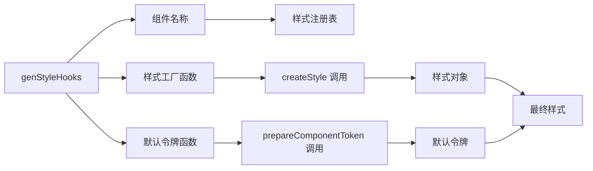

**图表来源**
- [src/LoadingIndicatorCircusBall/useStyle.ts](file://src/LoadingIndicatorCircusBall/useStyle.ts#L337-L344)
- [src/Sheet/style/index.ts](file://src/Sheet/style/index.ts#L25-L32)

### 类型声明扩展

系统通过模块声明扩展的方式将组件令牌集成到全局类型系统：

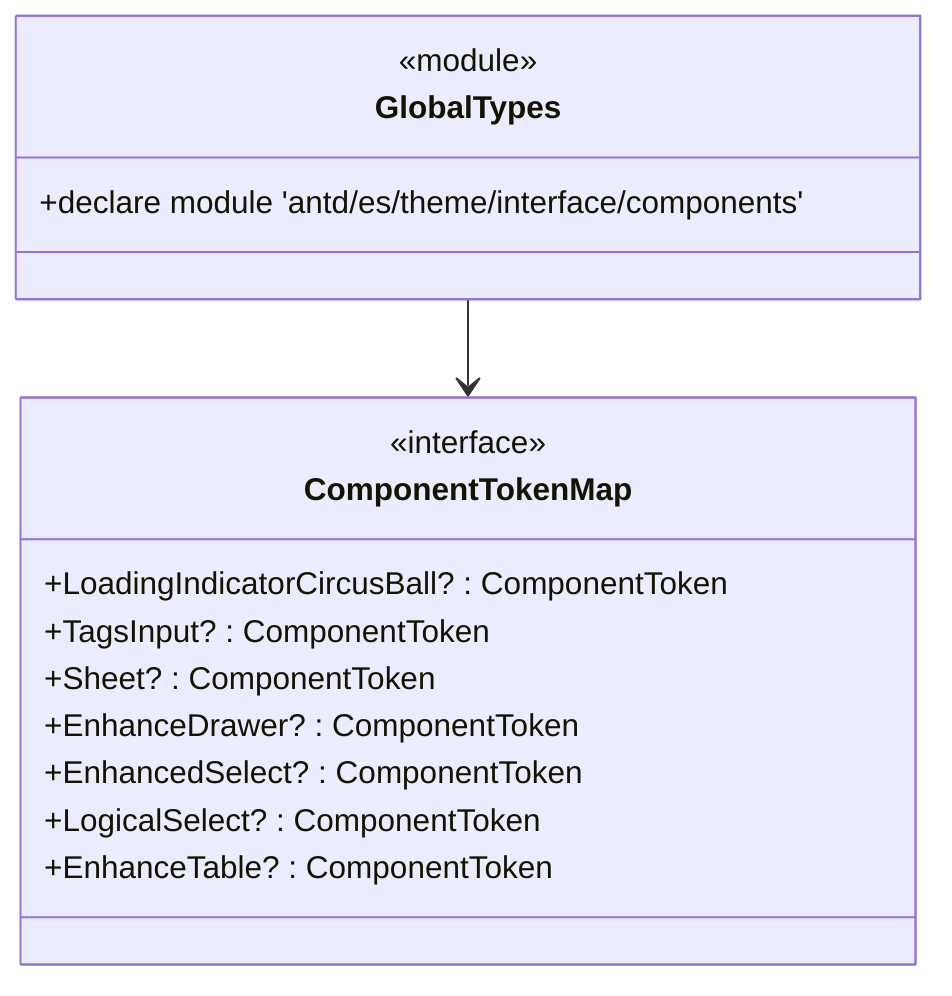

**图表来源**
- [src/typings.d.ts](file://src/typings.d.ts#L24-L33)

### 样式合并策略

系统使用 `mergeToken` 函数合并不同层级的令牌：

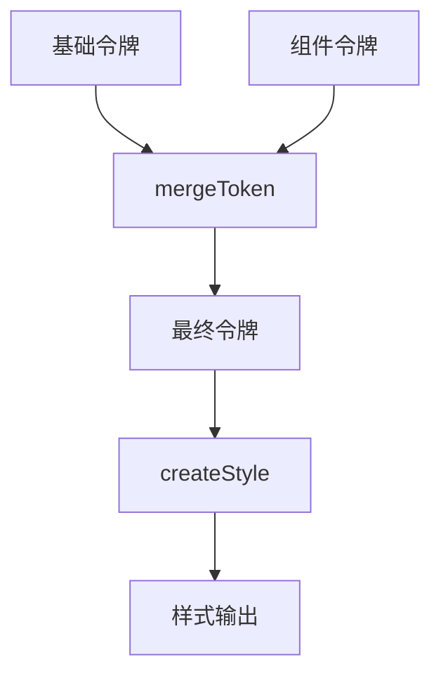

**图表来源**
- [src/LoadingIndicatorCircusBall/useStyle.ts](file://src/LoadingIndicatorCircusBall/useStyle.ts#L340-L341)

**章节来源**
- [src/LoadingIndicatorCircusBall/useStyle.ts](file://src/LoadingIndicatorCircusBall/useStyle.ts#L337-L344)
- [src/Sheet/style/index.ts](file://src/Sheet/style/index.ts#L25-L32)

## ConfigProvider 主题定制

antd-ext 完全兼容 Ant Design 的 `ConfigProvider`，支持通过主题配置进行全局样式定制。

### 配置方式

主题定制通过 `theme.components` 属性实现：

```mermaid
graph TB
A[ConfigProvider] --> B[theme.components]
B --> C[组件主题配置]
C --> D[LoadingIndicatorCircusBall]
C --> E[TagsInput]
C --> F[Sheet]
D --> G[ball1Color: '#1890ff']
D --> H[ball2Color: '#52c41a']
D --> I[ballShadowColor: 'rgba(0, 0, 0, 0.2)']
```

**图表来源**
- [src/LoadingIndicatorCircusBall/demo/theme-customization.tsx](file://src/LoadingIndicatorCircusBall/demo/theme-customization.tsx#L7-L18)

### 类型安全保障

系统提供了完整的 TypeScript 类型支持：

| 配置项 | 类型 | 默认值 | 说明 |
|--------|------|--------|------|
| ball1Color | string | '#397BF9' | 第一个小球颜色 |
| ball2Color | string | '#F4B400' | 第二个小球颜色 |
| ballShadowColor | string | 'rgba(0, 0, 0, 0.1)' | 阴影颜色 |
| tagMaxWidth | number | 100 | 标签最大宽度 |
| paddingMD | number | 6 | 中等尺寸内边距 |

### 运行时主题切换

由于使用 CSS-in-JS，主题切换具有以下优势：

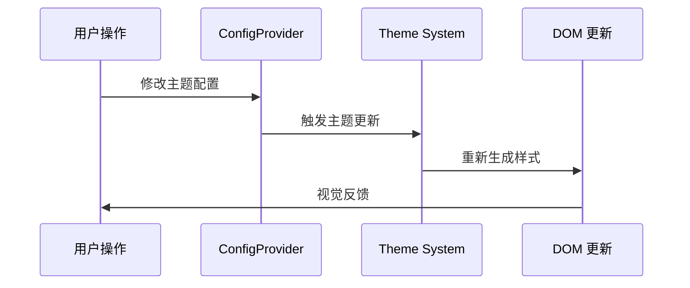

**章节来源**
- [src/LoadingIndicatorCircusBall/demo/theme-customization.tsx](file://src/LoadingIndicatorCircusBall/demo/theme-customization.tsx#L1-L30)

## 实际应用示例

### LoadingIndicatorCircusBall 主题定制

该组件展示了完整的 CSS-in-JS 主题定制能力：

```mermaid
graph LR
A[基础配置] --> B[ball1Color: '#1890ff']
A --> C[ball2Color: '#52c41a']
A --> D[ballShadowColor: 'rgba(0, 0, 0, 0.2)']
B --> E[蓝色主球]
C --> F[绿色辅助球]
D --> G[半透明阴影]
E --> H[视觉效果]
F --> H
G --> H
```

**图表来源**
- [src/LoadingIndicatorCircusBall/demo/theme-customization.tsx](file://src/LoadingIndicatorCircusBall/demo/theme-customization.tsx#L9-L15)

### TagsInput 组件定制

TagsInput 组件提供了更丰富的定制选项：

| 定制维度 | 配置项 | 尺寸影响 |
|----------|--------|----------|
| 尺寸相关 | controlHeightSM/LG | 小/大尺寸高度 |
| 内边距 | paddingSM/LG | 小/大尺寸内边距 |
| 外边距 | marginSM/LG | 小/大尺寸外边距 |
| 字体 | fontSizeSM/LG | 小/大尺寸字体 |
| 间距 | tagsGapSm/LG | 小/大尺寸标签间距 |

### Sheet 组件样式组合

Sheet 组件展示了如何组合多个子组件的样式：

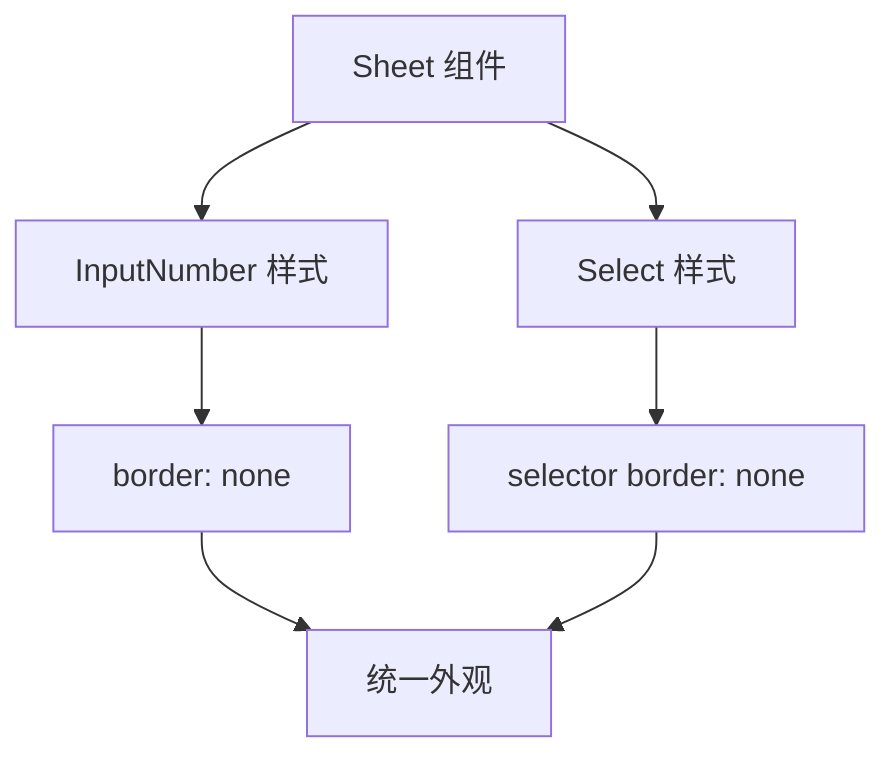

**图表来源**
- [src/Sheet/style/inputNumberStyle.ts](file://src/Sheet/style/inputNumberStyle.ts#L14-L22)
- [src/Sheet/style/selectStyle.ts](file://src/Sheet/style/selectStyle.ts#L14-L24)

**章节来源**
- [src/LoadingIndicatorCircusBall/demo/theme-customization.tsx](file://src/LoadingIndicatorCircusBall/demo/theme-customization.tsx#L1-L30)
- [src/Sheet/style/index.ts](file://src/Sheet/style/index.ts#L1-L33)

## SCSS 对比分析

antd-ext 的 CSS-in-JS 方案与传统的 SCSS 方案相比具有显著优势：

### 样式隔离对比

| 特性 | CSS-in-JS | SCSS |
|------|-----------|------|
| 样式隔离 | 自动作用域 | 需要手动处理 |
| 运行时切换 | 原生支持 | 需要重新编译 |
| 变量继承 | 类型安全 | 编译时检查 |
| 动态计算 | 运行时计算 | 编译时固定 |

### 主题切换性能对比

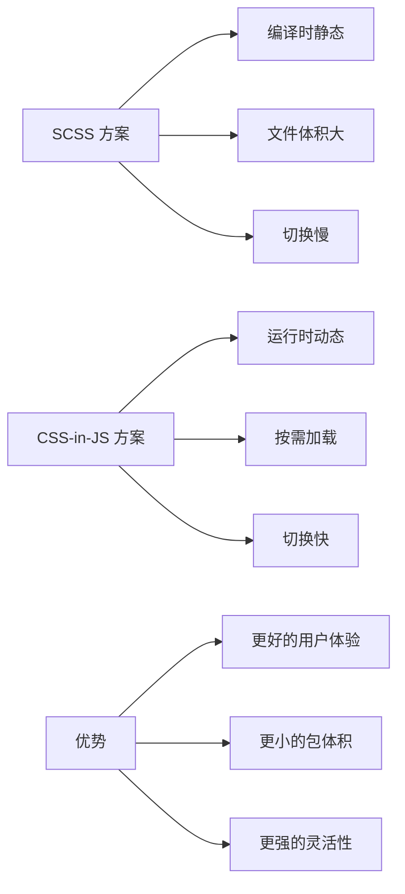

### 变量继承机制

CSS-in-JS 提供了更强大的变量继承能力：

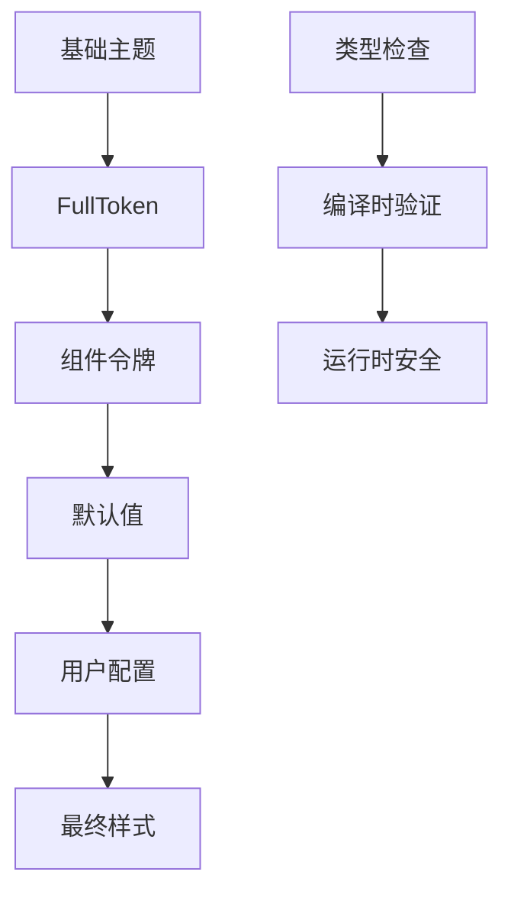

**章节来源**
- [src/LoadingIndicatorCircusBall/useStyle.ts](file://src/LoadingIndicatorCircusBall/useStyle.ts#L1-L345)
- [src/TagsInput/style/index.ts](file://src/TagsInput/style/index.ts#L1-L176)

## 最佳实践建议

### 组件样式设计原则

1. **单一职责**: 每个组件只管理自己的样式逻辑
2. **类型安全**: 充分利用 TypeScript 提供的类型检查
3. **可扩展性**: 通过 ComponentToken 支持灵活定制
4. **性能优化**: 使用 CSS 变量减少重复计算

### 主题定制最佳实践

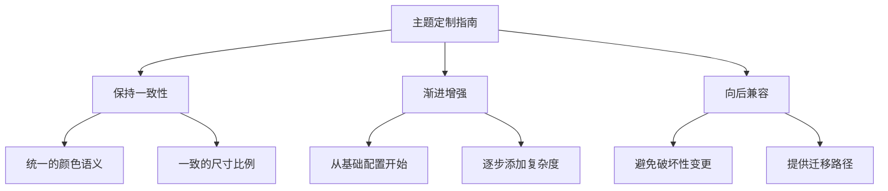

### 性能优化建议

1. **懒加载**: 只在需要时加载样式模块
2. **缓存策略**: 利用 CSS-in-JS 的内置缓存机制
3. **最小化重绘**: 通过 CSS 变量减少样式变更
4. **Bundle 分割**: 按需引入组件样式

### 开发调试技巧

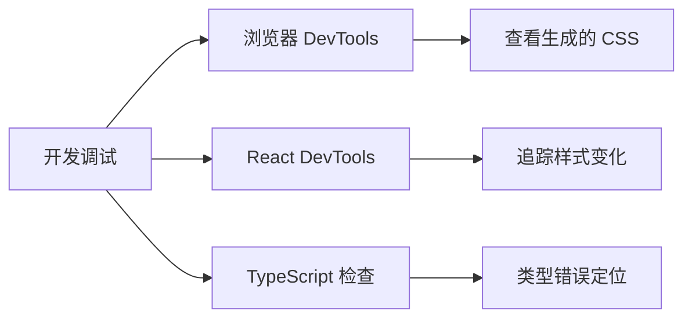

## 总结

antd-ext 展示了现代前端框架中 CSS-in-JS 样式定制的最佳实践。通过深入集成 Ant Design 的主题系统，它实现了：

### 核心优势

1. **类型安全**: 完整的 TypeScript 支持确保开发时的类型安全
2. **动态主题**: 运行时主题切换能力
3. **样式隔离**: 自动的作用域管理和样式隔离
4. **性能优化**: 按需加载和智能缓存机制
5. **开发体验**: 优秀的 IDE 支持和错误提示

### 技术创新

- **GenerateStyle API**: 简洁而强大的样式定义接口
- **CSS 变量集成**: 将 JavaScript 动态逻辑与 CSS 变量完美结合
- **模块化架构**: 每个组件独立的样式模块
- **类型扩展**: 通过模块声明实现类型的无缝集成

### 应用价值

antd-ext 的样式系统不仅解决了传统 CSS 方法的诸多痛点，还为 React 应用的主题定制提供了新的思路。其设计理念和实现方式值得在类似的 UI 库和组件开发中借鉴和应用。

通过本文档的深入解析，开发者可以全面理解 CSS-in-JS 在现代前端开发中的应用价值，并能够基于这些知识构建更加灵活和可维护的样式系统。