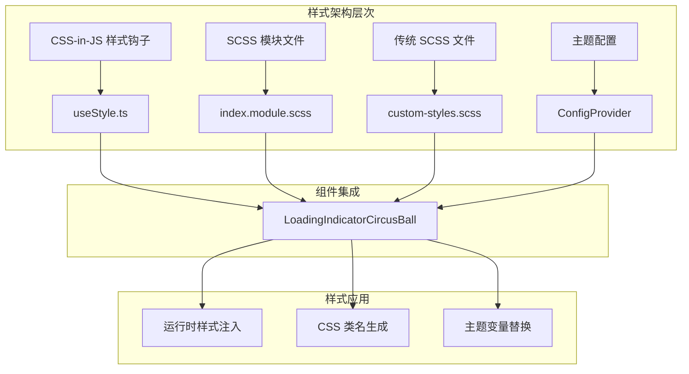
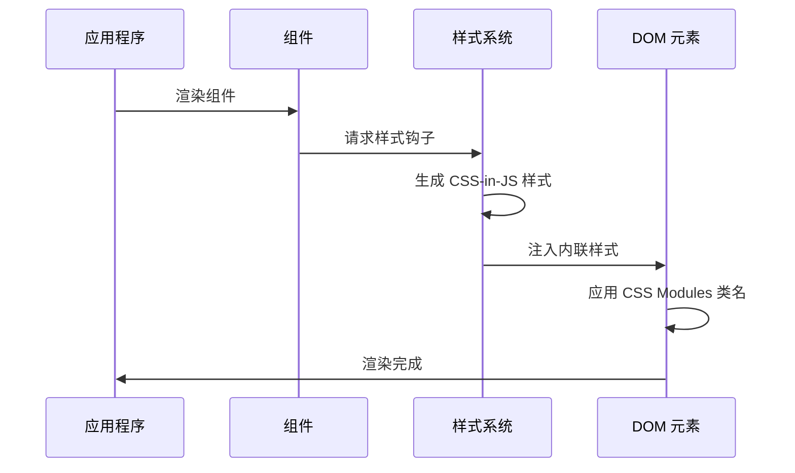
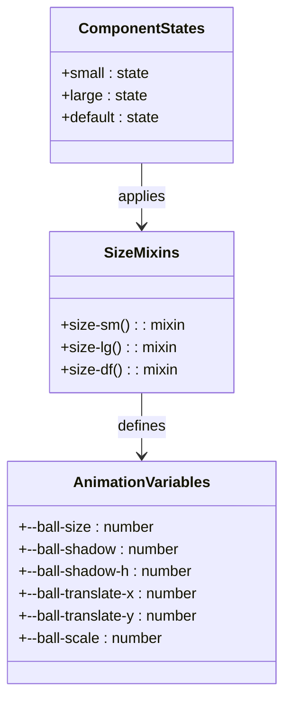
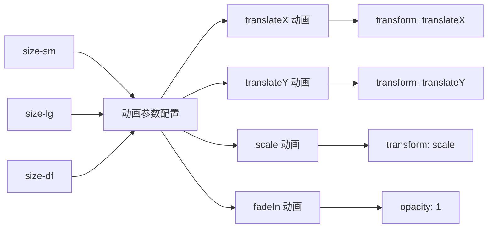
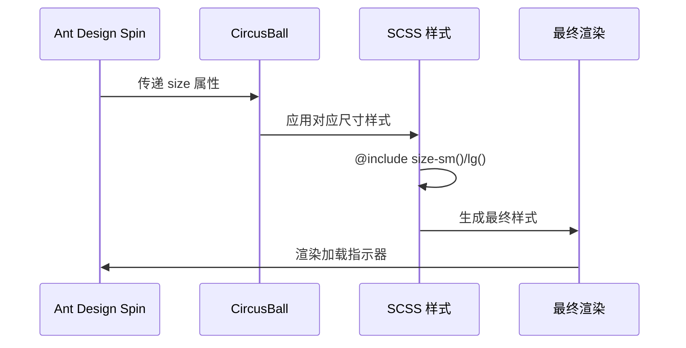
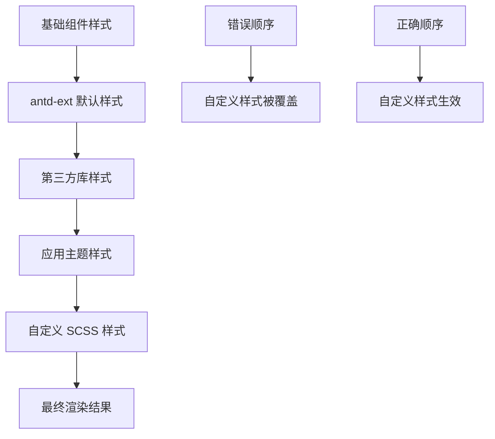
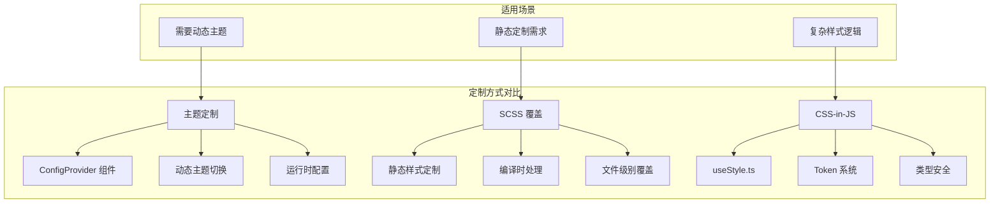
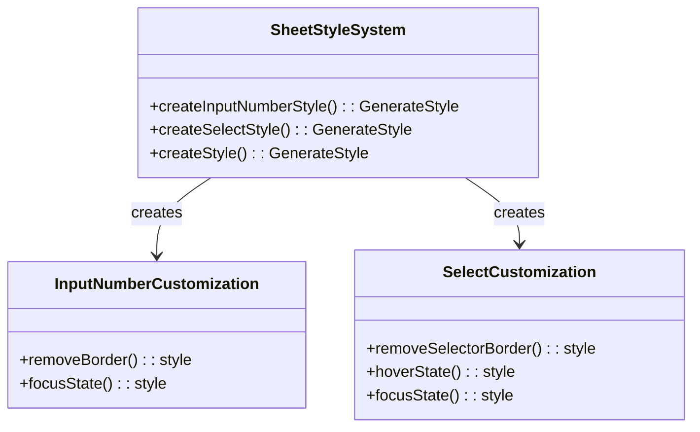
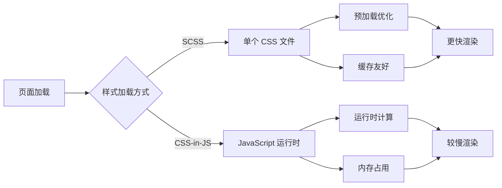

# SCSS 样式覆盖

<cite>
**本文档引用的文件**
- [index.module.scss](file://src/LoadingIndicatorCircusBall/index.module.scss)
- [useStyle.ts](file://src/LoadingIndicatorCircusBall/useStyle.ts)
- [index.tsx](file://src/LoadingIndicatorCircusBall/index.tsx)
- [theme-customization.tsx](file://src/LoadingIndicatorCircusBall/demo/theme-customization.tsx)
- [with-spin.tsx](file://src/LoadingIndicatorCircusBall/demo/with-spin.tsx)
- [different-sizes.tsx](file://src/LoadingIndicatorCircusBall/demo/different-sizes.tsx)
- [basic.tsx](file://src/LoadingIndicatorCircusBall/demo/basic.tsx)
- [inputNumberStyle.ts](file://src/Sheet/style/inputNumberStyle.ts)
- [selectStyle.ts](file://src/Sheet/style/selectStyle.ts)
- [index.ts](file://src/Sheet/style/index.ts)
- [package.json](file://package.json)
</cite>

## 目录
1. [简介](#简介)
2. [项目架构概览](#项目架构概览)
3. [样式作用域隔离机制](#样式作用域隔离机制)
4. [SCSS 混合宏系统](#scss-混合宏系统)
5. [Ant Design 集成方案](#ant-design-集成方案)
6. [自定义 SCSS 文件创建](#自定义-scss-文件创建)
7. [样式覆盖最佳实践](#样式覆盖最佳实践)
8. [性能考虑](#性能考虑)
9. [故障排除指南](#故障排除指南)
10. [总结](#总结)

## 简介

antd-ext 是一个基于 Ant Design 扩展的 React 组件库，提供了丰富的 UI 组件和灵活的样式定制能力。本文档专注于 SCSS 样式覆盖技术，详细介绍如何通过传统的 SCSS 文件实现对 antd-ext 组件样式的深度定制，同时保持良好的代码组织和维护性。

该库采用现代化的样式处理方式，结合 CSS Modules、CSS-in-JS 和传统 SCSS 文件，为开发者提供了多层次的样式定制解决方案。

## 项目架构概览

antd-ext 项目采用了模块化的架构设计，每个组件都有独立的样式管理策略：



**图表来源**
- [useStyle.ts](file://src/LoadingIndicatorCircusBall/useStyle.ts#L1-L345)
- [index.module.scss](file://src/LoadingIndicatorCircusBall/index.module.scss#L1-L164)

**章节来源**
- [useStyle.ts](file://src/LoadingIndicatorCircusBall/useStyle.ts#L1-L345)
- [index.module.scss](file://src/LoadingIndicatorCircusBall/index.module.scss#L1-L164)

## 样式作用域隔离机制

### CSS Modules 的 :local 包裹机制

antd-ext 在样式处理中大量使用了 CSS Modules 技术，通过 `:local()` 选择器实现样式的局部作用域隔离，防止全局样式污染。

```mermaid
flowchart TD
A[SCSS 文件] --> B{:local() 包裹}
B --> C[CSS Modules 编译]
C --> D[生成唯一类名]
D --> E[运行时注入]
E --> F[样式隔离生效]
G[原始类名] --> H[编译后类名]
H --> I[hash 值附加]
I --> J[避免冲突]
```

**图表来源**
- [index.module.scss](file://src/LoadingIndicatorCircusBall/index.module.scss#L46-L46)

在 LoadingIndicatorCircusBall 组件中，`:local()` 的使用体现在以下关键位置：

- **根元素包裹**：`:local(.LoadingIndicatorCircusBall)` 确保样式仅作用于当前组件实例
- **嵌套选择器**：`:local(.LoadingIndicatorCircusBall) .ball` 实现精确的样式定位
- **状态类选择**：`:local(.LoadingIndicatorCircusBall).small` 支持条件样式应用

这种机制的优势包括：
- **完全隔离**：样式不会影响其他组件
- **可预测性**：类名经过哈希处理，避免命名冲突
- **性能优化**：减少不必要的样式匹配开销

**章节来源**
- [index.module.scss](file://src/LoadingIndicatorCircusBall/index.module.scss#L46-L46)

### 样式优先级控制

通过 CSS Modules 的编译机制，antd-ext 实现了精确的样式优先级控制：



**图表来源**
- [index.tsx](file://src/LoadingIndicatorCircusBall/index.tsx#L17-L18)
- [useStyle.ts](file://src/LoadingIndicatorCircusBall/useStyle.ts#L337-L344)

## SCSS 混合宏系统

### 动态尺寸参数化

antd-ext 实现了一套完整的 SCSS 混合宏系统，支持不同尺寸的动画参数动态配置：



**图表来源**
- [index.module.scss](file://src/LoadingIndicatorCircusBall/index.module.scss#L5-L28)

### 尺寸参数详解

| 尺寸类型 | --ball-size | --ball-shadow | --ball-shadow-h | --ball-translate-x | --ball-translate-y |
|---------|-------------|---------------|-----------------|-------------------|-------------------|
| small   | 5px         | 1px           | 2px             | -10px             | -13.5px           |
| default | 12px        | 4.25px        | 5.5px           | -50px             | -60.5px           |
| large   | 18px        | 4.25px        | 5.5px           | -80px             | -90.5px           |

这些参数通过 CSS 自定义属性（CSS Variables）实现动态绑定，支持运行时的样式调整。

**章节来源**
- [index.module.scss](file://src/LoadingIndicatorCircusBall/index.module.scss#L5-L28)

### 动画参数配置

混合宏系统不仅定义了尺寸参数，还包含了完整的动画配置：



**图表来源**
- [index.module.scss](file://src/LoadingIndicatorCircusBall/index.module.scss#L139-L161)

## Ant Design 集成方案

### 与 ant-spin 的无缝集成

antd-ext 的 LoadingIndicatorCircusBall 组件与 Ant Design 的 Spin 组件实现了深度集成：



**图表来源**
- [index.module.scss](file://src/LoadingIndicatorCircusBall/index.module.scss#L30-L44)
- [with-spin.tsx](file://src/LoadingIndicatorCircusBall/demo/with-spin.tsx#L1-L11)

### 类名结构映射

组件的类名结构遵循 Ant Design 的命名约定：

| Ant Design 类名 | antd-ext 映射 | 功能描述 |
|----------------|---------------|----------|
| `.ant-spin` | `.ant-spin` | Spin 容器 |
| `.ant-spin-sm` | `.ant-spin-sm` | 小尺寸标识 |
| `.ant-spin-lg` | `.ant-spin-lg` | 大尺寸标识 |
| `.LoadingIndicatorCircusBall` | `.LoadingIndicatorCircusBall` | 组件根类 |

这种映射确保了组件能够正确响应 Ant Design 的主题系统和尺寸规范。

**章节来源**
- [index.module.scss](file://src/LoadingIndicatorCircusBall/index.module.scss#L30-L44)
- [with-spin.tsx](file://src/LoadingIndicatorCircusBall/demo/with-spin.tsx#L1-L11)

## 自定义 SCSS 文件创建

### 创建 custom-styles.scss 文件

为了实现更深层次的样式定制，开发者可以创建自定义的 SCSS 文件：

```scss
// custom-styles.scss 示例
.LoadingIndicatorCircusBall {
  // 覆盖默认尺寸变量
  --ball-size: 15px;
  --ball-shadow: 3px;
  
  // 修改动画参数
  --ball-translate-x: -60px;
  --ball-translate-y: -70px;
  
  // 自定义颜色方案
  .ball {
    background-color: #FF6B6B;
    
    &:nth-child(2) {
      background-color: #4ECDC4;
    }
    
    &:nth-child(3) {
      background-color: #45B7D1;
    }
  }
}

// 为特定尺寸定制
.LoadingIndicatorCircusBall.small {
  --ball-size: 8px;
  --ball-shadow: 2px;
}

.LoadingIndicatorCircusBall.large {
  --ball-size: 25px;
  --ball-shadow: 6px;
}
```

### 引入顺序的重要性

正确的引入顺序对于样式覆盖的成功至关重要：



**图表来源**
- [index.module.scss](file://src/LoadingIndicatorCircusBall/index.module.scss#L1-L164)

推荐的引入顺序：
1. 第三方库的基础样式
2. antd-ext 的默认样式
3. 应用的主题配置
4. 自定义的 SCSS 样式文件

**章节来源**
- [index.module.scss](file://src/LoadingIndicatorCircusBall/index.module.scss#L1-L164)

### 选择器结构保持一致性

为了确保样式覆盖的有效性，必须保持与原组件一致的选择器结构：

```scss
// 错误示例 - 选择器不匹配
.custom-loading-indicator {
  --ball-size: 20px;
}

// 正确示例 - 保持原选择器结构
.LoadingIndicatorCircusBall {
  --ball-size: 20px;
  
  .ball {
    // 子元素样式也应保持一致
    background-color: #FF6B6B;
  }
}
```

## 样式覆盖最佳实践

### 主题定制 vs SCSS 覆盖

antd-ext 提供了多种样式定制方式，每种方式适用于不同的场景：



**图表来源**
- [theme-customization.tsx](file://src/LoadingIndicatorCircusBall/demo/theme-customization.tsx#L1-L30)
- [useStyle.ts](file://src/LoadingIndicatorCircusBall/useStyle.ts#L1-L345)

### 组件级别的样式定制

对于 Sheet 组件，展示了如何进行组件级别的样式定制：



**图表来源**
- [index.ts](file://src/Sheet/style/index.ts#L1-L33)
- [inputNumberStyle.ts](file://src/Sheet/style/inputNumberStyle.ts#L1-L24)
- [selectStyle.ts](file://src/Sheet/style/selectStyle.ts#L1-L27)

**章节来源**
- [index.ts](file://src/Sheet/style/index.ts#L1-L33)
- [inputNumberStyle.ts](file://src/Sheet/style/inputNumberStyle.ts#L1-L24)
- [selectStyle.ts](file://src/Sheet/style/selectStyle.ts#L1-L27)

### 动态主题切换的替代方案

虽然 antd-ext 支持动态主题切换，但对于不需要此功能的静态定制场景，SCSS 覆盖提供了更简洁的解决方案：

| 特性 | SCSS 覆盖 | 动态主题切换 |
|------|-----------|--------------|
| 实现复杂度 | 低 | 高 |
| 性能开销 | 低 | 中等 |
| 维护成本 | 低 | 高 |
| 功能完整性 | 中等 | 高 |
| 开发体验 | 直接 | 配置化 |

## 性能考虑

### 样式加载优化

SCSS 样式覆盖在性能方面具有明显优势：



### 样式缓存策略

对于 SCSS 覆盖，建议采用以下缓存策略：
- **文件级别缓存**：浏览器缓存编译后的 CSS 文件
- **版本控制**：通过文件名版本号实现强制更新
- **CDN 优化**：利用 CDN 加速样式文件分发

### 运行时性能影响

CSS-in-JS 方式在运行时会带来额外的性能开销：
- **样式计算**：每次组件渲染都需要重新计算样式
- **内存占用**：内联样式对象增加内存消耗
- **重绘重排**：频繁的样式变更可能导致页面重绘

相比之下，SCSS 覆盖在编译时就确定了最终的 CSS，运行时性能更加稳定。

## 故障排除指南

### 常见问题及解决方案

#### 样式未生效

**问题症状**：自定义样式没有按照预期工作

**可能原因**：
1. 引入顺序错误
2. 选择器优先级不足
3. CSS Modules 类名冲突

**解决方案**：
```scss
// 确保正确的引入顺序
@import '~antd/dist/antd.css';
@import '~@byte.n/antd-ext/dist/index.css';
@import 'custom-styles.scss'; // 最后引入自定义样式

// 使用更高优先级的选择器
.LoadingIndicatorCircusBall.LoadingIndicatorCircusBall {
  --ball-size: 20px;
}
```

#### 样式被覆盖

**问题症状**：部分样式被其他样式规则覆盖

**诊断步骤**：
1. 使用浏览器开发者工具检查最终应用的样式
2. 查看样式的来源和优先级
3. 确认是否有更高优先级的样式规则

**解决方法**：
```scss
// 增加选择器特异性
.LoadingIndicatorCircusBall {
  // 或者使用 !important（谨慎使用）
  --ball-size: 20px !important;
}
```

#### 动画效果异常

**问题症状**：自定义尺寸下动画效果不正常

**原因分析**：
- 动画参数与尺寸不匹配
- CSS 变量未正确继承

**修复方案**：
```scss
.LoadingIndicatorCircusBall {
  // 确保所有相关参数都正确设置
  --ball-size: 15px;
  --ball-shadow: 3px;
  --ball-translate-x: calc(-1 * var(--ball-size) * 4);
  --ball-translate-y: calc(-1 * var(--ball-size) * 5);
}
```

**章节来源**
- [index.module.scss](file://src/LoadingIndicatorCircusBall/index.module.scss#L1-L164)

### 调试技巧

#### 使用 CSS 变量调试

```scss
.LoadingIndicatorCircusBall {
  // 添加调试标记
  outline: 1px solid red;
  
  // 输出变量值（仅用于调试）
  &::before {
    content: 'Size: ' var(--ball-size);
    position: absolute;
    top: -20px;
    left: 0;
    color: white;
    background: black;
    padding: 2px 5px;
  }
}
```

#### 样式隔离验证

```scss
// 验证样式是否正确隔离
.LoadingIndicatorCircusBall {
  // 设置独特的背景色
  background: rgba(255, 0, 0, 0.1);
  
  // 验证子元素样式
  .ball {
    border: 2px solid blue;
  }
}
```

## 总结

SCSS 样式覆盖是 antd-ext 提供的一种强大而灵活的样式定制方案，特别适用于不需要动态主题切换的静态定制场景。通过本文档的详细介绍，开发者可以：

### 核心优势

1. **样式隔离**：通过 CSS Modules 的 `:local()` 机制确保样式不会污染全局空间
2. **灵活定制**：使用 SCSS 混合宏系统实现不同尺寸的参数化定制
3. **深度覆盖**：直接操作 CSS 变量和动画参数，实现细粒度的样式控制
4. **性能优化**：编译时确定的 CSS 减少运行时性能开销

### 最佳实践要点

1. **保持选择器一致性**：确保自定义样式的选择器与原组件结构完全匹配
2. **注意引入顺序**：在组件样式之后引入自定义 SCSS 文件以确保优先级
3. **合理使用 CSS 变量**：通过变量系统实现样式的模块化和可配置性
4. **测试兼容性**：在不同尺寸和状态下验证样式效果

### 适用场景

- **静态主题定制**：不需要运行时动态切换主题的应用
- **品牌化定制**：需要深度定制视觉风格的企业应用
- **性能敏感场景**：对运行时性能有较高要求的应用
- **简单样式调整**：只需要修改少量样式参数的场景

通过掌握这些 SCSS 样式覆盖技术，开发者可以充分发挥 antd-ext 的定制潜力，构建符合业务需求的高质量用户界面。