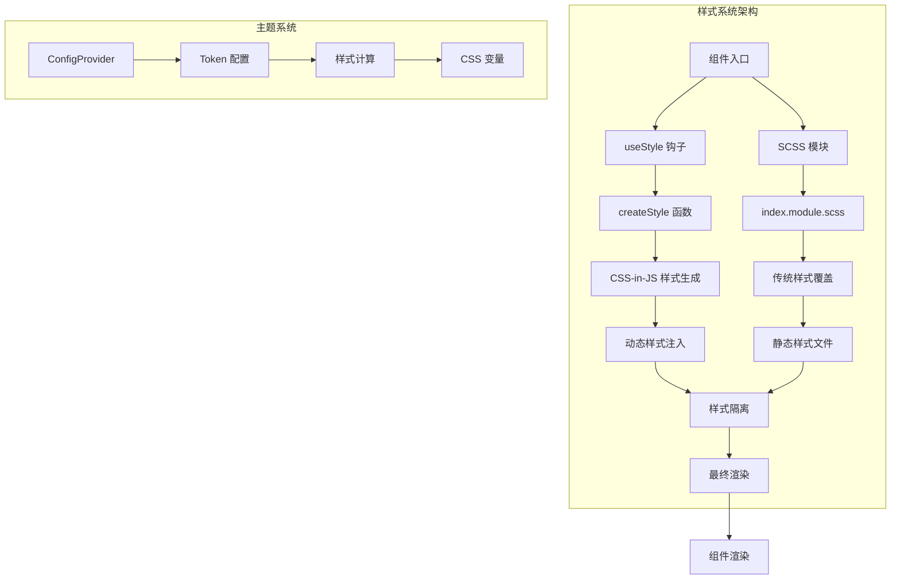
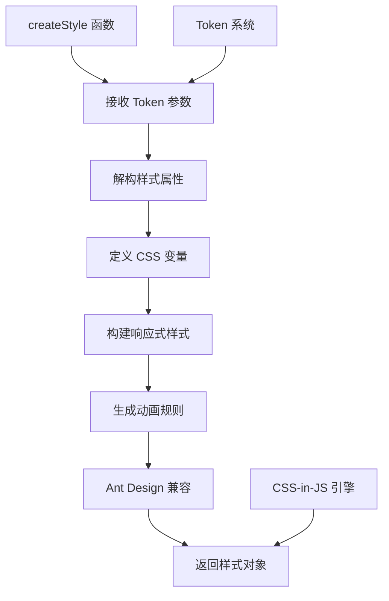
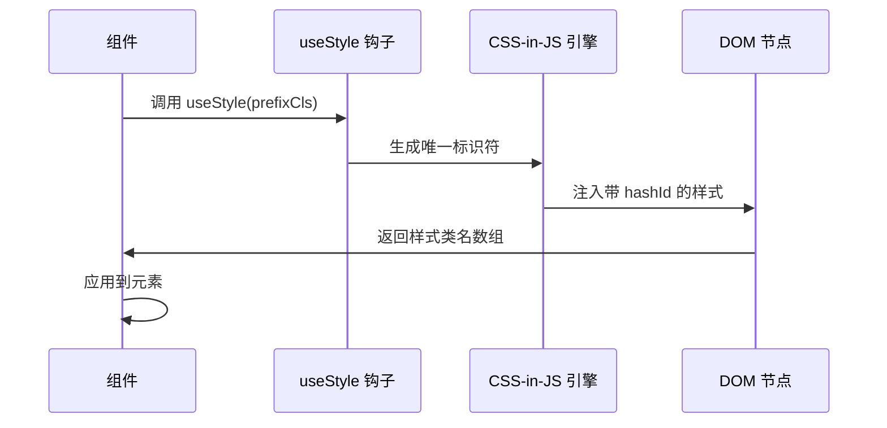
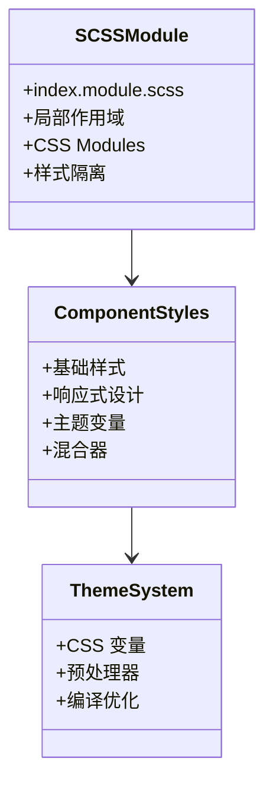
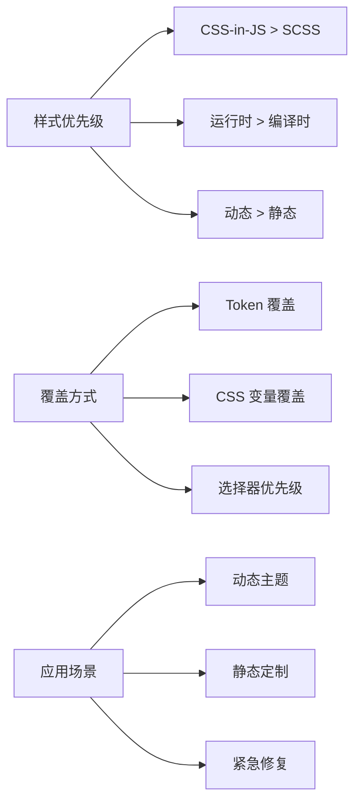
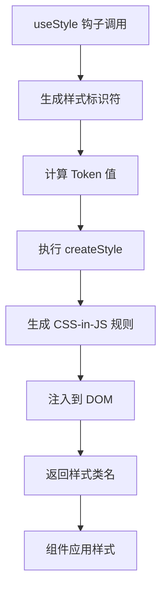
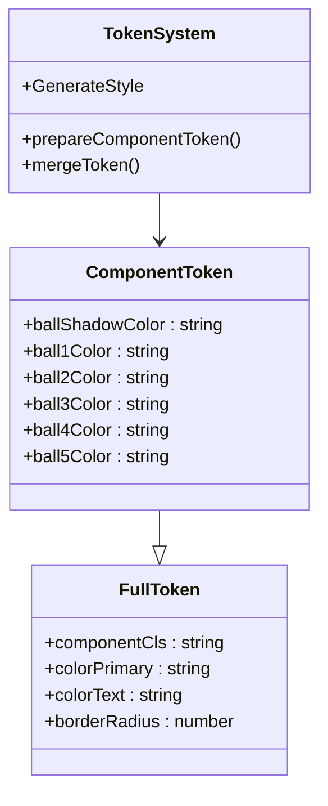
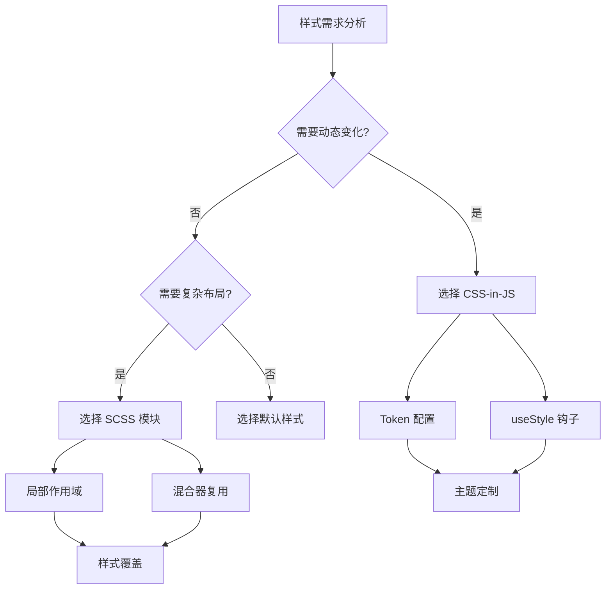

# 样式覆盖方法

<cite>
**本文档引用的文件**
- [src/LoadingIndicatorCircusBall/index.tsx](file://src/LoadingIndicatorCircusBall/index.tsx)
- [src/LoadingIndicatorCircusBall/useStyle.ts](file://src/LoadingIndicatorCircusBall/useStyle.ts)
- [src/LoadingIndicatorCircusBall/index.module.scss](file://src/LoadingIndicatorCircusBall/index.module.scss)
- [src/Sheet/style/index.ts](file://src/Sheet/style/index.ts)
- [src/Sheet/style/inputNumberStyle.ts](file://src/Sheet/style/inputNumberStyle.ts)
- [src/Sheet/style/selectStyle.ts](file://src/Sheet/style/selectStyle.ts)
- [src/TagsInput/style/index.ts](file://src/TagsInput/style/index.ts)
- [src/typings.d.ts](file://src/typings.d.ts)
- [package.json](file://package.json)
</cite>

## 目录
1. [简介](#简介)
2. [项目架构概览](#项目架构概览)
3. [CSS-in-JS 样式系统](#css-in-js-样式系统)
4. [SCSS 模块样式系统](#scss-模块样式系统)
5. [样式覆盖机制详解](#样式覆盖机制详解)
6. [主题定制与 Token 系统](#主题定制与-token-系统)
7. [实际应用示例](#实际应用示例)
8. [最佳实践指南](#最佳实践指南)
9. [故障排除](#故障排除)
10. [总结](#总结)

## 简介

antd-ext 组件库提供了两种强大的样式定制机制，旨在满足现代前端开发中对组件样式的灵活需求。本系统基于 Ant Design 的设计体系，结合了 CSS-in-JS 和传统 SCSS 两种主流样式解决方案，为开发者提供了完整的样式覆盖能力。

核心特性包括：
- **CSS-in-JS 动态样式生成**：基于 `@ant-design/cssinjs` 实现的运行时样式计算
- **SCSS 模块化样式**：支持传统的 SCSS 文件覆盖和自定义样式
- **组件级样式隔离**：通过 `componentCls` 类名前缀确保样式不冲突
- **主题定制支持**：完整的 Token 系统支持全局和局部主题定制
- **运行时样式计算**：结合 `useStyle` 钩子实现动态样式生成

## 项目架构概览

antd-ext 的样式系统采用分层架构设计，将样式逻辑与业务逻辑分离，确保组件的可维护性和扩展性。



**图表来源**
- [src/LoadingIndicatorCircusBall/index.tsx](file://src/LoadingIndicatorCircusBall/index.tsx#L1-L47)
- [src/LoadingIndicatorCircusBall/useStyle.ts](file://src/LoadingIndicatorCircusBall/useStyle.ts#L1-L345)

**章节来源**
- [src/LoadingIndicatorCircusBall/index.tsx](file://src/LoadingIndicatorCircusBall/index.tsx#L1-L47)
- [src/LoadingIndicatorCircusBall/useStyle.ts](file://src/LoadingIndicatorCircusBall/useStyle.ts#L1-L345)

## CSS-in-JS 样式系统

### createStyle 函数核心机制

`createStyle` 是 antd-ext 样式系统的核心函数，它基于 `@ant-design/cssinjs` 库实现了强大的 CSS-in-JS 功能。



**图表来源**
- [src/LoadingIndicatorCircusBall/useStyle.ts](file://src/LoadingIndicatorCircusBall/useStyle.ts#L33-L325)

### 样式生成流程

CSS-in-JS 样式生成遵循以下流程：

1. **Token 解析**：从 `FullToken` 中提取样式变量
2. **CSS 变量定义**：使用 `--variable-name` 形式定义动态变量
3. **响应式设计**：通过 `&.size-class` 实现不同尺寸的样式适配
4. **动画支持**：内置关键帧动画和过渡效果
5. **Ant Design 兼容**：自动适配 Ant Design 组件样式

### 样式隔离机制

通过 `genStyleHooks` 和 `mergeToken` 实现样式隔离：



**图表来源**
- [src/LoadingIndicatorCircusBall/useStyle.ts](file://src/LoadingIndicatorCircusBall/useStyle.ts#L337-L344)

**章节来源**
- [src/LoadingIndicatorCircusBall/useStyle.ts](file://src/LoadingIndicatorCircusBall/useStyle.ts#L33-L325)

## SCSS 模块样式系统

### SCSS 模块化架构

antd-ext 支持传统的 SCSS 样式覆盖，通过模块化的方式组织样式文件：



**图表来源**
- [src/LoadingIndicatorCircusBall/index.module.scss](file://src/LoadingIndicatorCircusBall/index.module.scss#L1-L164)

### 样式覆盖策略

SCSS 模块提供了多种样式覆盖策略：

1. **局部作用域**：通过 `:local()` 语法确保样式隔离
2. **混合器复用**：定义可重用的样式片段
3. **变量系统**：支持 CSS 变量和 SCSS 变量
4. **嵌套规则**：保持良好的代码组织结构

### 自定义 SCSS 文件集成

开发者可以通过以下方式引入自定义 SCSS 文件：

```scss
// custom-styles.scss 示例
@import '~@byte.n/antd-ext/src/LoadingIndicatorCircusBall/index.module.scss';

.LoadingIndicatorCircusBall {
  // 自定义样式覆盖
  .ball {
    background-color: #ff0000 !important;
  }
  
  &.custom-size {
    --ball-size: 20px;
  }
}
```

**章节来源**
- [src/LoadingIndicatorCircusBall/index.module.scss](file://src/LoadingIndicatorCircusBall/index.module.scss#L1-L164)

## 样式覆盖机制详解

### 两种样式方案的兼容性

antd-ext 的样式系统设计考虑了两种方案的兼容性：



### 样式优先级处理

样式系统按照以下优先级处理：

1. **Token 配置**：最高优先级，通过 ConfigProvider 设置
2. **CSS-in-JS 动态样式**：次高优先级，运行时计算
3. **SCSS 模块样式**：中等优先级，编译时确定
4. **默认样式**：最低优先级，组件内置样式

### useStyle 钩子的运行时计算

`useStyle` 钩子是连接 CSS-in-JS 和 React 组件的关键桥梁：



**图表来源**
- [src/LoadingIndicatorCircusBall/index.tsx](file://src/LoadingIndicatorCircusBall/index.tsx#L17-L18)

**章节来源**
- [src/LoadingIndicatorCircusBall/index.tsx](file://src/LoadingIndicatorCircusBall/index.tsx#L17-L18)
- [src/LoadingIndicatorCircusBall/useStyle.ts](file://src/LoadingIndicatorCircusBall/useStyle.ts#L337-L344)

## 主题定制与 Token 系统

### Token 系统架构

antd-ext 实现了完整的 Token 系统，支持组件级别的主题定制：



**图表来源**
- [src/LoadingIndicatorCircusBall/useStyle.ts](file://src/LoadingIndicatorCircusBall/useStyle.ts#L15-L28)

### ConfigProvider 集成

通过 Ant Design 的 ConfigProvider 实现全局主题定制：

```typescript
// 主题定制示例
import { ConfigProvider } from 'antd';

const customTheme = {
  components: {
    LoadingIndicatorCircusBall: {
      ballShadowColor: 'rgba(255, 0, 0, 0.3)',
      ball1Color: '#FF0000',
      ball2Color: '#00FF00',
      ball3Color: '#0000FF',
      ball4Color: '#FFFF00',
      ball5Color: '#FF00FF',
    }
  }
};

<ConfigProvider theme={customTheme}>
  <App />
</ConfigProvider>
```

### 组件级 Token 定制

每个组件都可以定义自己的 Token 接口：

| Token 名称 | 类型 | 默认值 | 说明 |
|-----------|------|--------|------|
| ballShadowColor | string | 'rgba(0, 0, 0, 0.1)' | 小球阴影颜色 |
| ball1Color | string | '#397BF9' | 第一个小球颜色 |
| ball2Color | string | '#F4B400' | 第二个小球颜色 |
| ball3Color | string | '#EEEEEE' | 第三个小球颜色 |
| ball4Color | string | '#00A656' | 第四个小球颜色 |
| ball5Color | string | '#E3746B' | 第五个小球颜色 |

**章节来源**
- [src/LoadingIndicatorCircusBall/useStyle.ts](file://src/LoadingIndicatorCircusBall/useStyle.ts#L15-L28)
- [src/LoadingIndicatorCircusBall/useStyle.ts](file://src/LoadingIndicatorCircusBall/useStyle.ts#L328-L335)

## 实际应用示例

### LoadingIndicatorCircusBall 样式覆盖

以 LoadingIndicatorCircusBall 组件为例，展示两种样式覆盖方法的实际应用：

#### CSS-in-JS 覆盖示例

```typescript
// 动态主题定制
import { ConfigProvider } from 'antd';

const CustomLoadingIndicator = () => (
  <ConfigProvider 
    theme={{
      components: {
        LoadingIndicatorCircusBall: {
          ballShadowColor: 'rgba(0, 255, 0, 0.2)',
          ball1Color: '#00FF00',
          ball2Color: '#008000',
          ball3Color: '#004000',
          ball4Color: '#002000',
          ball5Color: '#001000',
        }
      }
    }}
  >
    <LoadingIndicatorCircusBall size="large" />
  </ConfigProvider>
);
```

#### SCSS 覆盖示例

```scss
// custom-loading-indicator.scss
@import '~@byte.n/antd-ext/src/LoadingIndicatorCircusBall/index.module.scss';

.custom-loading-indicator {
  :local(.LoadingIndicatorCircusBall) {
    --ball-size: 16px;
    --ball-shadow: 6px;
    
    .ball {
      border: 2px solid #ffffff;
      box-shadow: 0 0 10px rgba(255, 255, 255, 0.5);
    }
    
    &.dark-mode {
      --ball-shadow: 4px;
      
      .ball {
        background-color: #333333;
      }
    }
  }
}
```

### Sheet 组件样式定制

Sheet 组件展示了如何通过 CSS-in-JS 定制子组件样式：

```typescript
// Sheet 子组件样式定制
import { createInputNumberStyle, createSelectStyle } from '@byte.n/antd-ext/Sheet/style';

const customInputNumberStyle = createInputNumberStyle({
  // 自定义输入框样式
  '.ant-input-number': {
    border: '2px solid #1890ff',
    borderRadius: '8px',
  }
});

const customSelectStyle = createSelectStyle({
  // 自定义选择器样式
  '.ant-select-selector': {
    background: '#f0faff',
    border: '1px solid #1890ff',
  }
});
```

**章节来源**
- [src/LoadingIndicatorCircusBall/useStyle.ts](file://src/LoadingIndicatorCircusBall/useStyle.ts#L328-L335)
- [src/Sheet/style/inputNumberStyle.ts](file://src/Sheet/style/inputNumberStyle.ts#L9-L24)
- [src/Sheet/style/selectStyle.ts](file://src/Sheet/style/selectStyle.ts#L9-L26)

## 最佳实践指南

### 样式选择原则

根据不同的场景选择合适的样式方案：



### 性能优化建议

1. **CSS-in-JS 优化**
   - 合理使用 Token，避免频繁重新计算
   - 利用 CSS 变量减少重复计算
   - 避免在循环中创建样式

2. **SCSS 优化**
   - 使用 CSS Modules 避免全局污染
   - 合理组织混合器和变量
   - 避免过深的选择器嵌套

3. **通用建议**
   - 优先使用 Ant Design 的设计令牌
   - 保持样式命名的一致性
   - 及时清理未使用的样式

### 开发工作流

推荐的开发工作流程：

1. **原型阶段**：使用默认样式快速验证功能
2. **设计阶段**：通过 Token 系统进行主题定制
3. **实现阶段**：必要时使用 SCSS 进行精确控制
4. **优化阶段**：合并和优化样式文件

## 故障排除

### 常见问题及解决方案

#### 样式不生效

**问题描述**：自定义样式无法覆盖默认样式

**解决方案**：
1. 检查选择器优先级，使用更具体的选择器
2. 确认 CSS Modules 的作用域设置
3. 验证样式文件的导入顺序

#### Token 配置无效

**问题描述**：通过 ConfigProvider 设置的 Token 不生效

**解决方案**：
1. 确认组件是否正确声明了 ComponentToken 接口
2. 检查 Token 名称是否匹配
3. 验证 ConfigProvider 的层级关系

#### 样式冲突

**问题描述**：多个样式源导致样式冲突

**解决方案**：
1. 使用 CSS-in-JS 的高优先级特性
2. 在 SCSS 中使用 `!important`（谨慎使用）
3. 重构样式结构，减少依赖

### 调试技巧

1. **浏览器开发者工具**：检查最终应用的样式
2. **React DevTools**：查看组件的样式钩子状态
3. **样式隔离检测**：确认 CSS Modules 的作用域

## 总结

antd-ext 的样式系统提供了完整的解决方案，既保留了 Ant Design 的设计一致性，又给予了开发者充分的定制自由度。通过 CSS-in-JS 和 SCSS 两种方案的结合，开发者可以根据具体需求选择最适合的样式定制方式。

### 核心优势

1. **双重保障**：两种样式方案互为补充，适应不同场景
2. **类型安全**：完整的 TypeScript 支持，提供智能提示
3. **性能优化**：合理的缓存和计算策略，保证运行效率
4. **易于维护**：清晰的架构设计，便于长期维护

### 发展方向

随着前端技术的发展，antd-ext 的样式系统将继续演进：

- 更好的 CSS-in-JS 性能优化
- 增强的 SCSS 工具链支持
- 更丰富的主题定制选项
- 更完善的无障碍访问支持

通过掌握这些样式覆盖方法，开发者可以充分发挥 antd-ext 的潜力，构建出既美观又实用的用户界面。