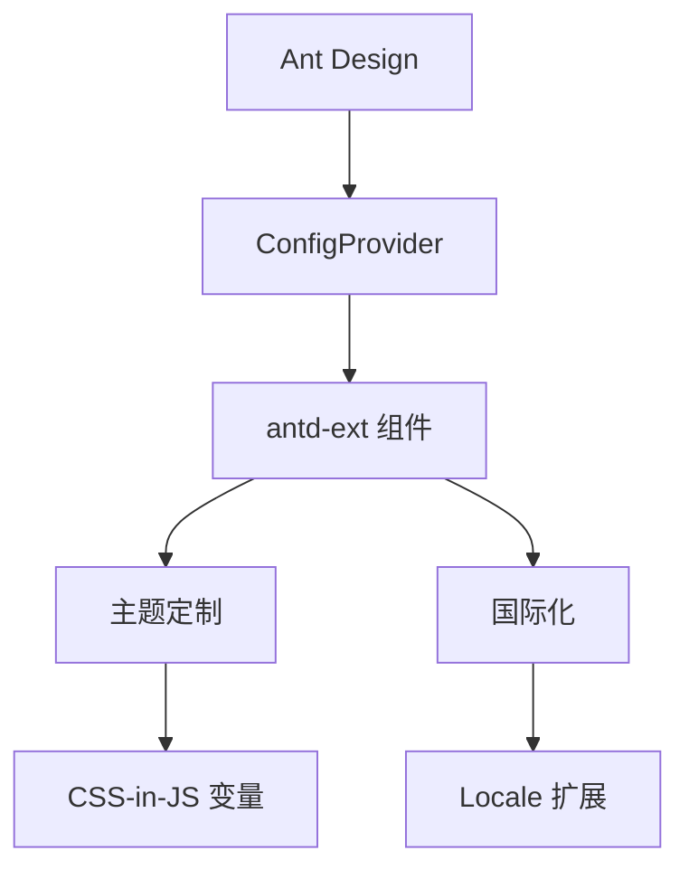
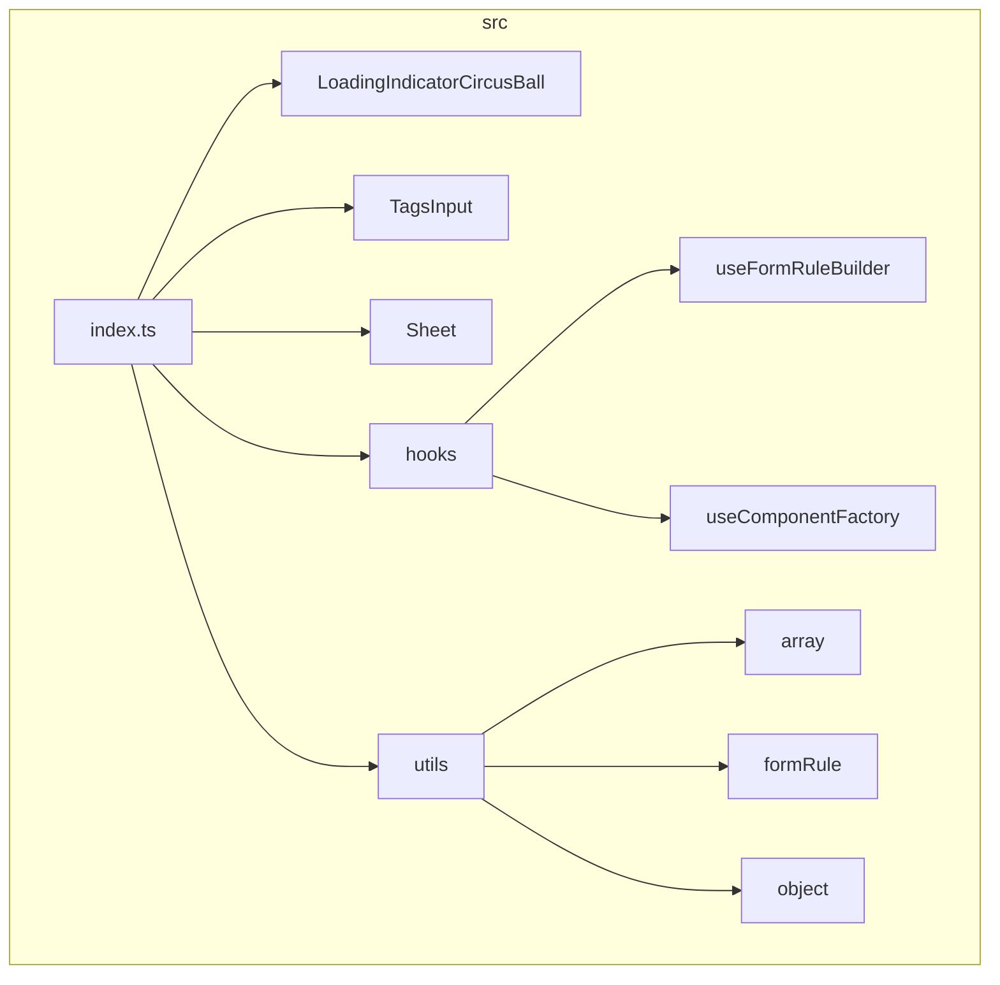
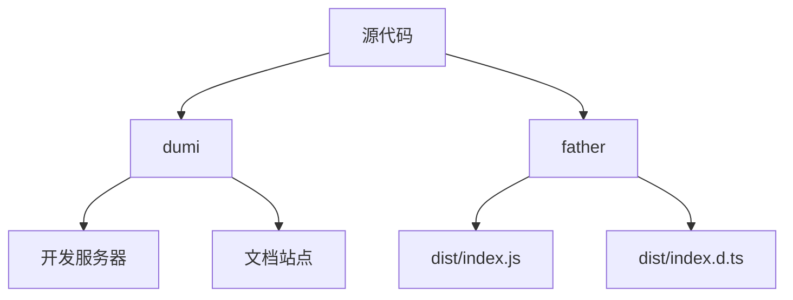
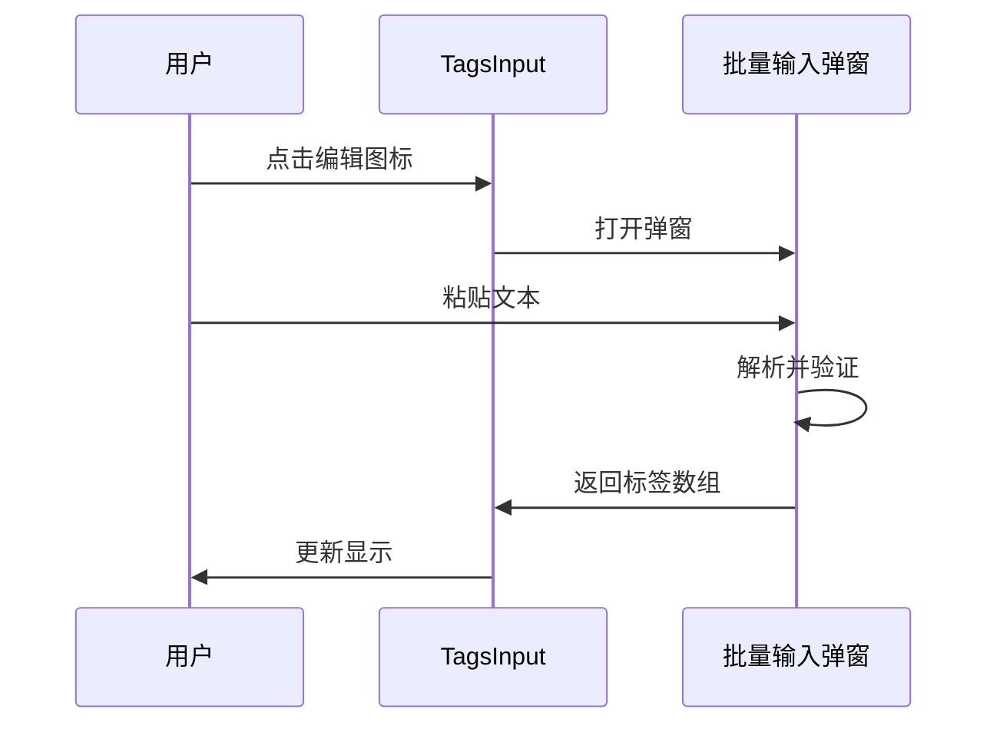
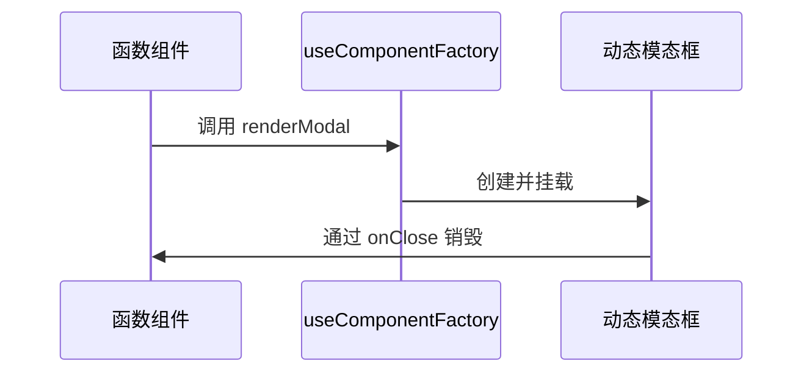

# 介绍与设计原则

<cite>
**本文档引用文件**  
- [README.md](file://README.md)
- [package.json](file://package.json)
- [src/index.md](file://src/index.md)
- [src/index.ts](file://src/index.ts)
- [src/typings.d.ts](file://src/typings.d.ts)
- [.dumirc.ts](file://.dumirc.ts)
- [.fatherrc.ts](file://.fatherrc.ts)
- [src/LoadingIndicatorCircusBall/index.md](file://src/LoadingIndicatorCircusBall/index.md)
- [src/TagsInput/index.md](file://src/TagsInput/index.md)
- [src/Sheet/index.md](file://src/Sheet/index.md)
- [src/hooks/useFormRuleBuilder.ts](file://src/hooks/useFormRuleBuilder.ts)
- [src/hooks/useComponentFactory.ts](file://src/hooks/useComponentFactory.ts)
- [src/utils/formRule.ts](file://src/utils/formRule.ts)
- [src/LoadingIndicatorCircusBall/index.tsx](file://src/LoadingIndicatorCircusBall/index.tsx)
- [src/TagsInput/index.tsx](file://src/TagsInput/index.tsx)
- [src/Sheet/index.tsx](file://src/Sheet/index.tsx)
</cite>

## 目录
1. [项目概述](#项目概述)
2. [核心目标](#核心目标)
3. [架构风格](#架构风格)
4. [模块关系与组件概览](#模块关系与组件概览)
5. [技术选型与设计决策](#技术选型与设计决策)
6. [典型使用场景](#典型使用场景)
7. [学习路径指引](#学习路径指引)

## 项目概述

antd-ext 是一个基于 dumi 构建的 React 组件库，旨在对 Ant Design 进行功能增强与补充。该项目兼容 React 16 至 19 版本，严格遵循 Ant Design 的设计规范，支持国际化与主题定制，致力于提升开发效率与用户体验。

项目通过 TypeScript 提供完整的类型定义，确保 API 的友好性与类型安全。其设计哲学是“增强而非替代”，在不破坏 Ant Design 原有生态的前提下，为开发者提供更强大、更灵活的工具集。

**Section sources**
- [README.md](file://README.md#L1-L42)
- [package.json](file://package.json#L1-L93)

## 核心目标

antd-ext 的核心目标可归纳为三个方面：提升开发效率、增强组件功能、提供更灵活的开发工具。

### 提升开发效率
通过提供如 `TagsInput`（标签输入）、`LogicalSelect`（逻辑条件构建器）等高频业务组件，减少重复开发工作。同时，`useFormRuleBuilder` 等自定义 Hook 简化了表单校验逻辑的构建过程，使代码更加简洁和可维护。

### 增强组件功能
对现有 Ant Design 组件进行能力扩展。例如，`EnhanceTable` 支持 `scroll.y = 'auto'` 自动高度和斑马纹效果，`EnhanceDrawer` 支持拖拽调整大小，这些功能直接解决了实际开发中的常见痛点。

### 提供灵活的开发工具
提供 `useComponentFactory` 等高级 Hook，允许在函数组件中动态渲染模态框等组件，避免了传统类组件中复杂的 `setState` 操作，提升了开发的灵活性和响应性。

**Section sources**
- [README.md](file://README.md#L7-L13)
- [src/index.md](file://src/index.md#L1-L4)

## 架构风格

antd-ext 采用基于 React 的组件化设计，结合 TypeScript 实现类型安全，并通过 CSS-in-JS 与 SCSS 混合样式方案实现灵活的主题定制。

### 组件化设计
所有功能均以独立组件形式组织，如 `LoadingIndicatorCircusBall`、`TagsInput` 和 `Sheet`，每个组件拥有独立的目录结构，包含实现文件、样式文件、文档和示例。

### TypeScript 类型安全
项目全面采用 TypeScript，所有组件和 Hook 都提供了精确的类型定义。例如，`TagsInputProps` 接口明确定义了组件的属性类型，`useFormRuleBuilder` 返回的 `FormRuleBuilder` 类提供了链式调用的类型推导。

### 与 Ant Design 的无缝集成
通过 `ConfigProvider` 机制，antd-ext 实现了与 Ant Design 主题系统和国际化体系的无缝协同。在 `src/typings.d.ts` 中，通过模块声明扩展了 `antd/es/locale` 和 `antd/es/theme/interface/components`，将自定义组件的本地化文本和主题 token 注入到 Ant Design 的全局配置中。

**Diagram sources**
- [src/typings.d.ts](file://src/typings.d.ts#L1-L34)
- [src/TagsInput/index.tsx](file://src/TagsInput/index.tsx#L1-L707)
- [src/LoadingIndicatorCircusBall/index.tsx](file://src/LoadingIndicatorCircusBall/index.tsx#L1-L47)

**Section sources**
- [src/typings.d.ts](file://src/typings.d.ts#L1-L34)
- [src/index.ts](file://src/index.ts#L1-L7)

## 模块关系与组件概览

项目模块结构清晰，主要分为组件、Hooks 和工具函数三大类。

### 组件模块
位于 `src/` 目录下的各个子目录，如 `LoadingIndicatorCircusBall`、`TagsInput`、`Sheet` 等。每个组件通过 `src/index.ts` 文件统一导出，形成库的公共 API。

### Hooks 模块
位于 `src/hooks/` 目录，包含 `useFormRuleBuilder` 和 `useComponentFactory` 两个核心 Hook，为业务开发提供高级抽象。

### 工具函数
位于 `src/utils/` 目录，提供如 `unionBy` 等通用工具函数，支持组件内部逻辑。

**Diagram sources**
- [src/index.ts](file://src/index.ts#L1-L7)
- [src/hooks/index.ts](file://src/hooks/index.ts#L1-L3)

**Section sources**
- [src/index.ts](file://src/index.ts#L1-L7)
- [src/hooks/index.ts](file://src/hooks/index.ts#L1-L3)

## 技术选型与设计决策

### 为何采用 dumi + father 技术栈
- **dumi**：专为组件库设计的文档工具，支持 Markdown 中嵌入 React 组件示例，能够自动生成 API 表格，极大提升了文档的可维护性和交互性。
- **father**：现代化的 React 组件库构建工具，支持一键构建 ESM、CJS 等多种格式，简化了打包配置。

**Diagram sources**
- [.dumirc.ts](file://.dumirc.ts#L1-L128)
- [.fatherrc.ts](file://.fatherrc.ts#L1-L7)

### CSS-in-JS 与 SCSS 混合样式方案的优势
- **CSS-in-JS**：使用 `@ant-design/cssinjs` 实现动态主题定制，通过 `useStyle` Hook 生成带哈希的类名，避免样式冲突。
- **SCSS**：用于编写静态样式，如组件布局和基础样式，便于维护和复用。

这种混合方案既保证了样式的动态性和隔离性，又保留了传统 CSS 的可读性和开发效率。

**Section sources**
- [.dumirc.ts](file://.dumirc.ts#L1-L128)
- [.fatherrc.ts](file://.fatherrc.ts#L1-L7)
- [package.json](file://package.json#L58-L59)

## 典型使用场景

### 批量标签输入
`TagsInput` 组件支持批量输入功能，用户可通过弹窗一次性粘贴大量标签，适用于需要批量导入 ID 或名称的场景。

**Diagram sources**
- [src/TagsInput/index.tsx](file://src/TagsInput/index.tsx#L257-L265)
- [src/TagsInput/index.md](file://src/TagsInput/index.md#L51-L55)

### 动态弹窗渲染
`useComponentFactory` Hook 允许在函数组件中动态创建和销毁模态框，避免了在组件状态中管理大量 `visible` 变量的复杂性。

**Diagram sources**
- [src/hooks/useComponentFactory.ts](file://src/hooks/useComponentFactory.ts#L29-L77)
- [src/TagsInput/index.tsx](file://src/TagsInput/index.tsx#L257-L265)

## 学习路径指引

### 初学者路径
1. 阅读 `README.md` 了解项目基本特性和安装方法。
2. 查看 `docs/guide.md` 学习基础使用。
3. 通过 `src/*/demo/*.tsx` 示例文件实践各个组件的用法。

### 高级用户路径
1. 分析 `src/typings.d.ts` 理解国际化和主题扩展机制。
2. 研究 `useFormRuleBuilder` 和 `useComponentFactory` 的实现，掌握高级 Hook 的使用模式。
3. 探索 `dumi` 和 `father` 的配置，了解如何定制文档和构建流程。

**Section sources**
- [README.md](file://README.md#L1-L42)
- [docs/guide.md](file://docs/guide.md)
- [src/hooks/useFormRuleBuilder.ts](file://src/hooks/useFormRuleBuilder.ts#L1-L22)
- [src/hooks/useComponentFactory.ts](file://src/hooks/useComponentFactory.ts#L1-L111)