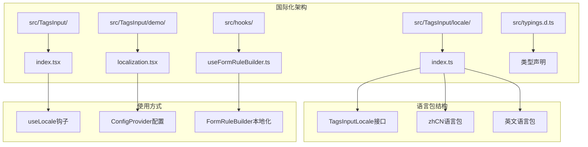
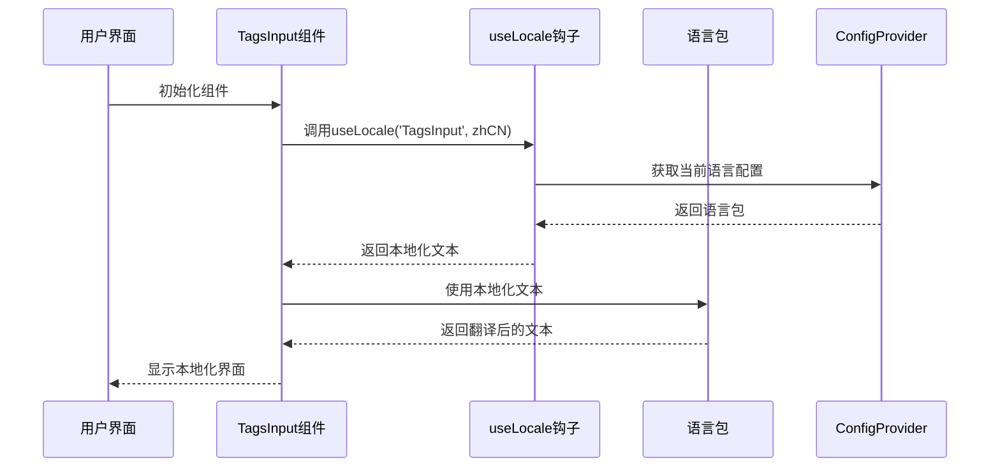
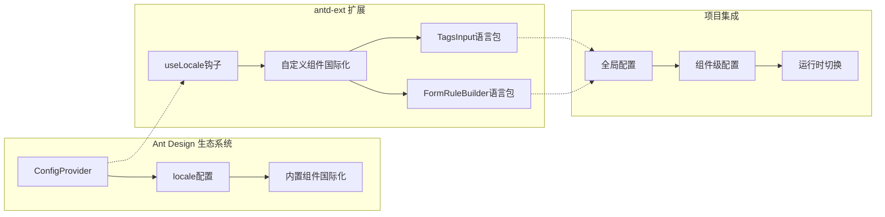
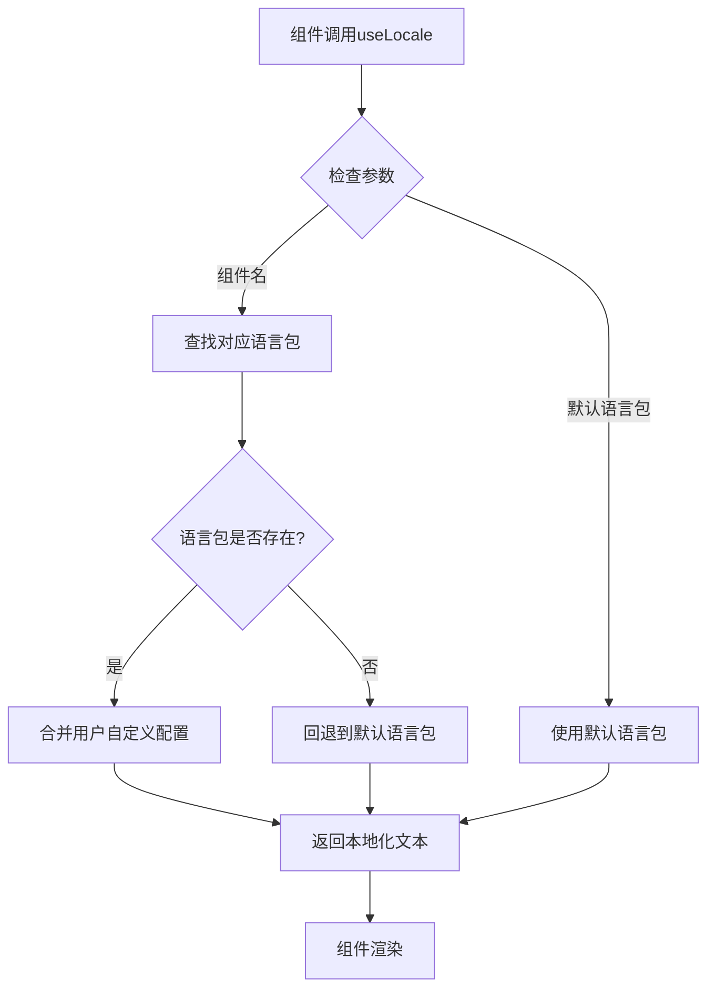
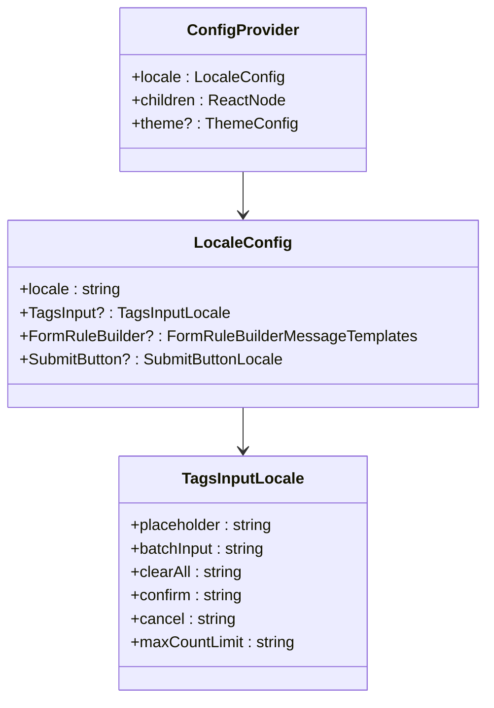
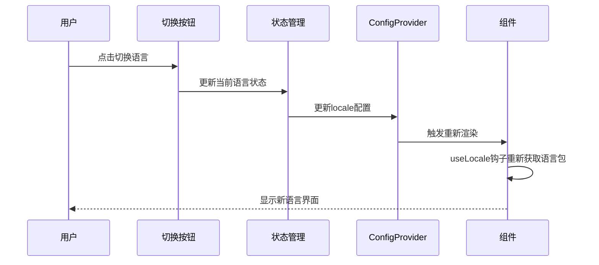
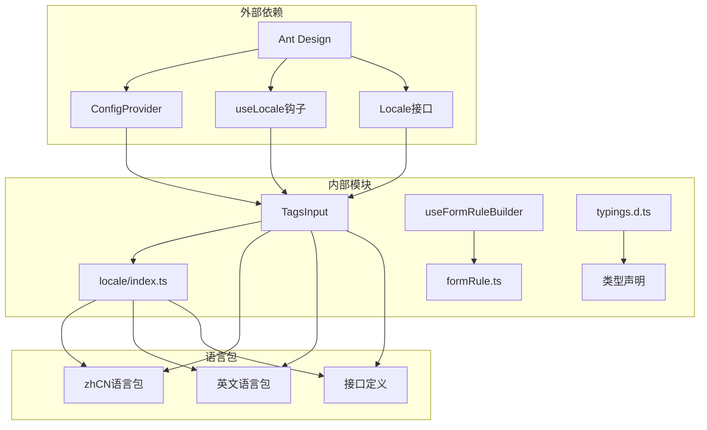

# 国际化支持

<cite>
**本文档中引用的文件**
- [src/TagsInput/locale/index.ts](file://src/TagsInput/locale/index.ts)
- [src/TagsInput/index.tsx](file://src/TagsInput/index.tsx)
- [src/TagsInput/demo/localization.tsx](file://src/TagsInput/demo/localization.tsx)
- [src/hooks/useFormRuleBuilder.ts](file://src/hooks/useFormRuleBuilder.ts)
- [src/typings.d.ts](file://src/typings.d.ts)
</cite>

## 目录
1. [简介](#简介)
2. [项目结构](#项目结构)
3. [核心组件](#核心组件)
4. [架构概览](#架构概览)
5. [详细组件分析](#详细组件分析)
6. [依赖关系分析](#依赖关系分析)
7. [性能考虑](#性能考虑)
8. [故障排除指南](#故障排除指南)
9. [结论](#结论)

## 简介

antd-ext 是一个基于 Ant Design 的扩展组件库，提供了强大的国际化支持功能。该库通过与 Ant Design 的 ConfigProvider.locale 保持同步，实现了项目级的统一语言管理。本文档详细说明了 antd-ext 如何实现多语言功能，包括 locale 文件夹的结构、语言包的组织方式、组件如何获取当前语言环境并动态切换文本等核心机制。

## 项目结构

antd-ext 的国际化支持主要集中在 `src/TagsInput/locale/` 目录下，采用模块化的语言包组织方式：

**图表来源**
- [src/TagsInput/locale/index.ts](file://src/TagsInput/locale/index.ts#L1-L47)
- [src/TagsInput/index.tsx](file://src/TagsInput/index.tsx#L1-L707)

**章节来源**
- [src/TagsInput/locale/index.ts](file://src/TagsInput/locale/index.ts#L1-L47)
- [src/TagsInput/demo/localization.tsx](file://src/TagsInput/demo/localization.tsx#L1-L137)

## 核心组件

### TagsInput 组件的国际化实现

TagsInput 组件是 antd-ext 中国际化支持的核心体现，通过 useLocale 钩子获取当前语言环境：

**图表来源**
- [src/TagsInput/index.tsx](file://src/TagsInput/index.tsx#L67-L71)
- [src/TagsInput/locale/index.ts](file://src/TagsInput/locale/index.ts#L24-L46)

### 语言包接口定义

TagsInput 的语言包通过 TypeScript 接口进行强类型定义：

| 属性名 | 类型 | 描述 | 示例 |
|--------|------|------|------|
| placeholder | string | 输入框占位符 | "按回车新增" |
| batchInput | string | 批量输入按钮文本 | "批量输入" |
| clearAll | string | 清空所有按钮文本 | "清空所有" |
| confirm | string | 确认按钮文本 | "确定" |
| cancel | string | 取消按钮文本 | "取消" |
| rows | string | 行数文本 | "行数" |
| maxCountLimit | string | 最大数量限制提示 | "最大数量限制：${maxCount}个" |
| invalidNumber | string | 无效数字错误提示 | "请输入有效的数字" |
| duplicateItem | string | 重复项提示 | "已有: ${item}" |

**章节来源**
- [src/TagsInput/locale/index.ts](file://src/TagsInput/locale/index.ts#L1-L47)

## 架构概览

antd-ext 的国际化架构基于 Ant Design 的 ConfigProvider 和自定义的 useLocale 钩子：

**图表来源**
- [src/typings.d.ts](file://src/typings.d.ts#L15-L21)
- [src/TagsInput/demo/localization.tsx](file://src/TagsInput/demo/localization.tsx#L71-L75)

## 详细组件分析

### useLocale 钩子机制

antd-ext 通过 useLocale 钩子实现组件级别的国际化：

**图表来源**
- [src/TagsInput/index.tsx](file://src/TagsInput/index.tsx#L67-L71)
- [src/hooks/useFormRuleBuilder.ts](file://src/hooks/useFormRuleBuilder.ts#L10-L13)

### ConfigProvider 配置同步

项目通过 ConfigProvider 实现全局语言配置的统一管理：

**图表来源**
- [src/TagsInput/demo/localization.tsx](file://src/TagsInput/demo/localization.tsx#L71-L75)
- [src/typings.d.ts](file://src/typings.d.ts#L15-L21)

### 动态语言切换实现

组件支持运行时动态切换语言，无需重新加载页面：

**图表来源**
- [src/TagsInput/demo/localization.tsx](file://src/TagsInput/demo/localization.tsx#L66-L68)

**章节来源**
- [src/TagsInput/index.tsx](file://src/TagsInput/index.tsx#L67-L71)
- [src/TagsInput/demo/localization.tsx](file://src/TagsInput/demo/localization.tsx#L66-L136)

## 依赖关系分析

antd-ext 的国际化功能依赖于以下核心模块：

**图表来源**
- [src/TagsInput/index.tsx](file://src/TagsInput/index.tsx#L16)
- [src/hooks/useFormRuleBuilder.ts](file://src/hooks/useFormRuleBuilder.ts#L1)
- [src/typings.d.ts](file://src/typings.d.ts#L1-L33)

**章节来源**
- [src/TagsInput/index.tsx](file://src/TagsInput/index.tsx#L16-L17)
- [src/hooks/useFormRuleBuilder.ts](file://src/hooks/useFormRuleBuilder.ts#L1-L21)

## 性能考虑

antd-ext 的国际化实现采用了多种优化策略：

1. **懒加载语言包**：只有在组件首次渲染时才加载对应的语言包
2. **缓存机制**：useLocale 钩子会缓存已获取的语言包，避免重复计算
3. **按需更新**：语言切换时只重新渲染受影响的组件
4. **类型安全**：通过 TypeScript 接口确保语言包的完整性

## 故障排除指南

### 常见问题及解决方案

| 问题 | 原因 | 解决方案 |
|------|------|----------|
| 语言包未生效 | ConfigProvider 配置缺失 | 确保正确配置 ConfigProvider.locale |
| 组件显示默认文本 | 语言包不完整 | 检查语言包是否包含所有必需字段 |
| 运行时切换失效 | 缺少状态管理 | 实现语言状态的响应式更新 |
| 类型错误 | 接口定义不匹配 | 确保语言包符合 TagsInputLocale 接口 |

### 开发者指南

#### 添加新的语言包

1. 在 `src/TagsInput/locale/` 目录下创建新的语言包文件
2. 导出新的语言包常量
3. 更新 `src/typings.d.ts` 中的类型声明
4. 在 Demo 中添加对应的配置

#### 覆盖现有翻译

1. 创建自定义语言包
2. 在 ConfigProvider 中覆盖默认语言包
3. 确保自定义语言包包含所有必需字段

**章节来源**
- [src/TagsInput/locale/index.ts](file://src/TagsInput/locale/index.ts#L1-L47)
- [src/TagsInput/demo/localization.tsx](file://src/TagsInput/demo/localization.tsx#L14-L64)

## 结论

antd-ext 提供了一套完整而灵活的国际化解决方案，通过与 Ant Design 的深度集成，实现了项目级的统一语言管理。其核心优势包括：

1. **模块化设计**：每个组件都有独立的语言包，便于维护和扩展
2. **类型安全**：通过 TypeScript 接口确保语言包的完整性
3. **运行时切换**：支持动态语言切换，提升用户体验
4. **向后兼容**：与 Ant Design 的国际化机制完全兼容

这套国际化支持不仅简化了多语言应用的开发流程，还为开发者提供了清晰的扩展路径，使得添加新语言或修改现有翻译变得简单直观。