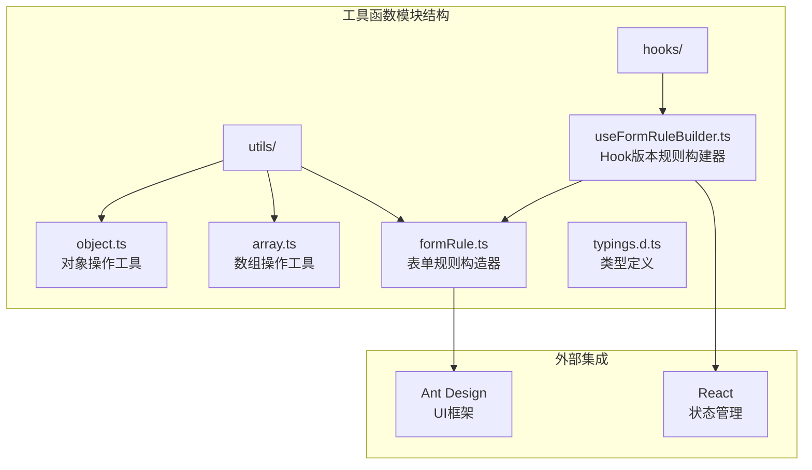
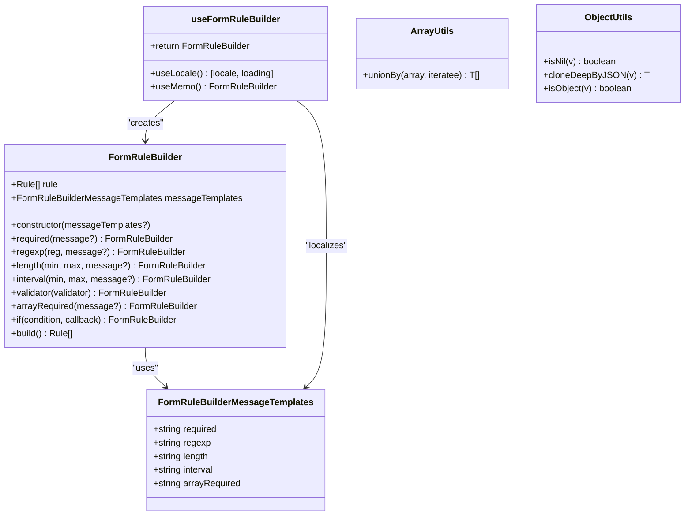
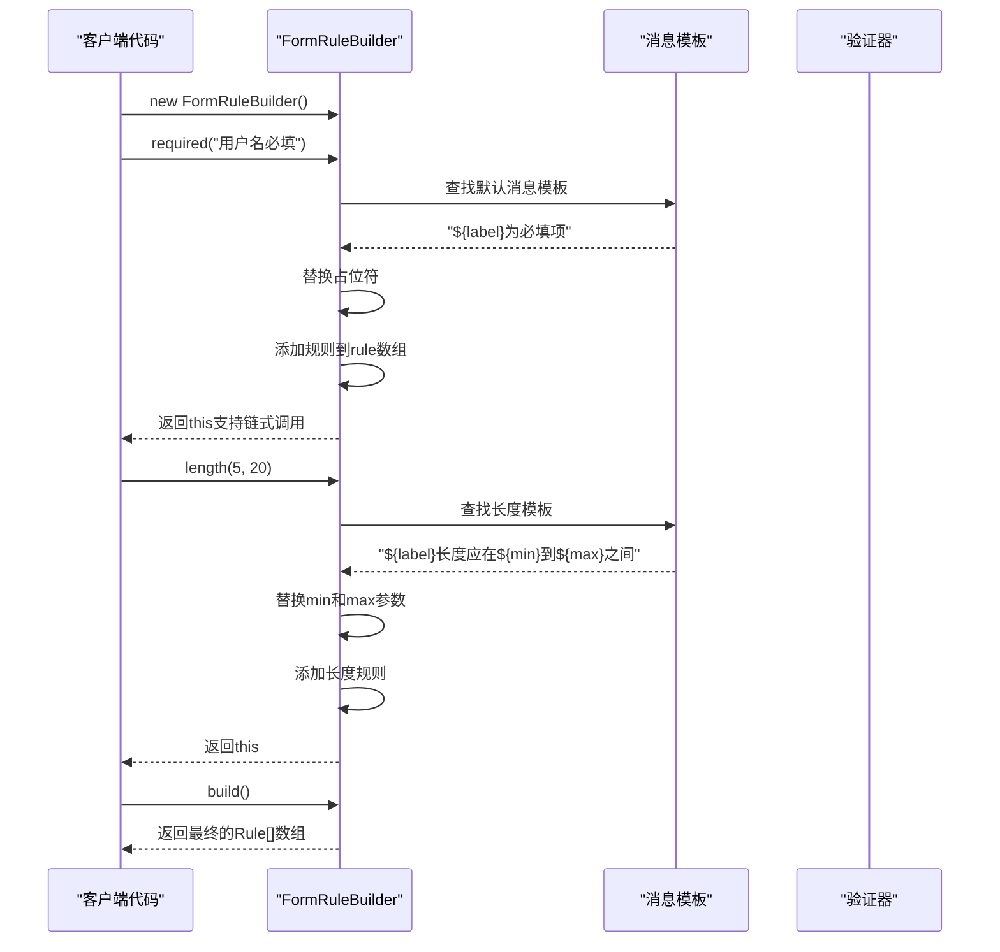
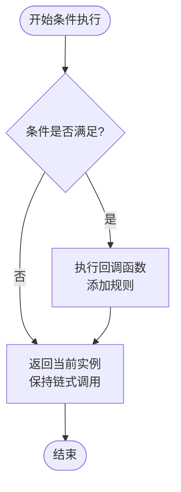
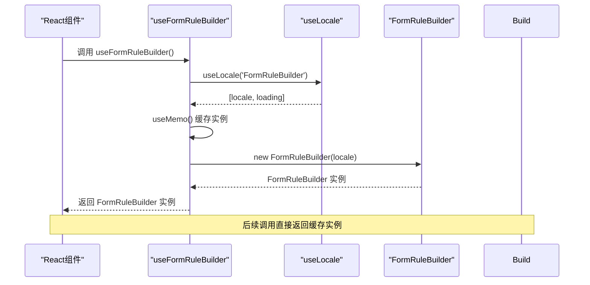
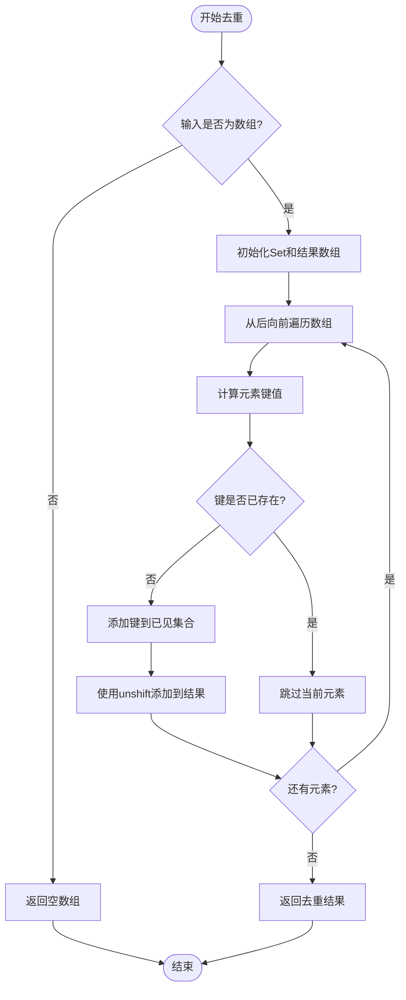
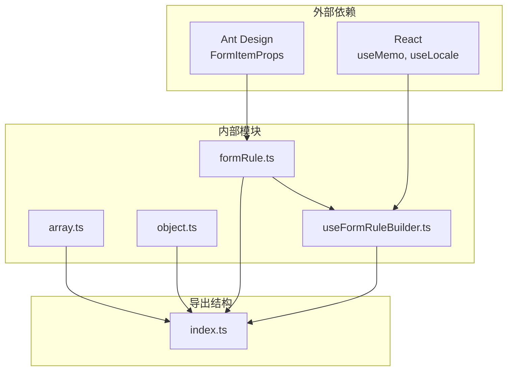

# 工具函数

<cite>
**本文档中引用的文件**
- [formRule.ts](file://src/utils/formRule.ts)
- [array.ts](file://src/utils/array.ts)
- [object.ts](file://src/utils/object.ts)
- [useFormRuleBuilder.ts](file://src/hooks/useFormRuleBuilder.ts)
- [typings.d.ts](file://src/typings.d.ts)
</cite>

## 目录
1. [简介](#简介)
2. [项目结构](#项目结构)
3. [核心组件](#核心组件)
4. [架构概览](#架构概览)
5. [详细组件分析](#详细组件分析)
6. [依赖关系分析](#依赖关系分析)
7. [性能考虑](#性能考虑)
8. [故障排除指南](#故障排除指南)
9. [结论](#结论)

## 简介

工具函数模块位于 `src/utils` 目录下，提供了一系列辅助函数，主要用于表单验证规则构建、数组操作和对象处理。该模块的核心功能包括：

- **表单规则构造器**：提供链式调用的表单验证规则构建工具
- **国际化支持**：内置多语言消息模板和本地化机制
- **通用数据操作**：提供数组去重和对象类型检查等基础工具

这些工具函数设计为内部组件实现的核心支撑，同时也作为公共 API 暴露给外部使用，具有良好的可扩展性和复用性。

## 项目结构

工具函数模块采用清晰的分类结构，每个文件专注于特定的功能领域：

**图表来源**
- [formRule.ts](file://src/utils/formRule.ts#L1-L167)
- [array.ts](file://src/utils/array.ts#L1-L50)
- [object.ts](file://src/utils/object.ts#L1-L16)
- [useFormRuleBuilder.ts](file://src/hooks/useFormRuleBuilder.ts#L1-L22)

**章节来源**
- [formRule.ts](file://src/utils/formRule.ts#L1-L167)
- [array.ts](file://src/utils/array.ts#L1-L50)
- [object.ts](file://src/utils/object.ts#L1-L16)

## 核心组件

### 表单规则构造器 (FormRuleBuilder)

表单规则构造器是工具函数模块的核心组件，提供了链式调用的表单验证规则构建能力。它支持多种验证类型的配置，并内置了完整的国际化支持。

主要特性：
- **链式调用接口**：支持流畅的规则构建语法
- **国际化支持**：内置多语言消息模板
- **灵活的消息定制**：支持自定义错误提示信息
- **条件执行**：提供条件判断的规则添加机制

### 数组操作工具

提供了高效的数组去重功能，特别针对需要保留最后一个重复项的场景进行了优化。

核心功能：
- **基于函数的去重**：通过自定义迭代函数实现灵活的去重逻辑
- **保持相对顺序**：从后向前遍历确保保留最后一个重复项
- **类型安全**：完整的 TypeScript 类型支持

### 对象操作工具

提供了基础的对象操作函数，主要用于类型检查和简单对象处理。

核心功能：
- **空值检查**：统一的 null 和 undefined 检查
- **深拷贝**：基于 JSON 序列化的深拷贝实现
- **对象类型检查**：可靠的 JavaScript 对象检测

**章节来源**
- [formRule.ts](file://src/utils/formRule.ts#L42-L154)
- [array.ts](file://src/utils/array.ts#L30-L49)
- [object.ts](file://src/utils/object.ts#L1-L16)

## 架构概览

工具函数模块采用了模块化的设计架构，各组件之间保持松耦合，便于独立使用和扩展：

**图表来源**
- [formRule.ts](file://src/utils/formRule.ts#L42-L154)
- [useFormRuleBuilder.ts](file://src/hooks/useFormRuleBuilder.ts#L9-L19)
- [array.ts](file://src/utils/array.ts#L30-L49)
- [object.ts](file://src/utils/object.ts#L1-L16)

## 详细组件分析

### FormRuleBuilder 表单规则构造器

FormRuleBuilder 是一个功能完整的表单验证规则构建器，支持链式调用和国际化配置。

#### 核心方法分析

**图表来源**
- [formRule.ts](file://src/utils/formRule.ts#L71-L101)
- [formRule.ts](file://src/utils/formRule.ts#L152-L154)

#### 国际化机制

FormRuleBuilder 内置了完整的国际化支持机制：

| 方法 | 参数 | 功能 | 默认模板 |
|------|------|------|----------|
| `required()` | `message?: string` | 必填验证 | `${label}为必填项` |
| `regexp()` | `reg: RegExp, message?: string` | 正则表达式验证 | `${label}格式不正确` |
| `length()` | `min: number, max: number, message?: string` | 字符串长度验证 | `${label}长度应在${min}到${max}之间` |
| `interval()` | `min: number, max: number, message?: string` | 数字范围验证 | `${label}应在${min}到${max}之间` |
| `arrayRequired()` | `message?: string` | 数组非空验证 | `请至少选择一项${label}` |

#### 条件执行机制

FormRuleBuilder 提供了智能的条件执行功能，允许根据运行时条件动态添加规则：

**图表来源**
- [formRule.ts](file://src/utils/formRule.ts#L59-L64)

**章节来源**
- [formRule.ts](file://src/utils/formRule.ts#L42-L154)

### useFormRuleBuilder Hook

useFormRuleBuilder 是 FormRuleBuilder 的 React Hook 版本，专门用于 React 组件中，自动处理国际化和状态管理。

#### Hook 设计模式

**图表来源**
- [useFormRuleBuilder.ts](file://src/hooks/useFormRuleBuilder.ts#L9-L19)

#### 国际化集成

useFormRuleBuilder 与 Ant Design 的国际化系统深度集成，支持：

- **自动语言检测**：基于 Ant Design 的 locale 系统
- **消息覆盖**：支持外部传入自定义消息模板
- **性能优化**：使用 useMemo 避免不必要的重新创建

**章节来源**
- [useFormRuleBuilder.ts](file://src/hooks/useFormRuleBuilder.ts#L1-L22)
- [typings.d.ts](file://src/typings.d.ts#L15-L21)

### 数组操作工具

#### unionBy 函数分析

unionBy 函数提供了高效的数组去重功能，其设计特点包括：

**图表来源**
- [array.ts](file://src/utils/array.ts#L30-L49)

#### 性能特性

- **时间复杂度**：O(n)，其中 n 是数组长度
- **空间复杂度**：O(k)，k 是唯一键的数量
- **稳定性**：保持元素的相对顺序
- **内存效率**：使用 Set 进行快速查找

**章节来源**
- [array.ts](file://src/utils/array.ts#L30-L49)

### 对象操作工具

#### 类型检查系统

对象操作工具提供了简洁而可靠的对象类型检查机制：

| 函数 | 输入类型 | 输出 | 用途 |
|------|----------|------|------|
| `isNil(v)` | `unknown` | `boolean` | 检查 null 或 undefined |
| `isObject(v)` | `unknown` | `boolean` | 检查是否为非空对象 |
| `cloneDeepByJSON(v)` | `T` | `T` | 基于 JSON 的深拷贝 |

#### 实现细节

- **isNil**：统一处理 null 和 undefined 的检查
- **isObject**：先检查非空再验证对象类型，避免类型错误
- **cloneDeepByJSON**：利用 JSON 序列化实现深拷贝，简单但有效

**章节来源**
- [object.ts](file://src/utils/object.ts#L1-L16)

## 依赖关系分析

工具函数模块的依赖关系相对简单，各组件之间保持低耦合：

**图表来源**
- [formRule.ts](file://src/utils/formRule.ts#L1-L3)
- [useFormRuleBuilder.ts](file://src/hooks/useFormRuleBuilder.ts#L1-L3)
- [typings.d.ts](file://src/typings.d.ts#L1-L2)

### 模块导出策略

工具函数模块通过统一的入口文件暴露功能：

- **FormRuleBuilder**：作为默认导出，提供完整的规则构建功能
- **useFormRuleBuilder**：作为命名导出，提供 React Hook 版本
- **数组和对象工具**：作为独立的命名导出

**章节来源**
- [formRule.ts](file://src/utils/formRule.ts#L162-L167)
- [useFormRuleBuilder.ts](file://src/hooks/useFormRuleBuilder.ts#L1-L22)

## 性能考虑

### FormRuleBuilder 性能优化

- **链式调用**：减少中间变量，提高内存效率
- **消息模板缓存**：在构造函数中预处理模板，避免重复计算
- **条件执行**：早期退出机制，减少不必要的计算

### 数组去重优化

- **Set 数据结构**：O(1) 的查找复杂度
- **逆序遍历**：确保保留最后一个重复项
- **原地修改**：使用 unshift 保持相对顺序

### 内存管理

- **useMemo 缓存**：React Hook 避免不必要的重新创建
- **浅拷贝优化**：对象工具使用简单的 JSON 序列化

## 故障排除指南

### 常见问题及解决方案

#### 表单规则构建问题

**问题**：国际化消息未正确显示
**解决方案**：
1. 确保 Ant Design 的 locale 已正确配置
2. 检查自定义消息模板的占位符格式
3. 验证消息模板中的占位符名称匹配

**问题**：链式调用中断
**解决方案**：
1. 确保每个方法都返回 this
2. 检查条件执行中的回调函数
3. 验证 build() 方法被正确调用

#### 数组去重问题

**问题**：去重结果不符合预期
**解决方案**：
1. 检查 iteratee 函数的返回值
2. 验证输入数组的类型
3. 确认去重逻辑符合业务需求

#### 对象操作问题

**问题**：深拷贝失败
**解决方案**：
1. 检查对象是否包含循环引用
2. 验证对象是否可序列化
3. 考虑使用更复杂的深拷贝方案

**章节来源**
- [formRule.ts](file://src/utils/formRule.ts#L27-L37)
- [array.ts](file://src/utils/array.ts#L31-L32)
- [object.ts](file://src/utils/object.ts#L5-L7)

## 结论

工具函数模块提供了完整而高效的辅助功能集合，具有以下优势：

### 主要优势

1. **功能完整性**：涵盖了表单验证、数组操作和对象处理的核心需求
2. **易用性**：提供直观的链式调用接口和完善的 TypeScript 支持
3. **国际化支持**：内置多语言消息模板和 React Hook 集成
4. **性能优化**：采用高效的数据结构和算法，注重内存和计算效率
5. **扩展性**：模块化设计便于功能扩展和维护

### 推荐使用方式

- **表单验证**：优先使用 FormRuleBuilder 或 useFormRuleBuilder
- **数据处理**：根据具体需求选择数组或对象工具函数
- **国际化应用**：配合 Ant Design 的国际化系统使用
- **React 开发**：推荐使用 useFormRuleBuilder Hook

### 最佳实践

1. **合理使用缓存**：对于复杂的规则构建，考虑使用 useMemo 包装
2. **类型安全**：充分利用 TypeScript 类型系统
3. **性能监控**：在大数据量场景下注意性能表现
4. **测试覆盖**：为关键功能编写单元测试

工具函数模块作为项目的基础支撑，为上层组件开发提供了强大而灵活的工具集，是整个项目架构中不可或缺的重要组成部分。