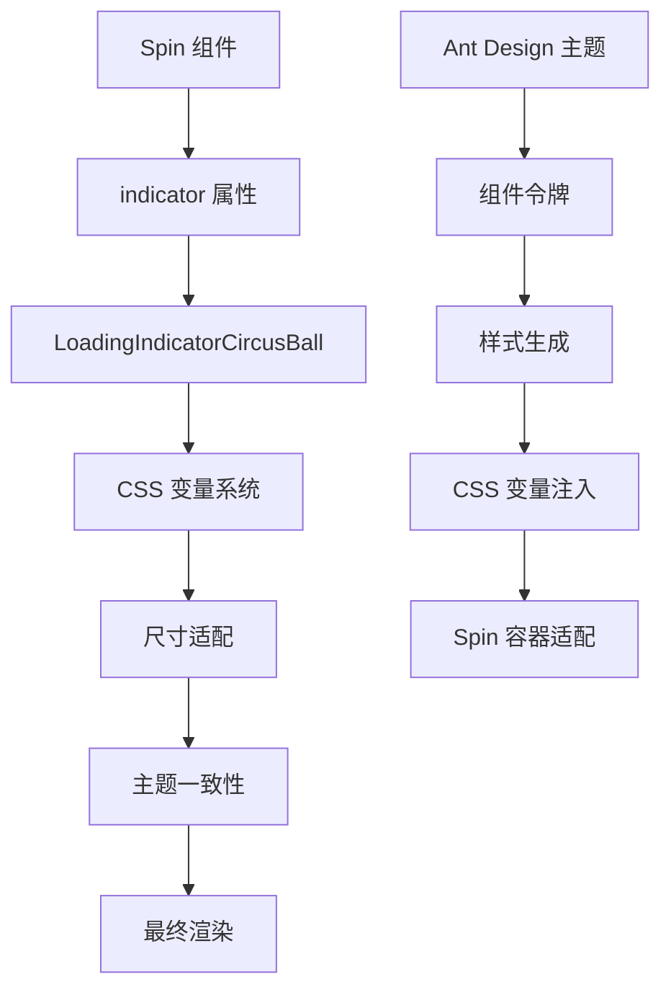
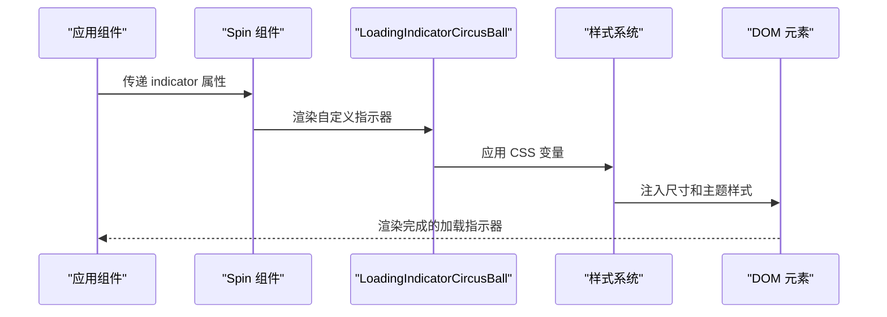
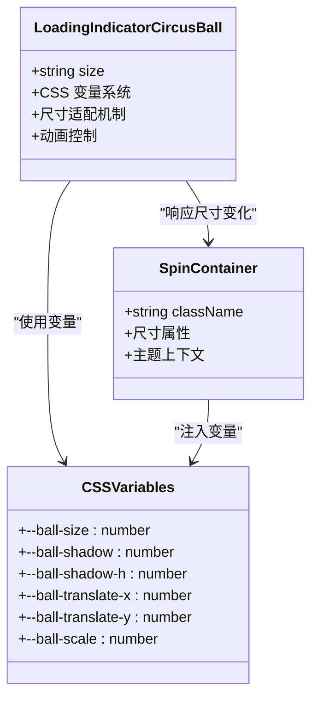
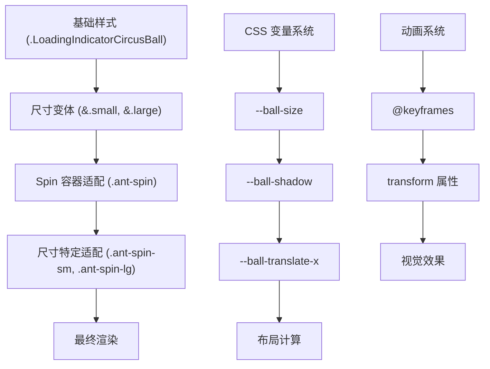

# Spin 集成

<cite>
**本文档中引用的文件**
- [index.tsx](file://src/LoadingIndicatorCircusBall/index.tsx)
- [useStyle.ts](file://src/LoadingIndicatorCircusBall/useStyle.ts)
- [index.module.scss](file://src/LoadingIndicatorCircusBall/index.module.scss)
- [with-spin.tsx](file://src/LoadingIndicatorCircusBall/demo/with-spin.tsx)
- [index.md](file://src/LoadingIndicatorCircusBall/index.md)
</cite>

## 目录
1. [简介](#简介)
2. [集成概述](#集成概述)
3. [基本集成步骤](#基本集成步骤)
4. [配置示例](#配置示例)
5. [尺寸适配机制](#尺寸适配机制)
6. [样式覆盖原理](#样式覆盖原理)
7. [主题定制](#主题定制)
8. [故障排除](#故障排除)
9. [最佳实践](#最佳实践)

## 简介

LoadingIndicatorCircusBall 是一个充满趣味性的马戏团风格加载指示器，包含 5 个彩色小球的动画效果。通过巧妙的 CSS 变量系统和 Ant Design 的主题集成机制，它可以无缝地作为 Ant Design Spin 组件的自定义指示器使用，为应用增添视觉吸引力和用户体验。

## 集成概述

LoadingIndicatorCircusBall 与 Ant Design Spin 组件的集成基于以下核心机制：



**图表来源**
- [index.tsx](file://src/LoadingIndicatorCircusBall/index.tsx#L1-L47)
- [useStyle.ts](file://src/LoadingIndicatorCircusBall/useStyle.ts#L32-L344)

## 基本集成步骤

### 1. 导入组件

首先需要导入必要的组件和 Spin 组件：

```typescript
import { Spin } from 'antd';
import { LoadingIndicatorCircusBall } from '@byte.n/antd-ext';
```

### 2. 基本使用方式

最简单的集成方式是直接将 LoadingIndicatorCircusBall 作为 Spin 的 indicator 属性值：

```typescript
<Spin
  indicator={<LoadingIndicatorCircusBall />}
  spinning={true}
/>
```

### 3. 完整集成流程



**图表来源**
- [with-spin.tsx](file://src/LoadingIndicatorCircusBall/demo/with-spin.tsx#L1-L11)
- [index.tsx](file://src/LoadingIndicatorCircusBall/index.tsx#L20-L45)

**章节来源**
- [with-spin.tsx](file://src/LoadingIndicatorCircusBall/demo/with-spin.tsx#L1-L11)

## 配置示例

### 基础 Spin 集成

最基本的集成方式适用于大多数场景：

```typescript
// 基础 Spin 集成
<Spin
  indicator={<LoadingIndicatorCircusBall />}
  spinning={true}
/>
```

### 带有尺寸控制的 Spin

可以通过设置 LoadingIndicatorCircusBall 的 size 属性来控制整体尺寸：

```typescript
// 不同尺寸的 Spin 集成
<Spin
  indicator={<LoadingIndicatorCircusBall size="large" />}
  spinning={true}
/>
```

### 在 ConfigProvider 中全局配置

可以将 LoadingIndicatorCircusBall 设置为全局默认的 Spin 指示器：

```typescript
<ConfigProvider
  theme={{
    components: {
      Spin: {
        indicator: <LoadingIndicatorCircusBall />
      }
    }
  }}
>
  {/* 应用内容 */}
</ConfigProvider>
```

### 表格加载状态集成

在表格等复杂组件中使用：

```typescript
<Table
  dataSource={data}
  loading={{
    indicator: <LoadingIndicatorCircusBall />,
    spinning: isLoading
  }}
  columns={columns}
/>
```

**章节来源**
- [with-spin.tsx](file://src/LoadingIndicatorCircusBall/demo/with-spin.tsx#L1-L11)

## 尺寸适配机制

LoadingIndicatorCircusBall 通过 CSS 变量系统实现了与 Ant Design Spin 组件的完美尺寸适配。这种机制确保了在不同尺寸的 Spin 容器中都能保持一致的视觉效果。

### CSS 变量系统架构



**图表来源**
- [useStyle.ts](file://src/LoadingIndicatorCircusBall/useStyle.ts#L48-L76)
- [index.module.scss](file://src/LoadingIndicatorCircusBall/index.module.scss#L5-L28)

### 尺寸规格对照表

| Spin 尺寸类名 | --ball-size | --ball-shadow | --ball-shadow-h | --ball-translate-x | --ball-translate-y |
|-------------|-------------|---------------|-----------------|-------------------|-------------------|
| .ant-spin-sm | 5px | 1px | 2px | -10px | -13.5px |
| .ant-spin | 12px | 4.25px | 5.5px | -50px | -60.5px |
| .ant-spin-lg | 18px | 4.25px | 5.5px | -80px | -90.5px |

### 自动尺寸适配原理

当 Spin 组件检测到不同的尺寸类名（如 `.ant-spin-sm` 或 `.ant-spin-lg`）时，会自动应用相应的 CSS 变量值，从而实现：

1. **容器尺寸匹配**：指示器的总高度和宽度自动适应 Spin 容器
2. **元素比例保持**：小球大小、阴影大小、动画轨迹等按比例缩放
3. **间距一致性**：小球之间的间距和边距保持相对比例

**章节来源**
- [useStyle.ts](file://src/LoadingIndicatorCircusBall/useStyle.ts#L238-L324)
- [index.module.scss](file://src/LoadingIndicatorCircusBall/index.module.scss#L30-L44)

## 样式覆盖原理

LoadingIndicatorCircusBall 通过精心设计的 CSS 选择器优先级和样式覆盖机制，确保在 Spin 容器中的正确渲染。

### 样式覆盖层次结构



**图表来源**
- [useStyle.ts](file://src/LoadingIndicatorCircusBall/useStyle.ts#L238-L324)
- [index.module.scss](file://src/LoadingIndicatorCircusBall/index.module.scss#L30-L44)

### 关键样式覆盖规则

#### 1. 基础尺寸覆盖

在 `.ant-spin` 容器下，通过嵌套选择器精确覆盖基础尺寸变量：

```scss
.ant-spin {
  &.ant-spin-sm {
    :local(.LoadingIndicatorCircusBall) {
      --ball-size: 5px;
      --ball-shadow: 1px;
      --ball-shadow-h: 2px;
      --ball-translate-x: -10px;
      --ball-translate-y: -13.5px;
    }
  }
  
  &.ant-spin-lg {
    :local(.LoadingIndicatorCircusBall) {
      --ball-size: 18px;
      --ball-shadow: 4.25px;
      --ball-shadow-h: 5.5px;
      --ball-translate-x: -80px;
      --ball-translate-y: -90.5px;
    }
  }
}
```

#### 2. 布局计算公式

Spin 容器的尺寸计算基于 CSS 变量：

```scss
height: calc((var(--ball-translate-y) * -1) + var(--ball-size));
width: calc((var(--ball-translate-x) * -1) + var(--ball-size));
margin: var(--ball-size);
```

这些计算确保：
- **垂直居中**：通过负值偏移实现垂直居中
- **水平对齐**：通过偏移和尺寸计算实现水平对齐
- **间距控制**：通过 margin 变量控制外部间距

#### 3. 动画兼容性

Spin 组件的动画系统与 LoadingIndicatorCircusBall 的动画系统协同工作：

- **透明度控制**：Spin 的 `opacity` 动画与指示器的 `fadeIn` 动画配合
- **尺寸同步**：Spin 的 `transform` 动画不影响指示器的内部动画
- **性能优化**：避免重复的动画计算，保持流畅体验

**章节来源**
- [useStyle.ts](file://src/LoadingIndicatorCircusBall/useStyle.ts#L238-L324)
- [index.module.scss](file://src/LoadingIndicatorCircusBall/index.module.scss#L30-L44)

## 主题定制

LoadingIndicatorCircusBall 支持通过 Ant Design 的主题系统进行深度定制，包括颜色、尺寸和动画参数。

### 主题配置接口

```typescript
interface ComponentToken {
  /** 小球阴影颜色 */
  ballShadowColor?: string;
  /** 小球1颜色 */
  ball1Color?: string;
  /** 小球2颜色 */
  ball2Color?: string;
  /** 小球3颜色 */
  ball3Color?: string;
  /** 小球4颜色 */
  ball4Color?: string;
  /** 小球5颜色 */
  ball5Color?: string;
}
```

### 默认主题配置

```typescript
const defaultTokens = {
  ballShadowColor: 'rgba(0, 0, 0, 0.1)',
  ball1Color: '#397BF9',
  ball2Color: '#F4B400',
  ball3Color: '#EEEEEE',
  ball4Color: '#00A656',
  ball5Color: '#E3746B',
};
```

### 主题定制示例

#### 1. 基础颜色定制

```typescript
<ConfigProvider
  theme={{
    components: {
      LoadingIndicatorCircusBall: {
        ball1Color: '#1890ff',
        ball2Color: '#52c41a',
        ball3Color: '#faad14',
        ball4Color: '#f5222d',
        ball5Color: '#722ed1',
        ballShadowColor: 'rgba(0, 0, 0, 0.2)',
      }
    }
  }}
>
  <Spin indicator={<LoadingIndicatorCircusBall />} spinning={true} />
</ConfigProvider>
```

#### 2. 动态主题切换

```typescript
const [theme, setTheme] = useState({
  ball1Color: '#397BF9',
  ball2Color: '#F4B400',
});

return (
  <ConfigProvider
    theme={{
      components: {
        LoadingIndicatorCircusBall: theme
      }
    }}
  >
    <Spin indicator={<LoadingIndicatorCircusBall />} spinning={true} />
  </ConfigProvider>
);
```

### 主题定制的最佳实践

1. **色彩对比度**：确保小球颜色与背景有足够的对比度
2. **阴影效果**：合理调整 `ballShadowColor` 以获得适当的立体感
3. **品牌一致性**：使用符合品牌调性的颜色方案
4. **无障碍考虑**：确保颜色选择符合无障碍设计标准

**章节来源**
- [useStyle.ts](file://src/LoadingIndicatorCircusBall/useStyle.ts#L15-L28)
- [useStyle.ts](file://src/LoadingIndicatorCircusBall/useStyle.ts#L328-L335)

## 故障排除

### 常见问题及解决方案

#### 1. 尺寸不匹配问题

**问题描述**：LoadingIndicatorCircusBall 在 Spin 容器中显示过大或过小

**解决方案**：
- 检查 Spin 容器是否正确应用了尺寸类名（`.ant-spin-sm`、`.ant-spin`、`.ant-spin-lg`）
- 确认 CSS 变量是否被正确注入
- 验证父容器的 `font-size` 是否影响了尺寸计算

#### 2. 样式冲突问题

**问题描述**：自定义样式覆盖了 LoadingIndicatorCircusBall 的默认样式

**解决方案**：
```scss
// 使用更具体的选择器
.ant-spin .custom-loading-indicator {
  // 避免直接覆盖 .LoadingIndicatorCircusBall 的样式
}

// 或者使用 CSS Modules 的局部作用域
:local(.custom-loading-indicator) {
  // 保持原有样式不变
}
```

#### 3. 动画性能问题

**问题描述**：在大量并发 Spin 实例中出现动画卡顿

**解决方案**：
- 减少同时运行的 Spin 实例数量
- 使用 `requestAnimationFrame` 优化动画
- 考虑使用 `will-change` 属性提升性能

#### 4. 主题不生效问题

**问题描述**：通过 ConfigProvider 设置的主题颜色没有生效

**解决方案**：
```typescript
// 确保主题配置正确
<ConfigProvider
  theme={{
    components: {
      LoadingIndicatorCircusBall: {
        ball1Color: '#your-color',
        ball2Color: '#your-color',
        // ... 其他颜色配置
      }
    }
  }}
>
  <Spin indicator={<LoadingIndicatorCircusBall />} spinning={true} />
</ConfigProvider>
```

### 调试技巧

1. **检查 CSS 变量**：使用浏览器开发者工具查看 `--ball-*` 变量是否正确应用
2. **验证选择器优先级**：确认样式选择器的优先级足够高
3. **测试不同尺寸**：分别测试 `small`、`default`、`large` 尺寸下的表现
4. **监控性能**：使用 Performance 面板检查动画性能

## 最佳实践

### 1. 性能优化建议

- **避免频繁切换**：不要在短时间内频繁切换 Spin 的 `spinning` 状态
- **合理使用尺寸**：根据实际需求选择合适的尺寸，避免过度放大
- **批量处理**：对于大量数据加载，考虑使用骨架屏替代

### 2. 用户体验建议

- **加载时间提示**：为长时间加载提供文字提示
- **交互反馈**：在加载期间禁用相关交互元素
- **错误处理**：提供加载失败时的降级方案

### 3. 主题设计建议

- **品牌一致性**：使用符合品牌调性的颜色方案
- **无障碍设计**：确保颜色对比度满足 WCAG 标准
- **多主题支持**：考虑支持亮色和暗色主题

### 4. 代码组织建议

```typescript
// 推荐的封装方式
const CustomSpin: React.FC<SpinProps> = (props) => {
  return (
    <Spin
      indicator={<LoadingIndicatorCircusBall size="default" />}
      {...props}
    />
  );
};

// 使用时
<CustomSpin spinning={isLoading}>
  {/* 内容 */}
</CustomSpin>
```

通过遵循这些最佳实践，可以确保 LoadingIndicatorCircusBall 与 Spin 组件的集成既美观又高效，为用户提供优秀的加载体验。