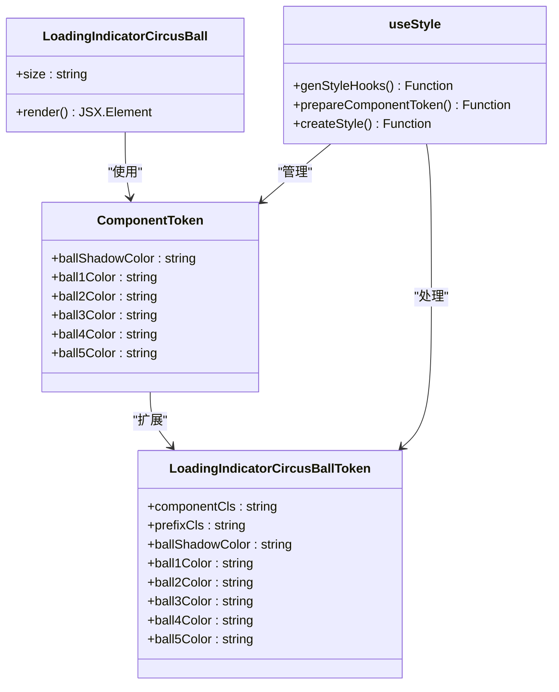
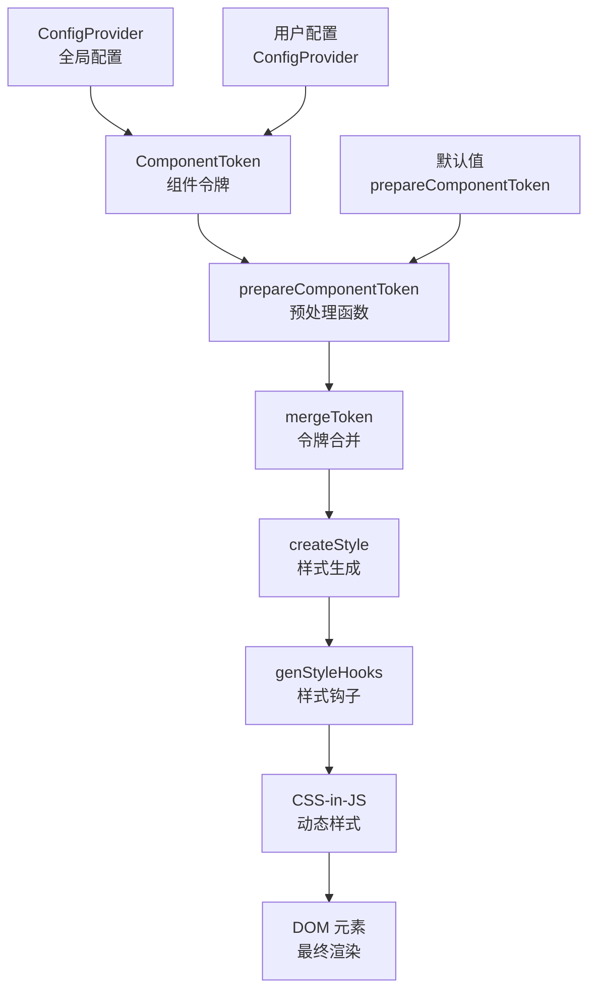
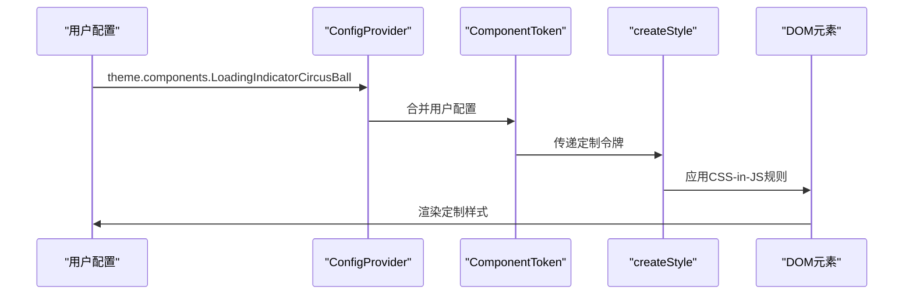
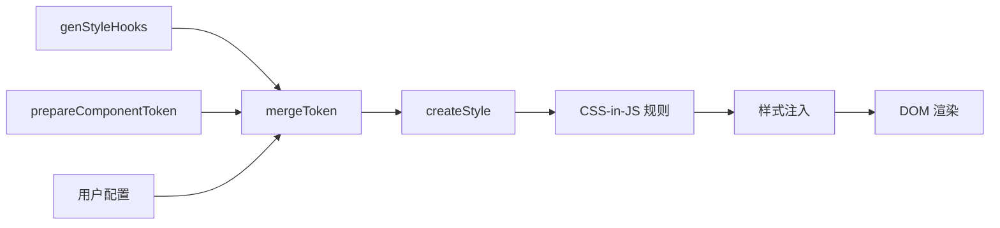
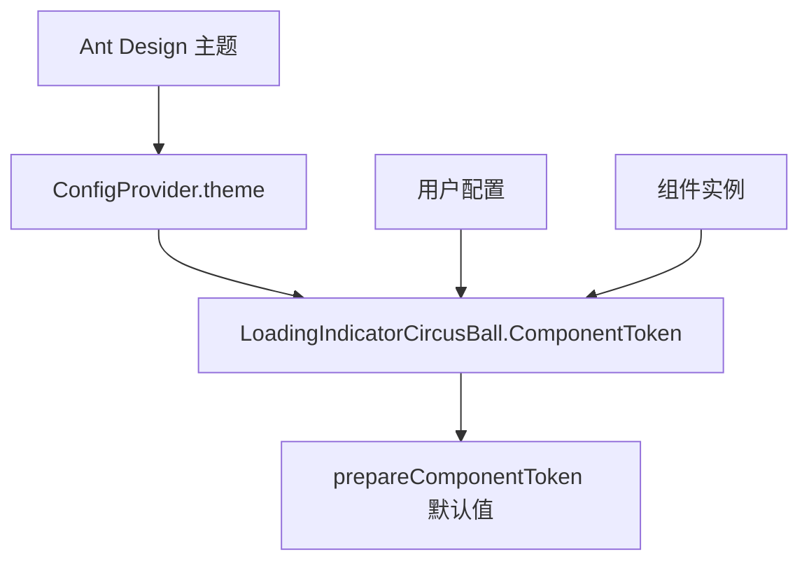

# 主题定制

<cite>
**本文档引用的文件**
- [index.tsx](file://src/LoadingIndicatorCircusBall/index.tsx)
- [useStyle.ts](file://src/LoadingIndicatorCircusBall/useStyle.ts)
- [theme-customization.tsx](file://src/LoadingIndicatorCircusBall/demo/theme-customization.tsx)
- [index.md](file://src/LoadingIndicatorCircusBall/index.md)
- [basic.tsx](file://src/LoadingIndicatorCircusBall/demo/basic.tsx)
- [different-sizes.tsx](file://src/LoadingIndicatorCircusBall/demo/different-sizes.tsx)
- [with-spin.tsx](file://src/LoadingIndicatorCircusBall/demo/with-spin.tsx)
- [index.module.scss](file://src/LoadingIndicatorCircusBall/index.module.scss)
</cite>

## 目录
1. [简介](#简介)
2. [核心组件架构](#核心组件架构)
3. [主题定制系统](#主题定制系统)
4. [ComponentToken 接口详解](#componenttoken-接口详解)
5. [ConfigProvider 全局配置](#configprovider-全局配置)
6. [样式注入机制](#样式注入机制)
7. [默认值与继承关系](#默认值与继承关系)
8. [实际应用示例](#实际应用示例)
9. [设计建议与最佳实践](#设计建议与最佳实践)
10. [故障排除指南](#故障排除指南)

## 简介

LoadingIndicatorCircusBall 是一个具有马戏团风格的加载指示器组件，通过 Ant Design 的主题定制系统提供了丰富的视觉定制能力。该组件包含五个彩色小球的动画效果，支持通过 ComponentToken 机制对小球颜色和阴影进行深度定制。

### 核心特性

- **五彩小球动画**：五个不同颜色的小球进行跳跃和移动的动画效果
- **多尺寸支持**：支持 small、default、large 三种尺寸规格
- **主题定制**：通过 ConfigProvider 和 ComponentToken 实现深度定制
- **Spin 集成**：可作为 Ant Design Spin 组件的自定义指示器
- **CSS-in-JS 样式**：基于 Ant Design 的样式系统实现

## 核心组件架构



**图表来源**
- [index.tsx](file://src/LoadingIndicatorCircusBall/index.tsx#L1-L47)
- [useStyle.ts](file://src/LoadingIndicatorCircusBall/useStyle.ts#L15-L28)

**章节来源**
- [index.tsx](file://src/LoadingIndicatorCircusBall/index.tsx#L1-L47)
- [useStyle.ts](file://src/LoadingIndicatorCircusBall/useStyle.ts#L1-L345)

## 主题定制系统

LoadingIndicatorCircusBall 采用 Ant Design 的现代主题定制系统，通过 ComponentToken 机制实现组件级别的样式定制。该系统基于 CSS-in-JS 技术，提供动态样式生成和主题继承能力。

### 系统架构图



**图表来源**
- [useStyle.ts](file://src/LoadingIndicatorCircusBall/useStyle.ts#L328-L344)
- [theme-customization.tsx](file://src/LoadingIndicatorCircusBall/demo/theme-customization.tsx#L6-L18)

## ComponentToken 接口详解

ComponentToken 是 LoadingIndicatorCircusBall 的核心定制接口，定义了五个可定制的属性：

### 属性表

| 属性名 | 类型 | 默认值 | 说明 |
|--------|------|--------|------|
| `ballShadowColor` | `string` | `'rgba(0, 0, 0, 0.1)'` | 小球阴影颜色，控制阴影的透明度和色调 |
| `ball1Color` | `string` | `'#397BF9'` | 第一个小球的背景色，通常作为主色调 |
| `ball2Color` | `string` | `'#F4B400'` | 第二个小球的背景色，通常作为强调色 |
| `ball3Color` | `string` | `'#EEEEEE'` | 第三个小球的背景色，通常作为中性色 |
| `ball4Color` | `string` | `'#00A656'` | 第四个小球的背景色，通常作为辅助色 |
| `ball5Color` | `string` | `'#E3746B'` | 第五个小球的背景色，通常作为对比色 |

### 样式应用流程



**图表来源**
- [useStyle.ts](file://src/LoadingIndicatorCircusBall/useStyle.ts#L36-L210)
- [theme-customization.tsx](file://src/LoadingIndicatorCircusBall/demo/theme-customization.tsx#L9-L16)

**章节来源**
- [useStyle.ts](file://src/LoadingIndicatorCircusBall/useStyle.ts#L15-L28)
- [index.md](file://src/LoadingIndicatorCircusBall/index.md#L51-L60)

## ConfigProvider 全局配置

通过 Ant Design 的 ConfigProvider 组件，可以在应用级别全局配置 LoadingIndicatorCircusBall 的主题样式。这是推荐的主要定制方式，适用于整个应用的主题一致性需求。

### 基本配置语法

```typescript
// ConfigProvider 配置示例路径
// src/LoadingIndicatorCircusBall/demo/theme-customization.tsx#L6-L18
```

### 配置结构详解

ConfigProvider 的 theme.components.LoadingIndicatorCircusBall 配置遵循以下结构：

- **components**: Ant Design 组件配置对象
- **LoadingIndicatorCircusBall**: 特定于该组件的配置对象
- **ball1Color - ball5Color**: 小球颜色配置
- **ballShadowColor**: 阴影颜色配置

### 配置优先级

1. **用户显式配置**：最高优先级，直接覆盖默认值
2. **主题继承**：从 ConfigProvider.theme 继承的基础样式
3. **默认值**：prepareComponentToken 函数提供的默认值

**章节来源**
- [theme-customization.tsx](file://src/LoadingIndicatorCircusBall/demo/theme-customization.tsx#L1-L30)

## 样式注入机制

LoadingIndicatorCircusBall 使用 Ant Design 的 genStyleHooks 系统实现样式的动态注入。这个机制确保样式能够正确地应用到组件实例上。

### 样式生成流程



**图表来源**
- [useStyle.ts](file://src/LoadingIndicatorCircusBall/useStyle.ts#L337-L344)

### 关键函数解析

#### prepareComponentToken 函数

该函数负责为 LoadingIndicatorCircusBall 组件提供默认的 ComponentToken 值：

- **ballShadowColor**: `'rgba(0, 0, 0, 0.1)'` - 浅灰色阴影，提供微妙的立体感
- **ball1Color**: `'#397BF9'` - 蓝色主色调，代表专业和信任
- **ball2Color**: `'#F4B400'` - 黄色强调色，吸引注意力
- **ball3Color**: `'#EEEEEE'` - 灰色中性色，平衡整体色彩
- **ball4Color**: `'#00A656'` - 绿色辅助色，传达积极和稳定
- **ball5Color**: `'#E3746B'` - 红色对比色，增加视觉冲击力

#### createStyle 函数

该函数接收完整的令牌对象，生成针对 LoadingIndicatorCircusBall 的 CSS-in-JS 规则：

- **CSS 变量定义**：设置动画相关的尺寸和位置变量
- **响应式样式**：为 small、default、large 三种尺寸提供不同的样式
- **动画关键帧**：定义 translateX、translateY、scale、fadeIn 四种动画
- **选择器映射**：将 ball1Color 到 ball5Color 映射到对应的 DOM 元素

**章节来源**
- [useStyle.ts](file://src/LoadingIndicatorCircusBall/useStyle.ts#L328-L344)

## 默认值与继承关系

### 默认值体系

LoadingIndicatorCircusBall 的默认值体系采用分层设计：

1. **prepareComponentToken 默认值**：提供基础的色彩方案
2. **ConfigProvider 继承**：允许全局主题覆盖
3. **组件实例覆盖**：支持单个组件的特殊定制

### 继承链路



**图表来源**
- [useStyle.ts](file://src/LoadingIndicatorCircusBall/useStyle.ts#L338-L342)

### 样式优先级矩阵

| 配置层级 | 优先级 | 示例配置 | 影响范围 |
|----------|--------|----------|----------|
| 组件实例 | 最高 | 直接属性覆盖 | 单个组件 |
| 用户配置 | 高 | ConfigProvider.theme | 整个应用 |
| 默认值 | 中 | prepareComponentToken | 组件库 |
| Ant Design 主题 | 最低 | 基础主题变量 | 全局 |

**章节来源**
- [useStyle.ts](file://src/LoadingIndicatorCircusBall/useStyle.ts#L328-L335)

## 实际应用示例

### 基础主题定制

最简单的定制方式是通过 ConfigProvider 的 theme.components 属性：

```typescript
// 基础定制示例路径
// src/LoadingIndicatorCircusBall/demo/theme-customization.tsx#L9-L16
```

### 品牌色系集成

对于企业应用，可以将品牌色系集成到 LoadingIndicatorCircusBall 中：

```typescript
// 品牌色系定制示例路径
// src/LoadingIndicatorCircusBall/demo/theme-customization.tsx#L10-L15
```

### 动态主题切换

支持运行时的主题切换，通过 React 状态管理动态更新配置：

```typescript
// 动态主题切换示例路径
// 可参考 ConfigProvider 的动态配置模式
```

### 尺寸适配策略

根据不同场景选择合适的尺寸：

- **small**: 用于紧凑布局或移动端界面
- **default**: 标准应用场景
- **large**: 需要突出显示的场景

**章节来源**
- [theme-customization.tsx](file://src/LoadingIndicatorCircusBall/demo/theme-customization.tsx#L1-L30)
- [different-sizes.tsx](file://src/LoadingIndicatorCircusBall/demo/different-sizes.tsx#L1-L11)

## 设计建议与最佳实践

### 色彩搭配原则

#### 1. 对比度要求
- 确保小球颜色与背景有足够的对比度
- 阴影颜色应保持适当的透明度，避免过于浓重
- 主色调与强调色之间应有明显的区分

#### 2. 品牌一致性
- 选择与品牌主色调相协调的颜色
- 考虑品牌色的明暗变化，确保可读性
- 遵循无障碍设计原则，考虑色盲用户的体验

#### 3. 视觉层次
- 主色调（ball1Color）应占据主导地位
- 强调色（ball2Color）用于吸引注意力
- 中性色（ball3Color）作为背景和过渡
- 辅助色（ball4Color）和对比色（ball5Color）增加视觉趣味

### 性能优化建议

#### 1. 样式缓存
- 利用 Ant Design 的样式缓存机制
- 避免频繁的样式重新计算
- 合理使用 CSS 变量减少重复计算

#### 2. 动画性能
- 使用 transform 和 opacity 进行动画
- 避免使用会触发重排的属性
- 合理设置动画持续时间和缓动函数

#### 3. 内存管理
- 及时清理不需要的样式钩子
- 避免内存泄漏
- 合理使用 React.memo 优化组件渲染

### 可访问性考虑

#### 1. 色彩无障碍
- 提供足够的对比度（WCAG AA 级别）
- 不仅依赖颜色传达信息
- 支持高对比度模式

#### 2. 动画可选
- 提供减少动画的选项
- 支持用户偏好设置
- 避免影响屏幕阅读器

### 开发最佳实践

#### 1. 类型安全
- 使用 TypeScript 确保类型安全
- 利用 ComponentToken 接口的类型检查
- 编写单元测试验证样式行为

#### 2. 模块化设计
- 保持组件的单一职责
- 合理分离样式逻辑和业务逻辑
- 支持样式主题的独立测试

#### 3. 文档维护
- 更新组件的使用文档
- 提供完整的配置示例
- 记录样式变更的影响范围

## 故障排除指南

### 常见问题及解决方案

#### 1. 样式不生效
**症状**: 配置了主题但样式没有改变
**原因**: 
- ConfigProvider 未正确包裹组件
- 配置路径错误
- 样式被更高优先级的样式覆盖

**解决方案**:
```typescript
// 确保正确包裹
<ConfigProvider theme={{
  components: {
    LoadingIndicatorCircusBall: {
      // 正确配置
    }
  }
}}>
  {/* 组件 */}
</ConfigProvider>
```

#### 2. 颜色显示异常
**症状**: 颜色显示不正确或出现意外效果
**原因**:
- 颜色格式不正确
- 透明度设置不当
- 颜色值超出有效范围

**解决方案**:
```typescript
// 使用正确的颜色格式
ball1Color: '#397BF9' // 十六进制
ball2Color: 'rgb(244, 180, 0)' // RGB
ball3Color: 'rgba(238, 238, 238, 0.8)' // RGBA
```

#### 3. 动画效果异常
**症状**: 动画卡顿或不连续
**原因**:
- CSS 变量计算错误
- 动画时间设置不当
- 浏览器兼容性问题

**解决方案**:
- 检查 CSS 变量的计算公式
- 调整动画持续时间和缓动函数
- 添加浏览器前缀或降级方案

#### 4. 性能问题
**症状**: 页面卡顿或内存占用过高
**原因**:
- 样式计算过于复杂
- 动画频率过高
- 样式钩子未正确清理

**解决方案**:
- 简化样式计算逻辑
- 降低动画频率
- 确保组件卸载时清理样式

### 调试技巧

#### 1. 开发工具检查
- 使用浏览器开发者工具检查最终样式
- 查看 CSS 变量的实际值
- 检查样式优先级和继承关系

#### 2. 控制台日志
- 在 prepareComponentToken 中添加调试信息
- 检查传入的 token 值
- 验证样式生成过程

#### 3. 组件状态监控
- 使用 React DevTools 检查组件状态
- 监控样式钩子的执行情况
- 验证配置的传递路径

**章节来源**
- [useStyle.ts](file://src/LoadingIndicatorCircusBall/useStyle.ts#L328-L344)
- [index.md](file://src/LoadingIndicatorCircusBall/index.md#L1-L80)

## 结论

LoadingIndicatorCircusBall 的主题定制系统展现了 Ant Design 现代主题系统的强大能力。通过 ComponentToken 机制，开发者可以轻松地将该组件融入现有的设计体系中，同时保持良好的用户体验和视觉一致性。

关键要点总结：

1. **灵活的定制能力**：支持全局和局部的样式定制
2. **类型安全**：完整的 TypeScript 类型定义确保开发安全
3. **性能优化**：基于 CSS-in-JS 的动态样式生成
4. **无障碍支持**：遵循 Web 无障碍设计原则
5. **易于维护**：清晰的架构和模块化设计

通过合理运用这些定制功能，开发者可以创建既美观又实用的加载指示器，提升应用的整体用户体验。