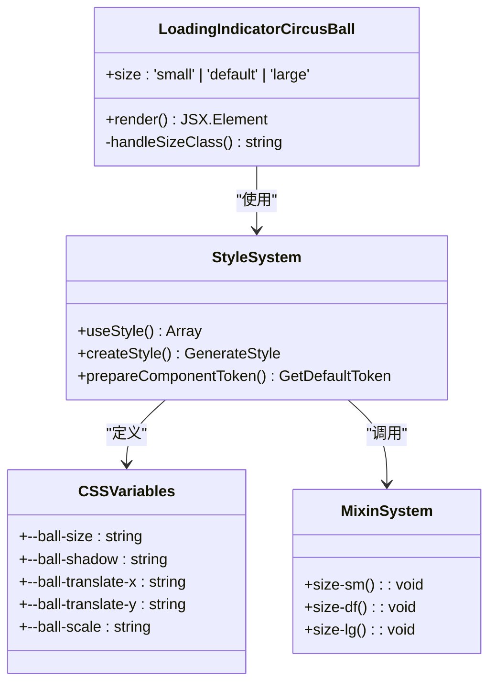
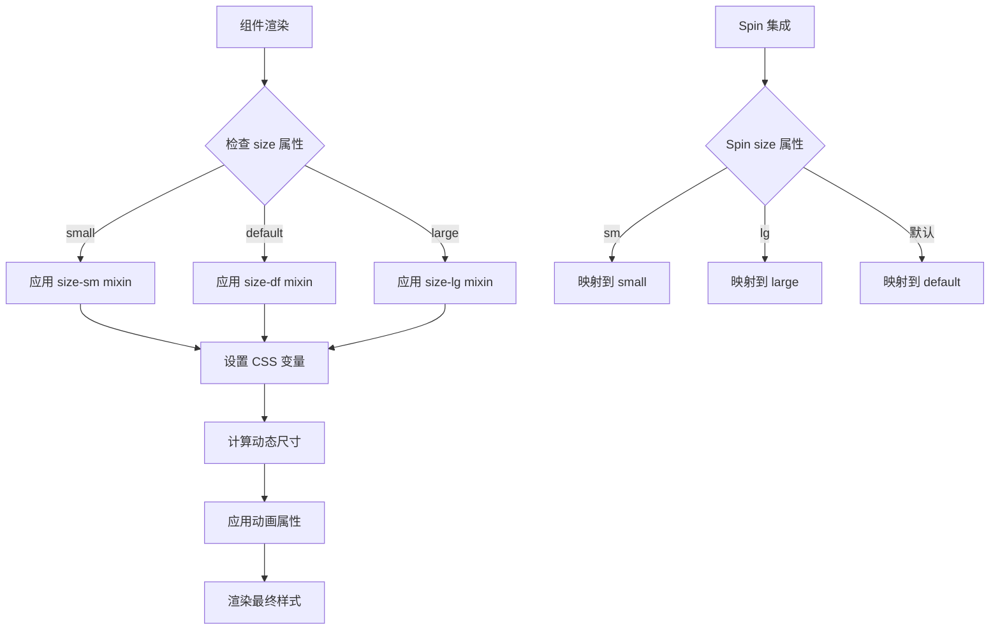
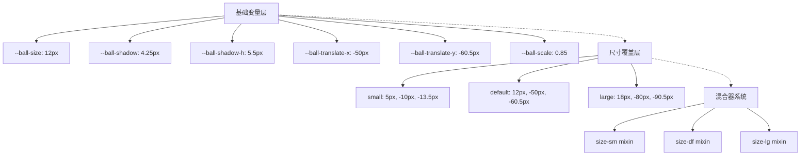
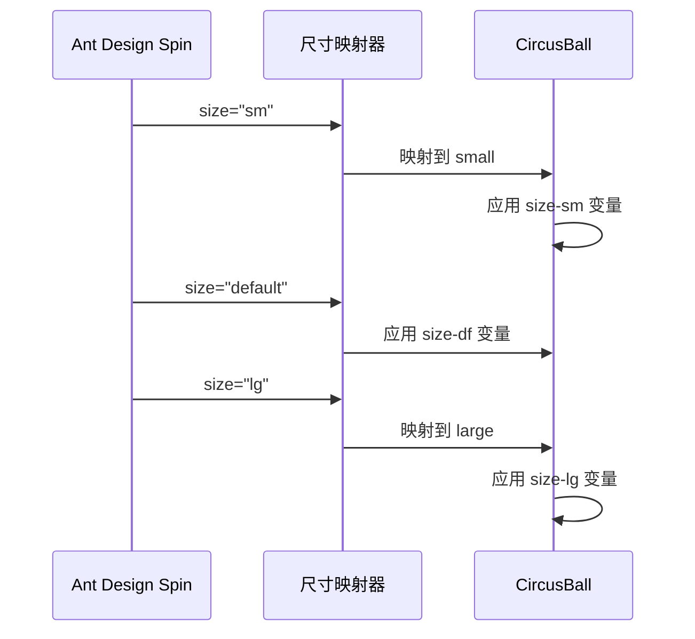
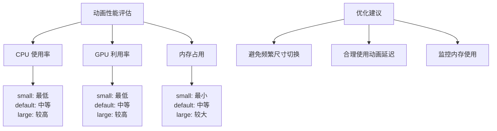

# 尺寸规格

<cite>
**本文档引用的文件**
- [index.tsx](file://src/LoadingIndicatorCircusBall/index.tsx)
- [useStyle.ts](file://src/LoadingIndicatorCircusBall/useStyle.ts)
- [index.module.scss](file://src/LoadingIndicatorCircusBall/index.module.scss)
- [different-sizes.tsx](file://src/LoadingIndicatorCircusBall/demo/different-sizes.tsx)
- [with-spin.tsx](file://src/LoadingIndicatorCircusBall/demo/with-spin.tsx)
- [index.md](file://src/LoadingIndicatorCircusBall/index.md)
</cite>

## 目录
1. [概述](#概述)
2. [尺寸规格定义](#尺寸规格定义)
3. [技术实现架构](#技术实现架构)
4. [CSS 变量系统](#css-变量系统)
5. [尺寸映射关系](#尺寸映射关系)
6. [视觉表现对比](#视觉表现对比)
7. [使用指南](#使用指南)
8. [设计规范建议](#设计规范建议)
9. [性能考虑](#性能考虑)
10. [故障排除](#故障排除)

## 概述

LoadingIndicatorCircusBall 组件提供了三种标准化的尺寸规格：small、default 和 large，每种尺寸都经过精心设计，以满足不同场景下的视觉需求和空间限制。该组件采用基于 CSS 变量的动态尺寸控制系统，确保尺寸变化时保持一致的动画质量和视觉效果。

## 尺寸规格定义

### 核心尺寸参数

| 尺寸 | 球体直径 | 水平移动距离 | 垂直弹跳高度 | 阴影尺寸 | 适用场景 |
|------|----------|--------------|--------------|----------|----------|
| **small** | 5px | -10px | -13.5px | 1px × 2px | 紧凑型界面元素、按钮内加载状态 |
| **default** | 12px | -50px | -60.5px | 4.25px × 5.5px | 标准界面元素、页面级加载 |
| **large** | 18px | -80px | -90.5px | 4.25px × 5.5px | 全屏加载场景、重要操作提示 |

### 尺寸计算公式

组件的高度和宽度通过以下公式动态计算：
- **高度**：`calc((var(--ball-translate-y) * -1) + var(--ball-size))`
- **宽度**：`calc((var(--ball-translate-x) * -1) + var(--ball-size))`

**节来源**
- [index.md](file://src/LoadingIndicatorCircusBall/index.md#L73-L78)
- [useStyle.ts](file://src/LoadingIndicatorCircusBall/useStyle.ts#L49-L103)

## 技术实现架构

### 组件结构设计



**图表来源**
- [index.tsx](file://src/LoadingIndicatorCircusBall/index.tsx#L12-L46)
- [useStyle.ts](file://src/LoadingIndicatorCircusBall/useStyle.ts#L32-L344)

### 样式系统架构



**图表来源**
- [index.module.scss](file://src/LoadingIndicatorCircusBall/index.module.scss#L5-L28)
- [useStyle.ts](file://src/LoadingIndicatorCircusBall/useStyle.ts#L238-L323)

**节来源**
- [index.tsx](file://src/LoadingIndicatorCircusBall/index.tsx#L12-L46)
- [useStyle.ts](file://src/LoadingIndicatorCircusBall/useStyle.ts#L32-L344)

## CSS 变量系统

### 变量定义层次

组件采用分层的 CSS 变量系统，支持细粒度的尺寸控制：



**图表来源**
- [useStyle.ts](file://src/LoadingIndicatorCircusBall/useStyle.ts#L49-L103)
- [index.module.scss](file://src/LoadingIndicatorCircusBall/index.module.scss#L5-L28)

### 变量作用域

| 变量名 | 作用范围 | 默认值 | 尺寸影响 |
|--------|----------|--------|----------|
| `--ball-size` | 球体直径 | 12px | 直接决定球体大小 |
| `--ball-shadow` | 阴影模糊半径 | 4.25px | 影响阴影柔和度 |
| `--ball-shadow-h` | 阴影水平扩展 | 5.5px | 影响阴影形状 |
| `--ball-translate-x` | 水平位移距离 | -50px | 决定动画范围 |
| `--ball-translate-y` | 垂直位移距离 | -60.5px | 决定跳跃高度 |
| `--ball-scale` | 缩放比例 | 0.85 | 影响透视效果 |

**节来源**
- [useStyle.ts](file://src/LoadingIndicatorCircusBall/useStyle.ts#L49-L103)
- [index.module.scss](file://src/LoadingIndicatorCircusBall/index.module.scss#L5-L28)

## 尺寸映射关系

### Spin 组件集成映射

当 LoadingIndicatorCircusBall 作为 Ant Design Spin 组件的指示器时，Spin 的 size 属性会自动映射到相应的 CircusBall 尺寸：



**图表来源**
- [useStyle.ts](file://src/LoadingIndicatorCircusBall/useStyle.ts#L238-L323)
- [index.module.scss](file://src/LoadingIndicatorCircusBall/index.module.scss#L30-L44)

### 映射规则表

| Spin Size | CircusBall Size | CSS 变量组合 | 视觉密度 |
|-----------|----------------|--------------|----------|
| sm | small | `--ball-size: 5px` | 高密度 |
| default | default | `--ball-size: 12px` | 标准密度 |
| lg | large | `--ball-size: 18px` | 低密度 |

**节来源**
- [useStyle.ts](file://src/LoadingIndicatorCircusBall/useStyle.ts#L238-L323)
- [index.module.scss](file://src/LoadingIndicatorCircusBall/index.module.scss#L30-L44)

## 视觉表现对比

### 尺寸视觉密度分析

```mermaid
graph LR
A[Small (5px)] --> B[紧凑布局<br/>高视觉密度<br/>适合按钮内加载]
C[Default (12px)] --> D[标准布局<br/>适中密度<br/>通用场景]
E[Large (18px)] --> F[宽松布局<br/>低视觉密度<br/>全屏加载]
G[动画效果] --> H[small: 快速密集<br/>default: 平衡流畅<br/>large: 缓慢舒展]
I[占用空间] --> J[small: 最小<br/>default: 中等<br/>large: 最大]
K[注意力强度] --> L[small: 最弱<br/>default: 中等<br/>large: 最强]
```

### 动画参数对比

| 尺寸 | 动画持续时间 | 跳跃频率 | 移动范围 | 视觉焦点 |
|------|-------------|----------|----------|----------|
| **small** | 500ms | 高频 | 短距离 | 分散 |
| **default** | 500ms | 中频 | 中距离 | 平衡 |
| **large** | 500ms | 低频 | 长距离 | 集中 |

**节来源**
- [useStyle.ts](file://src/LoadingIndicatorCircusBall/useStyle.ts#L140-L174)
- [index.module.scss](file://src/LoadingIndicatorCircusBall/index.module.scss#L74-L96)

## 使用指南

### 基础尺寸使用

通过 `size` 属性直接控制组件尺寸：

```typescript
// 不同尺寸的使用示例
<LoadingIndicatorCircusBall size="small" />      // 5px 球体
<LoadingIndicatorCircusBall size="default" />    // 12px 球体
<LoadingIndicatorCircusBall size="large" />      // 18px 球体
```

### Spin 组件集成

```typescript
// Spin 组件中的尺寸映射
<Spin size="sm" indicator={<LoadingIndicatorCircusBall />} />
<Spin size="default" indicator={<LoadingIndicatorCircusBall />} />
<Spin size="lg" indicator={<LoadingIndicatorCircusBall />} />
```

### 自定义样式覆盖

```scss
// 覆盖默认尺寸
.custom-small {
  @include size-sm();
}

.custom-large {
  @include size-lg();
}
```

**节来源**
- [different-sizes.tsx](file://src/LoadingIndicatorCircusBall/demo/different-sizes.tsx#L5-L10)
- [with-spin.tsx](file://src/LoadingIndicatorCircusBall/demo/with-spin.tsx#L5-L10)

## 设计规范建议

### 尺寸选择指南

#### Small 尺寸适用场景
- **按钮内部加载**：如提交按钮、确认按钮内的加载状态
- **紧凑界面元素**：仪表板卡片、列表项中的加载指示
- **移动端优先**：屏幕空间有限的移动设备界面
- **次要操作**：非关键性操作的加载反馈

#### Default 尺寸适用场景  
- **标准界面元素**：页面主体内容加载、表单提交
- **通用场景**：大多数 Web 应用的标准加载指示
- **桌面端应用**：宽屏显示器上的主界面加载
- **中等重要性操作**：数据查询、页面切换等

#### Large 尺寸适用场景
- **全屏加载**：页面整体重新加载、应用初始化
- **重要操作**：关键业务流程、数据导入导出
- **演示展示**：产品演示、功能介绍页面
- **高优先级任务**：系统维护、数据备份等

### 视觉一致性原则

1. **尺寸一致性**：同一界面中相同类型的加载操作应使用统一尺寸
2. **场景匹配**：根据操作的重要性和用户期望选择合适的尺寸
3. **动画协调**：尺寸变化时保持动画节奏的一致性
4. **无障碍考虑**：确保不同尺寸在各种设备上都能清晰可见

**节来源**
- [index.md](file://src/LoadingIndicatorCircusBall/index.md#L73-L78)

## 性能考虑

### 渲染性能优化

组件采用 CSS 变量和混合器系统，在尺寸切换时具有良好的性能表现：

- **CSS 变量缓存**：浏览器对 CSS 变量有良好的缓存机制
- **局部样式更新**：尺寸变化只影响相关 CSS 属性，不影响全局样式
- **硬件加速**：动画使用 transform 属性，可触发 GPU 加速

### 内存使用分析

| 尺寸 | CSS 变量数量 | 计算复杂度 | 内存占用 |
|------|-------------|------------|----------|
| **small** | 6 个变量 | 低 | 最小 |
| **default** | 6 个变量 | 中 | 中等 |
| **large** | 6 个变量 | 中 | 较大 |

### 动画性能对比



## 故障排除

### 常见问题及解决方案

#### 问题 1：尺寸不生效
**症状**：指定 size 属性后，组件尺寸没有变化
**原因**：CSS 变量被其他样式覆盖
**解决方案**：
```scss
// 确保正确的样式优先级
.LoadingIndicatorCircusBall {
  composes: size-df from './index.module.scss'; // 强制使用默认尺寸
}
```

#### 问题 2：Spin 集成失效
**症状**：Spin 组件无法正确映射尺寸
**原因**：Spin 的 indicator 属性未正确传递
**解决方案**：
```typescript
// 正确的 Spin 集成方式
<Spin indicator={<LoadingIndicatorCircusBall />} spinning={true} />
```

#### 问题 3：动画异常
**症状**：尺寸变化时动画出现抖动或错乱
**原因**：CSS 变量计算错误或动画冲突
**解决方案**：
- 检查 CSS 变量的计算公式
- 确保动画属性的正确继承
- 避免与其他 CSS 动画冲突

### 调试工具和技巧

1. **浏览器开发者工具**：检查 CSS 变量的实际值
2. **React DevTools**：验证组件属性传递
3. **性能面板**：监控动画性能指标
4. **样式检查器**：确认样式优先级和覆盖关系

**节来源**
- [useStyle.ts](file://src/LoadingIndicatorCircusBall/useStyle.ts#L32-L344)
- [index.module.scss](file://src/LoadingIndicatorCircusBall/index.module.scss#L45-L164)

## 总结

LoadingIndicatorCircusBall 的尺寸规格系统通过 CSS 变量和混合器的巧妙结合，实现了灵活而高效的尺寸控制。三种预设尺寸（small、default、large）分别针对不同的使用场景进行了优化，既保证了视觉效果的一致性，又提供了充分的灵活性。

通过理解这些尺寸规格的设计原理和使用方法，开发者可以更好地在项目中应用这一组件，为用户提供优秀的加载体验。同时，组件的模块化设计也为未来的扩展和定制提供了良好的基础。