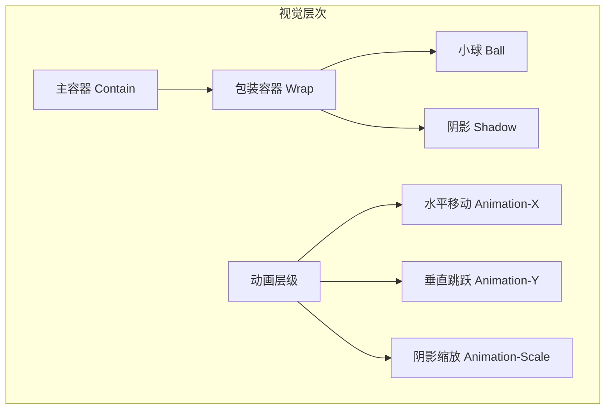
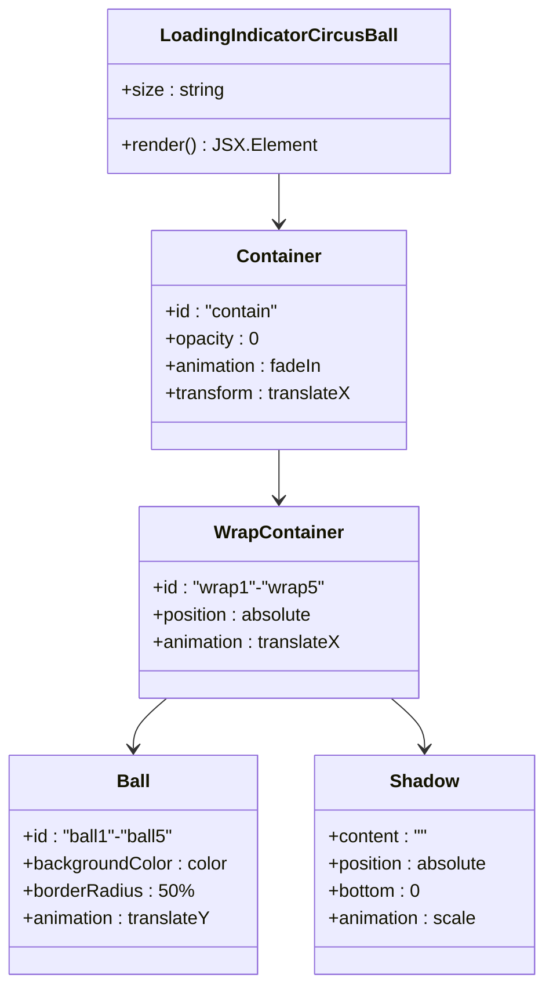
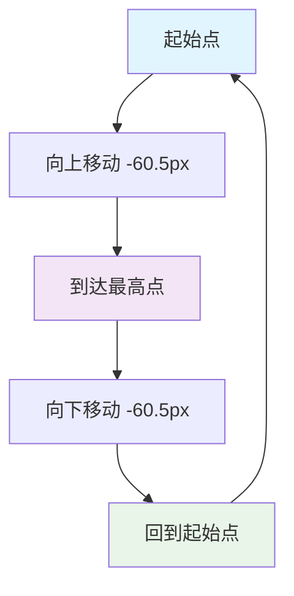
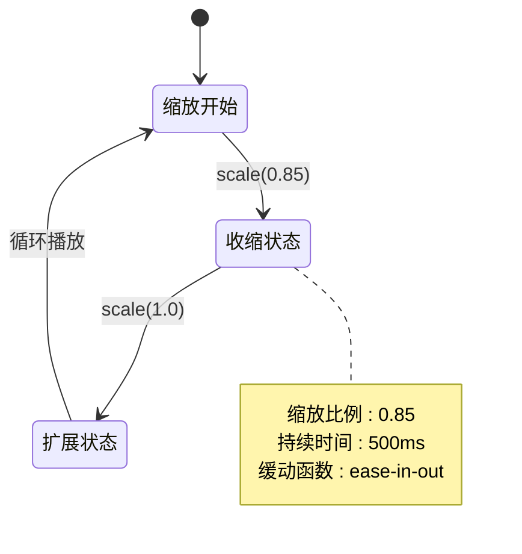
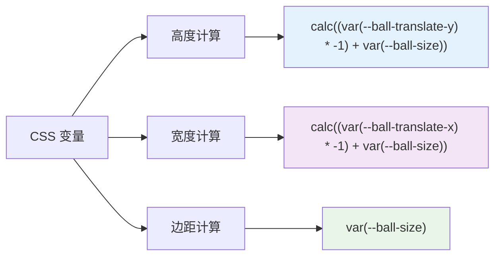

# LoadingIndicatorCircusBall 核心动画详细文档

<cite>
**本文档引用的文件**
- [index.tsx](file://src/LoadingIndicatorCircusBall/index.tsx)
- [useStyle.ts](file://src/LoadingIndicatorCircusBall/useStyle.ts)
- [index.module.scss](file://src/LoadingIndicatorCircusBall/index.module.scss)
- [index.md](file://src/LoadingIndicatorCircusBall/index.md)
- [basic.tsx](file://src/LoadingIndicatorCircusBall/demo/basic.tsx)
- [different-sizes.tsx](file://src/LoadingIndicatorCircusBall/demo/different-sizes.tsx)
- [with-spin.tsx](file://src/LoadingIndicatorCircusBall/demo/with-spin.tsx)
- [theme-customization.tsx](file://src/LoadingIndicatorCircusBall/demo/theme-customization.tsx)
</cite>

## 目录
1. [项目概述](#项目概述)
2. [视觉设计目标](#视觉设计目标)
3. [动画架构概览](#动画架构概览)
4. [核心动画机制](#核心动画机制)
5. [CSS 关键帧实现](#css-关键帧实现)
6. [交错延迟系统](#交错延迟系统)
7. [尺寸适配与响应式设计](#尺寸适配与响应式设计)
8. [性能优化分析](#性能优化分析)
9. [使用场景与集成](#使用场景与集成)
10. [总结](#总结)

## 项目概述

LoadingIndicatorCircusBall 是一个创新的马戏团风格加载指示器组件，由五个彩色小球组成的交错跳跃动画构成。该组件采用纯 CSS 动画技术，实现了流畅的 60fps 视觉效果，为应用程序提供了独特的视觉反馈体验。

**章节来源**
- [index.md](file://src/LoadingIndicatorCircusBall/index.md#L1-L80)
- [index.tsx](file://src/LoadingIndicatorCircusBall/index.tsx#L1-L47)

## 视觉设计目标

### 马戏团杂耍动态节奏模拟

该动画的核心设计理念是模拟马戏团杂耍表演的动态节奏，通过以下视觉特征实现：

- **色彩丰富性**：五个不同颜色的小球（蓝色、黄色、灰色、绿色、红色）代表不同的杂技演员
- **动态韵律感**：通过精确的时间控制和空间布局，创造出类似杂耍表演的节奏感
- **趣味性增强**：相比传统的加载动画，增加了视觉吸引力和用户愉悦度

### 视觉层次结构



**图表来源**
- [index.tsx](file://src/LoadingIndicatorCircusBall/index.tsx#L23-L41)

## 动画架构概览

### 组件结构设计

LoadingIndicatorCircusBall 采用分层的 DOM 结构，每一层都有特定的动画职责：



**图表来源**
- [index.tsx](file://src/LoadingIndicatorCircusBall/index.tsx#L23-L41)

### CSS-in-JS 与 SCSS 双重实现

该组件采用了创新的双重样式实现策略：

1. **CSS-in-JS 实现**：通过 `useStyle.ts` 中的 `createStyle` 函数实现动态样式生成
2. **SCSS 实现**：通过 `index.module.scss` 提供预编译样式支持

这种双重实现确保了：
- 灵活的主题定制能力
- 良好的类型安全支持
- 最佳的构建性能

**章节来源**
- [useStyle.ts](file://src/LoadingIndicatorCircusBall/useStyle.ts#L33-L344)
- [index.module.scss](file://src/LoadingIndicatorCircusBall/index.module.scss#L46-L163)

## 核心动画机制

### 三大基础动画类型

LoadingIndicatorCircusBall 实现了三种核心动画变换：

#### 1. 水平移动动画 (translateX)

负责小球在水平方向上的位移，形成整体的前进效果：

```mermaid
sequenceDiagram
participant Start as 起始位置
participant Middle as 中间位置
participant End as 结束位置
Start->>Middle : translateX(-50px)
Middle->>End : translateX(-50px)
Note over Start,End : 1000ms 周期<br/>ease-in-out 缓动<br/>交替播放模式
```

**图表来源**
- [useStyle.ts](file://src/LoadingIndicatorCircusBall/useStyle.ts#L140-L146)
- [index.module.scss](file://src/LoadingIndicatorCircusBall/index.module.scss#L74-L77)

#### 2. 垂直跳跃动画 (translateY)

实现小球的上下弹跳效果，创造跳跃的视觉感受：



**图表来源**
- [useStyle.ts](file://src/LoadingIndicatorCircusBall/useStyle.ts#L154-L159)
- [index.module.scss](file://src/LoadingIndicatorCircusBall/index.module.scss#L79-L86)

#### 3. 阴影缩放动画 (scale)

模拟小球跳跃时的透视效果和地面接触感：



**图表来源**
- [useStyle.ts](file://src/LoadingIndicatorCircusBall/useStyle.ts#L169-L174)
- [index.module.scss](file://src/LoadingIndicatorCircusBall/index.module.scss#L88-L97)

**章节来源**
- [useStyle.ts](file://src/LoadingIndicatorCircusBall/useStyle.ts#L212-L229)
- [index.module.scss](file://src/LoadingIndicatorCircusBall/index.module.scss#L139-L156)

## CSS 关键帧实现

### @keyframes 规则详解

组件定义了四个主要的关键帧动画：

#### translateX 关键帧
```scss
@keyframes translateX {
  100% {
    transform: translateX(var(--ball-translate-x));
  }
}
```

#### translateY 关键帧  
```scss
@keyframes translateY {
  100% {
    transform: translateY(var(--ball-translate-y));
  }
}
```

#### scale 关键帧
```scss
@keyframes scale {
  100% {
    transform: scale(var(--ball-scale));
  }
}
```

#### fadeIn 关键帧
```scss
@keyframes fadeIn {
  100% {
    opacity: 1;
  }
}
```

### 动画属性配置矩阵

| 动画类型 | 持续时间 | 迭代次数 | 缓动函数 | 方向 | 关键帧百分比 |
|---------|---------|---------|---------|------|-------------|
| translateX | 1000ms | infinite | ease-in-out | alternate | 100% |
| translateY | 500ms | infinite | ease-in-out | alternate | 100% |
| scale | 500ms | infinite | ease-in-out | alternate | 100% |
| fadeIn | 1s | 1 | linear | normal | 100% |

**章节来源**
- [useStyle.ts](file://src/LoadingIndicatorCircusBall/useStyle.ts#L212-L234)
- [index.module.scss](file://src/LoadingIndicatorCircusBall/index.module.scss#L139-L161)

## 交错延迟系统

### Staggered Animation 机制

交错动画是该组件的核心特色，通过精确的延迟控制创造出波浪式的视觉效果：

```mermaid
gantt
title 交错动画时间线
dateFormat X
axisFormat %s
section 小球1 (ball1)
延迟: 0ms, 0, 500
section 小球2 (ball2)
延迟: -400ms, 400, 900
section 小球3 (ball3)
延迟: -800ms, 800, 1300
section 小球4 (ball4)
延迟: -1200ms, 1200, 1700
section 小球5 (ball5)
延迟: -1600ms, 1600, 2100
```



### 延迟值分配策略

每个小球的动画延迟遵循以下模式：

| 小球编号 | 延迟值 | 时间窗口 | 视觉效果 |
|---------|--------|---------|---------|
| ball1 | 0ms | 0-500ms | 首先启动 |
| ball2 | -400ms | 400-900ms | 第二个启动 |
| ball3 | -800ms | 800-1300ms | 第三个启动 |
| ball4 | -1200ms | 1200-1700ms | 第四个启动 |
| ball5 | -1600ms | 1600-2100ms | 最后启动 |

### 同步机制设计

每个小球、其包装容器和阴影共享相同的 animation-delay 值，确保：

1. **位置同步**：小球、容器和阴影在同一时间点开始移动
2. **效果一致性**：避免因延迟差异导致的视觉错位
3. **性能优化**：减少不必要的重新计算

**章节来源**
- [useStyle.ts](file://src/LoadingIndicatorCircusBall/useStyle.ts#L176-L189)
- [index.module.scss](file://src/LoadingIndicatorCircusBall/index.module.scss#L99-L120)

## 尺寸适配与响应式设计

### 多尺寸支持系统

LoadingIndicatorCircusBall 提供三种预设尺寸，每种尺寸都有对应的 CSS 变量配置：

#### Small 尺寸 (-13.5px)
- 球体大小：5px
- 阴影偏移：1px
- 水平位移：-10px
- 垂直位移：-13.5px
- 缩放比例：0.85

#### Default 尺寸 (-60.5px)
- 球体大小：12px
- 阴影偏移：4.25px  
- 水平位移：-50px
- 垂直位移：-60.5px
- 缩放比例：0.85

#### Large 尺寸 (-90.5px)
- 球体大小：18px
- 阴影偏移：4.25px
- 水平位移：-80px
- 垂直位移：-90.5px
- 缩放比例：0.85

### 响应式布局计算



**图表来源**
- [useStyle.ts](file://src/LoadingIndicatorCircusBall/useStyle.ts#L49-L62)
- [index.module.scss](file://src/LoadingIndicatorCircusBall/index.module.scss#L51-L52)

**章节来源**
- [useStyle.ts](file://src/LoadingIndicatorCircusBall/useStyle.ts#L65-L126)
- [index.module.scss](file://src/LoadingIndicatorCircusBall/index.module.scss#L5-L43)

## 性能优化分析

### 纯 CSS 动画优势

LoadingIndicatorCircusBall 采用纯 CSS 动画技术，具有以下性能优势：

#### 1. GPU 加速优化

所有动画都利用了浏览器的硬件加速特性：
- **transform 属性**：触发 GPU 渲染管道
- **opacity 属性**：同样受益于硬件加速
- **复合层管理**：避免不必要的重绘和回流

#### 2. 流畅度保证

- **60fps 目标**：所有动画都针对 60fps 优化
- **时间间隔**：动画更新频率与显示器刷新率同步
- **内存效率**：避免 JavaScript 动画的内存开销

#### 3. CPU/GPU 开销分析

| 优化技术 | 开销类型 | 效果 |
|---------|---------|------|
| GPU 加速 | CPU | 显著降低 |
| 硬件合成 | 内存 | 减少页面重绘 |
| 关键帧优化 | 计算 | 提升渲染效率 |
| 变量缓存 | 计算 | 避免重复计算 |

### 动画时序优化

#### 时间函数选择
- **ease-in-out**：提供自然的加速度变化
- **平滑过渡**：避免突兀的开始和结束
- **用户体验**：符合人类视觉感知习惯

#### 周期设计原则
- **垂直跳跃**：500ms 周期，适中的节奏感
- **水平移动**：1000ms 周期，创造前进感
- **交错延迟**：1600ms 总周期，形成完整循环

**章节来源**
- [useStyle.ts](file://src/LoadingIndicatorCircusBall/useStyle.ts#L143-L144)
- [index.module.scss](file://src/LoadingIndicatorCircusBall/index.module.scss#L75-L76)

## 使用场景与集成

### 主要应用场景

#### 1. Ant Design Spin 集成
作为 Spin 组件的自定义指示器，无缝集成到现有系统中：

```typescript
// 示例代码路径
// src/LoadingIndicatorCircusBall/demo/with-spin.tsx
```

#### 2. 表单提交反馈
在表单处理过程中提供视觉反馈，提升用户体验：

```typescript
// 示例代码路径
// src/LoadingIndicatorCircusBall/demo/theme-customization.tsx
```

#### 3. 数据加载指示
在网络请求或数据处理期间提供友好的等待提示

### 主题定制能力

#### ConfigProvider 集成
通过 Ant Design 的主题系统实现完全的定制化：

```typescript
// 示例代码路径
// src/LoadingIndicatorCircusBall/demo/theme-customization.tsx
```

#### 自定义颜色方案
- **ball1Color** - 蓝色小球
- **ball2Color** - 黄色小球  
- **ball3Color** - 灰色小球
- **ball4Color** - 绿色小球
- **ball5Color** - 红色小球
- **ballShadowColor** - 阴影颜色

### 最佳实践建议

#### 1. 使用时机
- **短时间等待**：适合 1-3 秒的加载场景
- **用户引导**：配合文字说明提供更好的用户体验
- **品牌展示**：在品牌友好的界面中使用

#### 2. 性能考虑
- **避免过度使用**：不要在多个地方同时使用
- **适当尺寸**：根据屏幕大小选择合适的尺寸
- **主题一致性**：确保与整体设计风格协调

**章节来源**
- [index.md](file://src/LoadingIndicatorCircusBall/index.md#L47-L61)
- [with-spin.tsx](file://src/LoadingIndicatorCircusBall/demo/with-spin.tsx#L1-L10)
- [theme-customization.tsx](file://src/LoadingIndicatorCircusBall/demo/theme-customization.tsx#L1-L29)

## 总结

LoadingIndicatorCircusBall 是一个精心设计的马戏团风格加载指示器，通过以下核心特性实现了卓越的用户体验：

### 技术亮点
- **创新的交错动画机制**：通过 -1600ms 到 0ms 的精确延迟，创造出波浪式的视觉效果
- **纯 CSS 动画实现**：利用 GPU 加速技术，确保流畅的 60fps 表现
- **灵活的尺寸系统**：支持 small、default、large 三种尺寸，适应不同场景需求
- **强大的主题定制**：通过 ConfigProvider 实现完全的视觉定制

### 设计价值
- **视觉吸引力**：丰富的色彩和动态效果提升了用户的视觉体验
- **品牌友好**：独特的马戏团风格有助于建立品牌形象
- **用户体验**：有趣的动画减少了等待的枯燥感，提升了用户满意度

### 应用前景
该组件不仅是一个技术实现的典范，更是现代 Web 应用中用户体验设计的重要创新。通过将艺术美感与功能性完美结合，为开发者提供了一个既美观又实用的加载指示器解决方案。