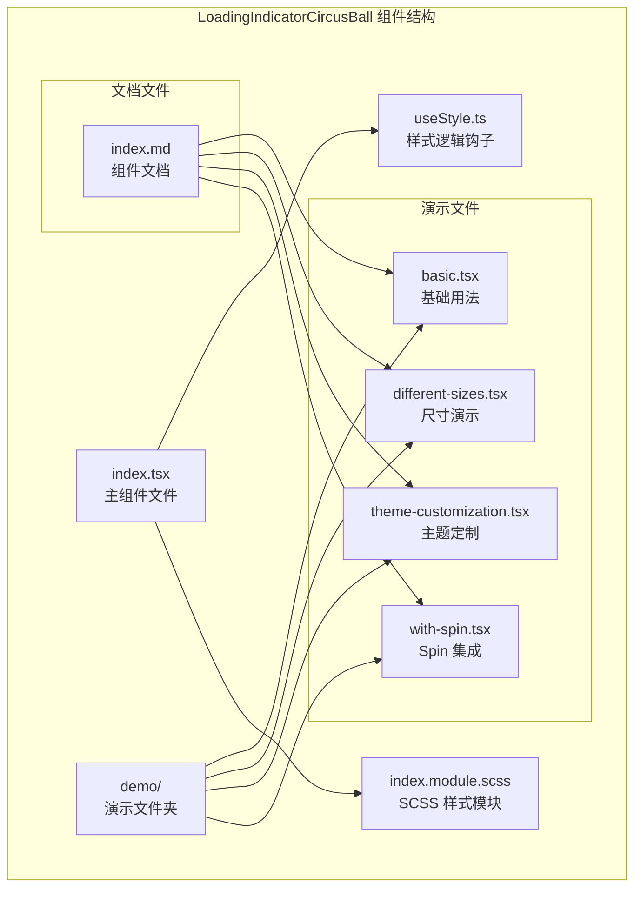
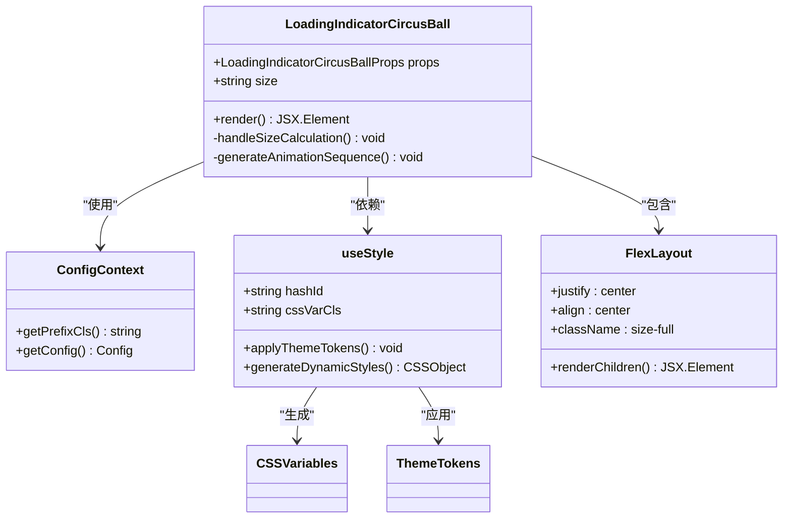
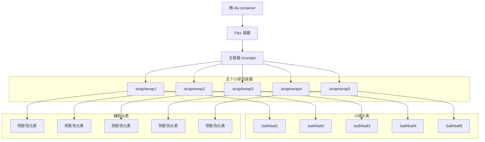
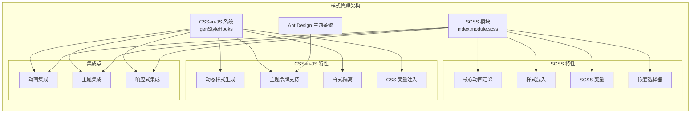
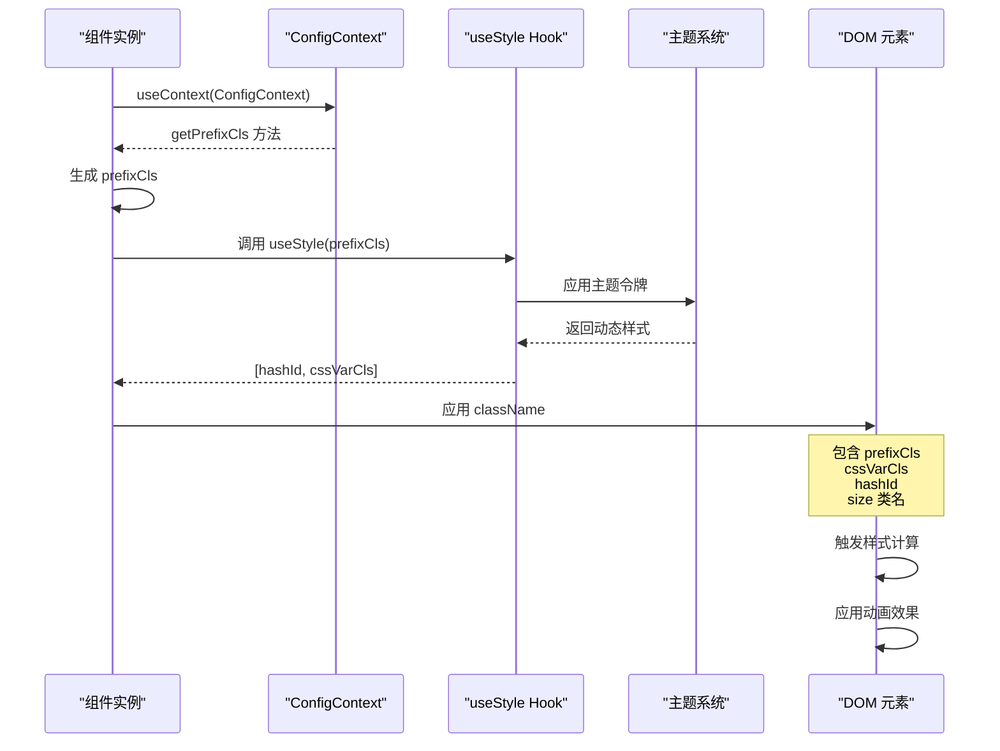
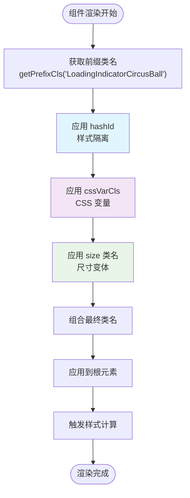
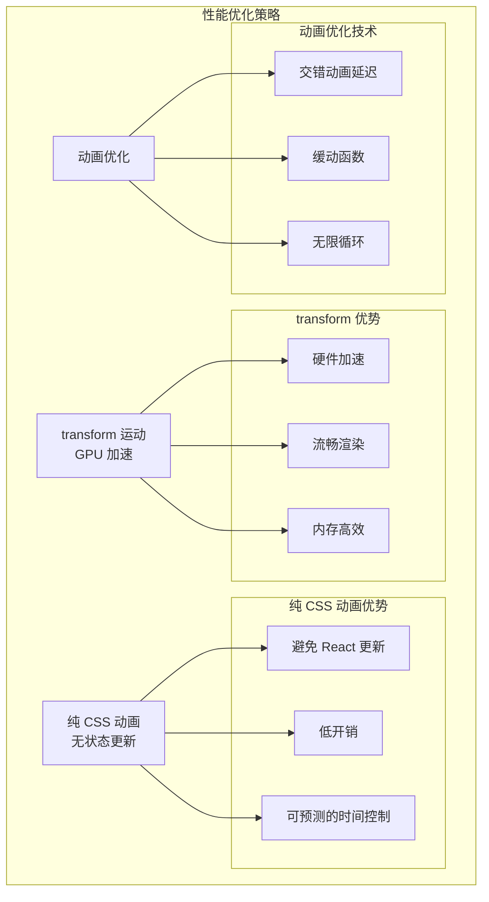
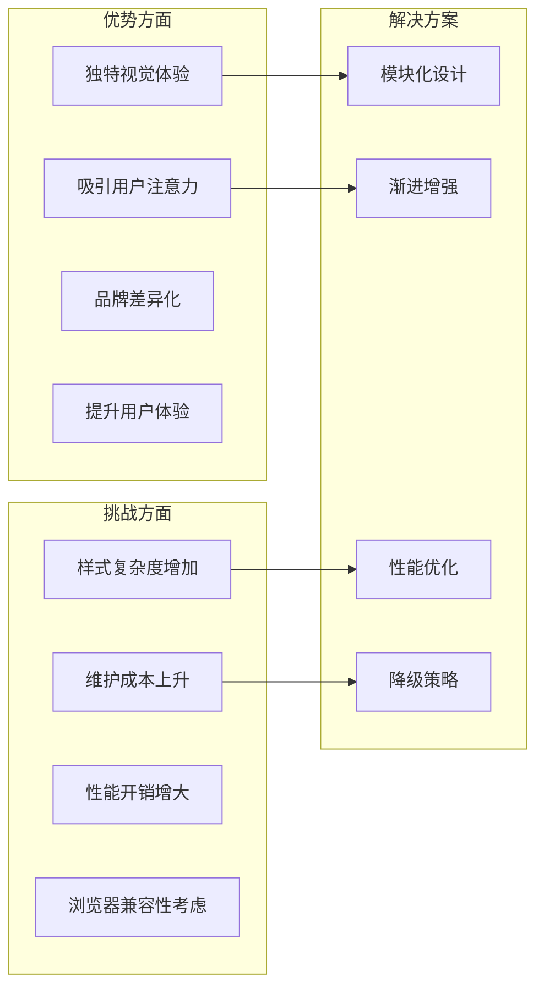

# LoadingIndicatorCircusBall 架构文档

<cite>
**本文档引用的文件**
- [src/LoadingIndicatorCircusBall/index.tsx](file://src/LoadingIndicatorCircusBall/index.tsx)
- [src/LoadingIndicatorCircusBall/useStyle.ts](file://src/LoadingIndicatorCircusBall/useStyle.ts)
- [src/LoadingIndicatorCircusBall/index.module.scss](file://src/LoadingIndicatorCircusBall/index.module.scss)
- [src/LoadingIndicatorCircusBall/demo/basic.tsx](file://src/LoadingIndicatorCircusBall/demo/basic.tsx)
- [src/LoadingIndicatorCircusBall/demo/different-sizes.tsx](file://src/LoadingIndicatorCircusBall/demo/different-sizes.tsx)
- [src/LoadingIndicatorCircusBall/demo/theme-customization.tsx](file://src/LoadingIndicatorCircusBall/demo/theme-customization.tsx)
- [src/LoadingIndicatorCircusBall/demo/with-spin.tsx](file://src/LoadingIndicatorCircusBall/demo/with-spin.tsx)
- [src/LoadingIndicatorCircusBall/index.md](file://src/LoadingIndicatorCircusBall/index.md)
- [package.json](file://package.json)
</cite>

## 目录
1. [概述](#概述)
2. [项目结构](#项目结构)
3. [核心组件架构](#核心组件架构)
4. [样式管理系统](#样式管理系统)
5. [数据流分析](#数据流分析)
6. [性能优化设计](#性能优化设计)
7. [设计权衡与考量](#设计权衡与考量)
8. [总结](#总结)

## 概述

LoadingIndicatorCircusBall 是一个专为 Ant Design 生态系统设计的增强型加载指示器组件，采用了独特的马戏团风格动画效果。该组件通过五个彩色小球的协调运动，创造出富有表现力的视觉体验，为应用程序增添了趣味性和用户友好性。

该组件展现了现代前端开发中的高级封装模式，结合了 CSS-in-JS 和 SCSS 模块化样式管理的最佳实践，同时充分利用了 Ant Design 的主题系统和配置机制。

## 项目结构

LoadingIndicatorCircusBall 组件在项目中的组织结构体现了清晰的职责分离和模块化设计原则：

**图表来源**
- [src/LoadingIndicatorCircusBall/index.tsx](file://src/LoadingIndicatorCircusBall/index.tsx#L1-L47)
- [src/LoadingIndicatorCircusBall/useStyle.ts](file://src/LoadingIndicatorCircusBall/useStyle.ts#L1-L345)
- [src/LoadingIndicatorCircusBall/index.module.scss](file://src/LoadingIndicatorCircusBall/index.module.scss#L1-L164)

**章节来源**
- [src/LoadingIndicatorCircusBall/index.tsx](file://src/LoadingIndicatorCircusBall/index.tsx#L1-L47)
- [src/LoadingIndicatorCircusBall/useStyle.ts](file://src/LoadingIndicatorCircusBall/useStyle.ts#L1-L345)
- [src/LoadingIndicatorCircusBall/index.module.scss](file://src/LoadingIndicatorCircusBall/index.module.scss#L1-L164)

## 核心组件架构

### 组件设计原理

LoadingIndicatorCircusBall 采用了基于 Ant Design Flex 布局容器的高阶封装模式，其核心架构体现了以下设计原则：

**图表来源**
- [src/LoadingIndicatorCircusBall/index.tsx](file://src/LoadingIndicatorCircusBall/index.tsx#L12-L46)
- [src/LoadingIndicatorCircusBall/useStyle.ts](file://src/LoadingIndicatorCircusBall/useStyle.ts#L33-L344)

### DOM 结构设计

组件的 DOM 结构采用了层次化的绝对定位布局，形成了独特的视觉效果：

**图表来源**
- [src/LoadingIndicatorCircusBall/index.tsx](file://src/LoadingIndicatorCircusBall/index.tsx#L21-L43)

**章节来源**
- [src/LoadingIndicatorCircusBall/index.tsx](file://src/LoadingIndicatorCircusBall/index.tsx#L12-L46)

## 样式管理系统

### CSS-in-JS 与 SCSS 混合架构

LoadingIndicatorCircusBall 采用了创新的混合样式管理方案，结合了 Ant Design 的 CSS-in-JS 系统和传统的 SCSS 模块化方法：

**图表来源**
- [src/LoadingIndicatorCircusBall/useStyle.ts](file://src/LoadingIndicatorCircusBall/useStyle.ts#L337-L344)
- [src/LoadingIndicatorCircusBall/index.module.scss](file://src/LoadingIndicatorCircusBall/index.module.scss#L1-L164)

### 主题令牌系统

组件定义了完整的主题令牌接口，支持深度定制：

| 令牌名称 | 类型 | 默认值 | 说明 |
|---------|------|--------|------|
| `ballShadowColor` | string | `'rgba(0, 0, 0, 0.1)'` | 小球阴影颜色 |
| `ball1Color` | string | `'#397BF9'` | 第一个小球颜色 |
| `ball2Color` | string | `'#F4B400'` | 第二个小球颜色 |
| `ball3Color` | string | `'#EEEEEE'` | 第三个小球颜色 |
| `ball4Color` | string | `'#00A656'` | 第四个小球颜色 |
| `ball5Color` | string | `'#E3746B'` | 第五个小球颜色 |

### 尺寸变体系统

组件支持三种预设尺寸，每种尺寸都有对应的 CSS 变量配置：

| 尺寸 | 小球直径 | 水平位移 | 垂直位移 | 缩放比例 |
|------|----------|----------|----------|----------|
| `small` | 5px | -10px | -13.5px | 0.85 |
| `default` | 12px | -50px | -60.5px | 0.85 |
| `large` | 18px | -80px | -90.5px | 0.85 |

**章节来源**
- [src/LoadingIndicatorCircusBall/useStyle.ts](file://src/LoadingIndicatorCircusBall/useStyle.ts#L15-L28)
- [src/LoadingIndicatorCircusBall/useStyle.ts](file://src/LoadingIndicatorCircusBall/useStyle.ts#L328-L335)
- [src/LoadingIndicatorCircusBall/index.module.scss](file://src/LoadingIndicatorCircusBall/index.module.scss#L5-L19)

## 数据流分析

### 样式应用流程

LoadingIndicatorCircusBall 的样式应用遵循了 Ant Design 的标准数据流模式：

**图表来源**
- [src/LoadingIndicatorCircusBall/index.tsx](file://src/LoadingIndicatorCircusBall/index.tsx#L16-L18)
- [src/LoadingIndicatorCircusBall/useStyle.ts](file://src/LoadingIndicatorCircusBall/useStyle.ts#L337-L344)

### 样式类名组合策略

组件通过精确的类名组合实现了样式隔离和主题适配：

**图表来源**
- [src/LoadingIndicatorCircusBall/index.tsx](file://src/LoadingIndicatorCircusBall/index.tsx#L22)

**章节来源**
- [src/LoadingIndicatorCircusBall/index.tsx](file://src/LoadingIndicatorCircusBall/index.tsx#L16-L18)
- [src/LoadingIndicatorCircusBall/index.tsx](file://src/LoadingIndicatorCircusBall/index.tsx#L22)

## 性能优化设计

### GPU 加速动画

组件在动画实现上采用了多项性能优化技术：

**图表来源**
- [src/LoadingIndicatorCircusBall/useStyle.ts](file://src/LoadingIndicatorCircusBall/useStyle.ts#L140-L145)
- [src/LoadingIndicatorCircusBall/useStyle.ts](file://src/LoadingIndicatorCircusBall/useStyle.ts#L148-L158)

### 动画时间线设计

组件的动画系统采用了精密的时间控制策略：

| 元素 | 动画类型 | 延迟时间 | 持续时间 | 缓动函数 |
|------|----------|----------|----------|----------|
| `.wrap` | `translateX` | 0ms | 1000ms | `ease-in-out` |
| `.ball` | `translateY` | 0ms | 500ms | `ease-in-out` |
| `.wrap:after` | `scale` | 0ms | 500ms | `ease-in-out` |
| `#wrap2` | `translateX` | -400ms | 1000ms | `ease-in-out` |
| `#wrap3` | `translateX` | -800ms | 1000ms | `ease-in-out` |
| `#wrap4` | `translateX` | -1200ms | 1000ms | `ease-in-out` |
| `#wrap5` | `translateX` | -1600ms | 1000ms | `ease-in-out` |

### 内存管理优化

组件通过以下方式优化内存使用：

- **CSS 变量复用**：大量使用 CSS 变量减少重复样式定义
- **动画状态最小化**：纯 CSS 实现避免 React 状态管理开销
- **样式隔离**：通过 hashId 确保样式不会相互污染

**章节来源**
- [src/LoadingIndicatorCircusBall/useStyle.ts](file://src/LoadingIndicatorCircusBall/useStyle.ts#L140-L145)
- [src/LoadingIndicatorCircusBall/useStyle.ts](file://src/LoadingIndicatorCircusBall/useStyle.ts#L148-L158)
- [src/LoadingIndicatorCircusBall/useStyle.ts](file://src/LoadingIndicatorCircusBall/useStyle.ts#L176-L189)

## 设计权衡与考量

### 样式复杂度权衡

LoadingIndicatorCircusBall 在设计过程中做出了以下重要权衡：

### 技术决策考量

1. **CSS-in-JS vs SCSS 选择**：
   - **CSS-in-JS**：支持动态主题和运行时样式计算
   - **SCSS**：提供更强大的样式复用和编译时优化

2. **动画实现策略**：
   - **纯 CSS 动画**：性能最优但灵活性有限
   - **JavaScript 动画**：灵活性高但性能开销大

3. **主题系统集成**：
   - **深度定制**：提供丰富的定制选项
   - **默认美观**：确保开箱即用的良好体验

### 适用场景分析

该组件最适合以下应用场景：

- **需要增强用户体验的界面**：如长时间加载的操作
- **品牌友好的界面**：需要独特视觉风格的应用
- **教育或娱乐应用**：需要吸引注意力的场景
- **企业级应用**：需要专业但不失趣味性的界面

**章节来源**
- [src/LoadingIndicatorCircusBall/index.md](file://src/LoadingIndicatorCircusBall/index.md#L62-L80)

## 总结

LoadingIndicatorCircusBall 组件展现了现代前端开发中高级封装模式的最佳实践。通过结合 Ant Design 的生态系统，该组件成功地将复杂的动画效果与简洁的 API 设计相结合，为开发者提供了既美观又实用的加载指示器解决方案。

### 核心成就

1. **技术创新**：首次在 Ant Design 生态中引入如此复杂的 CSS-in-JS 与 SCSS 混合架构
2. **性能优化**：通过 transform 和纯 CSS 动画实现高性能的视觉效果
3. **主题集成**：完美融入 Ant Design 的主题系统，支持深度定制
4. **用户体验**：创造了独特的马戏团风格动画，显著提升用户交互体验

### 设计启示

该组件的设计为现代前端组件开发提供了宝贵的参考价值：

- **样式管理的新思路**：混合使用 CSS-in-JS 和传统 CSS 预处理器
- **性能优先的设计哲学**：始终将用户体验和性能放在首位
- **生态系统的深度整合**：充分利用现有框架的能力
- **渐进增强的策略**：在保证基本功能的同时提供丰富的定制选项

LoadingIndicatorCircusBall 不仅是一个功能组件，更是现代前端开发设计理念的生动体现，为构建高质量的用户界面提供了新的思考方向。