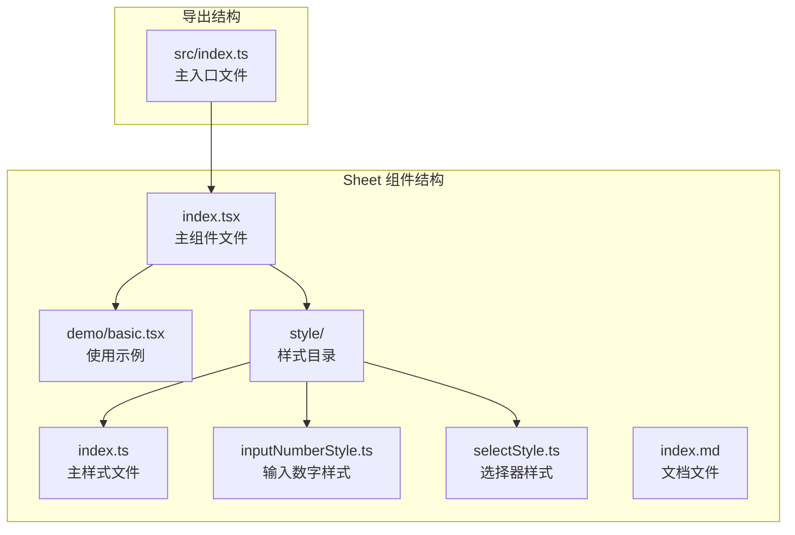
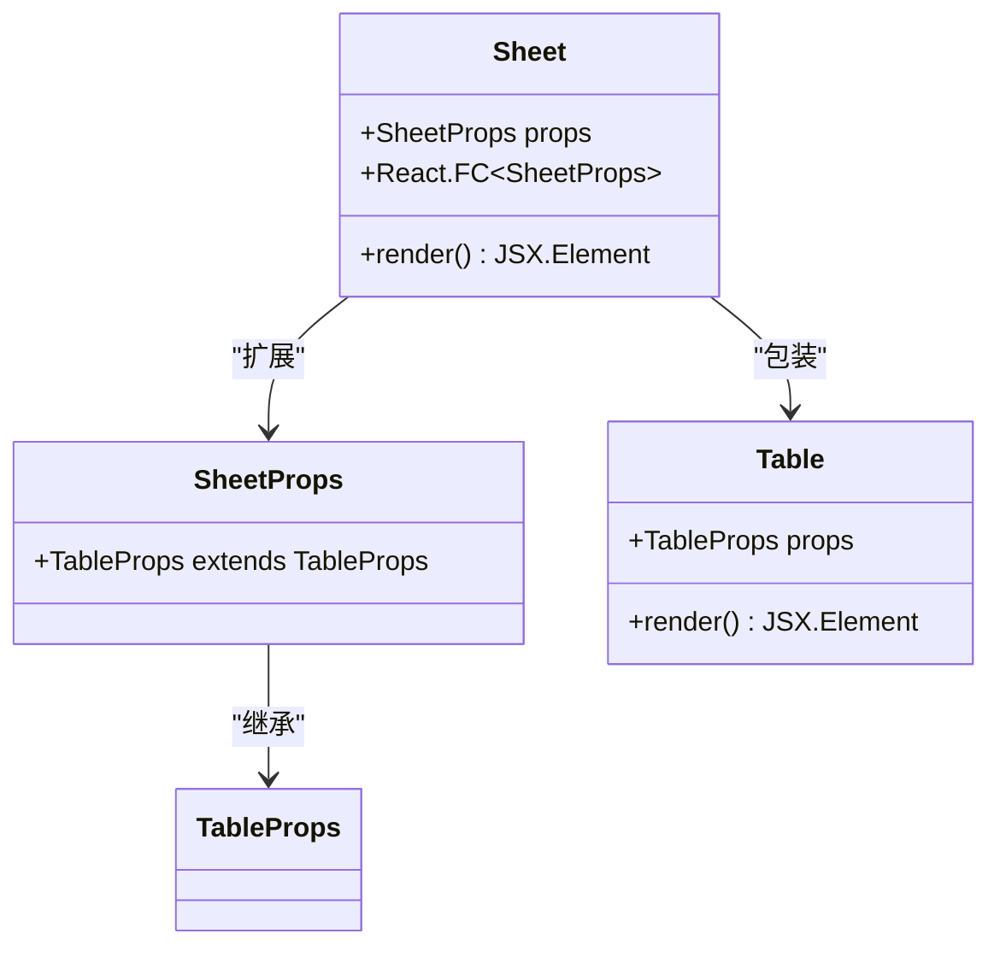
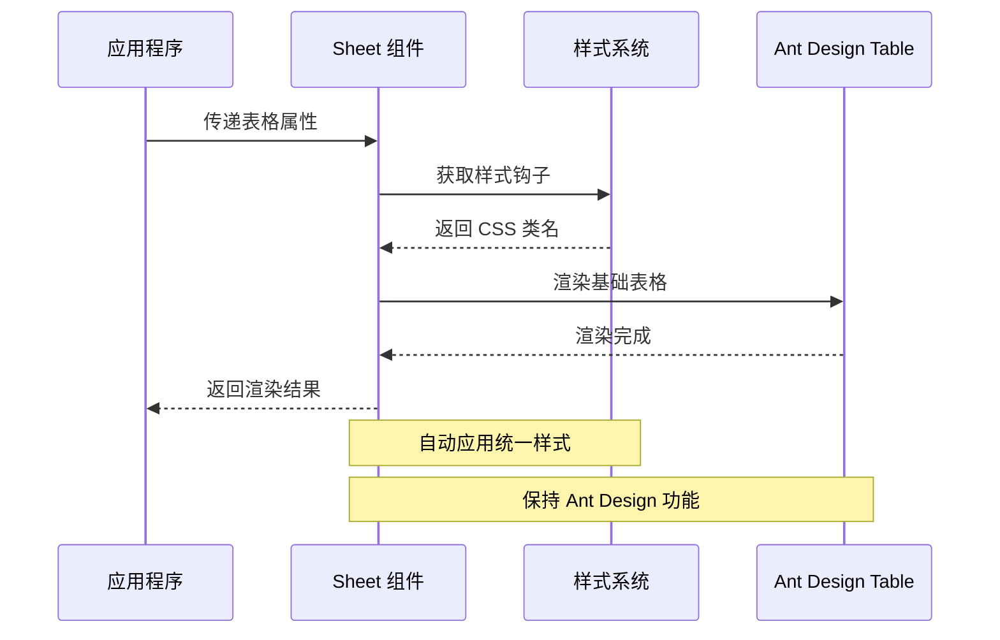
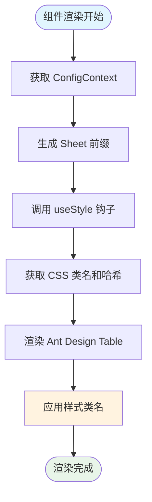
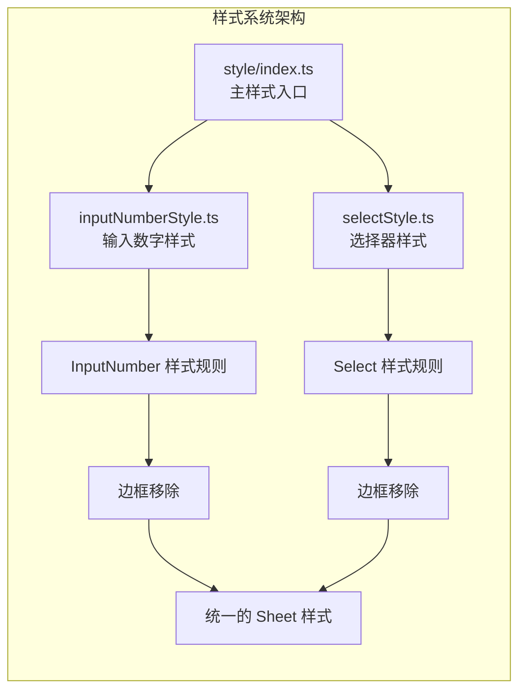
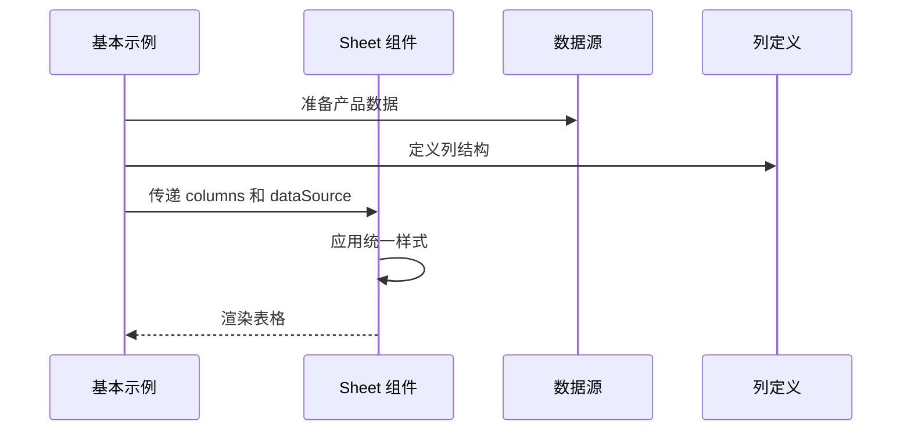

# Sheet 表格封装

<cite>
**本文档中引用的文件**
- [index.tsx](file://src/Sheet/index.tsx)
- [basic.tsx](file://src/Sheet/demo/basic.tsx)
- [index.ts](file://src/Sheet/style/index.ts)
- [inputNumberStyle.ts](file://src/Sheet/style/inputNumberStyle.ts)
- [selectStyle.ts](file://src/Sheet/style/selectStyle.ts)
- [index.md](file://src/Sheet/index.md)
- [index.ts](file://src/index.ts)
- [package.json](file://package.json)
</cite>

## 目录
1. [简介](#简介)
2. [项目结构](#项目结构)
3. [核心组件](#核心组件)
4. [架构概览](#架构概览)
5. [详细组件分析](#详细组件分析)
6. [样式系统](#样式系统)
7. [使用示例](#使用示例)
8. [性能考虑](#性能考虑)
9. [最佳实践](#最佳实践)
10. [局限性与建议](#局限性与建议)
11. [总结](#总结)

## 简介

Sheet 是一个基于 Ant Design Table 的轻量级表格封装组件，旨在解决表格列配置繁琐、样式不统一的问题。它提供了更高层次的抽象，使开发者能够通过简洁的配置快速构建具有标准样式和交互行为的表格。

### 设计初衷

- **简化配置**：减少表格列定义的复杂度
- **统一样式**：确保表格内嵌组件的一致视觉风格
- **主题集成**：与 Ant Design 主题系统无缝集成
- **开发效率**：提高后台管理系统中数据列表的开发速度

## 项目结构

Sheet 组件位于 `src/Sheet/` 目录下，包含以下关键文件：

**图表来源**
- [index.tsx](file://src/Sheet/index.tsx#L1-L22)
- [index.ts](file://src/Sheet/style/index.ts#L1-L33)

**章节来源**
- [index.tsx](file://src/Sheet/index.tsx#L1-L22)
- [index.ts](file://src/index.ts#L1-L7)

## 核心组件

### Sheet 主组件

Sheet 组件是一个简单的包装器，继承了 Ant Design Table 的所有功能，同时添加了统一的样式处理：

**图表来源**
- [index.tsx](file://src/Sheet/index.tsx#L7-L21)

### 核心特性

1. **类型安全**：通过 TypeScript 接口确保类型正确性
2. **样式注入**：自动应用统一的样式类名
3. **主题支持**：与 Ant Design 主题系统集成
4. **前缀管理**：使用 ConfigProvider 提供的前缀

**章节来源**
- [index.tsx](file://src/Sheet/index.tsx#L1-L22)

## 架构概览

Sheet 组件采用简洁的架构设计，通过最小化的包装提供强大的功能：

**图表来源**
- [index.tsx](file://src/Sheet/index.tsx#L9-L20)

## 详细组件分析

### 组件实现机制

Sheet 组件的核心实现非常简洁，主要包含以下步骤：

1. **上下文获取**：从 ConfigProvider 获取前缀类名生成函数
2. **样式处理**：调用 useStyle 钩子获取 CSS 类名和哈希标识
3. **属性传递**：将所有属性透传给底层 Table 组件
4. **样式应用**：自动添加样式类名和哈希标识

**图表来源**
- [index.tsx](file://src/Sheet/index.tsx#L9-L20)

### 属性继承与扩展

Sheet 通过继承 TableProps 接口，完全支持 Ant Design Table 的所有功能：

| 属性类别 | 描述 | 支持情况 |
|---------|------|----------|
| 基础属性 | columns, dataSource, rowKey 等 | ✅ 完全支持 |
| 交互功能 | pagination, sorter, selection 等 | ✅ 完全支持 |
| 样式定制 | className, style, prefixCls 等 | ✅ 完全支持 |
| 性能优化 | loading, scroll, size 等 | ✅ 完全支持 |

**章节来源**
- [index.tsx](file://src/Sheet/index.tsx#L7-L8)

## 样式系统

### 样式架构设计

Sheet 的样式系统采用模块化设计，通过独立的样式文件处理不同组件类型的样式需求：

**图表来源**
- [index.ts](file://src/Sheet/style/index.ts#L1-L33)
- [inputNumberStyle.ts](file://src/Sheet/style/inputNumberStyle.ts#L1-L25)
- [selectStyle.ts](file://src/Sheet/style/selectStyle.ts#L1-L27)

### 输入数字样式处理

InputNumber 组件的样式定制专注于移除边框，提供更简洁的外观：

| 样式规则 | 目标元素 | 效果 |
|---------|----------|------|
| `.ant-input-number` | 输入框容器 | 移除默认边框 |
| `.ant-input-number-input` | 内部输入区域 | 移除边框 |
| `.ant-input-number:focus-within` | 聚焦状态 | 移除聚焦边框 |

### 选择器样式处理

Select 组件的样式定制同样专注于边框移除，但需要处理多种状态：

| 状态类型 | 选择器 | 效果 |
|---------|--------|------|
| 默认状态 | `.ant-select .ant-select-selector` | 移除边框 |
| 悬停状态 | `.ant-select:not(.ant-select-disabled):hover .ant-select-selector` | 移除悬停边框 |
| 聚焦状态 | `.ant-select-focused .ant-select-selector` | 移除聚焦边框 |

**章节来源**
- [inputNumberStyle.ts](file://src/Sheet/style/inputNumberStyle.ts#L1-L25)
- [selectStyle.ts](file://src/Sheet/style/selectStyle.ts#L1-L27)

## 使用示例

### 基本使用方法

Sheet 组件的基本使用方式与 Ant Design Table 完全相同，只需导入并直接使用：

**图表来源**
- [basic.tsx](file://src/Sheet/demo/basic.tsx#L1-L101)

### 典型应用场景

基本示例展示了 Sheet 在实际业务中的典型用法：

1. **静态文本显示**：商品名称、价格等
2. **下拉选择**：商品分类选择
3. **数值输入**：库存数量编辑
4. **开关控制**：启用状态切换

### 数据结构设计

示例中使用的产品接口定义了完整的数据模型：

| 字段名 | 类型 | 描述 |
|-------|------|------|
| key | string | 唯一标识符 |
| name | string | 商品名称 |
| category | string | 分类名称 |
| price | number | 商品价格 |
| stock | number | 库存数量 |
| enabled | boolean | 启用状态 |

**章节来源**
- [basic.tsx](file://src/Sheet/demo/basic.tsx#L1-L101)

## 性能考虑

### 虚拟滚动兼容性

虽然 Sheet 组件本身不直接处理虚拟滚动，但它完全兼容 Ant Design Table 的虚拟滚动功能：

- **大数据集支持**：当数据量较大时，可以启用虚拟滚动
- **内存优化**：只渲染可见区域的数据行
- **滚动性能**：平滑滚动体验，避免 DOM 元素过多导致的性能问题

### 样式性能优化

样式系统采用了高效的 CSS-in-JS 实现：

- **样式缓存**：避免重复计算样式
- **选择器优化**：使用高效的 CSS 选择器
- **条件渲染**：只在需要时应用特定样式

### 渲染性能

由于 Sheet 是一个轻量级包装器，其渲染开销极小：

- **最小化包装**：只添加必要的样式处理
- **属性透传**：避免额外的属性转换
- **React 优化**：利用 React 的优化机制

## 最佳实践

### 数据源处理

1. **数据格式标准化**：确保数据源符合预期格式
2. **键值唯一性**：为每条数据提供唯一的 key 值
3. **空数据处理**：妥善处理空数组或 null 数据源

### 列定义最佳实践

1. **语义化命名**：使用有意义的 dataIndex 和 title
2. **渲染函数优化**：避免在 render 函数中创建新对象
3. **条件渲染**：合理使用条件渲染提升性能

### 样式定制

1. **主题集成**：充分利用 Ant Design 主题系统
2. **响应式设计**：考虑不同屏幕尺寸的适配
3. **可访问性**：确保表格内容的可访问性

### 错误处理

1. **数据验证**：在数据进入表格前进行验证
2. **异常捕获**：处理可能的渲染异常
3. **降级方案**：提供备用的显示方案

## 局限性与建议

### 当前局限性

1. **高度定制化限制**：不适合需要完全自定义样式的复杂表格
2. **功能限制**：某些高级功能可能需要绕过 Sheet 直接使用 Table
3. **学习成本**：需要熟悉 Ant Design Table 的所有功能

### 改进建议

1. **增加文档示例**：提供更多使用场景的演示
2. **性能测试**：进行大规模数据的性能测试
3. **功能扩展**：考虑添加常用的功能增强
4. **类型完善**：进一步完善 TypeScript 类型定义

### 适用场景

Sheet 组件最适合以下场景：

- **后台管理系统**：数据列表展示
- **配置界面**：参数设置表格
- **报表系统**：数据统计表格
- **管理面板**：用户、订单等管理界面

### 不适用场景

以下场景建议直接使用 Ant Design Table：

- **高度定制化表格**：需要完全自定义样式的场景
- **复杂交互**：需要特殊交互逻辑的表格
- **特殊布局**：需要特殊布局要求的表格

## 总结

Sheet 组件作为一个轻量级的表格封装，成功地解决了表格配置繁琐和样式不统一的问题。它通过简洁的 API 设计和智能的样式处理，为开发者提供了一个高效、易用的表格解决方案。

### 核心优势

1. **简化开发**：大幅减少表格配置的工作量
2. **统一风格**：确保表格内嵌组件的一致性
3. **主题集成**：与 Ant Design 生态完美融合
4. **性能优秀**：轻量级设计，渲染性能优异

### 发展方向

随着项目的不断发展，Sheet 组件可以在以下方面继续改进：

- 扩展更多的内置样式选项
- 增加更多的使用场景示例
- 提供更丰富的定制能力
- 加强 TypeScript 类型支持

Sheet 组件代表了现代前端开发中"约定优于配置"理念的成功实践，为开发者提供了一个既简单又强大的表格解决方案。