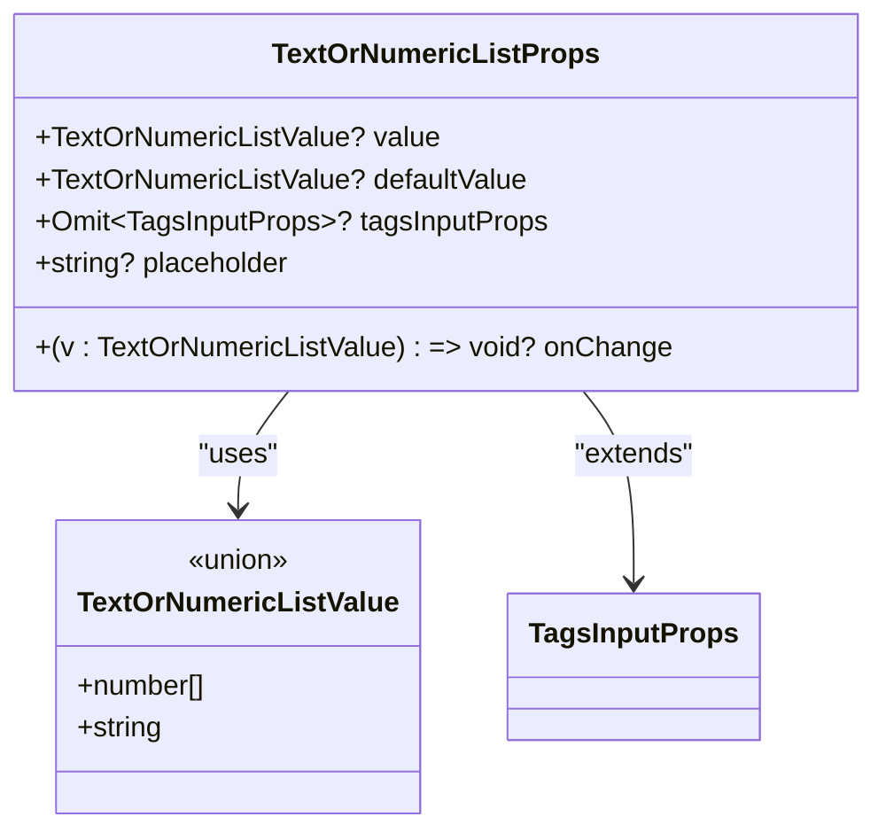

# TagsInput 组件 API 参考

<cite>
**本文档中引用的文件**
- [src/TagsInput/index.tsx](file://src/TagsInput/index.tsx)
- [src/TagsInput/index.md](file://src/TagsInput/index.md)
- [src/TagsInput/locale/index.ts](file://src/TagsInput/locale/index.ts)
- [src/TagsInput/demo/numeric.tsx](file://src/TagsInput/demo/numeric.tsx)
- [src/TagsInput/demo/basic.tsx](file://src/TagsInput/demo/basic.tsx)
- [src/TagsInput/demo/text-or-numeric-list.tsx](file://src/TagsInput/demo/text-or-numeric-list.tsx)
- [src/typings.d.ts](file://src/typings.d.ts)
</cite>

## 目录
1. [简介](#简介)
2. [TagsInput 核心组件](#tagsinput-核心组件)
3. [TextOrNumericList 特殊组件](#textornumericlist-特殊组件)
4. [类型定义](#类型定义)
5. [本地化配置](#本地化配置)
6. [主题定制](#主题定制)
7. [使用示例](#使用示例)

## 简介

TagsInput 是一个功能丰富的标签输入组件，支持文本和数字两种输入类型，具有批量输入、数量限制、显示限制等功能。该组件提供了灵活的 API 设计，支持受控和非受控两种模式，并内置了完善的本地化支持。

## TagsInput 核心组件

### TagsInputProps 接口

TagsInput 组件的核心接口定义了所有可用的属性和配置选项。

```mermaid
classDiagram
class TagsInputProps {
+string? className
+CSSProperties? style
+string? placeholder
+TagType~T~[]? value
+TagType~T~[]? defaultValue
+(value : TagType~T~[]) => void? onChange
+number? maxCount
+number? maxDisplayCount
+T? type
+Omit~InputProps~? inputProps
+string? prefixCls
+SizeType? size
}
class TagType {
<<generic>>
+T extends 'text' | 'numeric'
+T extends 'numeric' ? number : string
}
class DisplayTag {
<<union>>
+TagType~T~
+{type : 'ellipsis'; count : number}
}
TagsInputProps --> TagType : "uses"
TagsInputProps --> DisplayTag : "generates"
```

**图表来源**
- [src/TagsInput/index.tsx](file://src/TagsInput/index.tsx#L33-L57)

#### 属性详解

| 属性名 | 类型 | 是否必需 | 默认值 | 说明 | 版本 |
|--------|------|----------|--------|------|------|
| `className` | `string` | 否 | - | 自定义类名，应用于外层容器 | - |
| `style` | `React.CSSProperties` | 否 | - | 自定义样式对象 | - |
| `placeholder` | `string` | 否 | 国际化文本 | 输入框占位符文本 | - |
| `value` | `TagType<T>[]` | 否 | - | 当前标签值（受控模式） | - |
| `defaultValue` | `TagType<T>[]` | 否 | `[]` | 默认标签值（非受控模式） | - |
| `onChange` | `(value: TagType<T>[]) => void` | 否 | - | 标签值变化时的回调函数 | - |
| `maxCount` | `number` | 否 | `200` | 最大标签数量限制 | - |
| `maxDisplayCount` | `number` | 否 | `2` | 最大显示标签数量，超过则显示省略号 | - |
| `type` | `'text' \| 'numeric'` | 否 | `'text'` | 输入类型：'text' 支持任意字符串，'numeric' 只支持数字 | - |
| `inputProps` | `Omit<InputProps, 'value' \| 'onChange' \| 'onKeyDown' \| 'placeholder' \| 'suffix'>` | 否 | - | 传递给内部 Input 组件的属性（排除冲突属性） | - |
| `size` | `'small' \| 'middle' \| 'large'` | 否 | `'middle'` | 输入框尺寸 | - |
| `prefixCls` | `string` | 否 | - | 自定义前缀类名 | - |

**节来源**
- [src/TagsInput/index.tsx](file://src/TagsInput/index.tsx#L41-L57)
- [src/TagsInput/index.md](file://src/TagsInput/index.md#L73-L86)

### 泛型参数说明

TagsInput 组件使用泛型参数 `T` 来控制输入类型：

- **`T extends 'text' | 'numeric'`**: 泛型约束，只能是 'text' 或 'numeric' 字面量类型
- **`TagType<T>`**: 根据 T 的值返回对应的类型
  - 当 `T extends 'numeric'`: 返回 `number` 类型
  - 当 `T extends 'text'`: 返回 `string` 类型

这种设计确保了类型安全，编译器能够正确推断出正确的类型。

**节来源**
- [src/TagsInput/index.tsx](file://src/TagsInput/index.tsx#L33-L35)

## TextOrNumericList 特殊组件

TextOrNumericList 是 TagsInput 的特殊变体，支持同时处理文本和数字列表输入。

### TextOrNumericListProps 接口



**图表来源**
- [src/TagsInput/index.tsx](file://src/TagsInput/index.tsx#L533-L547)

#### 属性详解

| 属性名 | 类型 | 是否必需 | 默认值 | 说明 | 版本 |
|--------|------|----------|--------|------|------|
| `value` | `string \| number[]` | 否 | - | 当前值（受控模式） | - |
| `defaultValue` | `string \| number[]` | 否 | `''` | 默认值（非受控模式） | - |
| `onChange` | `(value: string \| number[]) => void` | 否 | - | 值变化时的回调函数 | - |
| `tagsInputProps` | `Omit<TagsInputProps<'numeric'>, 'defaultValue' \| 'value' \| 'onChange' \| 'type' \| 'style' \| 'className' \| 'placeholder'>` | 否 | - | 传递给内部 TagsInput 的属性配置 | - |
| `placeholder` | `string` | 否 | 国际化文本 | 输入框占位符文本 | - |

**节来源**
- [src/TagsInput/index.tsx](file://src/TagsInput/index.tsx#L535-L547)
- [src/TagsInput/index.md](file://src/TagsInput/index.md#L89-L98)

### 工作机制

TextOrNumericList 组件根据输入值的类型自动切换显示模式：

- **字符串输入**: 显示普通输入框，支持文本输入
- **数字数组输入**: 显示 TagsInput 组件，支持标签模式
- **自动切换**: 清空所有标签后自动切换回文本模式

**节来源**
- [src/TagsInput/index.tsx](file://src/TagsInput/index.tsx#L556-L669)

## 类型定义

### 核心类型

```mermaid
graph TD
A[TagType&lt;T&gt;] --> B{T extends 'numeric'?}
B --> |是| C[number]
B --> |否| D[string]
E[DisplayTag&lt;T&gt;] --> F[TagType&lt;T&gt;]
E --> G[{type: 'ellipsis'; count: number}]
H[TextOrNumericListValue] --> I[number[]]
H --> J[string]
```

**图表来源**
- [src/TagsInput/index.tsx](file://src/TagsInput/index.tsx#L33-L39)
- [src/TagsInput/index.tsx](file://src/TagsInput/index.tsx#L533)

### 类型关系表

| 类型名 | 定义 | 用途 |
|--------|------|------|
| `TagType<T>` | `T extends 'numeric' ? number : string` | 根据输入类型返回对应的基础类型 |
| `DisplayTag<T>` | `TagType<T> \| {type: 'ellipsis'; count: number}` | 标签显示类型，支持普通标签和省略号 |
| `TextOrNumericListValue` | `number[] \| string` | TextOrNumericList 的联合类型值 |

**节来源**
- [src/TagsInput/index.tsx](file://src/TagsInput/index.tsx#L33-L39)
- [src/TagsInput/index.tsx](file://src/TagsInput/index.tsx#L533)

## 本地化配置

TagsInput 组件支持通过 ConfigProvider 进行本地化配置，可配置的文本包括：

### 可配置的本地化文本

| 文本键 | 说明 | 默认值 |
|--------|------|--------|
| `placeholder` | 输入框占位文本 | `'按回车新增'` |
| `batchInput` | 批量输入提示文本 | `'批量输入'` |
| `clearAll` | 清空所有提示文本 | `'清空所有'` |
| `confirm` | 确认按钮文本 | `'确定'` |
| `cancel` | 取消按钮文本 | `'取消'` |
| `rows` | 行数文本 | `'行数'` |
| `maxCountLimit` | 最大数量限制提示 | `'最大数量限制：${maxCount}个'` |
| `maxCountLimitIgnore` | 最大数量限制忽略提示 | `'最大数量限制：${maxCount}个, 忽略超出部分'` |
| `maxCountLimitTruncated` | 最大数量限制截取提示 | `'最大数量限制：${maxCount}个，已自动截取前${maxCount}个'` |
| `invalidNumber` | 无效数字提示 | `'请输入有效的数字'` |
| `duplicateItem` | 重复项提示 | `'已有: ${item}'` |
| `duplicateItemRemoved` | 重复项移除提示 | `'已移除重复的项：${items}, 若需要提交，重新点击确定'` |
| `invalidNumberRow` | 无效数字行提示 | `"'${text}'行不是有效数字"` |
| `numericTypeHint` | 数字类型提示 | `'数字'` |
| `textTypeHint` | 文本类型提示 | `'文本'` |
| `enterToSwitchMode` | 切换模式提示 | `'回车可切换输入模式'` |
| `inputIdOrName` | 输入 ID 或名称提示 | `'输入ID或名称，输入ID时，回车可切换输入模式'` |
| `dynamicPlaceholder` | 动态占位符文本 | `'一行一个${typeHint}，最多${maxCount}个'` |
| `ellipsisCount` | 省略号计数文本 | `'...${count}个'` |

**节来源**
- [src/TagsInput/locale/index.ts](file://src/TagsInput/locale/index.ts#L1-L47)
- [src/TagsInput/index.md](file://src/TagsInput/index.md#L104-L125)

## 主题定制

TagsInput 组件支持通过 ConfigProvider 进行主题定制，可配置的 token 包括：

### 可配置的主题 Token

| Token | 说明 | 类型 | 默认值 |
|-------|------|------|--------|
| `tagMaxWidth` | 标签最大宽度 | `number` | `100` |
| `paddingSM` | 小尺寸内边距 | `number` | `4` |
| `paddingMD` | 中等尺寸内边距 | `number` | `6` |
| `paddingLG` | 大尺寸内边距 | `number` | `8` |
| `marginSM` | 小尺寸外边距 | `number` | `4` |
| `marginMD` | 中等尺寸外边距 | `number` | `6` |
| `marginLG` | 大尺寸外边距 | `number` | `8` |
| `controlHeightSM` | 小尺寸高度 | `number` | `24` |
| `controlHeightMD` | 中等尺寸高度 | `number` | `32` |
| `controlHeightLG` | 大尺寸高度 | `number` | `40` |
| `fontSizeSM` | 小尺寸字体大小 | `number` | `12` |
| `fontSizeMD` | 中等尺寸字体大小 | `number` | `14` |
| `fontSizeLG` | 大尺寸字体大小 | `number` | `16` |

**节来源**
- [src/TagsInput/index.md](file://src/TagsInput/index.md#L130-L145)

## 使用示例

### 基础用法

```typescript
// 基础文本标签输入
const [tags, setTags] = useState<string[]>(['标签1', '标签2']);

return (
  <TagsInput
    value={tags}
    onChange={setTags}
    placeholder="输入标签，按回车添加"
  />
);
```

### 数字类型输入

```typescript
// 数字标签输入
const [numbers, setNumbers] = useState<number[]>([1, 2, 3]);

return (
  <TagsInput
    type="numeric"
    value={numbers}
    onChange={setNumbers}
    placeholder="输入数字，按回车添加"
  />
);
```

### TextOrNumericList 使用

```typescript
// 文本或数字列表输入
const [value, setValue] = useState<string | number[]>('');

return (
  <TagsInput.TextOrNumericList
    value={value}
    onChange={setValue}
    placeholder="输入ID或名称"
    tagsInputProps={{
      maxCount: 10,
      maxDisplayCount: 3,
      size: 'large',
    }}
  />
);
```

**节来源**
- [src/TagsInput/demo/basic.tsx](file://src/TagsInput/demo/basic.tsx#L1-L22)
- [src/TagsInput/demo/numeric.tsx](file://src/TagsInput/demo/numeric.tsx#L1-L24)
- [src/TagsInput/demo/text-or-numeric-list.tsx](file://src/TagsInput/demo/text-or-numeric-list.tsx#L1-L106)