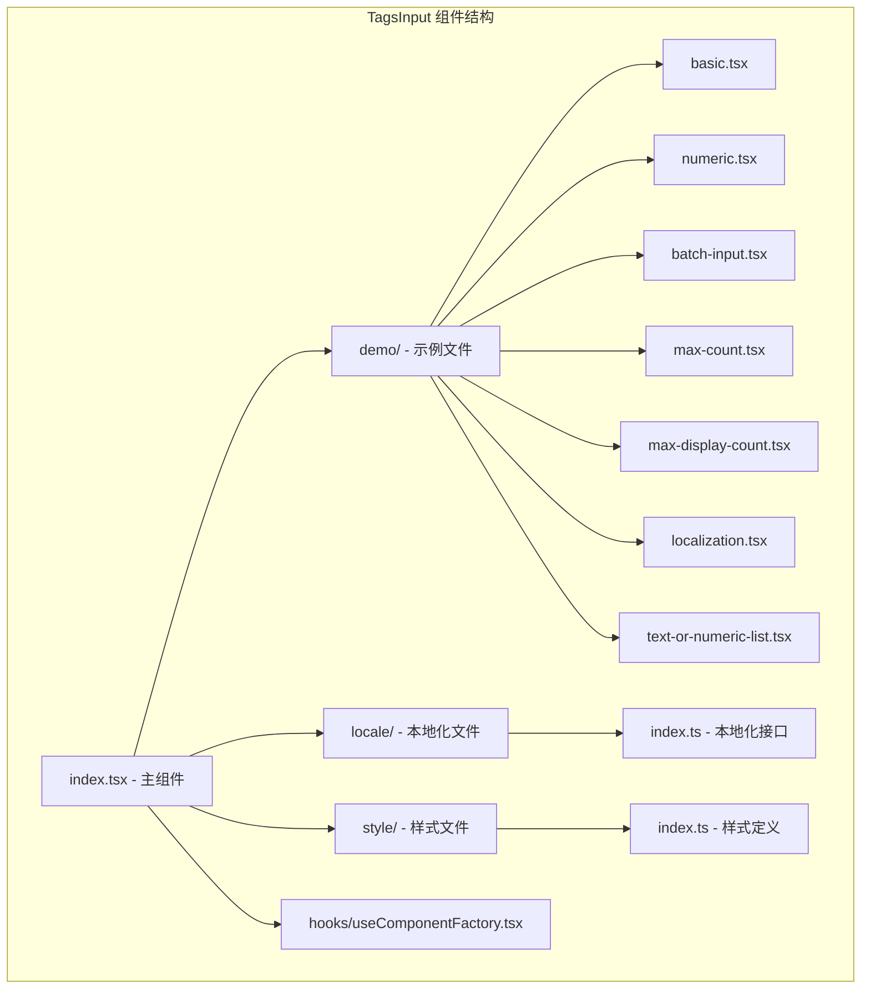
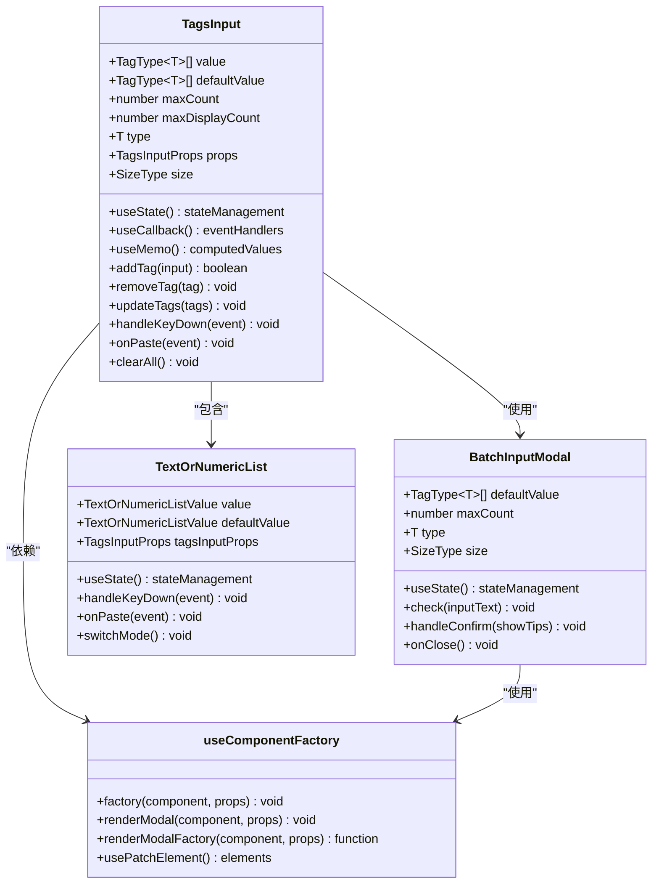
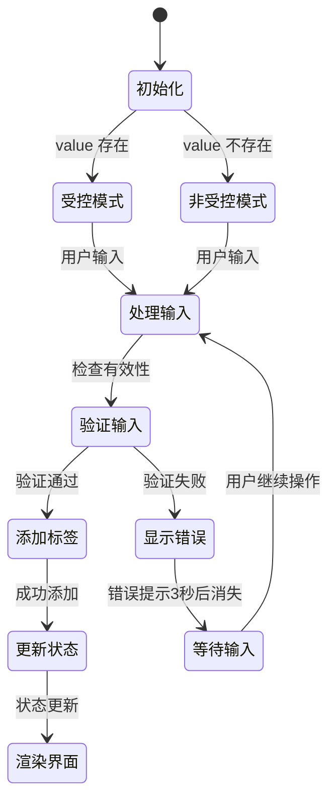
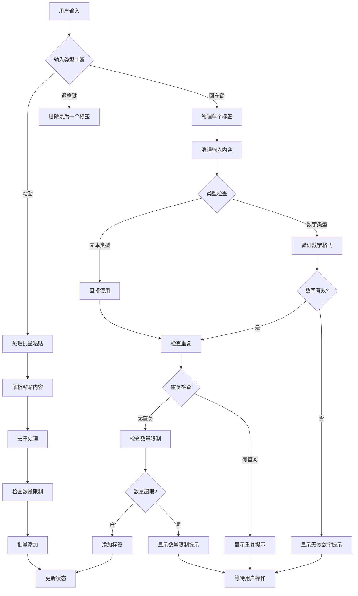
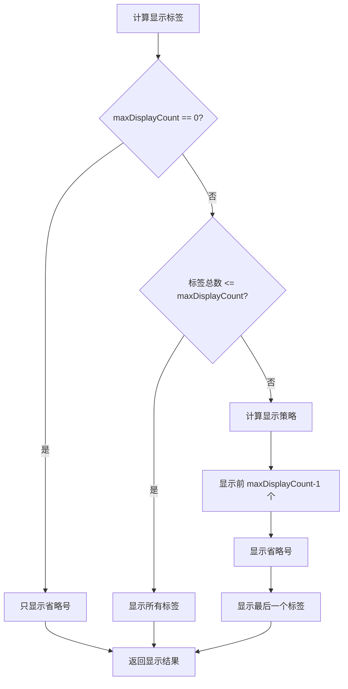
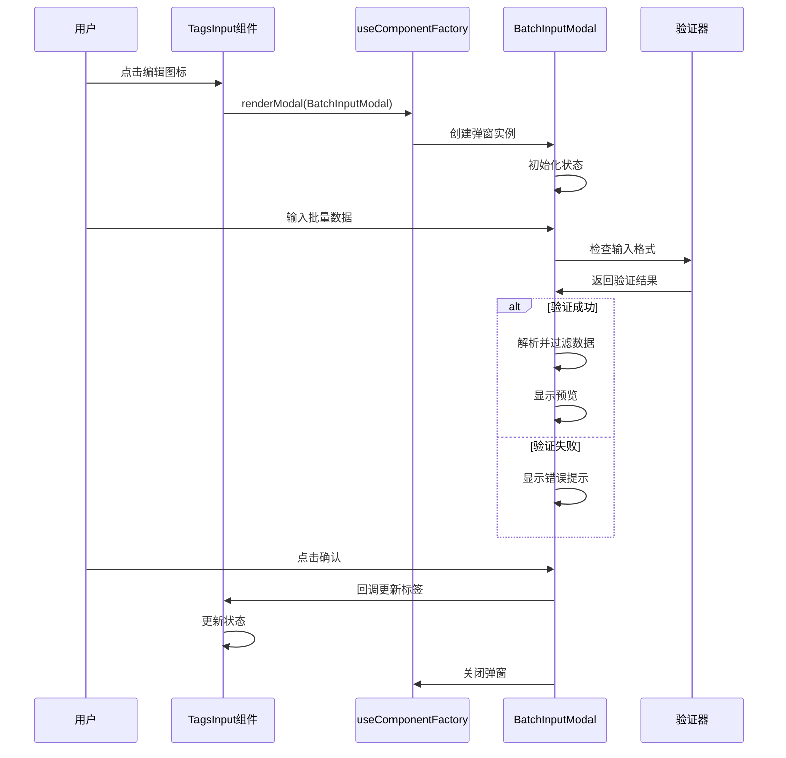
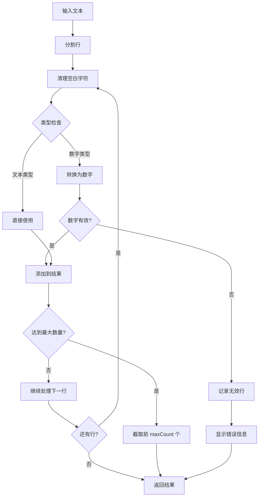
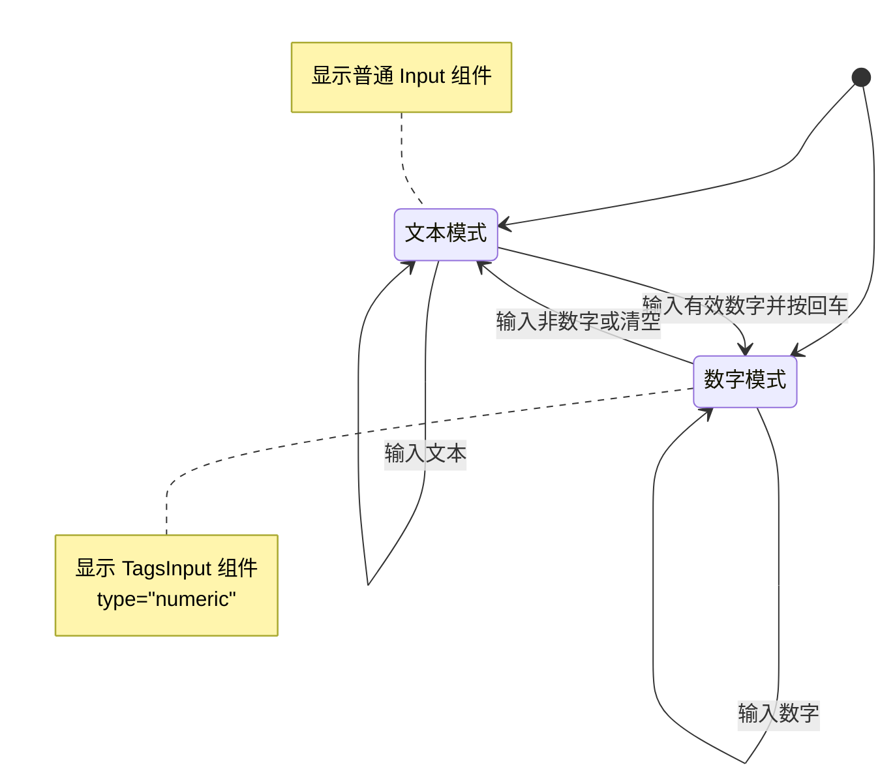
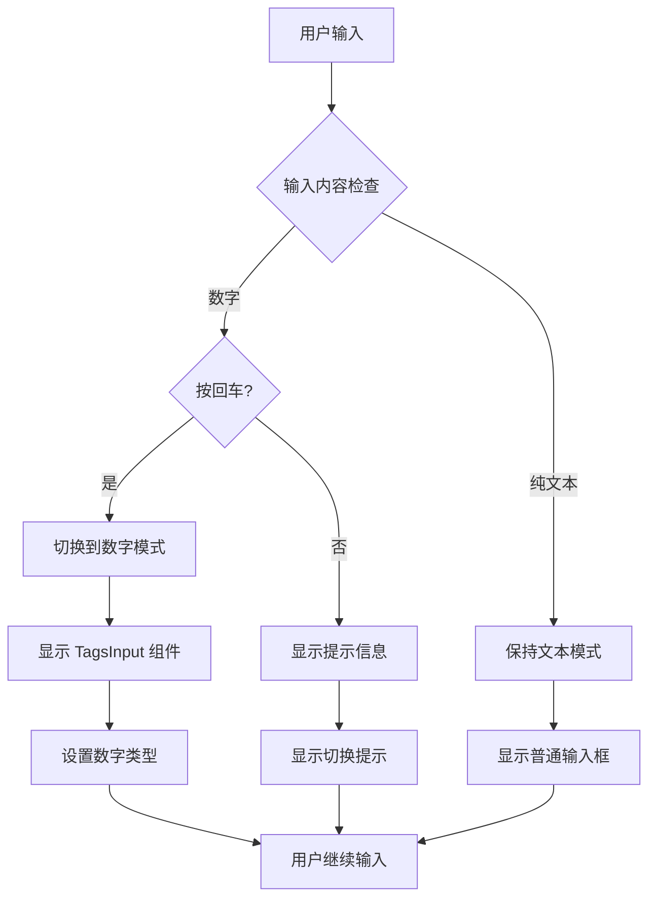

# TagsInput 标签输入框

<cite>
**本文档引用的文件**
- [src/TagsInput/index.tsx](file://src/TagsInput/index.tsx)
- [src/TagsInput/index.md](file://src/TagsInput/index.md)
- [src/TagsInput/locale/index.ts](file://src/TagsInput/locale/index.ts)
- [src/TagsInput/style/index.ts](file://src/TagsInput/style/index.ts)
- [src/hooks/useComponentFactory.tsx](file://src/hooks/useComponentFactory.tsx)
- [src/TagsInput/demo/basic.tsx](file://src/TagsInput/demo/basic.tsx)
- [src/TagsInput/demo/numeric.tsx](file://src/TagsInput/demo/numeric.tsx)
- [src/TagsInput/demo/batch-input.tsx](file://src/TagsInput/demo/batch-input.tsx)
- [src/TagsInput/demo/max-count.tsx](file://src/TagsInput/demo/max-count.tsx)
- [src/TagsInput/demo/max-display-count.tsx](file://src/TagsInput/demo/max-display-count.tsx)
- [src/TagsInput/demo/localization.tsx](file://src/TagsInput/demo/localization.tsx)
- [src/TagsInput/demo/text-or-numeric-list.tsx](file://src/TagsInput/demo/text-or-numeric-list.tsx)
</cite>

## 目录
1. [简介](#简介)
2. [项目结构](#项目结构)
3. [核心特性](#核心特性)
4. [架构概览](#架构概览)
5. [详细组件分析](#详细组件分析)
6. [API 参考](#api-参考)
7. [本地化支持](#本地化支持)
8. [主题定制](#主题定制)
9. [性能优化](#性能优化)
10. [常见问题与解决方案](#常见问题与解决方案)
11. [总结](#总结)

## 简介

TagsInput 是一个功能丰富的标签输入组件，专为需要用户输入多个标签或数值的场景而设计。该组件支持文本和数字两种类型输入，具备批量输入、数量限制、显示截断等高级功能，是现代 Web 应用中数据录入的理想选择。

### 设计目标

- **功能增强型标签输入框**：超越传统输入框，提供更丰富的交互体验
- **多类型支持**：同时支持文本和数字类型输入
- **批量处理能力**：通过弹窗支持大量数据的一次性输入
- **灵活的数量控制**：支持最大数量限制和显示数量限制
- **智能显示策略**：当标签数量过多时自动显示省略号
- **完善的本地化支持**：内置多语言支持和主题定制能力

## 项目结构



**图表来源**
- [src/TagsInput/index.tsx](file://src/TagsInput/index.tsx#L1-L50)
- [src/TagsInput/demo/basic.tsx](file://src/TagsInput/demo/basic.tsx#L1-L22)
- [src/TagsInput/locale/index.ts](file://src/TagsInput/locale/index.ts#L1-L47)

**章节来源**
- [src/TagsInput/index.tsx](file://src/TagsInput/index.tsx#L1-L707)
- [src/TagsInput/index.md](file://src/TagsInput/index.md#L1-L145)

## 核心特性

### 1. 双类型输入支持

TagsInput 支持两种输入类型，满足不同的业务需求：

- **文本类型 (`'text'`)**：支持任意字符串输入，适用于标签、分类等场景
- **数字类型 (`'numeric'`)**：自动验证输入是否为有效数字，适用于 ID、价格等数值场景

### 2. 智能数量控制

- **最大数量限制** (`maxCount`)：防止用户输入过多标签
- **最大显示数量** (`maxDisplayCount`)：控制界面显示的标签数量，超出部分显示省略号
- **实时数量统计**：在输入框右侧显示当前数量/最大数量的比例

### 3. 批量输入功能

通过点击右侧编辑图标，用户可以打开批量输入弹窗，支持：
- 多行文本输入
- 自动解析换行分隔的数据
- 实时验证和错误提示
- 重复项自动去重

### 4. 显示优化策略

当标签数量超过显示限制时，组件采用智能的显示策略：
- 显示前 N-1 个标签
- 显示省略号标识剩余数量
- 显示最后一个标签
- 点击省略号可查看完整列表

### 5. 交互增强功能

- **粘贴板支持**：支持从剪贴板批量导入数据
- **键盘导航**：支持回车键添加标签，退格键删除最后一个标签
- **实时验证**：输入时即时验证有效性并给出反馈
- **重复项检测**：自动检测并阻止重复输入

## 架构概览



**图表来源**
- [src/TagsInput/index.tsx](file://src/TagsInput/index.tsx#L41-L81)
- [src/TagsInput/index.tsx](file://src/TagsInput/index.tsx#L358-L367)
- [src/TagsInput/index.tsx](file://src/TagsInput/index.tsx#L535-L547)
- [src/hooks/useComponentFactory.tsx](file://src/hooks/useComponentFactory.tsx#L29-L76)

**章节来源**
- [src/TagsInput/index.tsx](file://src/TagsInput/index.tsx#L64-L354)
- [src/TagsInput/index.tsx](file://src/TagsInput/index.tsx#L358-L531)

## 详细组件分析

### 主组件 TagsInput

主组件是整个标签输入系统的核心，提供了完整的标签管理功能。

#### 核心状态管理



**图表来源**
- [src/TagsInput/index.tsx](file://src/TagsInput/index.tsx#L92-L113)
- [src/TagsInput/index.tsx](file://src/TagsInput/index.tsx#L124-L162)

#### 输入处理流程

组件支持多种输入方式，每种都有相应的处理逻辑：



**图表来源**
- [src/TagsInput/index.tsx](file://src/TagsInput/index.tsx#L164-L213)
- [src/TagsInput/index.tsx](file://src/TagsInput/index.tsx#L192-L213)

#### 显示策略算法

当标签数量超过显示限制时，组件采用智能的显示策略：



**图表来源**
- [src/TagsInput/index.tsx](file://src/TagsInput/index.tsx#L222-L245)

**章节来源**
- [src/TagsInput/index.tsx](file://src/TagsInput/index.tsx#L64-L354)

### 批量输入弹窗 BatchInputModal

批量输入功能通过独立的弹窗组件实现，提供更强大的数据输入能力。

#### 弹窗组件架构



**图表来源**
- [src/TagsInput/index.tsx](file://src/TagsInput/index.tsx#L257-L265)
- [src/TagsInput/index.tsx](file://src/TagsInput/index.tsx#L358-L531)

#### 数据验证与处理

批量输入支持复杂的验证逻辑：



**图表来源**
- [src/TagsInput/index.tsx](file://src/TagsInput/index.tsx#L414-L479)

**章节来源**
- [src/TagsInput/index.tsx](file://src/TagsInput/index.tsx#L358-L531)

### TextOrNumericList 特殊模式

TextOrNumericList 是一个特殊的功能组件，能够根据输入内容自动切换文本和数字模式。

#### 模式切换机制



**图表来源**
- [src/TagsInput/index.tsx](file://src/TagsInput/index.tsx#L556-L669)

#### 自动切换逻辑



**图表来源**
- [src/TagsInput/index.tsx](file://src/TagsInput/index.tsx#L601-L618)
- [src/TagsInput/index.tsx](file://src/TagsInput/index.tsx#L636-L669)

**章节来源**
- [src/TagsInput/index.tsx](file://src/TagsInput/index.tsx#L556-L669)

## API 参考

### TagsInput 主组件

| 参数 | 说明 | 类型 | 默认值 | 版本 |
|------|------|------|--------|------|
| className | 自定义类名 | `string` | - | - |
| style | 自定义样式 | `CSSProperties` | - | - |
| placeholder | 输入框占位文本 | `string` | `'按回车新增'` | - |
| value | 当前标签值（受控模式） | `TagType<T>[]` | - | - |
| defaultValue | 默认标签值（非受控模式） | `TagType<T>[]` | `[]` | - |
| onChange | 标签值变化时的回调 | `(value: TagType<T>[]) => void` | - | - |
| maxCount | 最大标签数量限制 | `number` | `200` | - |
| maxDisplayCount | 最大显示标签数量 | `number` | `2` | - |
| type | 输入类型 | `'text' \| 'numeric'` | `'text'` | - |
| inputProps | 传递给输入框的属性 | `Omit<InputProps, 'value' \| 'onChange' \| 'onKeyDown' \| 'placeholder' \| 'suffix'>` | - | - |
| size | 输入框尺寸 | `'small' \| 'middle' \| 'large'` | `'middle'` | - |
| prefixCls | 自定义前缀类名 | `string` | - | - |

### TagsInput.TextOrNumericList 特殊组件

| 参数 | 说明 | 类型 | 默认值 | 版本 |
|------|------|------|--------|------|
| value | 当前值（受控模式） | `string \| number[]` | - | - |
| defaultValue | 默认值（非受控模式） | `string \| number[]` | `''` | - |
| onChange | 值变化时的回调 | `(value: string \| number[]) => void` | - | - |
| tagsInputProps | 传递给 TagsInput 的属性 | `Omit<TagsInputProps<'numeric'>, 'defaultValue' \| 'value' \| 'onChange' \| 'type' \| 'style' \| 'className'>` | - | - |
| placeholder | 输入框占位文本 | `string` | `'输入ID或名称，输入ID时，回车可切换输入模式'` | - |

**章节来源**
- [src/TagsInput/index.md](file://src/TagsInput/index.md#L71-L145)

## 本地化支持

TagsInput 组件提供了完整的本地化支持，可以通过 ConfigProvider 进行配置。

### 可配置的本地化文本

| 文本键 | 说明 | 默认值 |
|--------|------|--------|
| placeholder | 输入框占位文本 | `'按回车新增'` |
| batchInput | 批量输入提示文本 | `'批量输入'` |
| clearAll | 清空所有提示文本 | `'清空所有'` |
| confirm | 确认按钮文本 | `'确定'` |
| cancel | 取消按钮文本 | `'取消'` |
| rows | 行数文本 | `'行数'` |
| rowsCountInfo | 行数统计信息 | `'${rows}：${rowCount}/${maxCount}'` |
| maxCountLimit | 最大数量限制提示 | `'最大数量限制：${maxCount}个'` |
| maxCountLimitIgnore | 最大数量限制忽略提示 | `'最大数量限制：${maxCount}个, 忽略超出部分'` |
| maxCountLimitTruncated | 最大数量限制截取提示 | `'最大数量限制：${maxCount}个，已自动截取前${maxCount}个'` |
| invalidNumber | 无效数字提示 | `'请输入有效的数字'` |
| duplicateItem | 重复项提示 | `'已有: ${item}'` |
| duplicateItemRemoved | 重复项移除提示 | `'已移除重复的项：${items}, 若需要提交，重新点击确定'` |
| invalidNumberRow | 无效数字行提示 | `"'${text}'行不是有效数字"` |
| numericTypeHint | 数字类型提示 | `'数字'` |
| textTypeHint | 文本类型提示 | `'文本'` |
| enterToSwitchMode | 切换模式提示 | `'回车可切换输入模式'` |
| inputIdOrName | 输入 ID 或名称提示 | `'输入ID或名称，输入ID时，回车可切换输入模式'` |
| dynamicPlaceholder | 动态占位符文本 | `'一行一个${typeHint}，最多${maxCount}个'` |
| ellipsisCount | 省略号计数文本 | `'...${count}个'` |

### 本地化配置示例

```typescript
// 中文配置
const zhLocale = {
  placeholder: '按回车新增',
  batchInput: '批量输入',
  clearAll: '清空所有',
  confirm: '确定',
  cancel: '取消',
  // ... 其他配置
};

// 英文配置
const enLocale = {
  placeholder: 'Press Enter to add',
  batchInput: 'Batch Input',
  clearAll: 'Clear All',
  confirm: 'Confirm',
  cancel: 'Cancel',
  // ... 其他配置
};
```

**章节来源**
- [src/TagsInput/locale/index.ts](file://src/TagsInput/locale/index.ts#L1-L47)
- [src/TagsInput/demo/localization.tsx](file://src/TagsInput/demo/localization.tsx#L15-L63)

## 主题定制

TagsInput 组件支持通过 ConfigProvider 的 theme.tokens 进行主题定制。

### 可定制的视觉属性

| Token | 说明 | 类型 | 默认值 |
|-------|------|------|--------|
| tagMaxWidth | 标签最大宽度 | `number` | `100` |
| paddingSM | 小尺寸内边距 | `number` | `4` |
| paddingMD | 中等尺寸内边距 | `number` | `6` |
| paddingLG | 大尺寸内边距 | `number` | `8` |
| marginSM | 小尺寸外边距 | `number` | `4` |
| marginMD | 中等尺寸外边距 | `number` | `6` |
| marginLG | 大尺寸外边距 | `number` | `8` |
| controlHeightSM | 小尺寸高度 | `number` | `24` |
| controlHeightMD | 中等尺寸高度 | `number` | `32` |
| controlHeightLG | 大尺寸高度 | `number` | `40` |
| fontSizeSM | 小尺寸字体大小 | `number` | `12` |
| fontSizeMD | 中等尺寸字体大小 | `number` | `14` |
| fontSizeLG | 大尺寸字体大小 | `number` | `16` |

### 主题定制示例

```typescript
import { ConfigProvider } from 'antd';

const customTheme = {
  components: {
    TagsInput: {
      tagMaxWidth: 150,
      paddingSM: 2,
      paddingMD: 4,
      paddingLG: 6,
      controlHeightSM: 20,
      controlHeightMD: 28,
      controlHeightLG: 36,
      fontSizeSM: 10,
      fontSizeMD: 12,
      fontSizeLG: 14,
    },
  },
};

<ConfigProvider theme={customTheme}>
  <TagsInput />
</ConfigProvider>
```

**章节来源**
- [src/TagsInput/style/index.ts](file://src/TagsInput/style/index.ts#L10-L67)
- [src/TagsInput/index.md](file://src/TagsInput/index.md#L126-L145)

## 性能优化

### 渲染策略优化

对于大数据量场景，TagsInput 采用了多种优化策略：

#### 1. 智能显示策略
- **延迟渲染**：只渲染可见的标签，隐藏的标签不进行 DOM 渲染
- **虚拟滚动**：当标签数量超过一定阈值时，采用虚拟滚动技术
- **防抖处理**：输入事件采用防抖机制，减少频繁的重新渲染

#### 2. 状态管理优化
- **记忆化计算**：使用 `useMemo` 缓存计算结果
- **事件处理器缓存**：使用 `useCallback` 缓存事件处理器
- **条件渲染**：根据状态条件决定是否重新渲染子组件

#### 3. 内存管理
- **及时清理**：组件卸载时及时清理定时器和事件监听器
- **弱引用**：对大型数据结构使用弱引用避免内存泄漏

### 大数据量处理建议

```typescript
// 对于大量数据的处理建议
const handleLargeDataset = useCallback((largeArray: string[]) => {
  // 分批处理数据
  const batchSize = 100;
  for (let i = 0; i < largeArray.length; i += batchSize) {
    const batch = largeArray.slice(i, i + batchSize);
    // 处理批次数据
    processBatch(batch);
  }
}, []);

// 使用虚拟化技术
const VirtualizedTags = React.memo(({ tags }: { tags: string[] }) => {
  const { outerRef, innerRef, items } = useVirtual({
    size: tags.length,
    parentRef: outerRef,
    estimateSize: () => 32,
  });

  return (
    <div ref={outerRef} style={{ height: '200px', overflow: 'auto' }}>
      <div ref={innerRef} style={{ height: `${tags.length * 32}px`, position: 'relative' }}>
        {items.map(({ index, style }) => (
          <div key={index} style={style}>
            {tags[index]}
          </div>
        ))}
      </div>
    </div>
  );
});
```

## 常见问题与解决方案

### 1. 重复项处理

**问题描述**：用户多次输入相同的标签

**解决方案**：
- 组件内置重复项检测机制
- 显示重复项提示信息
- 自动阻止重复添加

**最佳实践**：
```typescript
// 在 onChange 中添加额外的去重逻辑
const handleChange = useCallback((values: string[]) => {
  // 使用 Set 去重
  const uniqueValues = Array.from(new Set(values));
  onChange(uniqueValues);
}, [onChange]);
```

### 2. 无效数字校验

**问题描述**：数字类型输入时出现无效数字

**解决方案**：
- 实时验证输入格式
- 显示具体的错误信息
- 提供正确的输入示例

**错误处理示例**：
```typescript
// 自定义验证规则
const validateNumber = (value: string) => {
  const num = Number(value);
  if (Number.isNaN(num)) {
    return {
      hasError: true,
      help: '请输入有效的数字',
    };
  }
  return { hasError: false };
};
```

### 3. 批量输入解析失败

**问题描述**：批量输入时某些行解析失败

**解决方案**：
- 分行解析，单独处理每一行
- 记录失败的行号和原因
- 提供详细的错误报告

**解析优化**：
```typescript
// 增强的批量解析逻辑
const parseBatchInput = (input: string) => {
  const lines = input.split('\n').map(line => line.trim()).filter(Boolean);
  const results: { value: any; error?: string }[] = [];
  
  lines.forEach((line, index) => {
    try {
      const value = parseLine(line);
      results.push({ value });
    } catch (error) {
      results.push({ 
        value: line, 
        error: `第 ${index + 1} 行解析失败: ${error.message}` 
      });
    }
  });
  
  return results;
};
```

### 4. 性能问题

**问题描述**：大量标签时界面卡顿

**解决方案**：
- 实现虚拟滚动
- 减少不必要的重新渲染
- 使用 Web Workers 处理大量数据

**性能监控**：
```typescript
// 性能监控工具
const usePerformanceMonitor = () => {
  const [metrics, setMetrics] = useState({
    renderTime: 0,
    memoryUsage: 0,
    eventCount: 0,
  });

  const measureRenderTime = useCallback((callback: () => void) => {
    const start = performance.now();
    callback();
    const end = performance.now();
    setMetrics(prev => ({
      ...prev,
      renderTime: end - start,
    }));
  }, []);

  return { metrics, measureRenderTime };
};
```

### 5. 粘贴板数据处理

**问题描述**：粘贴复杂格式的数据时解析失败

**解决方案**：
- 支持多种分隔符（逗号、分号、换行）
- 自动识别数据格式
- 提供数据清洗功能

**粘贴处理优化**：
```typescript
// 增强的粘贴处理
const handlePaste = useCallback((event: ClipboardEvent) => {
  const text = event.clipboardData?.getData('text/plain') || '';
  const lines = text.split(/[\n\r]+/).map(line => line.trim()).filter(Boolean);
  
  // 尝试多种解析方式
  const parsers = [
    parseWithSeparators,
    parseWithQuotes,
    parseAsList,
  ];
  
  for (const parser of parsers) {
    const result = parser(lines);
    if (result.success) {
      return result.values;
    }
  }
  
  // 默认解析
  return lines;
}, []);
```

## 总结

TagsInput 组件是一个功能完备、设计精良的标签输入解决方案。它不仅提供了基本的标签输入功能，还通过批量输入、智能显示、本地化支持等特性，大大提升了用户体验和开发效率。

### 核心优势

1. **功能丰富**：支持多种输入类型、批量处理、数量控制等高级功能
2. **用户体验优秀**：智能的显示策略、实时验证、友好的错误提示
3. **扩展性强**：支持本地化、主题定制、自定义配置
4. **性能优化**：针对大数据量场景进行了专门优化
5. **易于集成**：遵循 React 和 Ant Design 的设计规范

### 适用场景

- **表单填写**：产品标签、分类标记、技能列表等
- **数据管理**：用户权限分配、角色管理、资源分组
- **搜索过滤**：多维度筛选条件、关键词匹配
- **内容编辑**：文章标签、话题分类、作品标签

### 发展方向

随着 Web 应用复杂度的提升，TagsInput 组件可以在以下方面进一步发展：

1. **AI 辅助输入**：基于历史数据的智能推荐
2. **协作功能**：多人同时编辑、版本控制
3. **移动端优化**：更好的触摸交互体验
4. **无障碍支持**：更完善的屏幕阅读器支持
5. **云端同步**：跨设备的数据同步能力

TagsInput 组件的设计理念体现了现代前端开发的最佳实践，为开发者提供了一个既强大又易用的标签输入解决方案。