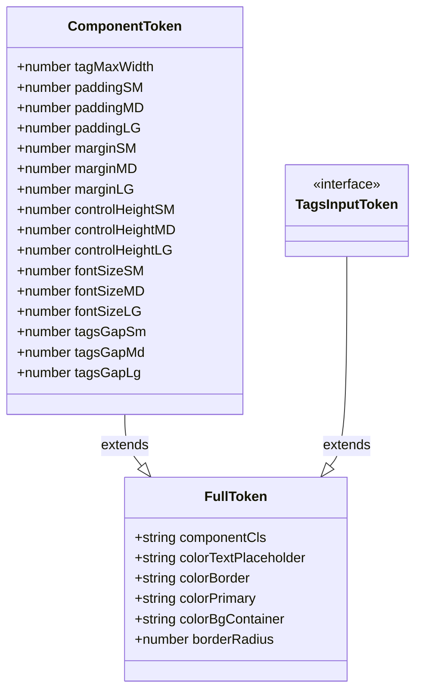
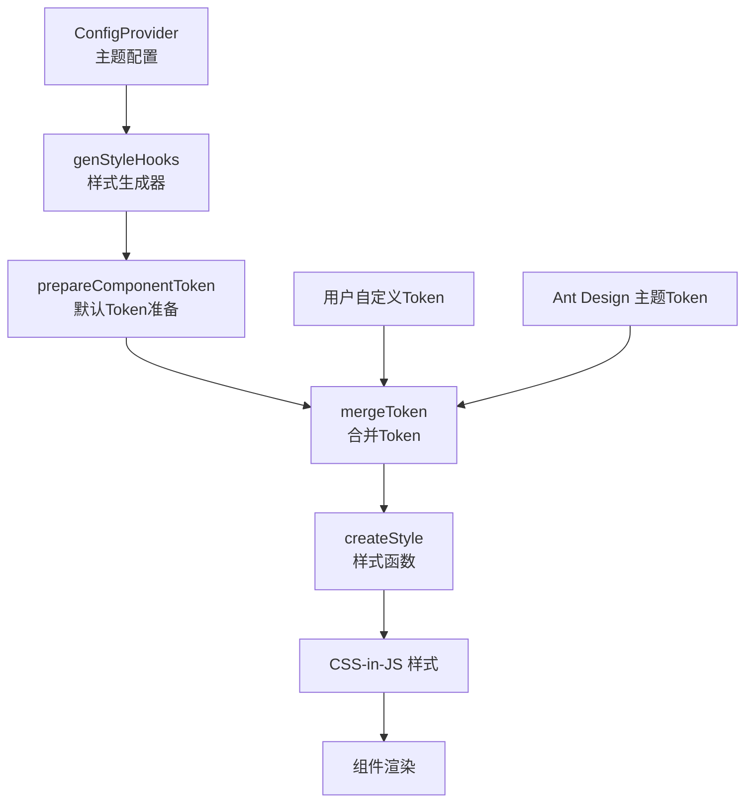
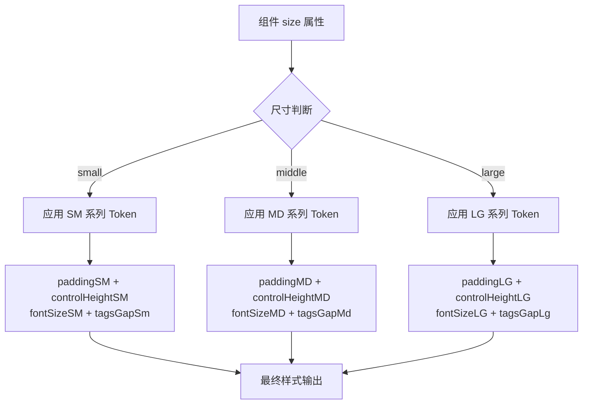

# TagsInput 组件主题定制

<cite>
**本文档引用的文件**
- [src/TagsInput/style/index.ts](file://src/TagsInput/style/index.ts)
- [src/TagsInput/index.tsx](file://src/TagsInput/index.tsx)
- [src/TagsInput/index.md](file://src/TagsInput/index.md)
- [src/TagsInput/demo/different-sizes.tsx](file://src/TagsInput/demo/different-sizes.tsx)
- [src/TagsInput/demo/localization.tsx](file://src/TagsInput/demo/localization.tsx)
</cite>

## 目录
1. [概述](#概述)
2. [Design Token 架构](#design-token-架构)
3. [核心 Token 详解](#核心-token-详解)
4. [genStyleHooks 机制](#genstylehooks-机制)
5. [主题定制实现](#主题定制实现)
6. [尺寸模式应用逻辑](#尺寸模式应用逻辑)
7. [实际应用示例](#实际应用示例)
8. [局部样式覆盖](#局部样式覆盖)
9. [最佳实践](#最佳实践)

## 概述

TagsInput 组件提供了完整的主题定制能力，通过 Ant Design 的设计令牌系统实现灵活的视觉样式配置。组件支持通过 `ConfigProvider.theme.components.TagsInput` 进行全局主题定制，同时保留了对局部样式的精确控制能力。

### 核心特性

- **完整的 Design Token 支持**：涵盖布局、间距、尺寸、字体等所有视觉属性
- **响应式尺寸系统**：支持 small/middle/large 三种尺寸模式
- **CSS-in-JS 样式生成**：基于 genStyleHooks 机制自动生成样式
- **Ant Design 主题集成**：无缝集成现有主题系统
- **局部覆盖能力**：支持 className 和 style 属性进行精细化控制

## Design Token 架构

TagsInput 组件采用 Ant Design 的设计令牌架构，通过 ComponentToken 接口定义所有可定制的视觉属性。



**图表来源**
- [src/TagsInput/style/index.ts](file://src/TagsInput/style/index.ts#L10-L40)

**章节来源**
- [src/TagsInput/style/index.ts](file://src/TagsInput/style/index.ts#L10-L40)

## 核心 Token 详解

### 标签布局 Token

| Token 名称 | 类型 | 默认值 | 说明 |
|-----------|------|--------|------|
| `tagMaxWidth` | `number` | `100` | 单个标签的最大宽度，防止标签过长影响布局 |

### 尺寸相关 Token

| Token 名称 | 类型 | 默认值 | 尺寸模式 | 说明 |
|-----------|------|--------|---------|------|
| `paddingSM` | `number` | `4` | small | 小尺寸内边距 |
| `paddingMD` | `number` | `6` | middle | 中等尺寸内边距 |
| `paddingLG` | `number` | `8` | large | 大尺寸内边距 |
| `controlHeightSM` | `number` | `24` | small | 小尺寸控制高度 |
| `controlHeightMD` | `number` | `32` | middle | 中等尺寸控制高度 |
| `controlHeightLG` | `number` | `40` | large | 大尺寸控制高度 |

### 字体相关 Token

| Token 名称 | 类型 | 默认值 | 尺寸模式 | 说明 |
|-----------|------|--------|---------|------|
| `fontSizeSM` | `number` | `12` | small | 小尺寸字体大小 |
| `fontSizeMD` | `number` | `14` | middle | 中等尺寸字体大小 |
| `fontSizeLG` | `number` | `16` | large | 大尺寸字体大小 |

### 间距相关 Token

| Token 名称 | 类型 | 默认值 | 尺寸模式 | 说明 |
|-----------|------|--------|---------|------|
| `tagsGapSm` | `number` | `2` | small | 小尺寸标签间距 |
| `tagsGapMd` | `number` | `4` | middle | 中等尺寸标签间距 |
| `tagsGapLg` | `number` | `6` | large | 大尺寸标签间距 |

**章节来源**
- [src/TagsInput/style/index.ts](file://src/TagsInput/style/index.ts#L10-L40)
- [src/TagsInput/style/index.ts](file://src/TagsInput/style/index.ts#L148-L166)

## genStyleHooks 机制

TagsInput 组件使用 Ant Design 的 genStyleHooks 机制生成 CSS-in-JS 样式，确保样式与主题系统的无缝集成。



**图表来源**
- [src/TagsInput/style/index.ts](file://src/TagsInput/style/index.ts#L168-L175)

### 样式生成流程

1. **Token 合并**：将用户提供的 Token 与默认 Token 合并
2. **样式计算**：根据合并后的 Token 计算最终样式值
3. **CSS-in-JS 转换**：将样式对象转换为 CSS-in-JS 形式
4. **动态注入**：将样式动态注入到 DOM 中

**章节来源**
- [src/TagsInput/style/index.ts](file://src/TagsInput/style/index.ts#L168-L175)

## 主题定制实现

### 基础主题定制

通过 ConfigProvider 的 theme.components.TagsInput 属性进行全局主题定制：

```typescript
// 基础主题定制示例
import { ConfigProvider } from 'antd';

const customTheme = {
  components: {
    TagsInput: {
      tagMaxWidth: 150,
      paddingSM: 6,
      paddingMD: 8,
      paddingLG: 10,
      controlHeightSM: 28,
      controlHeightMD: 36,
      controlHeightLG: 44,
      fontSizeSM: 13,
      fontSizeMD: 15,
      fontSizeLG: 18,
      tagsGapSm: 3,
      tagsGapMd: 5,
      tagsGapLg: 8,
    },
  },
};

const App = () => (
  <ConfigProvider theme={customTheme}>
    {/* TagsInput 组件 */}
  </ConfigProvider>
);
```

### 深度主题定制

支持更复杂的主题定制需求：

```typescript
// 深度主题定制示例
const deepCustomTheme = {
  components: {
    TagsInput: {
      // 基础尺寸定制
      paddingSM: 5,
      paddingMD: 7,
      paddingLG: 9,
      
      // 高级定制
      tagMaxWidth: 120,
      tagsGapSm: 3,
      tagsGapMd: 5,
      tagsGapLg: 7,
      
      // 响应式定制
      controlHeightSM: 26,
      controlHeightMD: 34,
      controlHeightLG: 42,
      
      // 字体定制
      fontSizeSM: 12.5,
      fontSizeMD: 14.5,
      fontSizeLG: 17,
    },
  },
};
```

**章节来源**
- [src/TagsInput/style/index.ts](file://src/TagsInput/style/index.ts#L148-L166)

## 尺寸模式应用逻辑

TagsInput 组件支持三种尺寸模式：small、middle（默认）、large。每种尺寸对应不同的 Token 应用规则。



**图表来源**
- [src/TagsInput/style/index.ts](file://src/TagsInput/style/index.ts#L115-L143)

### 尺寸 Token 映射表

| 尺寸模式 | 内边距 Token | 高度 Token | 字体 Token | 间距 Token |
|---------|-------------|-----------|-----------|-----------|
| small | `paddingSM: 4` | `controlHeightSM: 24` | `fontSizeSM: 12` | `tagsGapSm: 2` |
| middle | `paddingMD: 6` | `controlHeightMD: 32` | `fontSizeMD: 14` | `tagsGapMd: 4` |
| large | `paddingLG: 8` | `controlHeightLG: 40` | `fontSizeLG: 16` | `tagsGapLg: 6` |

### 样式应用机制

组件通过 CSS 类名选择器实现尺寸差异化样式：

```css
/* small 尺寸样式 */
.tags-input.small {
  minHeight: 24px;
  paddingLeft: 4px;
  paddingRight: 4px;
  paddingTop: 2px;
  paddingBottom: 2px;
}

.tags-input.small .tags-input-field {
  fontSize: 12px;
}

.tags-input.small .tags-input-tags {
  gap: 2px;
}

/* large 尺寸样式 */
.tags-input.large {
  minHeight: 40px;
  paddingLeft: 8px;
  paddingRight: 8px;
}

.tags-input.large .tags-input-field {
  fontSize: 16px;
}

.tags-input.large .tags-input-tags {
  gap: 6px;
}
```

**章节来源**
- [src/TagsInput/style/index.ts](file://src/TagsInput/style/index.ts#L115-L143)

## 实际应用示例

### 响应式设计示例

```typescript
// 响应式主题定制
const responsiveTheme = {
  components: {
    TagsInput: {
      // 移动端适配
      tagMaxWidth: 120,
      paddingSM: 3,
      controlHeightSM: 22,
      fontSizeSM: 11,
      tagsGapSm: 2,
      
      // 桌面端适配  
      paddingMD: 8,
      controlHeightMD: 36,
      fontSizeMD: 15,
      tagsGapMd: 6,
      
      // 大屏适配
      paddingLG: 12,
      controlHeightLG: 44,
      fontSizeLG: 18,
      tagsGapLg: 10,
    },
  },
};
```

### 品牌化定制示例

```typescript
// 品牌化主题定制
const brandTheme = {
  components: {
    TagsInput: {
      // 品牌色彩
      colorBorder: '#1890ff',
      colorPrimary: '#1890ff',
      colorBgContainer: '#f0faff',
      
      // 品牌间距
      paddingSM: 5,
      paddingMD: 9,
      paddingLG: 13,
      
      // 品牌字体
      fontSizeSM: 13,
      fontSizeMD: 16,
      fontSizeLG: 19,
      
      // 品牌间距
      tagsGapSm: 4,
      tagsGapMd: 8,
      tagsGapLg: 12,
    },
  },
};
```

### 高对比度主题示例

```typescript
// 高对比度主题定制
const highContrastTheme = {
  components: {
    TagsInput: {
      // 高对比度色彩
      colorBorder: '#000000',
      colorPrimary: '#000000',
      colorBgContainer: '#ffffff',
      colorTextPlaceholder: '#666666',
      
      // 增加间距提升可访问性
      paddingSM: 8,
      paddingMD: 12,
      paddingLG: 16,
      
      // 增大字体提升可读性
      fontSizeSM: 14,
      fontSizeMD: 18,
      fontSizeLG: 22,
      
      // 增加标签间距
      tagsGapSm: 6,
      tagsGapMd: 10,
      tagsGapLg: 14,
    },
  },
};
```

**章节来源**
- [src/TagsInput/demo/different-sizes.tsx](file://src/TagsInput/demo/different-sizes.tsx#L5-L55)

## 局部样式覆盖

虽然 TagsInput 组件主要通过主题定制进行全局样式管理，但仍支持局部样式的精确控制。

### className 覆盖

```typescript
// 使用 className 进行局部覆盖
const CustomTagsInput = () => {
  return (
    <TagsInput
      className="custom-tags-input"
      value={tags}
      onChange={setTags}
    />
  );
};

// CSS 样式
.custom-tags-input {
  border-radius: 8px;
  box-shadow: 0 2px 8px rgba(0, 0, 0, 0.1);
}

.custom-tags-input .tags-input-tag-item {
  background-color: #f5f5f5;
  border-color: #d9d9d9;
}
```

### style 属性覆盖

```typescript
// 使用 style 属性进行内联样式覆盖
const InlineStyledTagsInput = () => {
  return (
    <TagsInput
      style={{
        '--custom-border-radius': '12px',
        '--custom-background': '#f9f9f9',
      }}
      className="inline-styled"
      value={tags}
      onChange={setTags}
    />
  );
};
```

### 组合使用示例

```typescript
// 组合主题定制和局部覆盖
const CombinedExample = () => {
  return (
    <ConfigProvider
      theme={{
        components: {
          TagsInput: {
            // 全局主题定制
            colorPrimary: '#52c41a',
            controlHeightMD: 40,
          },
        },
      }}
    >
      <TagsInput
        className="local-override"
        style={{
          // 局部样式覆盖
          border: '2px solid #52c41a',
          padding: '12px',
        }}
        value={tags}
        onChange={setTags}
      />
    </ConfigProvider>
  );
};
```

## 最佳实践

### 1. 主题一致性原则

- **保持 Token 一致性**：确保相同功能的组件使用相同的 Token 值
- **遵循设计规范**：参考 Ant Design 的设计规范进行定制
- **考虑可访问性**：确保足够的对比度和适当的间距

### 2. 性能优化建议

- **避免过度定制**：仅定制必要的 Token，减少样式计算开销
- **合理使用局部覆盖**：优先使用主题定制，必要时才使用局部覆盖
- **缓存样式计算**：利用 Ant Design 的样式缓存机制

### 3. 开发调试技巧

- **使用浏览器开发者工具**：检查生成的 CSS-in-JS 样式
- **动态主题切换**：在开发环境中测试不同主题效果
- **主题预览**：创建主题预览页面进行效果验证

### 4. 维护和扩展

- **版本兼容性**：关注 Ant Design 版本更新对 Token 的影响
- **文档维护**：记录自定义主题的配置和使用方法
- **团队协作**：建立统一的主题定制规范

### 5. 常见问题解决

- **样式冲突**：使用更高优先级的选择器或 !important
- **主题不生效**：检查 ConfigProvider 的层级和 Token 配置
- **性能问题**：优化复杂的选择器和样式结构

通过以上主题定制方案，开发者可以灵活地调整 TagsInput 组件的视觉风格，满足不同项目的设计需求，同时保持与 Ant Design 生态系统的良好兼容性。