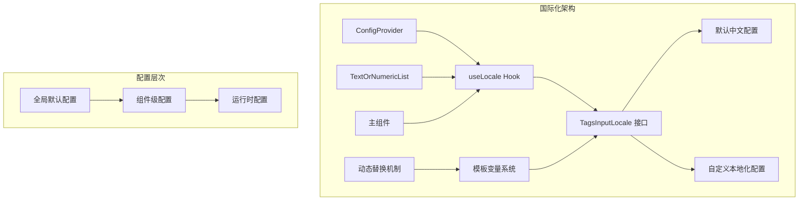
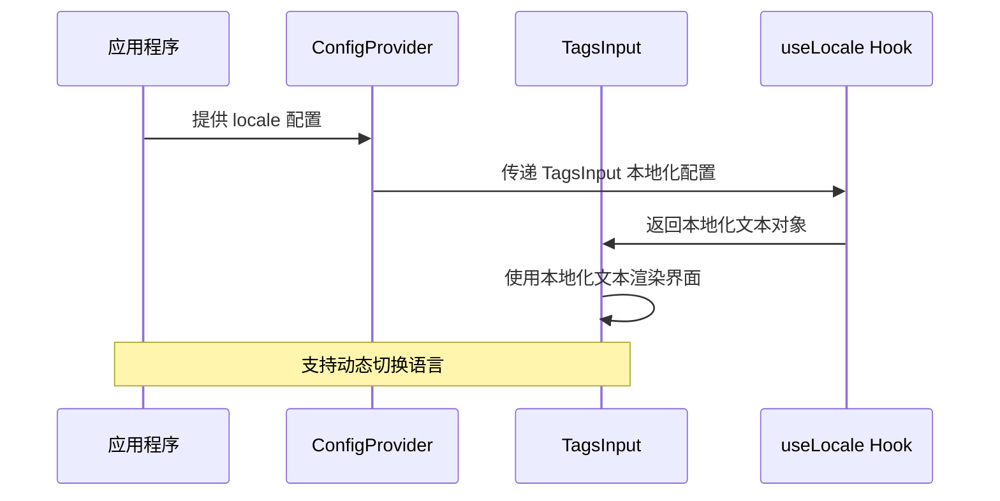
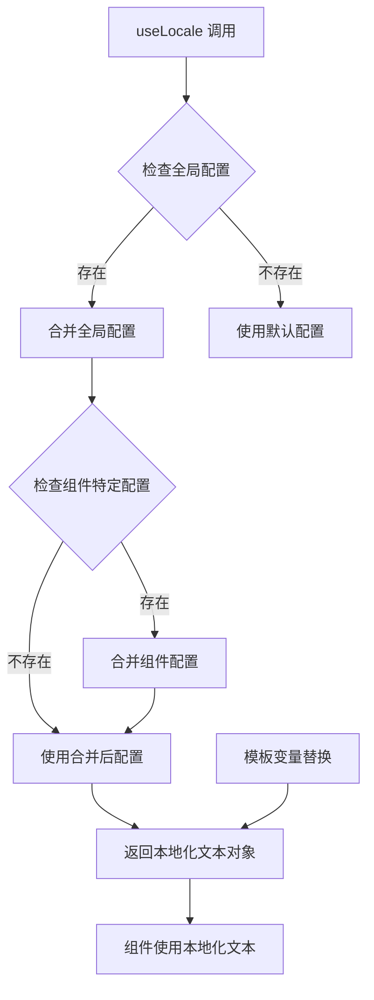
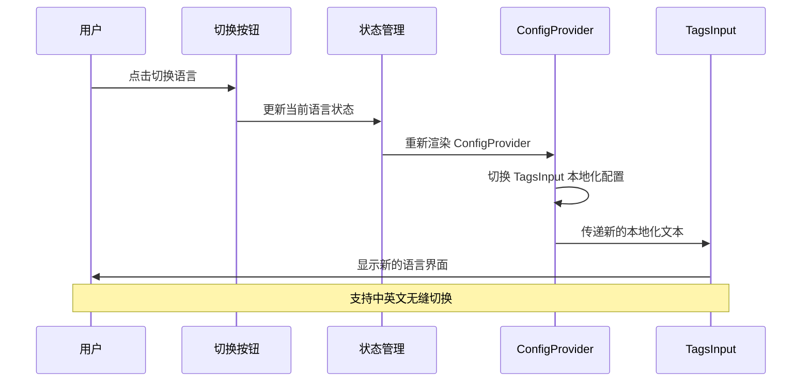
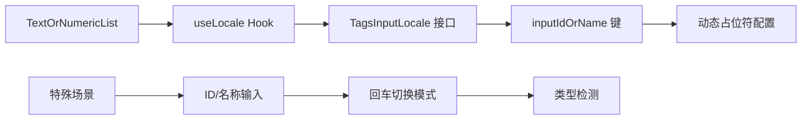

# TagsInput 组件国际化支持文档

<cite>
**本文档引用的文件**
- [src/TagsInput/locale/index.ts](file://src/TagsInput/locale/index.ts)
- [src/TagsInput/demo/localization.tsx](file://src/TagsInput/demo/localization.tsx)
- [src/TagsInput/index.tsx](file://src/TagsInput/index.tsx)
- [src/TagsInput/index.md](file://src/TagsInput/index.md)
</cite>

## 目录
1. [简介](#简介)
2. [国际化架构概述](#国际化架构概述)
3. [TagsInputLocale 接口详解](#tagsinputlocale-接口详解)
4. [默认本地化配置](#默认本地化配置)
5. [ConfigProvider 国际化配置](#configprovider-国际化配置)
6. [useLocale 钩子机制](#uselocale-钩子机制)
7. [模板变量系统](#模板变量系统)
8. [多语言切换示例](#多语言切换示例)
9. [TextOrNumericList 组件国际化](#textornumericlist-组件国际化)
10. [最佳实践](#最佳实践)

## 简介

TagsInput 组件提供了完整的国际化支持，允许开发者通过 ConfigProvider 配置组件的本地化文本。该组件支持多种文本键的本地化，包括输入提示、批量操作、错误提示、确认对话框等各种场景的文本内容。

## 国际化架构概述

TagsInput 组件的国际化支持基于以下核心架构：



**图表来源**
- [src/TagsInput/index.tsx](file://src/TagsInput/index.tsx#L66-L67)
- [src/TagsInput/locale/index.ts](file://src/TagsInput/locale/index.ts#L1-L47)

## TagsInputLocale 接口详解

TagsInputLocale 接口定义了组件所有可本地化的文本键：

| 文本键 | 类型 | 说明 | 默认值 |
|--------|------|------|--------|
| `placeholder` | `string` | 输入框占位文本 | `'按回车新增'` |
| `batchInput` | `string` | 批量输入按钮提示 | `'批量输入'` |
| `clearAll` | `string` | 清空按钮提示 | `'清空所有'` |
| `confirm` | `string` | 确认按钮文本 | `'确定'` |
| `cancel` | `string` | 取消按钮文本 | `'取消'` |
| `rows` | `string` | 行数标签 | `'行数'` |
| `rowsCountInfo` | `string` | 行数统计模板 | `'${rows}：${rowCount}/${maxCount}'` |
| `maxCountLimit` | `string` | 最大数量限制提示 | `'最大数量限制：${maxCount}个'` |
| `maxCountLimitIgnore` | `string` | 忽略超出部分提示 | `'最大数量限制：${maxCount}个, 忽略超出部分'` |
| `maxCountLimitTruncated` | `string` | 截取前N个提示 | `'最大数量限制：${maxCount}个，已自动截取前${maxCount}个'` |
| `invalidNumber` | `string` | 无效数字提示 | `'请输入有效的数字'` |
| `duplicateItem` | `string` | 重复项提示 | `'已有: ${item}'` |
| `duplicateItemRemoved` | `string` | 重复项移除提示 | `'已移除重复的项：${items}, 若需要提交，重新点击确定'` |
| `invalidNumberRow` | `string` | 无效数字行提示 | `"'${text}'行不是有效数字"` |
| `numericTypeHint` | `string` | 数字类型提示 | `'数字'` |
| `textTypeHint` | `string` | 文本类型提示 | `'文本'` |
| `enterToSwitchMode` | `string` | 回车切换提示 | `'回车可切换输入模式'` |
| `inputIdOrName` | `string` | TextOrNumericList 占位符 | `'输入ID或名称，输入ID时，回车可切换输入模式'` |
| `dynamicPlaceholder` | `string` | 批量输入框占位符 | `'一行一个${typeHint}，最多${maxCount}个'` |
| `ellipsisCount` | `string` | 省略号计数显示 | `'...${count}个'` |

**章节来源**
- [src/TagsInput/locale/index.ts](file://src/TagsInput/locale/index.ts#L1-L22)

## 默认本地化配置

组件提供了完整的中文默认配置，确保在未配置国际化时仍能正常工作：

```mermaid
classDiagram
class TagsInputLocale {
+string placeholder
+string batchInput
+string clearAll
+string confirm
+string cancel
+string rows
+string rowsCountInfo
+string maxCountLimit
+string maxCountLimitIgnore
+string maxCountLimitTruncated
+string invalidNumber
+string duplicateItem
+string duplicateItemRemoved
+string invalidNumberRow
+string numericTypeHint
+string textTypeHint
+string enterToSwitchMode
+string inputIdOrName
+string dynamicPlaceholder
+string ellipsisCount
}
class zhCN {
+placeholder : "按回车新增"
+batchInput : "批量输入"
+clearAll : "清空所有"
+confirm : "确定"
+cancel : "取消"
+rows : "行数"
+rowsCountInfo : "${rows}：${rowCount}/${maxCount}"
+maxCountLimit : "最大数量限制：${maxCount}个"
+maxCountLimitIgnore : "最大数量限制：${maxCount}个, 忽略超出部分"
+maxCountLimitTruncated : "最大数量限制：${maxCount}个，已自动截取前${maxCount}个"
+invalidNumber : "请输入有效的数字"
+duplicateItem : "已有 : ${item}"
+duplicateItemRemoved : "已移除重复的项：${items}, 若需要提交，重新点击确定"
+invalidNumberRow : "'${text}'行不是有效数字"
+numericTypeHint : "数字"
+textTypeHint : "文本"
+enterToSwitchMode : "回车可切换输入模式"
+inputIdOrName : "输入ID或名称，输入ID时，回车可切换输入模式"
+dynamicPlaceholder : "一行一个${typeHint}，最多${maxCount}个"
+ellipsisCount : "...${count}个"
}
TagsInputLocale <|-- zhCN
```

**图表来源**
- [src/TagsInput/locale/index.ts](file://src/TagsInput/locale/index.ts#L24-L46)

**章节来源**
- [src/TagsInput/locale/index.ts](file://src/TagsInput/locale/index.ts#L24-L46)

## ConfigProvider 国际化配置

通过 ConfigProvider 可以为 TagsInput 组件配置本地化文本：



**图表来源**
- [src/TagsInput/demo/localization.tsx](file://src/TagsInput/demo/localization.tsx#L71-L76)

**章节来源**
- [src/TagsInput/demo/localization.tsx](file://src/TagsInput/demo/localization.tsx#L71-L76)

## useLocale 钩子机制

useLocale 钩子是组件国际化的核心机制：



**图表来源**
- [src/TagsInput/index.tsx](file://src/TagsInput/index.tsx#L66-L67)

**章节来源**
- [src/TagsInput/index.tsx](file://src/TagsInput/index.tsx#L66-L67)

## 模板变量系统

TagsInput 组件支持丰富的模板变量，实现动态文本替换：

| 模板变量 | 说明 | 示例值 |
|----------|------|--------|
| `${maxCount}` | 最大数量限制 | `5` |
| `${rowCount}` | 当前行数 | `3` |
| `${item}` | 重复项内容 | `"标签1"` |
| `${items}` | 重复项列表 | `"标签1,标签2"` |
| `${text}` | 无效文本内容 | `"abc"` |
| `${typeHint}` | 类型提示 | `"数字"` |
| `${rows}` | 行数标签 | `"行数"` |
| `${count}` | 计数器 | `2` |

**章节来源**
- [src/TagsInput/locale/index.ts](file://src/TagsInput/locale/index.ts#L31-L45)

## 多语言切换示例

以下是完整的多语言切换实现示例：



**图表来源**
- [src/TagsInput/demo/localization.tsx](file://src/TagsInput/demo/localization.tsx#L66-L84)

**章节来源**
- [src/TagsInput/demo/localization.tsx](file://src/TagsInput/demo/localization.tsx#L1-L136)

## TextOrNumericList 组件国际化

TextOrNumericList 组件同样支持完整的国际化配置：



**图表来源**
- [src/TagsInput/index.tsx](file://src/TagsInput/index.tsx#L556-L565)

**章节来源**
- [src/TagsInput/index.tsx](file://src/TagsInput/index.tsx#L556-L565)

## 最佳实践

### 1. 完整的本地化配置

建议提供完整的本地化配置，避免遗漏关键文本：

```typescript
// 推荐的完整配置
const customLocale = {
  placeholder: '请输入内容',
  batchInput: '批量输入',
  clearAll: '清空所有',
  confirm: '确认',
  cancel: '取消',
  rows: '行数',
  rowsCountInfo: '${rows}: ${rowCount}/${maxCount}',
  maxCountLimit: '最多只能输入${maxCount}个',
  maxCountLimitIgnore: '超出部分将被忽略',
  maxCountLimitTruncated: '已截取前${maxCount}个',
  invalidNumber: '请输入有效数字',
  duplicateItem: '已存在: ${item}',
  duplicateItemRemoved: '已移除重复项: ${items}',
  invalidNumberRow: '${text}不是有效数字',
  numericTypeHint: '数字',
  textTypeHint: '文本',
  enterToSwitchMode: '按回车切换模式',
  inputIdOrName: '输入ID或名称',
  dynamicPlaceholder: '每行一个${typeHint}，最多${maxCount}个',
  ellipsisCount: '...${count}个'
};
```

### 2. 模板变量的最佳使用

合理使用模板变量提升用户体验：

- 使用语义化的模板变量名称
- 保持模板变量的一致性
- 考虑不同语言的语法差异

### 3. 性能优化建议

- 避免频繁的 ConfigProvider 重新渲染
- 合理缓存本地化配置
- 使用 useMemo 优化复杂计算

### 4. 测试策略

- 测试所有模板变量的替换效果
- 验证多语言切换的流畅性
- 检查特殊字符和长度限制

**章节来源**
- [src/TagsInput/index.md](file://src/TagsInput/index.md#L101-L124)