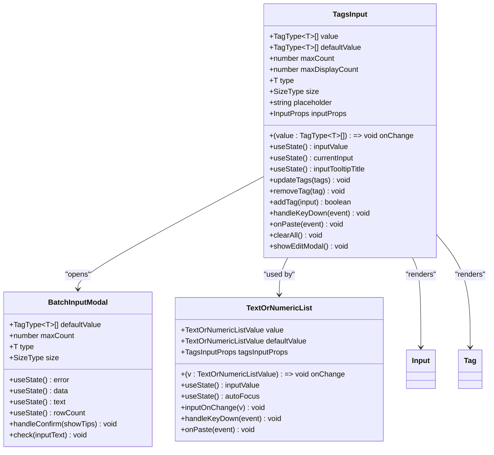
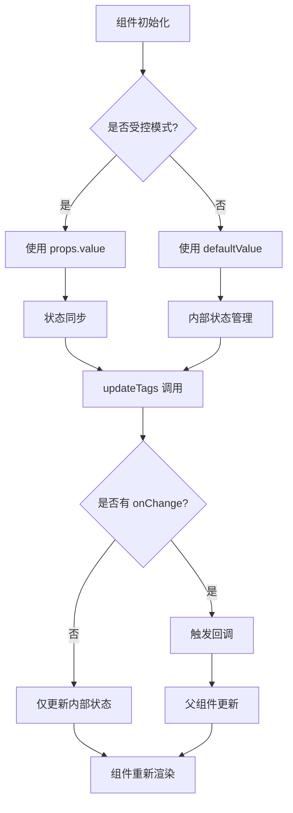
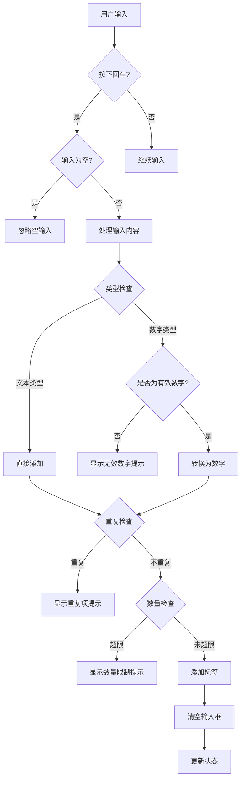
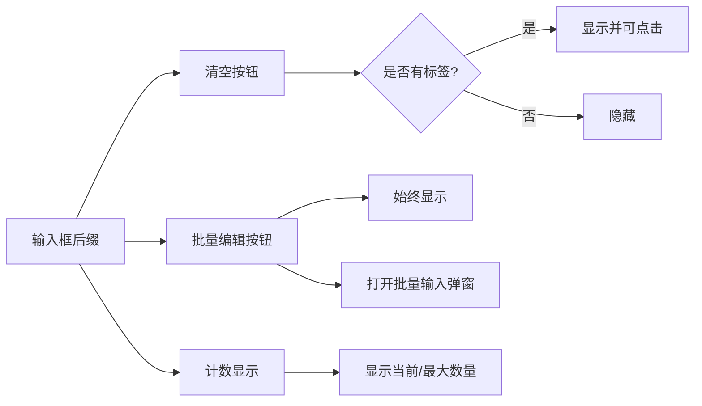

# TagsInput 组件基础用法

<cite>
**本文档引用的文件**
- [src/TagsInput/index.tsx](file://src/TagsInput/index.tsx)
- [src/TagsInput/demo/basic.tsx](file://src/TagsInput/demo/basic.tsx)
- [src/TagsInput/demo/different-sizes.tsx](file://src/TagsInput/demo/different-sizes.tsx)
- [src/TagsInput/demo/numeric.tsx](file://src/TagsInput/demo/numeric.tsx)
- [src/TagsInput/demo/max-count.tsx](file://src/TagsInput/demo/max-count.tsx)
- [src/TagsInput/index.md](file://src/TagsInput/index.md)
- [src/TagsInput/locale/index.ts](file://src/TagsInput/locale/index.ts)
- [src/typings.d.ts](file://src/typings.d.ts)
</cite>

## 目录
1. [简介](#简介)
2. [核心特性](#核心特性)
3. [基本使用方式](#基本使用方式)
4. [TypeScript 类型定义](#typescript-类型定义)
5. [组件架构分析](#组件架构分析)
6. [默认行为说明](#默认行为说明)
7. [输入框后缀图标功能](#输入框后缀图标功能)
8. [最佳实践建议](#最佳实践建议)
9. [总结](#总结)

## 简介

TagsInput 是一个功能丰富的标签输入组件，支持文本和数字两种类型，具有批量输入、数量限制、显示限制等功能。该组件完全遵循 Ant Design 设计语言，提供了优秀的用户体验和开发体验。

## 核心特性

TagsInput 组件具备以下核心特性：

- **双模式支持**：既支持受控模式（通过 `value` 和 `onChange` 控制），也支持非受控模式（通过 `defaultValue` 设置初始值）
- **多种输入类型**：支持文本标签和数字标签两种类型
- **智能验证**：自动拦截重复项，验证数字有效性
- **批量输入**：支持通过弹窗进行批量标签输入
- **数量限制**：可配置最大标签数量和显示数量
- **响应式设计**：支持不同尺寸的输入框
- **国际化支持**：内置多语言支持

## 基本使用方式

### 受控模式

受控模式是最常见的使用方式，通过 `value` 和 `onChange` 实现双向数据绑定：

```typescript
// 基础受控用法示例路径：src/TagsInput/demo/basic.tsx#L4-L22
```

在受控模式下：
- `value` 属性接收当前的标签数组
- `onChange` 回调函数接收更新后的标签数组
- 组件状态完全由父组件控制

### 非受控模式

非受控模式适用于简单的场景，通过 `defaultValue` 设置初始值：

```typescript
// 非受控模式示例路径：src/TagsInput/demo/different-sizes.tsx#L47-L52
```

在非受控模式下：
- `defaultValue` 属性设置初始标签数组
- 组件内部维护自己的状态
- 适合简单的静态场景

**章节来源**
- [src/TagsInput/index.tsx](file://src/TagsInput/index.tsx#L92-L113)
- [src/TagsInput/demo/basic.tsx](file://src/TagsInput/demo/basic.tsx#L4-L22)

## TypeScript 类型定义

### 泛型类型系统

TagsInput 使用强大的泛型系统来支持不同类型的数据：

```typescript
// 类型定义示例路径：src/TagsInput/index.tsx#L33-L40
```

### TagType 类型映射

- **默认类型**：`TagType<T>` 默认为 `'text'` 类型，返回 `string`
- **数字类型**：当 `type="numeric"` 时，返回 `number`
- **联合类型**：支持 `string | number` 的混合类型

### 接口定义

```typescript
// Props 接口定义示例路径：src/TagsInput/index.tsx#L41-L56
```

主要接口包含：
- `value` 和 `defaultValue`：标签数组类型
- `onChange`：回调函数签名
- `maxCount`：最大数量限制
- `maxDisplayCount`：最大显示数量
- `type`：输入类型标识
- `size`：尺寸控制

**章节来源**
- [src/TagsInput/index.tsx](file://src/TagsInput/index.tsx#L33-L56)
- [src/typings.d.ts](file://src/typings.d.ts#L1-L34)

## 组件架构分析

### 核心组件结构



**图表来源**
- [src/TagsInput/index.tsx](file://src/TagsInput/index.tsx#L64-L353)
- [src/TagsInput/index.tsx](file://src/TagsInput/index.tsx#L358-L707)

### 状态管理机制

组件采用 React Hooks 进行状态管理：



**图表来源**
- [src/TagsInput/index.tsx](file://Src/TagsInput/index.tsx#L92-L113)

**章节来源**
- [src/TagsInput/index.tsx](file://src/TagsInput/index.tsx#L64-L353)

## 默认行为说明

### 输入处理逻辑

TagsInput 具有一套完善的输入处理逻辑：



**图表来源**
- [src/TagsInput/index.tsx](file://src/TagsInput/index.tsx#L124-L161)

### 关键默认行为

1. **回车添加**：输入文本后按回车自动添加标签
2. **空输入过滤**：空输入不会被添加为标签
3. **重复项拦截**：自动检测并阻止重复标签
4. **数量限制**：达到最大数量时禁止添加新标签
5. **数字验证**：数字类型输入会验证是否为有效数字
6. **粘贴分割**：支持粘贴多行文本自动分割为标签

**章节来源**
- [src/TagsInput/index.tsx](file://src/TagsInput/index.tsx#L124-L216)

## 输入框后缀图标功能

### 图标功能说明

TagsInput 的输入框后缀区域包含三个功能图标：



**图表来源**
- [src/TagsInput/index.tsx](file://src/TagsInput/index.tsx#L323-L347)

### 各图标功能详解

1. **清空按钮（DeleteOutlined）**
   - **显示条件**：只有当存在标签时才显示
   - **功能**：点击后清空所有标签
   - **交互**：鼠标悬停显示"清空所有"提示

2. **批量编辑按钮（EditOutlined）**
   - **显示条件**：始终显示，不受标签数量影响
   - **功能**：打开批量输入弹窗，支持一次性输入多个标签
   - **交互**：鼠标悬停显示"批量输入"提示

3. **计数显示**
   - 显示格式：`当前数量/最大数量`
   - 例如：`3/200` 表示已添加3个标签，最大允许200个
   - 字体颜色：次要文本色

**章节来源**
- [src/TagsInput/index.tsx](file://src/TagsInput/index.tsx#L323-L347)

## 最佳实践建议

### 性能优化建议

1. **避免昂贵操作**
   - 在 `onChange` 回调中避免执行耗时操作
   - 避免在回调中进行复杂的计算或网络请求
   - 考虑使用防抖（debounce）或节流（throttle）技术

2. **合理设置 maxCount**
   - 根据业务需求设置合理的最大数量限制
   - 避免设置过大的值导致内存占用过高

3. **优化渲染性能**
   - 对于大量标签的场景，考虑使用虚拟滚动
   - 合理设置 `maxDisplayCount` 减少 DOM 元素数量

### 用户体验优化

1. **适当的占位符**
   - 提供清晰的输入指导
   - 根据输入类型调整占位符文本

2. **及时的反馈**
   - 利用内置的提示系统提供即时反馈
   - 合理使用 tooltip 显示错误信息

3. **无障碍访问**
   - 确保键盘导航正常工作
   - 提供适当的 ARIA 属性

### 错误处理策略

1. **输入验证**
   - 利用组件的内置验证功能
   - 提供友好的错误提示信息

2. **边界情况处理**
   - 处理空输入和无效输入
   - 正确处理粘贴操作中的异常情况

**章节来源**
- [src/TagsInput/index.tsx](file://src/TagsInput/index.tsx#L247-L255)

## 总结

TagsInput 组件是一个功能完整、设计精良的标签输入组件，它：

1. **提供了灵活的使用方式**：支持受控和非受控两种模式，满足不同场景需求
2. **具备完善的类型系统**：通过泛型支持文本和数字两种类型
3. **拥有丰富的交互功能**：包括批量输入、数量限制、智能验证等
4. **遵循设计规范**：完全符合 Ant Design 设计语言
5. **注重用户体验**：提供直观的界面和及时的操作反馈

通过合理使用 TagsInput 组件，开发者可以快速构建出功能丰富、用户体验良好的标签输入功能，同时保持代码的简洁性和可维护性。