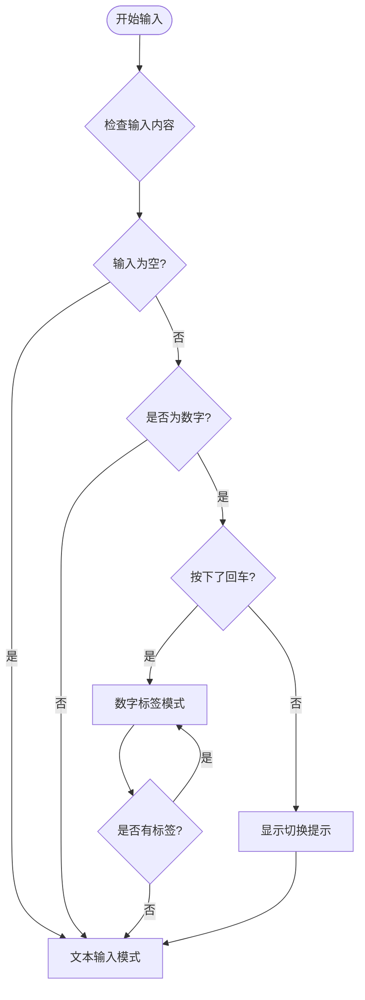
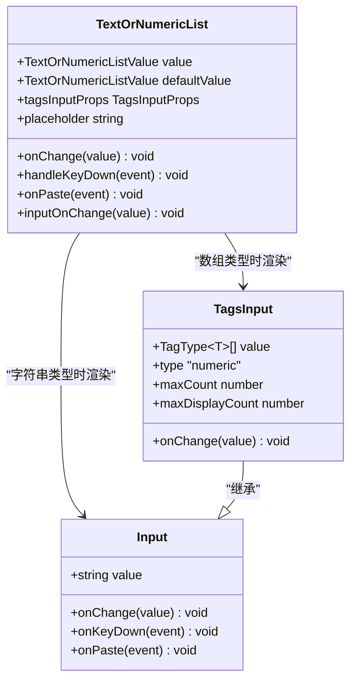
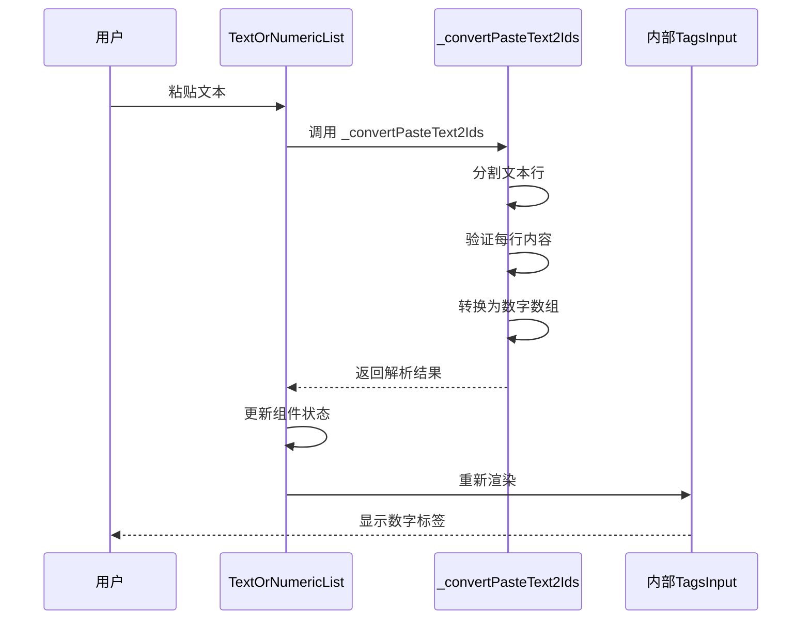

# TextOrNumericList 模式

<cite>
**本文档中引用的文件**
- [text-or-numeric-list.tsx](file://src/TagsInput/demo/text-or-numeric-list.tsx)
- [index.tsx](file://src/TagsInput/index.tsx)
- [index.md](file://src/TagsInput/index.md)
</cite>

## 目录
1. [简介](#简介)
2. [核心特性](#核心特性)
3. [智能模式切换机制](#智能模式切换机制)
4. [组件架构](#组件架构)
5. [使用场景](#使用场景)
6. [配置选项](#配置选项)
7. [粘贴功能集成](#粘贴功能集成)
8. [实现细节](#实现细节)
9. [最佳实践](#最佳实践)
10. [故障排除](#故障排除)

## 简介

TextOrNumericList 是 TagsInput 组件中的一个特殊模式，它提供了一种智能的输入体验：根据用户输入的内容类型（字符串或数字数组）自动在文本输入和数字标签输入之间切换。这种设计使得用户可以在单一输入框中灵活处理不同类型的数据，无需手动切换模式。

## 核心特性

### 智能模式识别
- **自动类型检测**：根据输入内容自动判断是文本还是数字
- **无缝切换**：在文本输入和标签模式之间平滑过渡
- **状态保持**：支持受控和非受控两种模式

### 交互体验
- **键盘快捷键**：输入数字后按回车自动切换到标签模式
- **粘贴解析**：支持粘贴包含数字的文本，自动解析为数字列表
- **清空检测**：清空所有标签后自动切换回文本输入模式

### 功能完整性
- **批量输入**：支持通过弹窗进行批量数据输入
- **数量限制**：可配置最大标签数量和显示数量
- **重复检测**：自动检测并处理重复项

## 智能模式切换机制

TextOrNumericList 的核心在于其智能的模式切换算法，该机制基于以下规则：



**图表来源**
- [index.tsx](file://src/TagsInput/index.tsx#L601-L618)
- [index.tsx](file://src/TagsInput/index.tsx#L637-L669)

### 切换触发条件

#### 从文本到数字标签的切换
1. **输入有效数字**：用户输入可以被转换为数字的字符串
2. **按下回车键**：在有效数字输入后按下回车
3. **自动转换**：系统自动将字符串转换为数字数组

#### 从数字标签回到文本输入
1. **清空标签**：删除所有数字标签
2. **自动检测**：系统检测到没有剩余标签
3. **模式重置**：恢复到初始的文本输入状态

**章节来源**
- [index.tsx](file://src/TagsInput/index.tsx#L578-L598)
- [index.tsx](file://src/TagsInput/index.tsx#L601-L618)

## 组件架构

TextOrNumericList 采用条件渲染的方式，在运行时根据数据类型动态选择渲染组件：



**图表来源**
- [index.tsx](file://src/TagsInput/index.tsx#L533-L547)
- [index.tsx](file://src/TagsInput/index.tsx#L637-L651)
- [index.tsx](file://src/TagsInput/index.tsx#L653-L669)

### 状态管理

组件维护以下关键状态：

| 状态变量 | 类型 | 用途 | 默认值 |
|---------|------|------|--------|
| inputValue | TextOrNumericListValue | 内部状态存储 | defaultValue |
| autoFocus | boolean | 控制焦点行为 | false |
| tagsInputKey | number | 强制重新渲染 | 1 |

**章节来源**
- [index.tsx](file://src/TagsInput/index.tsx#L569-L571)
- [index.tsx](file://src/TagsInput/index.tsx#L636-L637)

## 使用场景

### 基础用法场景

#### 场景一：通用ID输入
适用于需要输入单个文本或数字ID的场景，如用户ID、订单号等。

**特点**：
- 初始为文本输入模式
- 输入数字后按回车自动切换
- 支持混合输入多种格式

#### 场景二：默认数值列表
当组件初始化时就包含数字数组时，直接显示为标签模式。

**特点**：
- 自动识别数组类型
- 显示为数字标签集合
- 支持编辑和删除操作

#### 场景三：自定义配置
通过 tagsInputProps 传递配置给内部的 TagsInput 组件。

**特点**：
- 支持最大数量限制
- 可配置显示数量
- 支持不同尺寸设置

**章节来源**
- [text-or-numeric-list.tsx](file://src/TagsInput/demo/text-or-numeric-list.tsx#L7-L106)

## 配置选项

### 基础配置

TextOrNumericList 组件提供了丰富的配置选项：

| 属性 | 类型 | 默认值 | 说明 |
|------|------|--------|------|
| value | string \| number[] | - | 当前值（受控模式） |
| defaultValue | string \| number[] | '' | 默认值（非受控模式） |
| onChange | (value: string \| number[]) => void | - | 值变化时的回调 |
| placeholder | string | '输入ID或名称，输入ID时，回车可切换输入模式' | 占位符文本 |
| tagsInputProps | Omit<TagsInputProps<'numeric'>> | - | 传递给 TagsInput 的配置 |

### TagsInput 配置选项

通过 tagsInputProps 可以配置内部的 TagsInput 组件：

| 属性 | 类型 | 说明 |
|------|------|------|
| maxCount | number | 最大标签数量 |
| maxDisplayCount | number | 最大显示标签数量 |
| size | SizeType | 输入框尺寸 |
| inputProps | InputProps | 输入框额外属性 |

**章节来源**
- [index.tsx](file://src/TagsInput/index.tsx#L535-L547)
- [index.tsx](file://src/TagsInput/index.tsx#L543-L546)

## 粘贴功能集成

TextOrNumericList 实现了强大的粘贴功能，能够自动解析包含数字的文本：



**图表来源**
- [index.tsx](file://src/TagsInput/index.tsx#L622-L632)
- [index.tsx](file://src/TagsInput/index.tsx#L674-L705)

### 粘贴处理逻辑

粘贴功能的核心实现包括以下步骤：

1. **文本提取**：从剪贴板获取纯文本内容
2. **行分割**：按换行符分割文本为多行
3. **内容验证**：逐行验证是否为有效数字
4. **去重处理**：使用 Set 去除重复项
5. **状态更新**：触发组件重新渲染

### 支持的粘贴格式

- **单行数字**：`123`
- **多行数字**：`1\n2\n3`
- **混合内容**：包含数字和非数字的文本
- **重复数字**：自动去重处理

**章节来源**
- [index.tsx](file://src/TagsInput/index.tsx#L622-L632)
- [index.tsx](file://src/TagsInput/index.tsx#L674-L705)

## 实现细节

### 关键算法

#### 数字检测算法
组件使用双重验证确保输入的有效性：

```typescript
// 第一步：检查是否为空
if (!(realValue as string)?.trim()) {
  return;
}

// 第二步：检查是否为数字
if (Number.isNaN(Number(realValue))) {
  return;
}
```

#### 粘贴解析算法
粘贴功能的解析过程：

```typescript
function _convertPasteText2Ids<T extends 'text' | 'numeric' = 'text'>(
  clipboardData: DataTransfer | null,
  type: T,
): ReturnT<T> {
  // 1. 获取剪贴板文本
  const text = clipboardData.getData('text/plain')?.trim();
  
  // 2. 分割为多行
  const rows = text.split('\n');
  
  // 3. 验证和转换
  for (let row of rows) {
    row = row.trim();
    if (type === 'numeric') {
      const num = Number(row);
      if (Number.isNaN(num)) {
        return null; // 非数字返回null
      }
      ids.push(num as unknown as T);
    }
  }
  
  // 4. 去重处理
  return Array.from(new Set(ids)) as unknown as ReturnT<T>;
}
```

### 性能优化

#### 状态更新策略
- **防抖处理**：避免频繁的状态更新
- **条件渲染**：只有在必要时才重新渲染
- **记忆化**：使用 useCallback 缓存回调函数

#### 内存管理
- **自动清理**：组件卸载时自动清理状态
- **引用稳定**：保持回调函数引用的稳定性

**章节来源**
- [index.tsx](file://src/TagsInput/index.tsx#L601-L618)
- [index.tsx](file://src/TagsInput/index.tsx#L674-L705)

## 最佳实践

### 开发建议

1. **合理使用场景**
   - 适用于需要灵活输入文本或数字的场景
   - 避免在复杂业务逻辑中过度使用

2. **性能考虑**
   - 对于大量数据输入，考虑使用 tagsInputProps 限制 maxCount
   - 合理设置 maxDisplayCount 避免界面拥挤

3. **用户体验**
   - 提供清晰的占位符文本
   - 正确处理错误状态和提示信息

### 常见问题

1. **初始值问题**
   - 确保 defaultValue 的类型正确
   - 注意受控和非受控模式的区别

2. **粘贴功能**
   - 确保浏览器允许访问剪贴板权限
   - 处理粘贴内容格式不规范的情况

3. **键盘事件**
   - 正确阻止默认行为防止页面跳转
   - 处理不同浏览器的键盘事件差异

## 故障排除

### 常见问题及解决方案

#### 问题1：无法切换模式
**症状**：输入数字后按回车没有切换到标签模式
**原因**：输入内容不是有效的数字
**解决方案**：检查输入格式，确保可以被 Number() 转换

#### 问题2：粘贴功能失效
**症状**：粘贴包含数字的文本没有自动解析
**原因**：剪贴板权限被拒绝或格式不正确
**解决方案**：检查浏览器权限设置，确保文本格式正确

#### 问题3：组件状态混乱
**症状**：组件在不同模式间切换异常
**原因**：状态管理不当或 props 传递错误
**解决方案**：检查 value 和 onChange 的配合使用

### 调试技巧

1. **状态监控**：使用 React DevTools 监控组件状态
2. **日志输出**：在关键函数中添加 console.log
3. **断点调试**：在 handleKeyDown 和 onPaste 中设置断点

**章节来源**
- [index.tsx](file://src/TagsInput/index.tsx#L601-L618)
- [index.tsx](file://src/TagsInput/index.tsx#L622-L632)

## 总结

TextOrNumericList 模式代表了现代前端组件设计的趋势：智能化、自适应和用户体验优先。通过巧妙的算法设计和优雅的架构实现，它成功地解决了传统组件在处理混合数据类型时的痛点，为开发者提供了一个既强大又易用的解决方案。

这种模式不仅提高了开发效率，更重要的是改善了用户的操作体验，体现了以用户为中心的设计理念。随着 Web 应用对交互体验要求的不断提高，类似 TextOrNumericList 这样的智能组件将会在更多的应用场景中发挥重要作用。