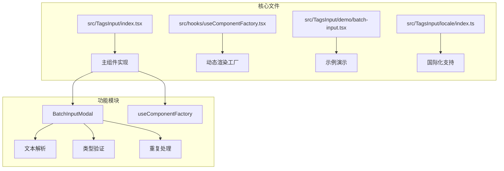
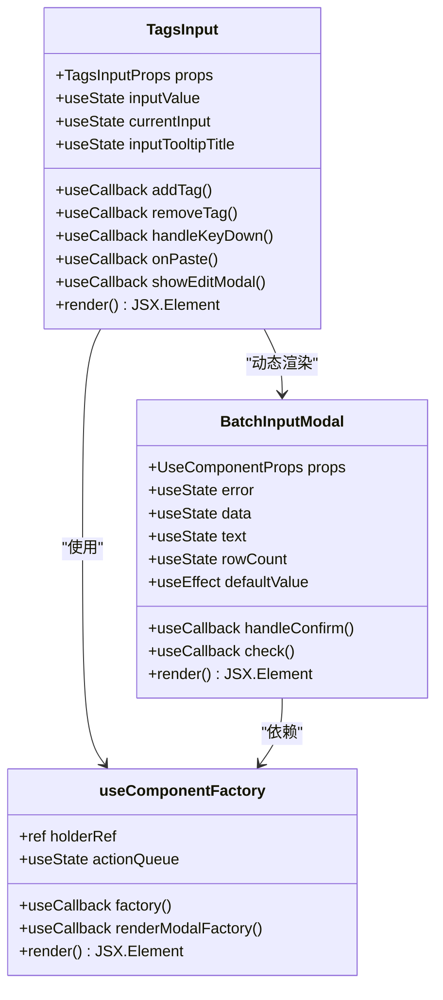
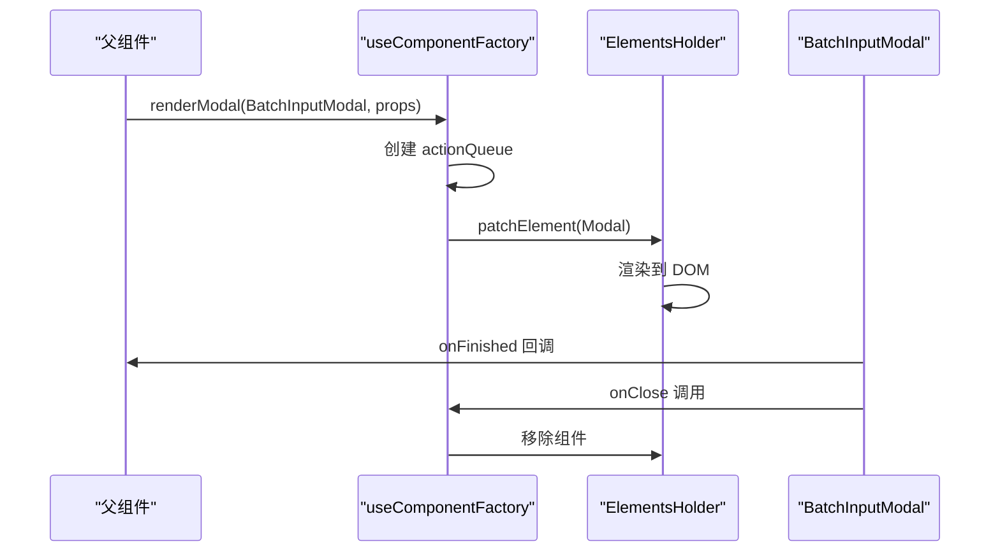
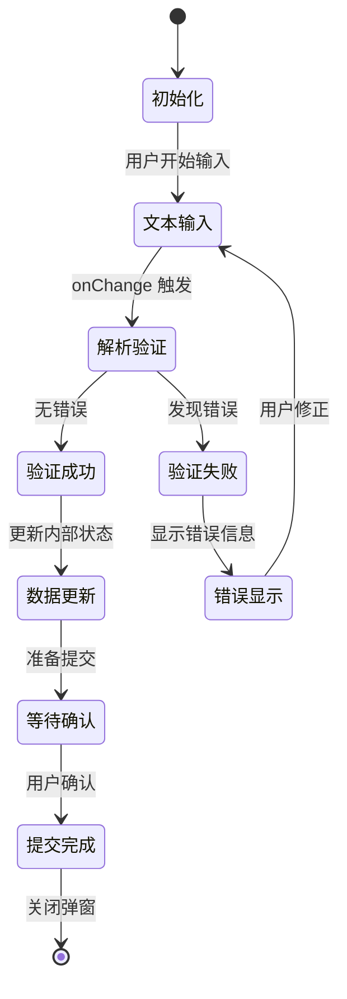
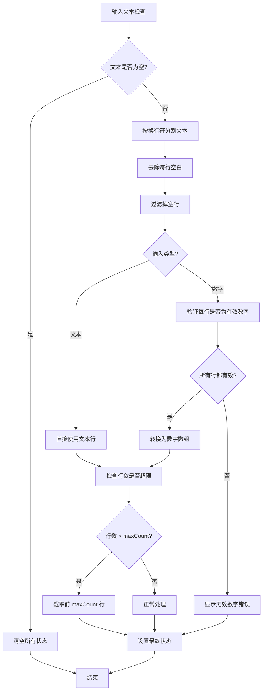
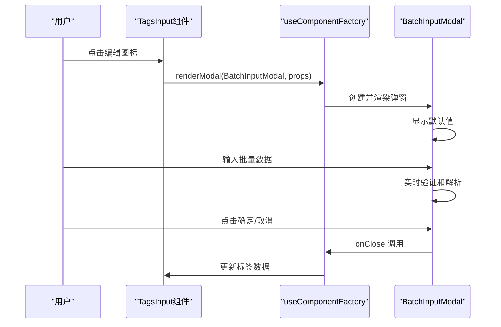
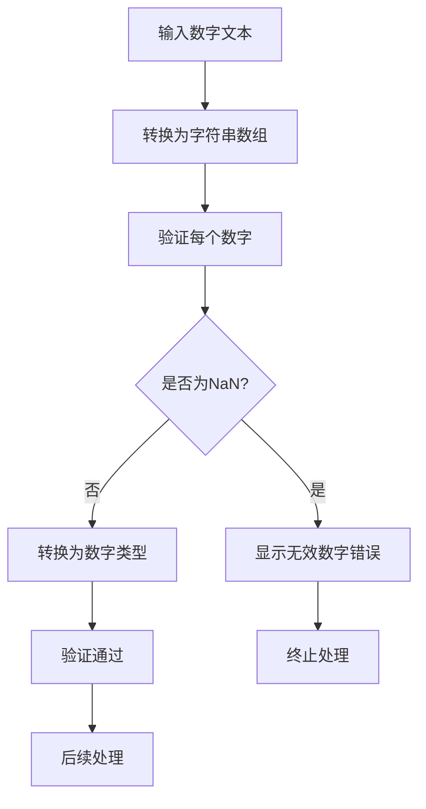
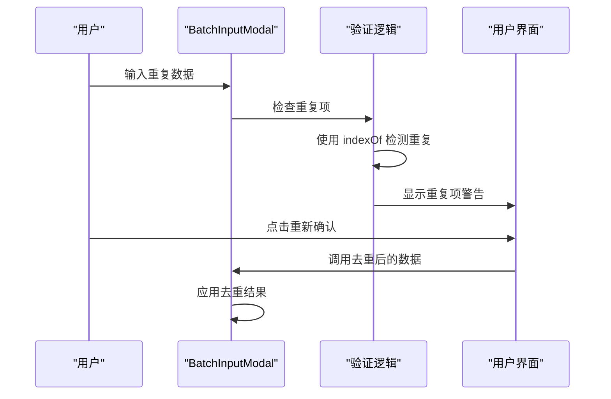
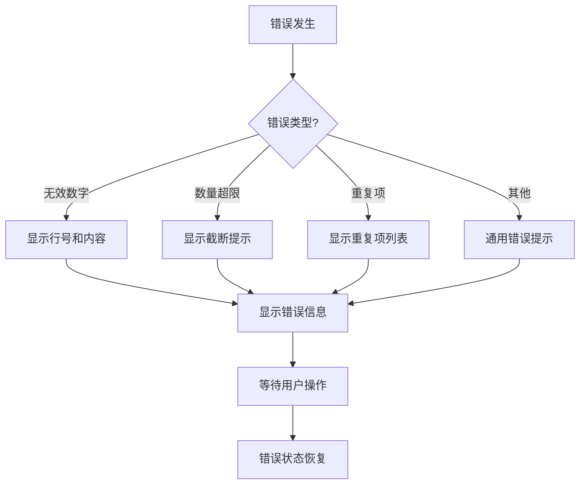

# TagsInput 组件批量输入功能详细文档

<cite>
**本文档中引用的文件**
- [src/TagsInput/index.tsx](file://src/TagsInput/index.tsx)
- [src/hooks/useComponentFactory.tsx](file://src/hooks/useComponentFactory.tsx)
- [src/TagsInput/demo/batch-input.tsx](file://src/TagsInput/demo/batch-input.tsx)
- [src/TagsInput/locale/index.ts](file://src/TagsInput/locale/index.ts)
</cite>

## 目录
1. [简介](#简介)
2. [项目结构](#项目结构)
3. [核心组件架构](#核心组件架构)
4. [useComponentFactory Hook 分析](#usecomponentfactory-hook-分析)
5. [BatchInputModal 组件实现](#batchinputmodal-组件实现)
6. [批量输入功能详解](#批量输入功能详解)
7. [文本和数字类型处理](#文本和数字类型处理)
8. [重复项去重机制](#重复项去重机制)
9. [错误处理和用户反馈](#错误处理和用户反馈)
10. [性能优化考虑](#性能优化考虑)
11. [总结](#总结)

## 简介

TagsInput 组件的批量输入功能是一个强大的特性，允许用户通过弹窗界面一次性输入多个标签或数值。该功能通过动态渲染机制、智能文本解析、类型验证和重复项处理等核心机制，为用户提供高效的数据输入体验。

## 项目结构

TagsInput 组件的批量输入功能涉及以下关键文件：



**图表来源**
- [src/TagsInput/index.tsx](file://src/TagsInput/index.tsx#L1-L707)
- [src/hooks/useComponentFactory.tsx](file://src/hooks/useComponentFactory.tsx#L1-L111)

**章节来源**
- [src/TagsInput/index.tsx](file://src/TagsInput/index.tsx#L1-L50)
- [src/hooks/useComponentFactory.tsx](file://src/hooks/useComponentFactory.tsx#L1-L30)

## 核心组件架构

TagsInput 组件采用现代化的 React 架构设计，通过 Hook 和 Context 模式实现复杂的功能组合：



**图表来源**
- [src/TagsInput/index.tsx](file://src/TagsInput/index.tsx#L64-L353)
- [src/TagsInput/index.tsx](file://src/TagsInput/index.tsx#L359-L530)
- [src/hooks/useComponentFactory.tsx](file://src/hooks/useComponentFactory.tsx#L29-L76)

**章节来源**
- [src/TagsInput/index.tsx](file://src/TagsInput/index.tsx#L64-L120)
- [src/TagsInput/index.tsx](file://src/TagsInput/index.tsx#L257-L265)

## useComponentFactory Hook 分析

useComponentFactory 是一个精心设计的 Hook，它实现了组件的按需加载和动态渲染机制：

### 核心实现原理



**图表来源**
- [src/hooks/useComponentFactory.tsx](file://src/hooks/useComponentFactory.tsx#L48-L62)
- [src/TagsInput/index.tsx](file://src/TagsInput/index.tsx#L257-L265)

### 关键特性

1. **延迟渲染机制**：组件只有在需要时才被实例化和渲染
2. **队列管理**：通过 actionQueue 确保组件渲染的顺序性
3. **资源清理**：自动管理组件的生命周期和内存释放
4. **类型安全**：泛型支持确保类型安全的组件传递

**章节来源**
- [src/hooks/useComponentFactory.tsx](file://src/hooks/useComponentFactory.tsx#L29-L76)

## BatchInputModal 组件实现

BatchInputModal 是批量输入功能的核心组件，负责处理复杂的文本解析和数据验证：

### 组件状态管理



**图表来源**
- [src/TagsInput/index.tsx](file://src/TagsInput/index.tsx#L380-L385)
- [src/TagsInput/index.tsx](file://src/TagsInput/index.tsx#L414-L478)

### 主要方法分析

#### handleConfirm 方法

该方法处理用户的确认操作，包含两种模式：
- **直接提交模式**：立即应用所有数据
- **提示模式**：检查并提示重复项

#### check 方法

这是批量输入的核心解析逻辑：



**图表来源**
- [src/TagsInput/index.tsx](file://src/TagsInput/index.tsx#L414-L478)

**章节来源**
- [src/TagsInput/index.tsx](file://src/TagsInput/index.tsx#L389-L411)
- [src/TagsInput/index.tsx](file://src/TagsInput/index.tsx#L414-L478)

## 批量输入功能详解

### 触发机制

批量输入功能通过点击编辑图标触发，使用 useComponentFactory 实现动态渲染：



**图表来源**
- [src/TagsInput/index.tsx](file://src/TagsInput/index.tsx#L257-L265)
- [src/TagsInput/index.tsx](file://src/TagsInput/index.tsx#L389-L411)

### 数据流处理

批量输入的数据流遵循严格的验证和转换流程：

1. **原始文本输入**：用户在 TextArea 中输入多行文本
2. **实时解析**：每次文本变化时触发解析过程
3. **类型验证**：根据配置的类型进行相应验证
4. **重复检测**：识别并处理重复项
5. **数量控制**：确保不超过最大数量限制
6. **状态更新**：更新组件内部状态和外部回调

**章节来源**
- [src/TagsInput/index.tsx](file://src/TagsInput/index.tsx#L257-L265)
- [src/TagsInput/index.tsx](file://src/TagsInput/index.tsx#L389-L411)

## 文本和数字类型处理

### 文本类型处理

文本类型的批量输入相对简单，主要进行以下处理：

1. **文本分割**：按换行符分割输入文本
2. **空白处理**：去除每行的首尾空白字符
3. **空行过滤**：移除空行
4. **直接使用**：将处理后的文本行作为标签数组

### 数字类型处理

数字类型的处理更加严格，包含额外的验证步骤：



**图表来源**
- [src/TagsInput/index.tsx](file://src/TagsInput/index.tsx#L433-L448)

**章节来源**
- [src/TagsInput/index.tsx](file://src/TagsInput/index.tsx#L433-L451)

## 重复项去重机制

### Array.from(new Set(...)) 实现

组件使用 JavaScript 的 Set 对象实现高效的重复项去重：

```typescript
// 去重逻辑示例
const uniqueItems = Array.from(new Set(originalArray));
```

这种实现方式具有以下优势：
- **时间复杂度**：O(n)，线性时间复杂度
- **空间复杂度**：O(n)，需要额外的空间存储唯一值
- **类型安全**：保持原始数组的类型不变
- **简洁性**：代码简洁易读

### 重复项检测流程



**图表来源**
- [src/TagsInput/index.tsx](file://src/TagsInput/index.tsx#L398-L405)

**章节来源**
- [src/TagsInput/index.tsx](file://src/TagsInput/index.tsx#L398-L405)
- [src/TagsInput/index.tsx](file://src/TagsInput/index.tsx#L702-L704)

## 错误处理和用户反馈

### 错误类型分类

系统定义了多种错误类型，每种都有相应的用户反馈机制：

| 错误类型 | 触发条件 | 用户反馈 |
|---------|---------|---------|
| 无效数字 | 数字类型输入非数字字符 | 显示具体行号和内容 |
| 超出数量限制 | 输入行数超过 maxCount | 显示截断提示 |
| 重复项 | 存在重复的标签/数值 | 显示重复项列表 |
| 空输入 | 输入为空或仅含空白 | 清空状态 |

### 错误显示机制



**图表来源**
- [src/TagsInput/index.tsx](file://src/TagsInput/index.tsx#L440-L445)
- [src/TagsInput/index.tsx](file://src/TagsInput/index.tsx#L461-L471)

### 国际化支持

组件提供了完整的国际化支持，错误消息可以根据语言环境动态调整：

**章节来源**
- [src/TagsInput/locale/index.ts](file://src/TagsInput/locale/index.ts#L1-L47)
- [src/TagsInput/index.tsx](file://src/TagsInput/index.tsx#L440-L445)
- [src/TagsInput/index.tsx](file://src/TagsInput/index.tsx#L461-L471)

## 性能优化考虑

### 延迟渲染策略

useComponentFactory 实现了按需渲染，避免不必要的组件初始化：

- **内存效率**：只在需要时创建组件实例
- **启动性能**：减少初始加载时间
- **资源管理**：自动清理不再使用的组件

### 实时验证优化

批量输入的实时验证采用了以下优化策略：

- **防抖处理**：避免频繁的重新渲染
- **增量计算**：只处理变化的部分
- **早期退出**：在发现错误时尽早停止处理

### 大数据集处理

对于大量数据的处理，系统采用了以下策略：

- **分批处理**：避免阻塞主线程
- **虚拟滚动**：只渲染可见区域
- **缓存机制**：缓存计算结果

**章节来源**
- [src/hooks/useComponentFactory.tsx](file://src/hooks/useComponentFactory.tsx#L35-L45)
- [src/TagsInput/index.tsx](file://src/TagsInput/index.tsx#L414-L478)

## 总结

TagsInput 组件的批量输入功能是一个设计精良的解决方案，它通过以下核心特性实现了优秀的用户体验：

1. **动态渲染机制**：使用 useComponentFactory 实现按需加载
2. **智能文本解析**：支持换行符分割和类型特定处理
3. **严格的数据验证**：确保数据质量和一致性
4. **优雅的重复处理**：使用 Set 对象实现高效去重
5. **完善的错误处理**：提供清晰的用户反馈
6. **国际化支持**：支持多语言环境
7. **性能优化**：采用多种优化策略提升性能

这个实现展示了现代 React 应用开发的最佳实践，包括 Hook 的正确使用、状态管理、性能优化和用户体验设计。通过深入理解这些机制，开发者可以更好地利用和扩展这个功能。