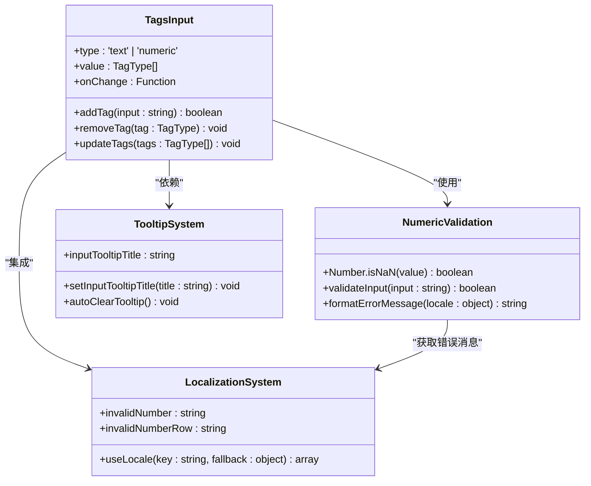
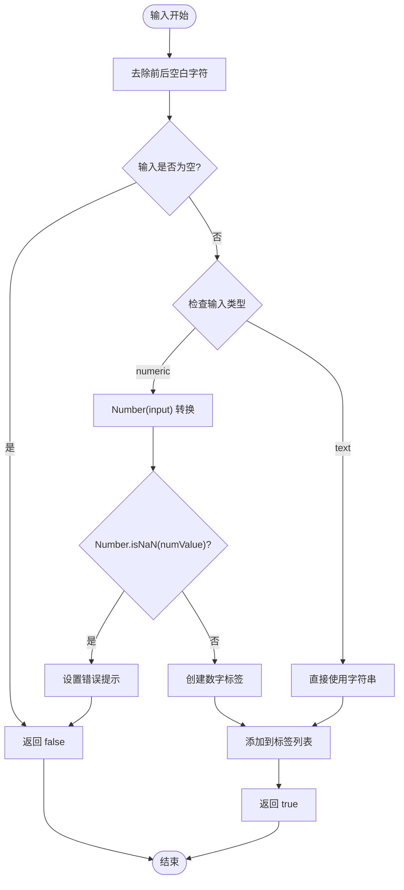
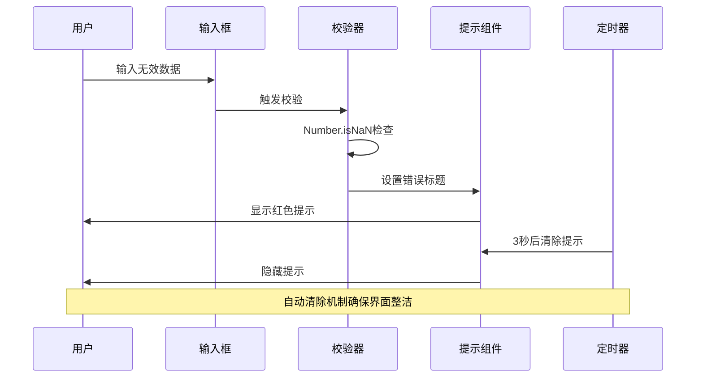
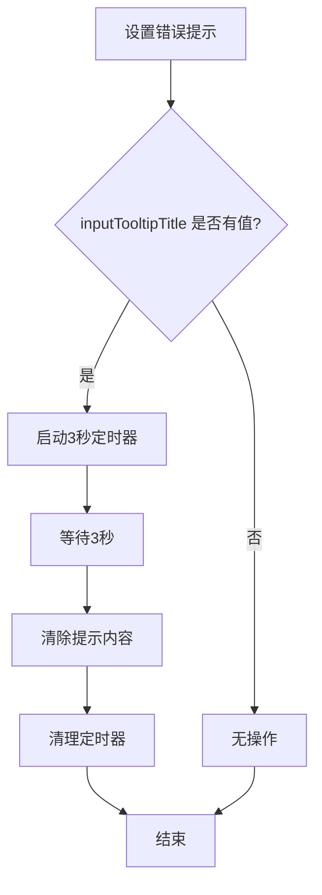
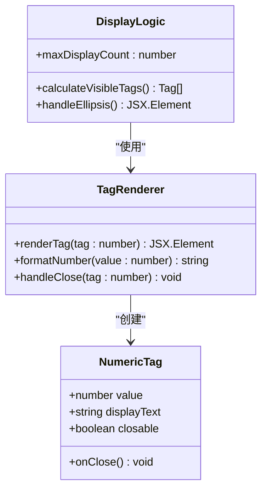
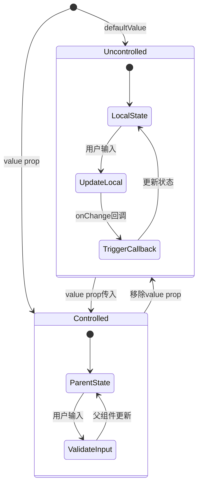
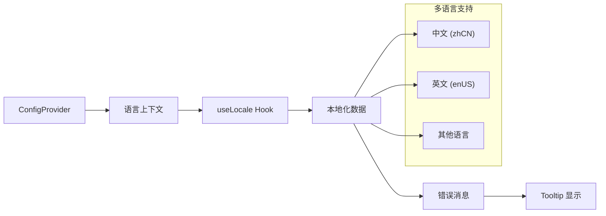
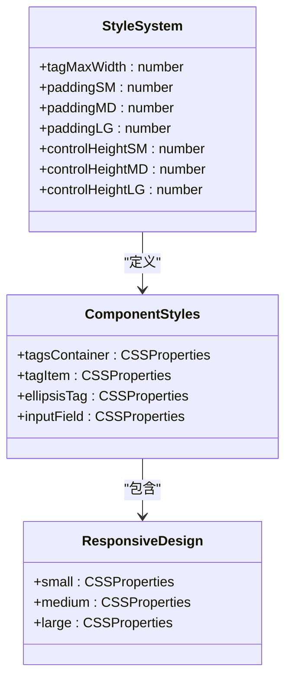

# 数字类型支持

<cite>
**本文档中引用的文件**
- [src/TagsInput/index.tsx](file://src/TagsInput/index.tsx)
- [src/TagsInput/demo/numeric.tsx](file://src/TagsInput/demo/numeric.tsx)
- [src/TagsInput/locale/index.ts](file://src/TagsInput/locale/index.ts)
- [src/TagsInput/style/index.ts](file://src/TagsInput/style/index.ts)
- [src/TagsInput/demo/localization.tsx](file://src/TagsInput/demo/localization.tsx)
</cite>

## 目录
1. [概述](#概述)
2. [核心功能架构](#核心功能架构)
3. [数字校验机制](#数字校验机制)
4. [错误提示系统](#错误提示系统)
5. [自动清除逻辑](#自动清除逻辑)
6. [实际应用场景](#实际应用场景)
7. [受控模式状态管理](#受控模式状态管理)
8. [国际化系统集成](#国际化系统集成)
9. [组件样式设计](#组件样式设计)
10. [最佳实践建议](#最佳实践建议)

## 概述

TagsInput 组件的数字类型支持是一个专门针对数值输入场景的功能模块，它通过 `type='numeric'` 属性启用严格的数字校验机制。该功能基于 JavaScript 的 `Number.isNaN` 方法进行严格判断，确保用户只能输入有效的数字值，并提供了完善的错误提示和自动清除机制。

### 主要特性

- **严格数字校验**：使用 `Number.isNaN` 进行精确的数字验证
- **实时错误提示**：通过 Tooltip 组件提供即时反馈
- **自动清除机制**：3秒后自动隐藏错误提示
- **国际化支持**：多语言错误消息文本
- **受控模式支持**：完整的状态管理模式
- **批量处理**：支持批量数字输入和粘贴操作

## 核心功能架构

**图表来源**
- [src/TagsInput/index.tsx](file://src/TagsInput/index.tsx#L64-L353)
- [src/TagsInput/locale/index.ts](file://src/TagsInput/locale/index.ts#L1-L47)

**章节来源**
- [src/TagsInput/index.tsx](file://src/TagsInput/index.tsx#L41-L81)
- [src/TagsInput/locale/index.ts](file://src/TagsInput/locale/index.ts#L1-L47)

## 数字校验机制

### 核心校验算法

数字类型支持的核心在于使用 `Number.isNaN` 方法进行严格判断。该方法与传统的 `isNaN()` 函数不同，它不会尝试将输入转换为数字后再判断，而是直接检查值是否为 NaN。

**图表来源**
- [src/TagsInput/index.tsx](file://src/TagsInput/index.tsx#L124-L161)

### 校验实现细节

在 `addTag` 方法中，数字校验的具体实现如下：

1. **输入预处理**：首先对输入字符串进行 `trim()` 处理，去除首尾空白字符
2. **空值检查**：如果输入为空字符串，直接返回 `false`
3. **类型判断**：根据 `type` 属性判断是否为数字类型
4. **严格转换**：使用 `Number()` 进行转换，然后通过 `Number.isNaN()` 进行严格判断
5. **错误处理**：如果转换失败，设置相应的错误提示信息

**章节来源**
- [src/TagsInput/index.tsx](file://src/TagsInput/index.tsx#L124-L161)

## 错误提示系统

### Tooltip 提示机制

当检测到无效输入时，组件会通过 Tooltip 组件显示错误提示。这种设计提供了良好的用户体验，避免了传统表单验证中的突兀警告。

**图表来源**
- [src/TagsInput/index.tsx](file://src/TagsInput/index.tsx#L309-L313)
- [src/TagsInput/index.tsx](file://src/TagsInput/index.tsx#L247-L255)

### 错误提示内容

错误提示内容通过国际化系统动态获取，支持多种语言环境：

| 错误类型 | 中文提示 | 英文提示 |
|---------|---------|---------|
| 无效数字 | 请输入有效的数字 | Please enter a valid number |
| 无效数字行 | '${text}'行不是有效数字 | '${text}' is not a valid number |

**章节来源**
- [src/TagsInput/locale/index.ts](file://src/TagsInput/locale/index.ts#L36-L39)

## 自动清除逻辑

### 3秒延迟清除机制

为了提供更好的用户体验，错误提示会在显示3秒后自动清除。这个机制通过 React 的 `useEffect` 和 `setTimeout` 实现：

**图表来源**
- [src/TagsInput/index.tsx](file://src/TagsInput/index.tsx#L247-L255)

### 清除逻辑实现

自动清除逻辑的关键实现包括：

1. **状态监听**：监听 `inputTooltipTitle` 状态的变化
2. **定时器管理**：使用 `setTimeout` 设置3秒延迟
3. **清理机制**：在组件卸载或新提示出现时清理旧定时器
4. **内存安全**：确保没有内存泄漏

**章节来源**
- [src/TagsInput/index.tsx](file://src/TagsInput/index.tsx#L247-L255)

## 实际应用场景

### 数字类型标签渲染

在数字类型模式下，标签的渲染方式与文本类型有所不同。每个数字标签都会被正确地格式化和显示：

**图表来源**
- [src/TagsInput/index.tsx](file://src/TagsInput/index.tsx#L273-L306)

### 数值总和计算

数字类型支持的一个重要应用场景是数值总和计算。在示例中展示了如何实时计算数字列表的总和：

**章节来源**
- [src/TagsInput/demo/numeric.tsx](file://src/TagsInput/demo/numeric.tsx#L17-L18)

### 批量数字处理

组件还支持批量数字输入，用户可以在批量编辑模式下输入多行数字，系统会自动进行校验和去重：

**章节来源**
- [src/TagsInput/index.tsx](file://src/TagsInput/index.tsx#L434-L449)

## 受控模式状态管理

### 状态同步机制

TagsInput 组件支持受控和非受控两种模式。在数字类型模式下，状态管理需要特别注意数字类型的特殊性：

**图表来源**
- [src/TagsInput/index.tsx](file://src/TagsInput/index.tsx#L92-L113)

### 状态管理最佳实践

1. **类型安全**：使用泛型确保类型安全
2. **状态同步**：正确处理受控和非受控模式的状态同步
3. **性能优化**：使用 `useCallback` 和 `useMemo` 优化性能
4. **错误边界**：妥善处理各种异常情况

**章节来源**
- [src/TagsInput/index.tsx](file://src/TagsInput/index.tsx#L92-L113)

## 国际化系统集成

### useLocale Hook 使用

组件通过 `useLocale` Hook 集成 Ant Design 的国际化系统，能够根据当前语言环境动态获取相应的错误提示文本：

**图表来源**
- [src/TagsInput/index.tsx](file://src/TagsInput/index.tsx#L67-L68)
- [src/TagsInput/locale/index.ts](file://src/TagsInput/locale/index.ts#L24-L46)

### 本地化配置示例

组件支持完整的本地化配置，包括：

| 配置项 | 说明 | 中文默认值 | 英文默认值 |
|-------|------|-----------|-----------|
| invalidNumber | 无效数字提示 | 请输入有效的数字 | Please enter a valid number |
| invalidNumberRow | 无效数字行提示 | '${text}'行不是有效数字 | '${text}' is not a valid number |
| numericTypeHint | 数字类型提示 | 数字 | Number |
| enterToSwitchMode | 切换模式提示 | 回车可切换输入模式 | Press Enter to switch mode |

**章节来源**
- [src/TagsInput/locale/index.ts](file://src/TagsInput/locale/index.ts#L36-L42)
- [src/TagsInput/demo/localization.tsx](file://src/TagsInput/demo/localization.tsx#L15-L64)

## 组件样式设计

### 样式架构

TagsInput 组件采用了基于 Ant Design 设计系统的样式架构，支持多种尺寸和主题：

**图表来源**
- [src/TagsInput/style/index.ts](file://src/TagsInput/style/index.ts#L45-L175)

### 尺寸适配

组件支持三种尺寸：小（small）、中（default）、大（large），每种尺寸都有对应的样式变量：

| 尺寸 | 控制高度 | 内边距 | 字体大小 | 标签间距 |
|------|---------|--------|---------|---------|
| small | 24px | 4px | 12px | 2px |
| medium | 32px | 6px | 14px | 4px |
| large | 40px | 8px | 16px | 6px |

**章节来源**
- [src/TagsInput/style/index.ts](file://src/TagsInput/style/index.ts#L150-L166)

## 最佳实践建议

### 开发建议

1. **类型安全**：始终使用正确的类型定义，避免类型错误
2. **错误处理**：妥善处理各种异常输入情况
3. **性能优化**：合理使用 React 性能优化技巧
4. **用户体验**：提供清晰的错误提示和反馈

### 使用场景

1. **表单验证**：用于需要数字输入的表单字段
2. **标签管理**：创建数字标签集合
3. **批量处理**：支持批量数字输入和编辑
4. **数据筛选**：作为数字筛选条件的输入组件

### 注意事项

1. **内存管理**：确保定时器正确清理，避免内存泄漏
2. **国际化配置**：正确配置本地化文本，支持多语言
3. **状态同步**：在受控模式下正确处理状态同步
4. **错误边界**：妥善处理各种异常情况，提供友好的错误提示

通过以上详细分析，我们可以看到 TagsInput 组件的数字类型支持功能是一个设计精良、功能完备的解决方案，它不仅提供了严格的数字校验，还通过完善的错误提示和自动清除机制，为用户提供了优秀的使用体验。