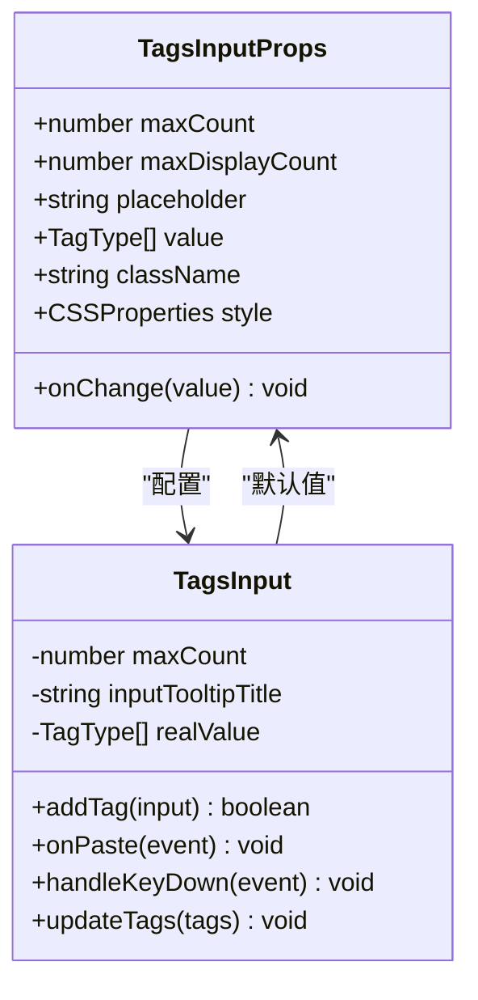
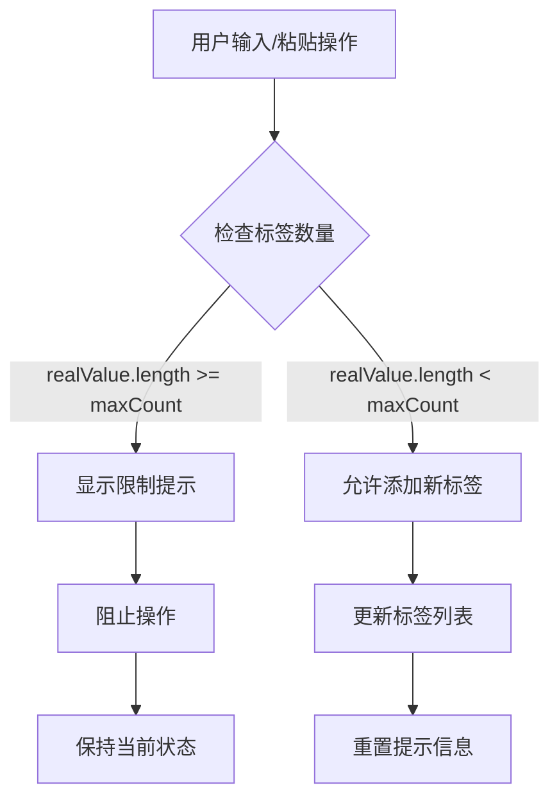
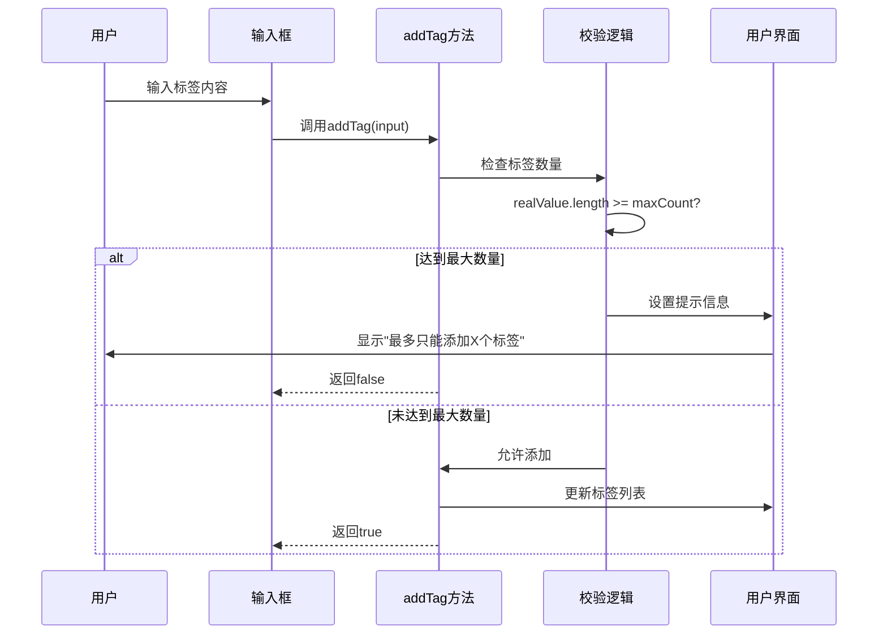
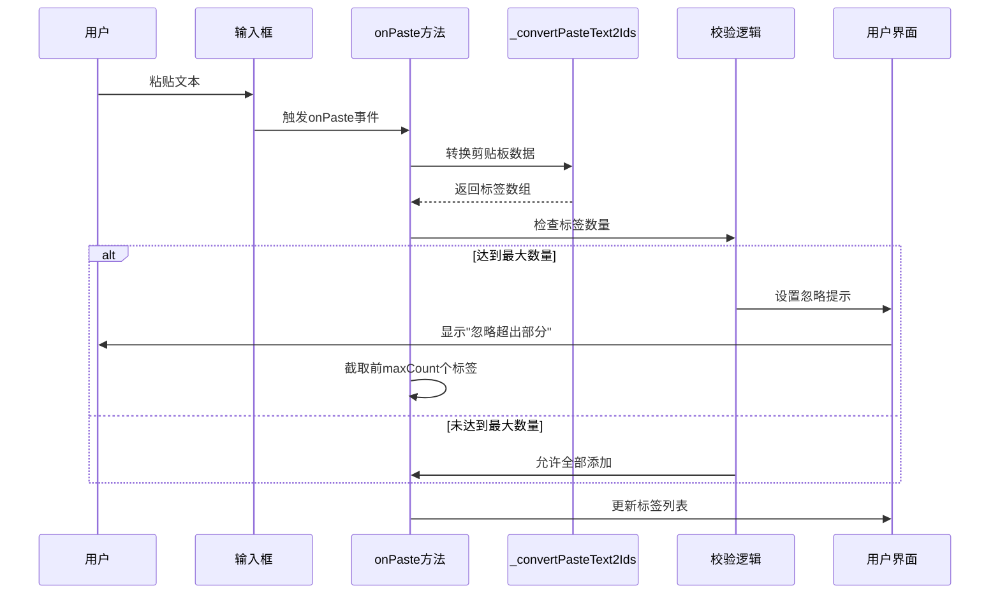
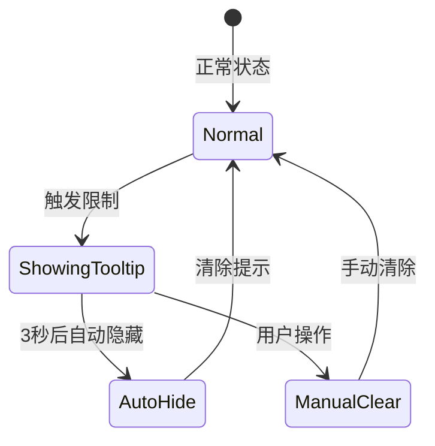
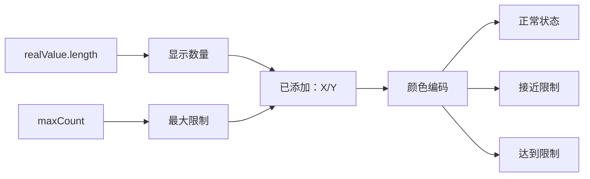
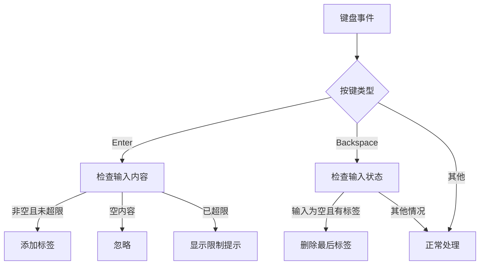
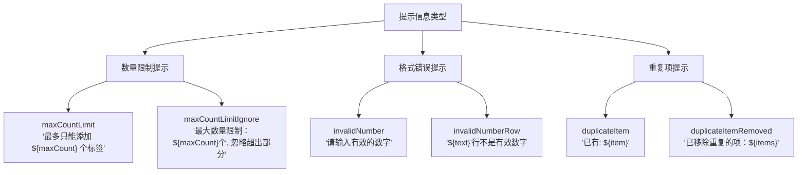

# TagsInput 组件最大数量限制功能详细文档

<cite>
**本文档中引用的文件**
- [index.tsx](file://src/TagsInput/index.tsx)
- [max-count.tsx](file://src/TagsInput/demo/max-count.tsx)
- [locale/index.ts](file://src/TagsInput/locale/index.ts)
- [style/index.ts](file://src/TagsInput/style/index.ts)
</cite>

## 目录
1. [概述](#概述)
2. [核心属性与配置](#核心属性与配置)
3. [最大数量限制机制](#最大数量限制机制)
4. [双重校验机制](#双重校验机制)
5. [视觉反馈系统](#视觉反馈系统)
6. [状态计数显示](#状态计数显示)
7. [交互行为分析](#交互行为分析)
8. [错误处理与提示](#错误处理与提示)
9. [最佳实践建议](#最佳实践建议)
10. [总结](#总结)

## 概述

TagsInput 组件的最大数量限制功能是一个重要的用户体验控制机制，它通过 `maxCount` 属性限制用户可以添加的标签数量。当标签数量达到预设上限时，组件会阻止新的标签添加，并通过视觉提示和状态反馈告知用户当前的限制情况。

该功能在多个场景下发挥重要作用：
- 防止用户输入过多标签导致界面混乱
- 控制数据存储和处理的性能开销
- 提供清晰的用户指导，避免误操作
- 维护数据结构的一致性和可预测性

## 核心属性与配置

### maxCount 属性定义



**图表来源**
- [index.tsx](file://src/TagsInput/index.tsx#L41-L56)

### 默认值与范围

- **默认最大数量**: 200 个标签
- **最小值**: 1（理论上，实际应用中通常设置为更合理的值）
- **最大值**: 无硬性限制，但建议根据具体业务需求设定合理范围

**章节来源**
- [index.tsx](file://src/TagsInput/index.tsx#L75-L76)

## 最大数量限制机制

### 核心实现原理

最大数量限制功能基于以下核心逻辑：



**图表来源**
- [index.tsx](file://src/TagsInput/index.tsx#L151-L156)
- [index.tsx](file://src/TagsInput/index.tsx#L201-L208)

### 实现细节分析

#### 1. 标签数量检查时机

最大数量检查在两个关键时机执行：

1. **实时检查**: 在添加新标签之前立即验证
2. **批量操作检查**: 在粘贴操作完成后进行最终验证

#### 2. 检查条件判断

```typescript
// 单个标签添加时的检查
if (realValue.length >= maxCount) {
    setInputTooltipTitle(
        locale.maxCountLimit.replace('${maxCount}', maxCount.toString())
    );
    return false;
}

// 粘贴操作后的检查
if (realValue.length >= maxCount) {
    setInputTooltipTitle(
        locale.maxCountLimitIgnore.replace('${maxCount}', maxCount.toString())
    );
    list = list.slice(0, maxCount);
}
```

**章节来源**
- [index.tsx](file://src/TagsInput/index.tsx#L151-L156)
- [index.tsx](file://src/TagsInput/index.tsx#L201-L208)

## 双重校验机制

### addTag 方法中的校验



**图表来源**
- [index.tsx](file://src/TagsInput/index.tsx#L124-L161)

### onPaste 回调中的校验



**图表来源**
- [index.tsx](file://src/TagsInput/index.tsx#L192-L214)

### 校验差异对比

| 校验类型 | 触发方式 | 处理策略 | 提示信息 |
|---------|---------|---------|---------|
| addTag | 手动输入回车 | 阻止添加，显示具体限制 | "最多只能添加 ${maxCount} 个标签" |
| onPaste | 粘贴操作 | 截取前maxCount个，忽略多余 | "最大数量限制：${maxCount}个, 忽略超出部分" |

**章节来源**
- [index.tsx](file://src/TagsInput/index.tsx#L151-L156)
- [index.tsx](file://src/TagsInput/index.tsx#L201-L208)

## 视觉反馈系统

### Tooltip 提示机制



**图表来源**
- [index.tsx](file://src/TagsInput/index.tsx#L247-L255)

### 提示信息动态生成

组件使用本地化字符串提供多语言支持：

```typescript
// 本地化配置示例
{
    maxCountLimit: '最大数量限制：${maxCount}个',
    maxCountLimitIgnore: '最大数量限制：${maxCount}个, 忽略超出部分'
}
```

### 视觉层次设计

1. **主输入框**: 当达到限制时，输入框可能呈现禁用状态或警告色
2. **状态指示器**: 显示当前标签数量和最大限制的比例
3. **工具提示**: 鼠标悬停时显示详细的限制说明

**章节来源**
- [locale/index.ts](file://src/TagsInput/locale/index.ts#L32-L33)

## 状态计数显示

### 数字格式化

组件在输入框右侧显示状态计数，格式为：`已添加：X/Y`



**图表来源**
- [index.tsx](file://src/TagsInput/index.tsx#L343-L345)

### 状态变化检测

```typescript
// 状态计数的渲染逻辑
<Typography.Text type="secondary">
    {realValue?.length}/{maxCount}
</Typography.Text>
```

### 视觉反馈等级

1. **正常状态**: 数字为常规颜色，表示有可用空间
2. **接近限制**: 数字可能变为警告色，提示用户注意剩余空间
3. **达到限制**: 数字可能变为危险色，明确表示无法添加更多标签

**章节来源**
- [index.tsx](file://src/TagsInput/index.tsx#L343-L345)

## 交互行为分析

### 键盘事件处理



**图表来源**
- [index.tsx](file://src/TagsInput/index.tsx#L164-L189)

### 粘贴操作特殊处理

粘贴操作具有特殊的处理逻辑：

1. **数据转换**: 将剪贴板文本转换为标签数组
2. **去重处理**: 使用 `Set` 去除重复标签
3. **截断处理**: 如果总数量超过限制，截取前 `maxCount` 个标签
4. **提示显示**: 显示忽略超出部分的提示信息

**章节来源**
- [index.tsx](file://src/TagsInput/index.tsx#L192-L214)

## 错误处理与提示

### 提示信息分类



**图表来源**
- [locale/index.ts](file://src/TagsInput/locale/index.ts#L32-L38)

### 自动清除机制

```typescript
// 自动清除提示的实现
useEffect(() => {
    if (inputTooltipTitle) {
        const timer = setTimeout(() => {
            setInputTooltipTitle('');
        }, 3000);
        return () => clearTimeout(timer);
    }
}, [inputTooltipTitle]);
```

### 错误恢复策略

1. **临时提示**: 3秒后自动消失，不影响用户操作
2. **状态重置**: 用户继续操作时自动清除错误状态
3. **操作保留**: 不影响已有的标签列表

**章节来源**
- [index.tsx](file://src/TagsInput/index.tsx#L247-L255)

## 最佳实践建议

### 开发者指南

1. **合理设置 maxCount 值**
   - 根据业务需求确定合适的限制值
   - 考虑用户体验，避免设置过小的值
   - 提供有意义的默认值

2. **本地化支持**
   - 确保所有提示信息都有对应的本地化版本
   - 考虑不同语言的文本长度差异
   - 提供清晰的翻译指导

3. **用户体验优化**
   - 在界面上明确显示最大数量限制
   - 提供直观的状态指示器
   - 设计友好的错误恢复流程

### 性能考虑

1. **大数据量处理**
   - 对于大量标签的场景，考虑虚拟化渲染
   - 优化标签数量检查的性能
   - 合理使用 memoization 技术

2. **内存管理**
   - 及时清理不再使用的提示信息
   - 避免内存泄漏
   - 优化状态更新频率

### 测试策略

1. **边界测试**
   - 测试刚好等于 maxCount 的情况
   - 测试超过 maxCount 的情况
   - 测试边界值附近的临界点

2. **交互测试**
   - 测试各种输入方式（键盘、粘贴、拖拽）
   - 验证提示信息的正确性
   - 检查状态同步的准确性

## 总结

TagsInput 组件的最大数量限制功能是一个精心设计的用户体验控制机制。它通过双重校验机制确保了数据的一致性，通过丰富的视觉反馈提供了良好的用户指导，通过智能的状态管理维持了界面的响应性。

### 核心优势

1. **一致性保证**: 确保标签数量始终在可控范围内
2. **用户体验**: 提供清晰的限制提示和状态反馈
3. **灵活性**: 支持多种输入方式和处理策略
4. **国际化**: 内置多语言支持，适应全球化需求

### 技术亮点

1. **双重校验**: addTag 和 onPaste 方法都包含数量检查
2. **智能截断**: 粘贴操作时自动截取前 maxCount 个标签
3. **自动清除**: 3秒后自动清除提示信息，不干扰用户操作
4. **状态同步**: 实时更新状态计数，保持界面信息准确

这个功能展示了现代前端组件设计中对用户体验和数据完整性平衡的优秀实践，为开发者提供了可靠而易用的标签输入解决方案。