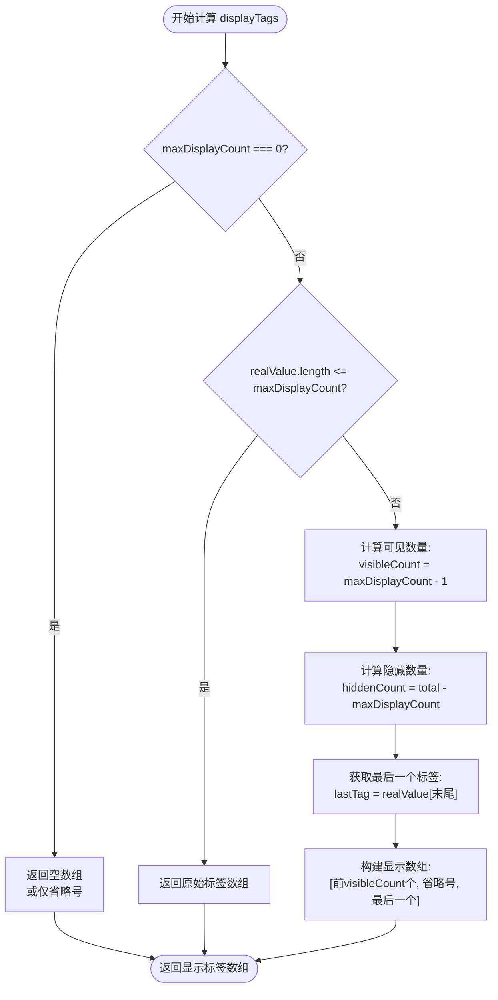
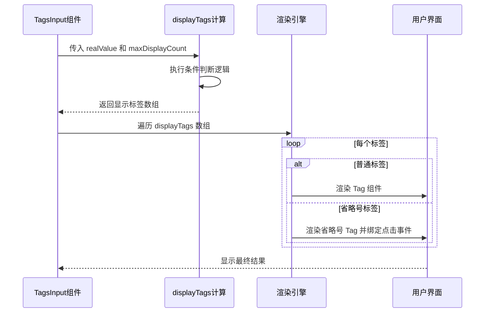
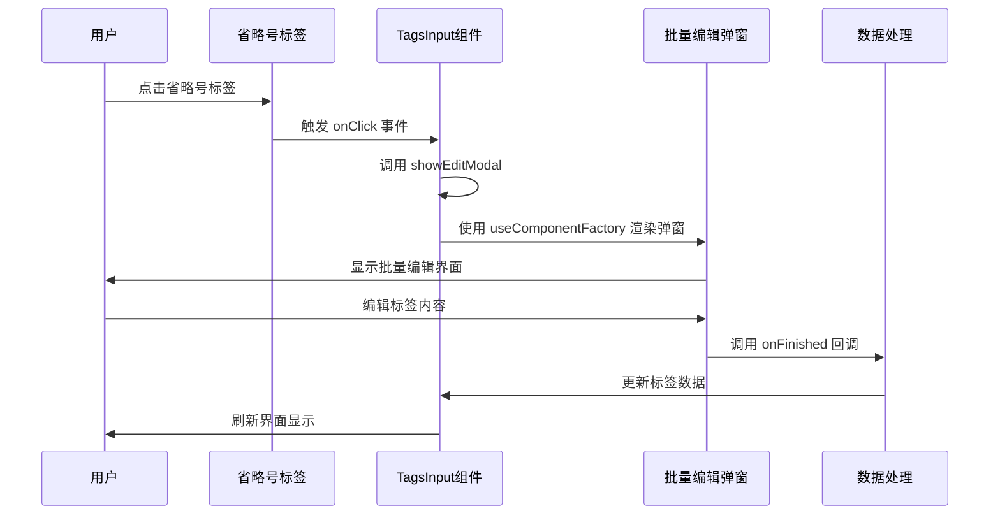

# TagsInput 组件最大显示数量功能详细文档

<cite>
**本文档中引用的文件**
- [src/TagsInput/index.tsx](file://src/TagsInput/index.tsx)
- [src/TagsInput/demo/max-display-count.tsx](file://src/TagsInput/demo/max-display-count.tsx)
- [src/TagsInput/style/index.ts](file://src/TagsInput/style/index.ts)
- [src/TagsInput/locale/index.ts](file://src/TagsInput/locale/index.ts)
- [src/hooks/useComponentFactory.tsx](file://src/hooks/useComponentFactory.tsx)
</cite>

## 目录
1. [简介](#简介)
2. [核心概念](#核心概念)
3. [maxDisplayCount 属性详解](#maxdisplaycount-属性详解)
4. [displayTags useMemo 计算逻辑](#displaytags-usememo-计算逻辑)
5. [视觉布局策略](#视觉布局策略)
6. [交互机制](#交互机制)
7. [实际应用场景](#实际应用场景)
8. [性能优化考虑](#性能优化考虑)
9. [总结](#总结)

## 简介

TagsInput 组件的最大显示数量功能是其核心特性之一，通过 `maxDisplayCount` 属性控制标签在界面上的显示数量。当标签数量超过指定阈值时，组件采用智能的视觉布局策略，通过省略号（...）来表示被隐藏的标签，同时提供批量编辑功能。

## 核心概念

### 显示标签类型定义

组件定义了两种标签类型：

```typescript
type DisplayTag<T extends 'text' | 'numeric'> =
  | TagType<T>           // 普通标签
  | { type: 'ellipsis'; count: number };  // 省略号标签
```

这种设计允许组件在同一渲染流程中处理不同类型的数据，实现灵活的视觉展示。

### 标签状态管理

组件维护两个关键的状态集合：
- `realValue`: 实际的标签数据数组
- `displayTags`: 经过 `maxDisplayCount` 处理后的显示标签数组

## maxDisplayCount 属性详解

### 默认值与配置

```typescript
maxDisplayCount = 2  // 默认显示前2个标签
```

### 属性行为规范

| maxDisplayCount 值 | 行为描述 | 视觉表现 |
|-------------------|----------|----------|
| `undefined` 或 `2` | 显示前2个标签，其余用省略号表示 | `[标签1, 标签2, ...N个]` |
| `3` | 显示前3个标签，其余用省略号表示 | `[标签1, 标签2, 标签3, ...N个]` |
| `0` | 只显示省略号，不显示任何具体标签 | `[...N个]` |
| `>= 实际标签数量` | 显示所有标签，无省略号 | `[标签1, 标签2, 标签3, ...]` |

**节源**
- [src/TagsInput/index.tsx](file://src/TagsInput/index.tsx#L76-L77)

## displayTags useMemo 计算逻辑

### 计算函数实现

组件使用 `useMemo` 钩子来优化性能，确保只有在依赖项变化时才重新计算显示标签：



**图表源**
- [src/TagsInput/index.tsx](file://src/TagsInput/index.tsx#L223-L245)

### 具体实现细节

#### maxDisplayCount = 0 特殊处理

当 `maxDisplayCount` 设置为 0 时，组件只显示省略号，表示所有标签都被隐藏：

```typescript
if (maxDisplayCount === 0) {
  return realValue.length > 0
    ? [{ type: 'ellipsis', count: realValue.length }]
    : [];
}
```

#### 正常情况下的标签分组

对于正常的 `maxDisplayCount` 值，组件采用以下策略：

1. **可见标签数量**: `maxDisplayCount - 1`
2. **隐藏标签数量**: `realValue.length - maxDisplayCount`
3. **保留顺序**: 始终保留第一个和最后一个标签，中间用省略号连接

**节源**
- [src/TagsInput/index.tsx](file://src/TagsInput/index.tsx#L223-L245)

## 视觉布局策略

### 标签渲染流程



**图表源**
- [src/TagsInput/index.tsx](file://src/TagsInput/index.tsx#L274-L306)

### 不同 maxDisplayCount 值的视觉差异

#### maxDisplayCount = 2

**输入**: ['标签1', '标签2', '标签3', '标签4', '标签5']
**输出**: ['标签1', '标签2', '...', '标签5']

#### maxDisplayCount = 3

**输入**: ['标签1', '标签2', '标签3', '标签4', '标签5']
**输出**: ['标签1', '标签2', '标签3', '...', '标签5']

#### maxDisplayCount = 0

**输入**: ['标签1', '标签2', '标签3', '标签4', '标签5']
**输出**: ['...', '5个']

### 样式设计原则

组件采用以下样式设计原则：

| 元素 | 样式类名 | 设计特点 |
|------|----------|----------|
| 省略号标签 | `.tags-input-ellipsis-tag` | 蓝色主题色，可点击 |
| 普通标签 | `.tags-input-tag-item` | 最大宽度限制，超出省略 |
| 整体容器 | `.tags-input-tags` | 弹性布局，自动换行 |

**节源**
- [src/TagsInput/style/index.ts](file://src/TagsInput/style/index.ts#L83-L115)

## 交互机制

### 省略号点击交互

当用户点击省略号标签时，会触发 `showEditModal` 函数，打开批量编辑弹窗：



**图表源**
- [src/TagsInput/index.tsx](file://src/TagsInput/index.tsx#L257-L265)

### 批量编辑功能

批量编辑弹窗提供了强大的标签管理功能：

#### 主要特性

1. **多行输入**: 支持通过换行符分隔多个标签
2. **类型验证**: 根据 `type` 属性验证输入格式
3. **去重处理**: 自动移除重复的标签
4. **数量限制**: 基于 `maxCount` 属性进行数量控制
5. **实时预览**: 显示当前行数和总数统计

#### 技术实现

批量编辑功能通过 `BatchInputModal` 组件实现，该组件继承了主组件的所有配置属性：

```typescript
renderModal(BatchInputModal<T>, {
  onFinished: updateTags,
  defaultValue: realValue,
  maxCount,
  size,
  type,
});
```

**节源**
- [src/TagsInput/index.tsx](file://src/TagsInput/index.tsx#L257-L265)
- [src/hooks/useComponentFactory.tsx](file://src/hooks/useComponentFactory.tsx#L43-L97)

## 实际应用场景

### 应用场景分类

#### 1. 空间受限的界面设计

**适用场景**: 导航栏、卡片摘要、表单字段
**优势**: 优雅地处理大量标签，保持界面整洁

#### 2. 数据概览展示

**适用场景**: 统计面板、搜索结果、筛选条件
**优势**: 提供快速概览，支持深度编辑

#### 3. 用户体验优化

**适用场景**: 设置面板、配置界面、高级选项
**优势**: 平衡简洁性和功能性

### 最佳实践建议

#### 性能考虑

1. **合理设置 maxDisplayCount**: 避免设置过小导致频繁显示省略号
2. **监控标签数量**: 对于可能包含大量标签的场景，考虑分页或虚拟化
3. **优化渲染频率**: 使用 `useMemo` 确保计算逻辑高效执行

#### 用户体验

1. **提供清晰的提示**: 使用 Tooltip 说明省略号的含义
2. **保持一致性**: 在相同场景下使用统一的 `maxDisplayCount` 值
3. **支持快速访问**: 确保批量编辑功能易于发现和使用

**节源**
- [src/TagsInput/demo/max-display-count.tsx](file://src/TagsInput/demo/max-display-count.tsx#L1-L42)

## 性能优化考虑

### useMemo 优化策略

组件使用 `useMemo` 来避免不必要的重新计算：

```typescript
const displayTags = useMemo((): DisplayTag<T>[] => {
  // 计算逻辑...
}, [realValue, maxDisplayCount]);
```

这种优化策略的优势：
- **减少计算开销**: 只有在 `realValue` 或 `maxDisplayCount` 变化时才重新计算
- **稳定 DOM 结构**: 相同的标签数组产生相同的 React key，提高渲染效率
- **内存优化**: 避免创建不必要的临时数组对象

### 渲染优化

1. **条件渲染**: 只有在有标签时才渲染标签区域
2. **事件委托**: 省略号标签的点击事件通过 React 事件系统处理
3. **样式缓存**: 使用 CSS-in-JS 的样式缓存机制

### 内存管理

1. **及时清理**: 组件卸载时自动清理定时器和事件监听器
2. **状态同步**: 确保 `realValue` 和 `displayTags` 的状态一致性
3. **避免循环引用**: 合理设计组件结构，避免内存泄漏

**节源**
- [src/TagsInput/index.tsx](file://src/TagsInput/index.tsx#L223-L245)
- [src/TagsInput/index.tsx](file://src/TagsInput/index.tsx#L247-L255)

## 总结

TagsInput 组件的最大显示数量功能是一个精心设计的用户体验解决方案。通过 `maxDisplayCount` 属性和 `displayTags` 的智能计算，组件实现了：

1. **优雅的空间利用**: 在有限的界面空间内展示尽可能多的信息
2. **清晰的视觉层次**: 通过省略号明确区分可见和隐藏的内容
3. **无缝的功能扩展**: 点击省略号即可进入批量编辑模式
4. **高性能的实现**: 通过 useMemo 和条件渲染确保良好的性能表现

这个功能不仅解决了技术上的挑战，更重要的是提升了用户的操作体验，体现了现代前端组件设计的最佳实践。开发者在使用时应该根据具体的业务场景合理配置 `maxDisplayCount` 值，并充分利用批量编辑功能来提升用户体验。