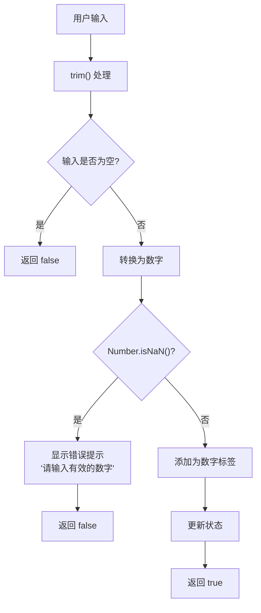
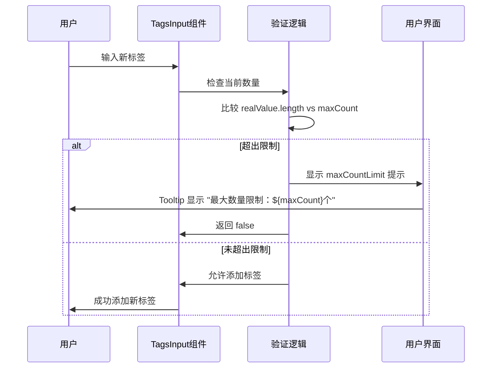
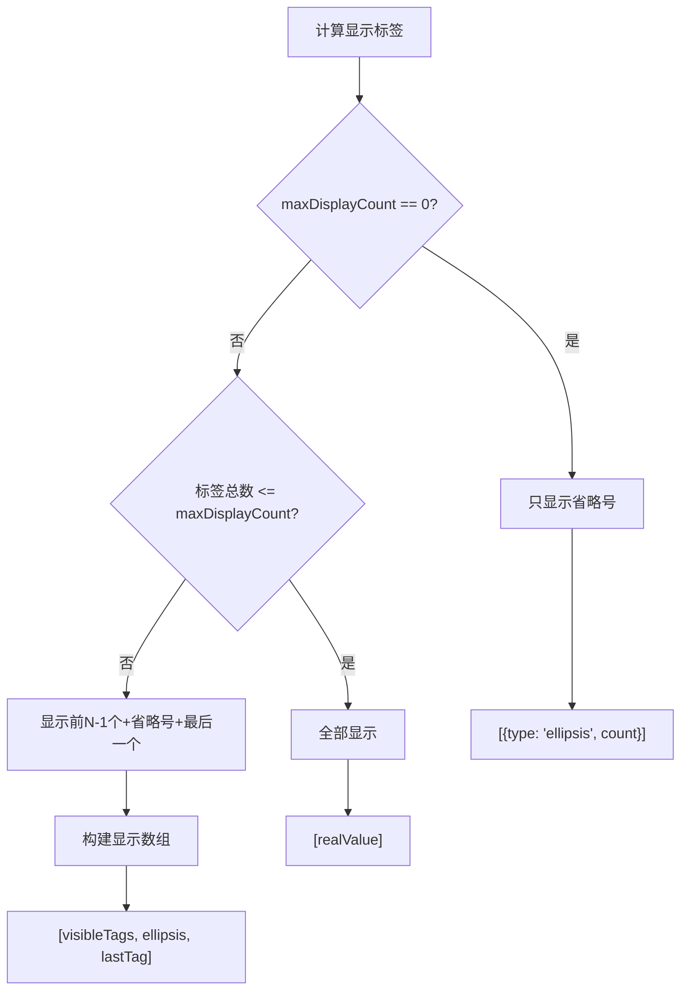
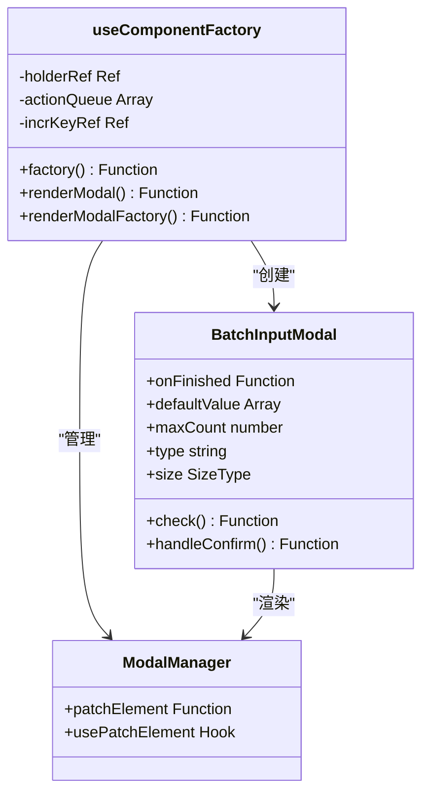
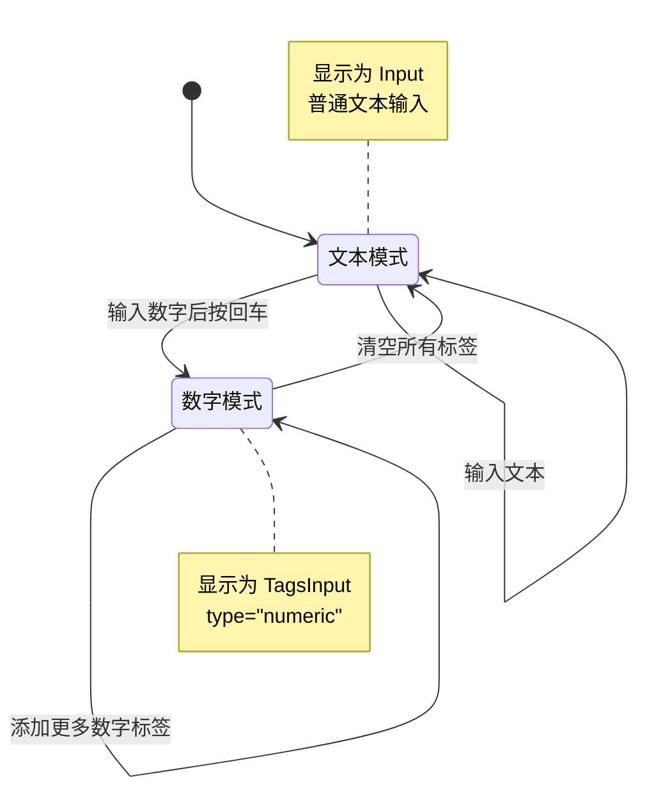
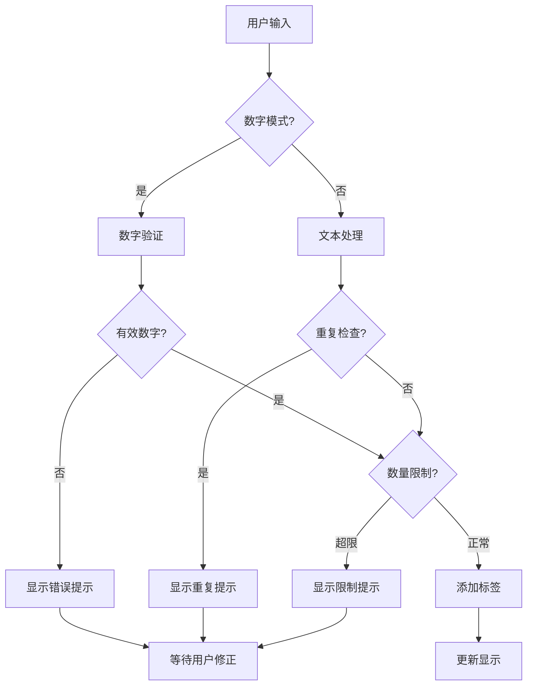
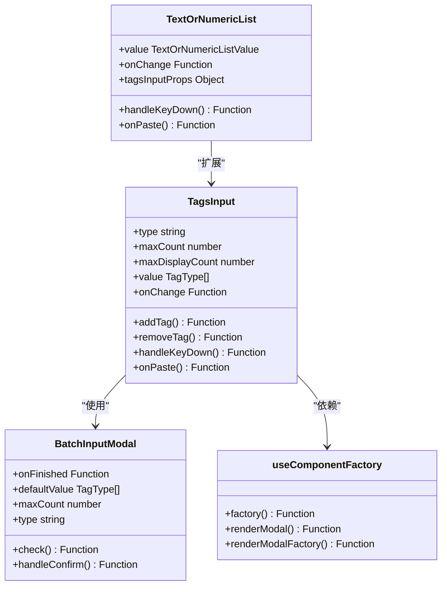

# 高级功能

<cite>
**本文档中引用的文件**
- [numeric.tsx](file://src/TagsInput/demo/numeric.tsx)
- [max-count.tsx](file://src/TagsInput/demo/max-count.tsx)
- [max-display-count.tsx](file://src/TagsInput/demo/max-display-count.tsx)
- [batch-input.tsx](file://src/TagsInput/demo/batch-input.tsx)
- [text-or-numeric-list.tsx](file://src/TagsInput/demo/text-or-numeric-list.tsx)
- [index.tsx](file://src/TagsInput/index.tsx)
- [useComponentFactory.tsx](file://src/hooks/useComponentFactory.tsx)
- [locale/index.ts](file://src/TagsInput/locale/index.ts)
- [style/index.ts](file://src/TagsInput/style/index.ts)
</cite>

## 目录
1. [概述](#概述)
2. [数字类型验证](#数字类型验证)
3. [数量限制机制](#数量限制机制)
4. [显示截断策略](#显示截断策略)
5. [批量输入功能](#批量输入功能)
6. [混合输入模式](#混合输入模式)
7. [功能组合使用场景](#功能组合使用场景)
8. [技术架构分析](#技术架构分析)
9. [性能优化考虑](#性能优化考虑)
10. [总结](#总结)

## 概述

TagsInput 组件提供了五种高级功能，每种功能都针对不同的使用场景进行了精心设计。这些功能包括数字类型验证、数量限制、显示截断、批量输入和混合输入模式，它们可以单独使用或组合使用，为用户提供灵活而强大的标签输入体验。

## 数字类型验证

### 自动数字校验机制

当设置 `type='numeric'` 时，TagsInput 组件会启用严格的数字验证机制。该机制的核心是基于 `Number.isNaN()` 的严格判断逻辑，确保只有有效的数字才能被添加为标签。

**图表来源**
- [index.tsx](file://src/TagsInput/index.tsx#L124-L160)

### 严格判断逻辑

组件使用 `Number.isNaN()` 而非 `isNaN()` 的严格判断，这是因为：
- `Number.isNaN()` 只有在参数本身就是 NaN 时才返回 true
- 它不会尝试将非数字类型转换为数字后再判断
- 这种严格性确保了数据类型的准确性

### 错误处理与提示

当输入无效数字时，组件会：
1. 显示 Tooltip 提示："请输入有效的数字"
2. 保持当前输入不变
3. 3秒后自动清除提示信息

**节来源**
- [index.tsx](file://src/TagsInput/index.tsx#L133-L139)
- [numeric.tsx](file://src/TagsInput/demo/numeric.tsx#L1-L25)

## 数量限制机制

### maxCount 参数控制

`maxCount` 参数用于限制标签的最大数量，当达到上限时会触发相应的限制机制。

**图表来源**
- [index.tsx](file://src/TagsInput/index.tsx#L150-L156)

### 限制提示机制

当达到最大数量限制时：
1. 显示具体的限制信息："最大数量限制：${maxCount}个"
2. 阻止新标签的添加
3. 3秒后自动清除提示

### 超出处理策略

对于粘贴操作，组件采用不同的处理策略：
- 如果超出限制，显示忽略提示："最大数量限制：${maxCount}个, 忽略超出部分"
- 自动截取前 maxCount 个标签
- 保持剩余内容在剪贴板中

**节来源**
- [index.tsx](file://src/TagsInput/index.tsx#L150-L156)
- [index.tsx](file://src/TagsInput/index.tsx#L199-L208)
- [max-count.tsx](file://src/TagsInput/demo/max-count.tsx#L1-L25)

## 显示截断策略

### maxDisplayCount 控制机制

`maxDisplayCount` 参数控制视觉上显示的标签数量，当超过这个数量时，组件会采用特殊的显示策略。

**图表来源**
- [index.tsx](file://src/TagsInput/index.tsx#L222-L245)

### 前 N-1 + 省略号 + 最后一个布局

当标签数量超过 `maxDisplayCount` 时，组件采用以下布局策略：
- 显示前 `maxDisplayCount - 1` 个标签
- 显示省略号标签，包含隐藏数量信息
- 显示最后一个标签

### 省略号交互逻辑

点击省略号标签会触发批量编辑模式：
1. 显示批量输入弹窗
2. 在弹窗中完整编辑所有标签
3. 编辑完成后更新原始标签列表

### 特殊情况处理

- 当 `maxDisplayCount = 0` 时，只显示省略号
- 当标签数量小于等于 `maxDisplayCount` 时，正常显示所有标签

**节来源**
- [index.tsx](file://src/TagsInput/index.tsx#L222-L245)
- [max-display-count.tsx](file://src/TagsInput/demo/max-display-count.tsx#L1-L42)

## 批量输入功能

### useComponentFactory Hook 架构

批量输入功能基于 `useComponentFactory` Hook 实现，这是一个通用的组件工厂模式，支持动态渲染和管理模态对话框。

**图表来源**
- [useComponentFactory.tsx](file://src/hooks/useComponentFactory.tsx#L29-L76)
- [index.tsx](file://src/TagsInput/index.tsx#L358-L531)

### 动态渲染机制

`useComponentFactory` 提供了三种主要功能：
1. **factory**: 直接渲染组件
2. **renderModal**: 创建模态对话框渲染函数
3. **renderModalFactory**: 返回延迟渲染的函数

### Modal 内部文本域处理

批量输入弹窗中的文本域具有以下特性：
- 支持多行文本输入
- 自动解析换行符生成标签数组
- 实时验证输入内容
- 显示行数统计信息

### 重复项自动去重

组件实现了智能的重复项检测和去重机制：
1. 在确认前检查重复项
2. 显示警告信息告知用户重复项
3. 自动过滤重复项后再提交
4. 保留原始输入供用户确认

**节来源**
- [index.tsx](file://src/TagsInput/index.tsx#L358-L531)
- [batch-input.tsx](file://src/TagsInput/demo/batch-input.tsx#L1-L39)

## 混合输入模式

### TextOrNumericList 智能切换

`TextOrNumericList` 组件实现了智能的输入模式切换，根据输入内容自动在文本模式和数字标签模式之间切换。

**图表来源**
- [index.tsx](file://src/TagsInput/index.tsx#L552-L669)

### 初始状态判断

组件根据以下条件判断初始显示模式：
1. **数字数组**: 直接显示为数字标签模式
2. **空字符串**: 显示为文本输入模式
3. **非空字符串**: 检查是否为数字，决定显示模式

### 模式切换逻辑

#### 从文本到数字模式
- 输入数字后按回车
- 自动验证输入是否为有效数字
- 切换到数字标签模式
- 保留输入内容作为第一个标签

#### 从数字到文本模式
- 清空所有数字标签
- 自动切换回文本输入模式
- 激活输入框焦点

### 粘贴功能增强

组件支持智能粘贴功能：
- 粘贴包含数字的内容时，自动解析为数字数组
- 粘贴纯文本时，保持文本输入模式
- 自动去重处理重复项

**节来源**
- [index.tsx](file://src/TagsInput/index.tsx#L552-L669)
- [text-or-numeric-list.tsx](file://src/TagsInput/demo/text-or-numeric-list.tsx#L1-L106)

## 功能组合使用场景

### 综合配置示例

以下是各种功能组合使用的最佳实践：

| 场景 | maxCount | maxDisplayCount | type | 特殊配置 |
|------|----------|-----------------|------|----------|
| 用户ID列表 | 10 | 3 | numeric | 限制用户数量，显示关键ID |
| 标签管理 | 50 | 5 | text | 支持大量标签，简化显示 |
| 价格区间 | 2 | 2 | numeric | 严格限制两个价格点 |
| 技能标签 | 20 | 8 | text | 平衡功能性和可用性 |

### 工作流程图

**图表来源**
- [index.tsx](file://src/TagsInput/index.tsx#L124-L160)

### 性能优化策略

1. **状态管理优化**: 使用 `useCallback` 和 `useMemo` 避免不必要的重新渲染
2. **批量操作**: 粘贴操作一次性处理所有内容
3. **延迟渲染**: 使用 `useComponentFactory` 实现按需渲染
4. **内存管理**: 及时清理定时器和事件监听器

## 技术架构分析

### 核心组件结构

**图表来源**
- [index.tsx](file://src/TagsInput/index.tsx#L41-L81)
- [index.tsx](file://src/TagsInput/index.tsx#L358-L531)
- [index.tsx](file://src/TagsInput/index.tsx#L552-L669)

### 数据流管理

组件采用受控和非受控两种模式：
- **受控模式**: 由父组件管理状态，通过 `value` 和 `onChange` 属性
- **非受控模式**: 组件内部维护状态，默认值通过 `defaultValue` 设置

### 国际化支持

组件提供完整的国际化支持，包括：
- 多语言文本资源
- 动态占位符替换
- 本地化格式化

**节来源**
- [index.tsx](file://src/TagsInput/index.tsx#L67-L81)
- [locale/index.ts](file://src/TagsInput/locale/index.ts#L1-L47)

## 性能优化考虑

### 渲染优化

1. **虚拟化**: 对于大量标签，考虑使用虚拟滚动
2. **防抖处理**: 输入事件使用防抖避免频繁更新
3. **记忆化**: 关键计算使用 `useMemo` 缓存结果

### 内存管理

1. **定时器清理**: 自动清除 Tooltip 显示定时器
2. **事件解绑**: 组件卸载时清理事件监听器
3. **引用管理**: 合理使用 React 引用避免内存泄漏

### 用户体验优化

1. **即时反馈**: 输入时立即显示验证结果
2. **错误提示**: 清晰的错误信息引导用户修正
3. **无障碍支持**: 完整的键盘导航和屏幕阅读器支持

## 总结

TagsInput 组件的五大高级功能构成了一个功能完备的标签输入解决方案：

1. **数字类型验证**确保数据准确性
2. **数量限制机制**防止过度使用
3. **显示截断策略**优化界面可用性
4. **批量输入功能**提升效率
5. **混合输入模式**提供灵活性

这些功能相互协作，为开发者提供了强大而易用的标签输入组件。通过合理的配置和组合使用，可以在各种应用场景中实现优秀的用户体验。

组件的设计充分考虑了性能、可维护性和用户体验，采用了现代 React 开发的最佳实践，包括 Hooks、Context、TypeScript 类型安全等。这使得组件不仅功能强大，而且易于扩展和定制。