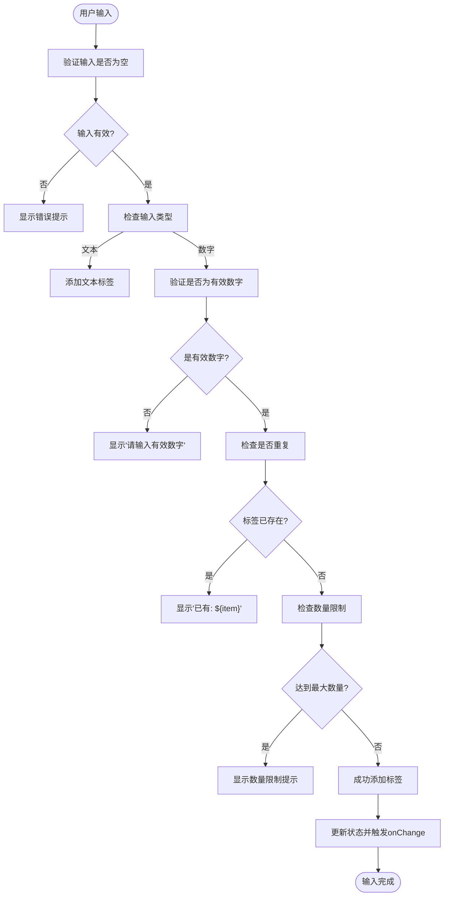
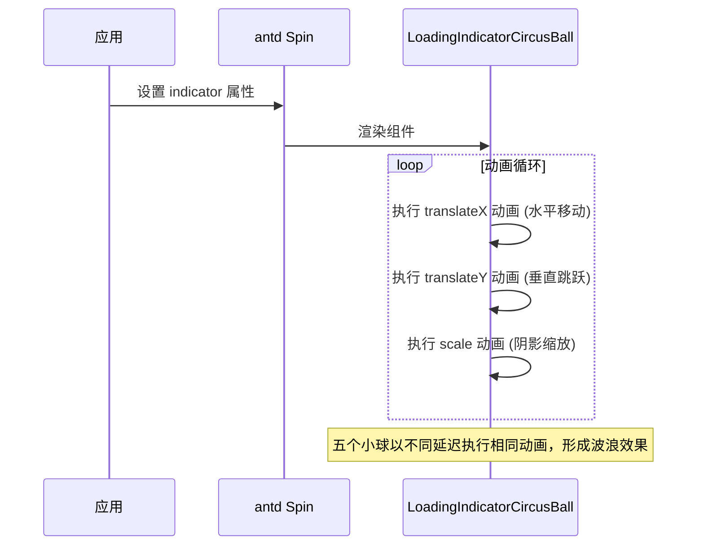

# 组件库

<cite>
**本文档引用的文件**  
- [README.md](file://README.md)
- [package.json](file://package.json)
- [src/index.ts](file://src/index.ts)
- [src/typings.d.ts](file://src/typings.d.ts)
- [src/TagsInput/index.tsx](file://src/TagsInput/index.tsx)
- [src/TagsInput/style/index.ts](file://src/TagsInput/style/index.ts)
- [src/TagsInput/locale/index.ts](file://src/TagsInput/locale/index.ts)
- [src/Sheet/index.tsx](file://src/Sheet/index.tsx)
- [src/Sheet/style/index.ts](file://src/Sheet/style/index.ts)
- [src/LoadingIndicatorCircusBall/index.tsx](file://src/LoadingIndicatorCircusBall/index.tsx)
- [src/LoadingIndicatorCircusBall/useStyle.ts](file://src/LoadingIndicatorCircusBall/useStyle.ts)
- [src/hooks/useComponentFactory.tsx](file://src/hooks/useComponentFactory.tsx)
- [src/utils/formRule.ts](file://src/utils/formRule.ts)
- [src/index.md](file://src/index.md)
- [src/TagsInput/index.md](file://src/TagsInput/index.md)
- [src/Sheet/index.md](file://src/Sheet/index.md)
- [src/LoadingIndicatorCircusBall/index.md](file://src/LoadingIndicatorCircusBall/index.md)
</cite>

## 目录

1. [简介](#简介)
2. [核心组件概览](#核心组件概览)
3. [共同特性](#共同特性)
4. [目录结构与开发规范](#目录结构与开发规范)
5. [总结与导航](#总结与导航)

## 简介

`antd-ext` 是一个基于 `dumi` 构建的 React 组件库，旨在对 Ant Design 进行功能增强与补充。该组件库兼容 React 16 至 19 版本，严格遵循 Ant Design 的设计规范，同时支持国际化与主题定制，致力于提升开发效率和用户体验。通过提供一系列高复用性的业务组件和增强型 UI 组件，`antd-ext` 解决了标准 Ant Design 在复杂业务场景下的功能缺失问题。

**Section sources**
- [README.md](file://README.md#L1-L42)

## 核心组件概览

`antd-ext` 提供了多个精心设计的 UI 组件，每个组件都针对特定的业务场景和用户痛点进行了优化。以下是三个核心组件的详细介绍。

### TagsInput：复杂标签输入场景的解决方案

`TagsInput` 组件专为处理复杂的标签输入需求而设计，解决了传统输入框在管理多个标签时的交互繁琐、易出错等问题。

**设计初衷与解决的问题**：
在许多业务系统中，用户需要输入多个标签（如关键词、ID列表、分类等）。原生的输入方式（如逗号分隔）体验差，难以编辑和删除单个标签。`TagsInput` 通过可视化标签、批量输入、数量限制等功能，极大地提升了此类场景的用户体验。

**核心功能**：
- **受控与非受控模式**：支持 `value` 和 `onChange` 实现完全受控，也支持 `defaultValue` 用于非受控场景。
- **类型安全**：通过泛型 `T extends 'text' | 'numeric'` 支持文本和数字两种类型，并对数字类型进行有效性验证。
- **批量输入**：内置弹窗支持用户一次性粘贴或输入多行数据，极大提升批量操作效率。
- **智能粘贴**：支持从 Excel 等表格软件复制多行数据并自动解析为标签。
- **数量控制**：`maxCount` 限制最大标签数量，`maxDisplayCount` 控制界面上显示的标签数量，超出部分以省略号显示。
- **国际化支持**：所有提示文本（如占位符、错误信息、按钮文字）均可通过 `ConfigProvider` 进行本地化配置。



**Diagram sources**
- [src/TagsInput/index.tsx](file://src/TagsInput/index.tsx#L64-L355)
- [src/TagsInput/locale/index.ts](file://src/TagsInput/locale/index.ts#L1-L47)

**Section sources**
- [src/TagsInput/index.tsx](file://src/TagsInput/index.tsx#L1-L707)
- [src/TagsInput/index.md](file://src/TagsInput/index.md#L1-L145)

### Sheet：简化表格封装

`Sheet` 组件是一个轻量级的封装，旨在简化 `antd` 的 `Table` 组件的使用，并为其提供统一的样式定制能力。

**设计初衷与解决的问题**：
虽然 `antd` 的 `Table` 组件功能强大，但在实际项目中，开发者常常需要为其内部的 `Input`、`Select` 等表单控件进行样式微调，以确保整体视觉风格的统一。`Sheet` 通过一个简单的封装，解决了在表格单元格中嵌入表单控件时的样式一致性问题。

**核心功能**：
- **无缝继承**：`Sheet` 本质上是 `Table` 的一个包装器，它继承了 `Table` 的所有 `props`，使用方式与 `Table` 完全一致。
- **样式集成**：其样式文件 `style/index.ts` 会自动引入并应用 `inputNumberStyle` 和 `selectStyle` 等预设样式，确保表格内的 `InputNumber` 和 `Select` 组件与表格本身风格协调。
- **主题定制**：支持通过 `ConfigProvider` 的 `theme.components.Sheet` 进行主题定制，尽管当前接口为空，但为未来的扩展预留了空间。

```mermaid
classDiagram
class Sheet {
+render() : ReactNode
}
class Table {
<<Component>>
}
Sheet --> Table : "包装/继承"
note right of Sheet
Sheet 组件通过包装 antd 的 Table 组件
实现了对表格内嵌表单控件的样式统一
end note
```

**Diagram sources**
- [src/Sheet/index.tsx](file://src/Sheet/index.tsx#L1-L22)
- [src/Sheet/style/index.ts](file://src/Sheet/style/index.ts#L1-L33)

**Section sources**
- [src/Sheet/index.tsx](file://src/Sheet/index.tsx#L1-L22)
- [src/Sheet/index.md](file://src/Sheet/index.md#L1-L11)

### LoadingIndicatorCircusBall：个性化加载动画

`LoadingIndicatorCircusBall` 组件提供了一个富有创意和趣味性的加载指示器，通过五个彩色小球的动画模拟马戏团表演，为应用增添活力。

**设计初衷与解决的问题**：
标准的加载动画（如旋转圆圈）往往显得单调乏味。`LoadingIndicatorCircusBall` 旨在打破这种沉闷，通过一个生动、有趣的动画来提升应用的视觉吸引力和用户友好度，特别适用于面向消费者或需要营造轻松氛围的应用场景。

**核心功能**：
- **马戏团风格动画**：五个不同颜色的小球以交错的延迟进行跳跃和水平移动，创造出波浪般的动态效果。
- **多种尺寸**：支持 `small`、`default`、`large` 三种尺寸，适应不同场景。
- **与 Spin 集成**：可直接作为 `antd` 的 `Spin` 组件的 `indicator` 属性，轻松替换默认的加载图标。
- **深度主题定制**：支持通过 `ConfigProvider` 完全定制五个小球的颜色和阴影颜色，实现品牌色的完美融合。



**Diagram sources**
- [src/LoadingIndicatorCircusBall/index.tsx](file://src/LoadingIndicatorCircusBall/index.tsx#L1-L47)
- [src/LoadingIndicatorCircusBall/useStyle.ts](file://src/LoadingIndicatorCircusBall/useStyle.ts#L1-L345)

**Section sources**
- [src/LoadingIndicatorCircusBall/index.tsx](file://src/LoadingIndicatorCircusBall/index.tsx#L1-L47)
- [src/LoadingIndicatorCircusBall/index.md](file://src/LoadingIndicatorCircusBall/index.md#L1-L80)

## 共同特性

`antd-ext` 的所有组件都遵循一套统一的设计原则和技术规范，确保了库的整体性和易用性。

### 受控模式 (Controlled Mode)
所有组件都优先支持受控模式，通过 `value` 和 `onChange` 的组合，让父组件能够完全掌控组件的状态，这符合 React 的最佳实践，便于状态管理和表单集成。

### TypeScript 类型推导
整个库使用 TypeScript 编写，提供了完整的类型定义。组件的 `props` 接口（如 `TagsInputProps`, `SheetProps`）都经过精确的类型声明，确保了开发过程中的类型安全和智能提示。

### ConfigProvider 统一配置
所有组件都支持通过 `antd` 的 `ConfigProvider` 进行全局配置。这体现在两个层面：
1.  **国际化**：通过在 `typings.d.ts` 中扩展 `antd/es/locale` 模块，将各组件的 `locale` 接口注入到全局 `Locale` 类型中，使得 `ConfigProvider` 的 `locale` 属性可以配置所有 `antd-ext` 组件的文本。
2.  **主题定制**：通过在 `typings.d.ts` 中扩展 `antd/es/theme/interface/components` 模块，将各组件的 `ComponentToken` 注入到 `ComponentTokenMap` 中，使得 `ConfigProvider` 的 `theme.components` 可以定制所有 `antd-ext` 组件的样式变量。

```mermaid
graph TB
subgraph "antd-ext 组件"
A[TagsInput]
B[Sheet]
C[LoadingIndicatorCircusBall]
end
subgraph "ConfigProvider"
D[ConfigProvider]
end
D --> A : 通过 locale 配置国际化
D --> B : 通过 locale 配置国际化
D --> C : 通过 locale 配置国际化
D --> A : 通过 theme.components 配置主题
D --> B : 通过 theme.components 配置主题
D --> C : 通过 theme.components 配置主题
style D fill:#f9f,stroke:#333
style A fill:#bbf,stroke:#333
style B fill:#bbf,stroke:#333
style C fill:#bbf,stroke:#333
```

**Diagram sources**
- [src/typings.d.ts](file://src/typings.d.ts#L1-L34)
- [src/index.ts](file://src/index.ts#L1-L7)

**Section sources**
- [src/typings.d.ts](file://src/typings.d.ts#L1-L34)

## 目录结构与开发规范

理解 `antd-ext` 的源码组织方式对于二次开发和贡献代码至关重要。

### 目录结构
项目的 `src` 目录采用**组件驱动**的组织方式：
- 每个组件（如 `TagsInput`, `Sheet`, `LoadingIndicatorCircusBall`）拥有独立的文件夹。
- 每个组件文件夹内包含：
  - `index.tsx`：组件的主入口文件。
  - `index.md`：该组件的文档文件，由 `dumi` 解析生成文档页面。
  - `demo/`：存放该组件的演示代码（`.tsx` 文件）。
  - `style/`：存放该组件的样式定义（`.ts` 文件）。
  - `locale/`：存放该组件的国际化文本（`.ts` 文件）。
- `hooks/` 和 `utils/` 目录存放跨组件复用的自定义 Hook 和工具函数。

### 开发规范
- **样式**：使用 `antd` 的 `@ant-design/cssinjs` 和 `genStyleHooks` API 来编写样式，确保与 `antd` 主题系统的无缝集成。
- **国际化**：遵循 `antd` 的 `useLocale` 模式，将组件的 `locale` 接口通过 TypeScript 模块扩展注入全局。
- **构建**：使用 `father` 进行构建，`dumi` 进行文档生成，`husky` 和 `lint-staged` 进行代码提交前的校验。

**Section sources**
- [package.json](file://package.json#L20-L34)
- [src/index.ts](file://src/index.ts#L1-L7)

## 总结与导航

`antd-ext` 组件库通过 `TagsInput`、`Sheet` 和 `LoadingIndicatorCircusBall` 等核心组件，有效解决了复杂标签输入、表格内控件样式统一和加载动画个性化等实际问题。其统一的受控模式、强大的 TypeScript 支持以及与 `ConfigProvider` 的深度集成，确保了库的高质量和易用性。

本总览文档为理解 `antd-ext` 奠定了基础。接下来，您可以参考各个组件目录下的 `index.md` 文件，获取更详细的 API 文档和使用示例。

**Section sources**
- [README.md](file://README.md#L1-L42)
- [src/index.md](file://src/index.md#L1-L4)