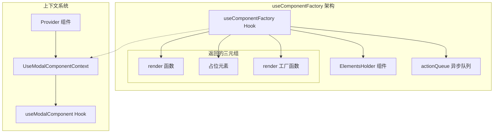
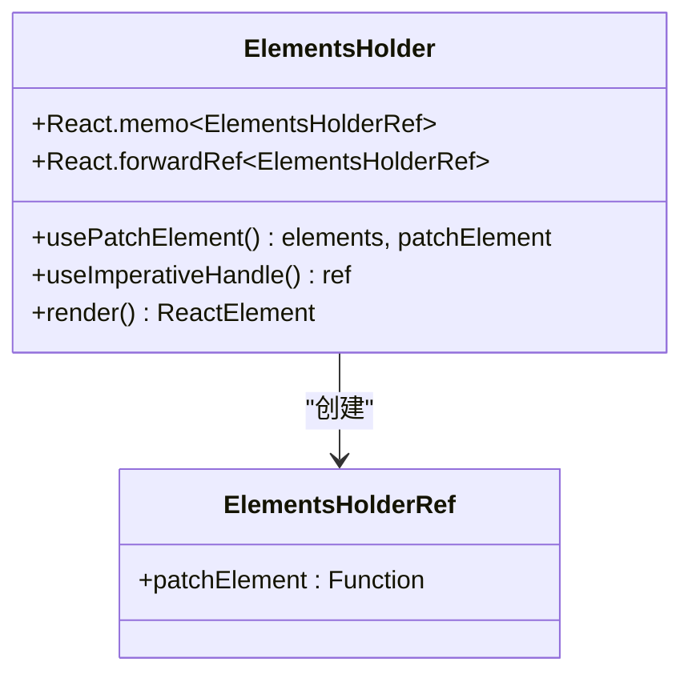
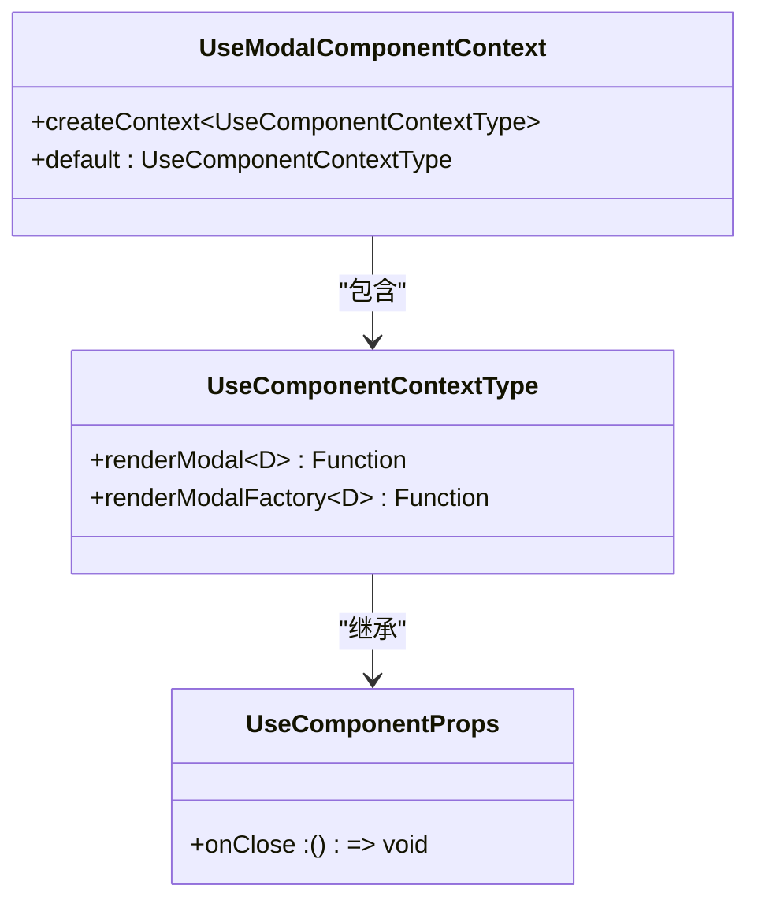
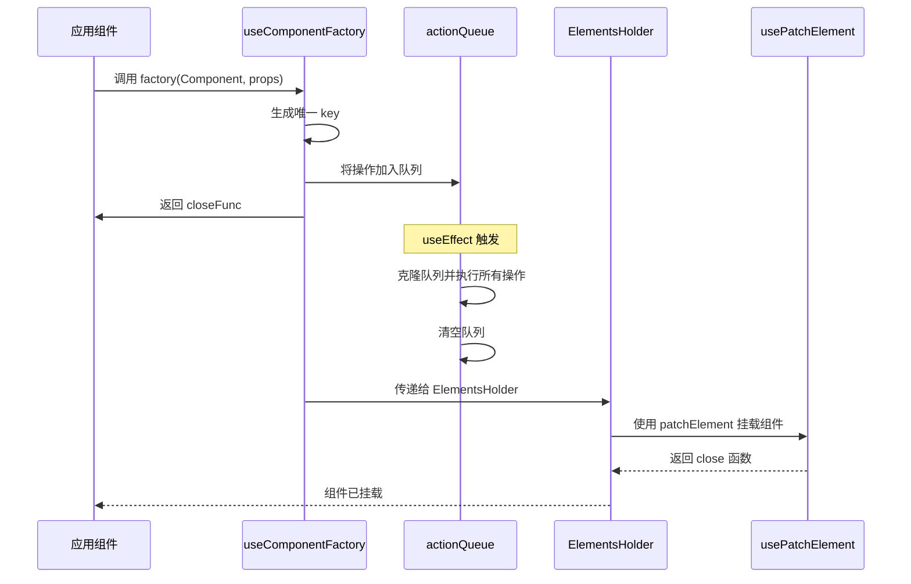
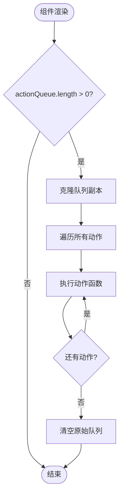
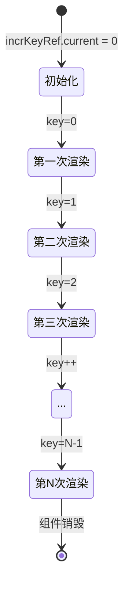
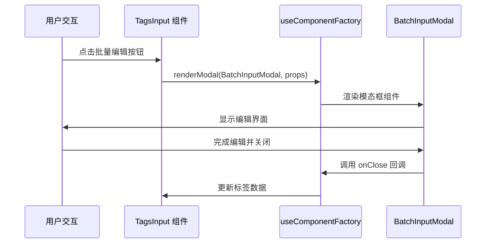
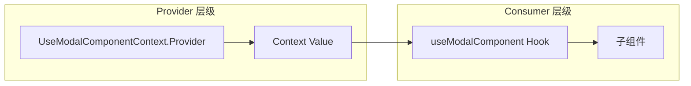

# useComponentFactory - 动态组件渲染工厂

<cite>
**本文档中引用的文件**
- [useComponentFactory.tsx](file://src/hooks/useComponentFactory.tsx)
- [TagsInput/index.tsx](file://src/TagsInput/index.tsx)
- [hooks/index.ts](file://src/hooks/index.ts)
</cite>

## 目录
1. [简介](#简介)
2. [核心架构](#核心架构)
3. [主要组件分析](#主要组件分析)
4. [工作原理详解](#工作原理详解)
5. [使用示例](#使用示例)
6. [上下文系统](#上下文系统)
7. [最佳实践](#最佳实践)
8. [常见问题与解决方案](#常见问题与解决方案)
9. [性能优化建议](#性能优化建议)
10. [总结](#总结)

## 简介

`useComponentFactory` 是一个强大的 React Hook，专门用于动态渲染临时组件（如 Modal、Drawer 等）。它提供了三种核心功能：直接渲染函数、占位元素和渲染工厂函数，能够智能地处理组件的动态挂载和卸载，特别适用于需要临时显示对话框、模态框等场景的应用程序。

该 Hook 基于 Ant Design 的 `usePatchElement` 钩子构建，实现了异步队列机制和 key 自增机制，确保组件的正确渲染和内存管理。

## 核心架构



**图表来源**
- [useComponentFactory.tsx](file://src/hooks/useComponentFactory.tsx#L29-L76)

## 主要组件分析

### ElementsHolder 组件

`ElementsHolder` 是一个内部组件，负责管理动态渲染的元素：



**图表来源**
- [useComponentFactory.tsx](file://src/hooks/useComponentFactory.tsx#L8-L17)

### 核心接口定义

Hook 定义了几个关键接口来确保类型安全：



**图表来源**
- [useComponentFactory.tsx](file://src/hooks/useComponentFactory.tsx#L20-L110)

**章节来源**
- [useComponentFactory.tsx](file://src/hooks/useComponentFactory.tsx#L1-L110)

## 工作原理详解

### 三元组返回机制

`useComponentFactory` 返回一个包含三个元素的数组：

1. **render 函数** (`factory`)：直接渲染组件的核心函数
2. **占位元素** (`<ElementsHolder />`)：用于挂载动态组件的容器
3. **render 工厂函数** (`renderModalFactory`)：返回延迟渲染函数的工厂



**图表来源**
- [useComponentFactory.tsx](file://src/hooks/useComponentFactory.tsx#L36-L45)
- [useComponentFactory.tsx](file://src/hooks/useComponentFactory.tsx#L48-L61)

### 异步队列机制

Hook 使用 `actionQueue` 来处理异步渲染操作：



**图表来源**
- [useComponentFactory.tsx](file://src/hooks/useComponentFactory.tsx#L36-L45)

### Key 自增机制

为了避免重复渲染和确保组件的唯一性，Hook 使用 `incrKeyRef` 来生成递增的 key：



**图表来源**
- [useComponentFactory.tsx](file://src/hooks/useComponentFactory.tsx#L47-L51)

**章节来源**
- [useComponentFactory.tsx](file://src/hooks/useComponentFactory.tsx#L29-L76)

## 使用示例

### 基础使用示例

以下是一个完整的使用示例，展示如何渲染一个带有 onClose 回调的临时组件：

```typescript
// 基本使用模式
const [renderModal, components] = useComponentFactory();

// 在组件中使用
const showModal = () => {
  renderModal(MyModalComponent, {
    title: '标题',
    content: '内容',
    onClose: () => console.log('Modal closed'),
    // 其他自定义属性
  });
};
```

### TagsInput 组件中的实际应用

在 TagsInput 组件中，展示了如何在上下文中使用 `useComponentFactory`：



**图表来源**
- [TagsInput/index.tsx](file://src/TagsInput/index.tsx#L257-L265)

### 上下文集成示例

```typescript
// 在应用根组件中设置 Provider
function App() {
  const [renderModal, components, renderModalFactory] = useComponentFactory();
  
  return (
    <UseModalComponentContext.Provider value={{
      renderModal,
      renderModalFactory
    }}>
      {/* 应用组件树 */}
      {components}
    </UseModalComponentContext.Provider>
  );
}

// 在子组件中使用
function ChildComponent() {
  const { renderModal } = useModalComponent();
  
  const handleClick = () => {
    renderModal(CustomModal, {
      // 模态框配置
    });
  };
  
  return <button onClick={handleClick}>打开模态框</button>;
}
```

**章节来源**
- [TagsInput/index.tsx](file://src/TagsInput/index.tsx#L82-L83)
- [TagsInput/index.tsx](file://src/TagsInput/index.tsx#L257-L265)

## 上下文系统

### UseModalComponentContext 设计

`UseModalComponentContext` 是一个 React Context，用于在整个应用中共享 `useComponentFactory` 的功能：



**图表来源**
- [useComponentFactory.tsx](file://src/hooks/useComponentFactory.tsx#L90-L97)

### 约束条件

`useModalComponent` Hook 必须在 `UseModalComponentContext.Provider` 内部调用，否则会抛出错误：

```typescript
// 错误用法 - 会抛出异常
function WrongComponent() {
  const { renderModal } = useModalComponent(); // Error: Not UseModalComponentContext.Provider
  
  return <div>...</div>;
}

// 正确用法
function CorrectComponent() {
  return (
    <UseModalComponentContext.Provider value={contextValue}>
      <ChildComponent />
    </UseModalComponentContext.Provider>
  );
}
```

**章节来源**
- [useComponentFactory.tsx](file://src/hooks/useComponentFactory.tsx#L90-L110)

## 最佳实践

### 1. 正确的上下文使用

始终在应用的顶层设置 `UseModalComponentContext.Provider`：

```typescript
// 推荐：在应用根组件中设置
function RootComponent() {
  const [renderModal, components, renderModalFactory] = useComponentFactory();
  
  return (
    <UseModalComponentContext.Provider value={{
      renderModal,
      renderModalFactory
    }}>
      <AppRoutes />
      {components} {/* 必须包含占位元素 */}
    </UseModalComponentContext.Provider>
  );
}
```

### 2. 避免在 render 函数中内联对象

```typescript
// ❌ 不推荐：在 render 函数中创建新对象
const handleClick = () => {
  renderModal(MyModal, {
    data: { /* 新对象 */ }, // 每次都会创建新对象
    onClose: () => {}
  });
};

// ✅ 推荐：提前定义对象
const modalData = { /* 对象内容 */ };
const handleClose = () => {};
const handleClick = () => {
  renderModal(MyModal, {
    data: modalData,
    onClose: handleClose
  });
};
```

### 3. 合理使用 render 工厂函数

```typescript
// ✅ 推荐：使用 render 工厂函数进行延迟渲染
const createModalRenderer = (props) => {
  return renderModalFactory(MyModal, props);
};

// 在事件处理中使用
const handleClick = createModalRenderer({ title: '动态标题' });
```

### 4. 确保 onClose 回调的正确性

```typescript
// ✅ 推荐：确保 onClose 回调的安全调用
const handleOpenModal = () => {
  renderModal(MyModal, {
    onClose: () => {
      // 确保回调函数存在
      props.onSuccess?.();
      // 其他清理逻辑
    }
  });
};
```

## 常见问题与解决方案

### 1. onClose 不触发的问题

**问题描述**：模态框关闭后，onClose 回调没有被调用。

**解决方案**：
- 确保组件正确传递了 onClose 属性
- 检查组件内部是否正确调用了 props.onClose()
- 验证 useComponentFactory 的正确使用

```typescript
// 检查组件内部实现
function MyModal({ onClose }) {
  const handleClose = () => {
    // 确保调用父组件的回调
    onClose?.();
  };
  
  return (
    <Modal
      open={true}
      onCancel={handleClose}
      // 其他属性...
    />
  );
}
```

### 2. 重复挂载的问题

**问题描述**：同一个组件被多次挂载。

**解决方案**：
- 使用 key 自增机制确保唯一性
- 检查 actionQueue 的异步处理
- 避免在短时间内频繁调用 render 函数

```typescript
// ✅ 推荐：使用防抖或节流
const debouncedRender = useCallback(debounce(renderModal, 100), [renderModal]);

// 或者使用状态控制
const [isModalVisible, setIsModalVisible] = useState(false);

const showModal = () => {
  if (!isModalVisible) {
    setIsModalVisible(true);
    renderModal(MyModal, {
      onClose: () => {
        setIsModalVisible(false);
      }
    });
  }
};
```

### 3. 内存泄漏问题

**问题描述**：动态组件未正确卸载导致内存泄漏。

**解决方案**：
- 确保 onClose 回调正确执行
- 使用正确的组件销毁时机
- 避免在组件中创建循环引用

```typescript
// ✅ 推荐：确保清理副作用
function MyModal({ onClose }) {
  useEffect(() => {
    // 设置清理函数
    return () => {
      // 清理逻辑
    };
  }, []);
  
  return <Modal onCancel={onClose} />;
}
```

### 4. 上下文未正确设置

**问题描述**：useModalComponent 抛出 "Not UseModalComponentContext.Provider" 错误。

**解决方案**：
- 确保在应用根层级设置了 Provider
- 检查 Provider 的 value 是否正确
- 验证组件树结构

```typescript
// ✅ 推荐：完整的 Provider 设置
function App() {
  const [renderModal, components, renderModalFactory] = useComponentFactory();
  
  return (
    <UseModalComponentContext.Provider value={{
      renderModal,
      renderModalFactory
    }}>
      <Router>
        <Routes>
          <Route path="/" element={<Home />} />
          {/* 其他路由 */}
        </Routes>
      </Router>
      {components} {/* 必须包含占位元素 */}
    </UseModalComponentContext.Provider>
  );
}
```

## 性能优化建议

### 1. 避免不必要的重新渲染

```typescript
// ✅ 推荐：使用 useCallback 缓存回调函数
const handleModalClose = useCallback(() => {
  // 处理关闭逻辑
}, []);

const handleModalOpen = useCallback(() => {
  renderModal(MyModal, {
    onClose: handleModalClose
  });
}, [renderModal, handleModalClose]);
```

### 2. 合理使用 memoization

```typescript
// ✅ 推荐：对大型组件使用 memoization
const MemoizedModal = React.memo(MyModal);

const handleOpen = () => {
  renderModal(MemoizedModal, {
    // props
  });
};
```

### 3. 控制同时渲染的组件数量

```typescript
// ✅ 推荐：限制并发渲染数量
const MAX_CONCURRENT_MODALS = 3;
const activeModals = useRef(0);

const safeRenderModal = (Component, props) => {
  if (activeModals.current >= MAX_CONCURRENT_MODALS) {
    console.warn('达到最大模态框数量限制');
    return;
  }
  
  activeModals.current++;
  
  renderModal(Component, {
    ...props,
    onClose: () => {
      activeModals.current--;
      props.onClose?.();
    }
  });
};
```

### 4. 优化 actionQueue 的处理

```typescript
// ✅ 推荐：批量处理队列操作
const processQueueBatch = useCallback(() => {
  if (actionQueue.length > 0) {
    const clone = [...actionQueue];
    setActionQueue([]);
    
    // 批量执行所有操作
    clone.forEach(action => action());
  }
}, [actionQueue]);
```

### 5. 使用正确的组件销毁策略

```typescript
// ✅ 推荐：确保组件正确销毁
function MyModal({ onClose }) {
  const cleanupRef = useRef();
  
  useEffect(() => {
    // 设置清理资源
    cleanupRef.current = () => {
      // 清理定时器、订阅等
    };
    
    return () => {
      cleanupRef.current?.();
    };
  }, []);
  
  return <Modal onCancel={onClose} />;
}
```

## 总结

`useComponentFactory` 是一个功能强大且设计精良的 React Hook，它解决了动态组件渲染中的多个关键问题：

### 核心优势

1. **智能的异步队列机制**：确保组件渲染的顺序性和一致性
2. **自动的 key 管理**：避免重复渲染和组件状态混乱
3. **灵活的上下文系统**：支持全局和局部的组件渲染需求
4. **完善的生命周期管理**：确保组件的正确挂载和卸载

### 关键特性

- **三元组返回**：提供直接渲染、占位元素和工厂函数三种使用方式
- **上下文集成**：与 React Context 系统无缝集成
- **类型安全**：完整的 TypeScript 类型定义
- **性能优化**：内置的 memoization 和防抖机制

### 使用要点

1. **必须在 UseModalComponentContext.Provider 内部调用**
2. **正确设置占位元素 `<ElementsHolder />`**
3. **合理使用 render 工厂函数进行延迟渲染**
4. **确保 onClose 回调的正确实现**
5. **遵循最佳实践避免常见问题**

通过掌握这些概念和实践，开发者可以高效地使用 `useComponentFactory` 来构建复杂的动态组件交互，特别是在需要大量临时显示对话框、模态框等场景的应用中。