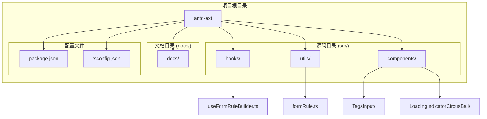
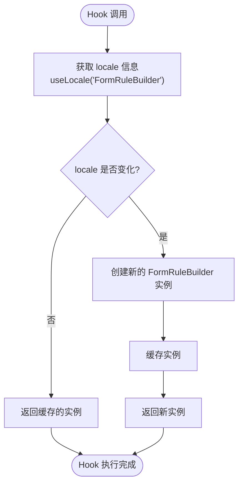
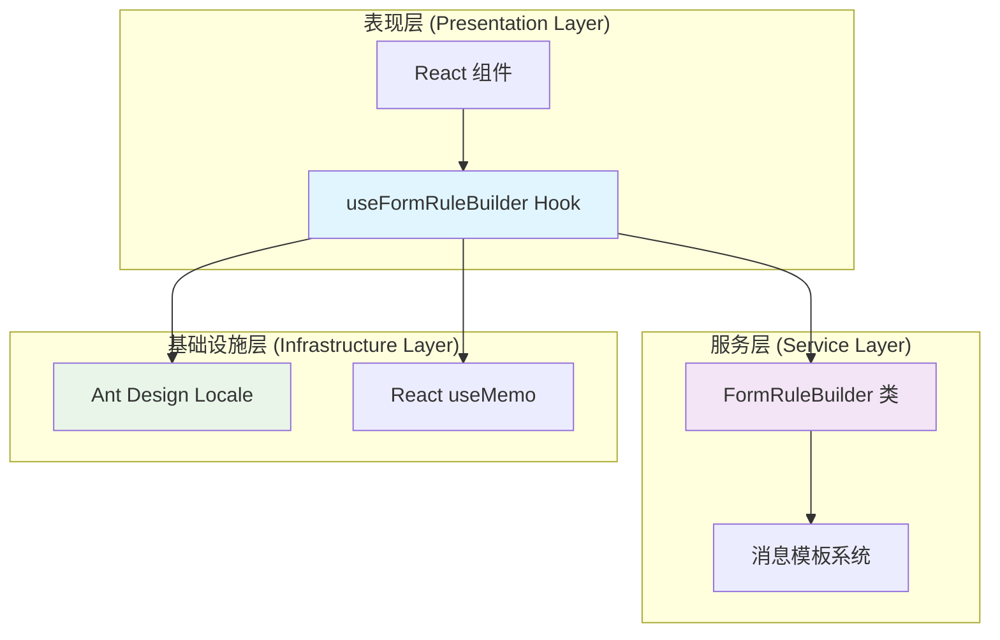
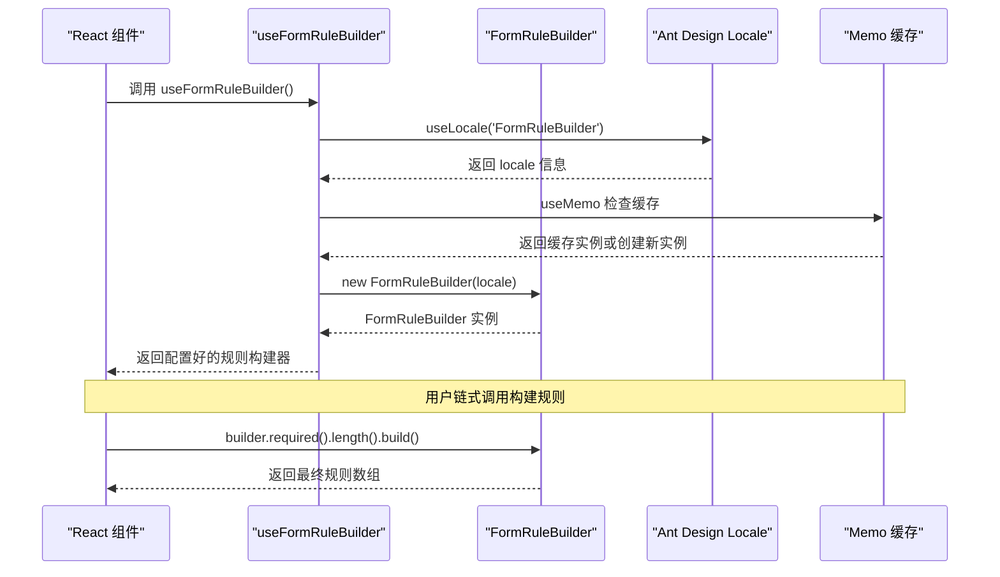
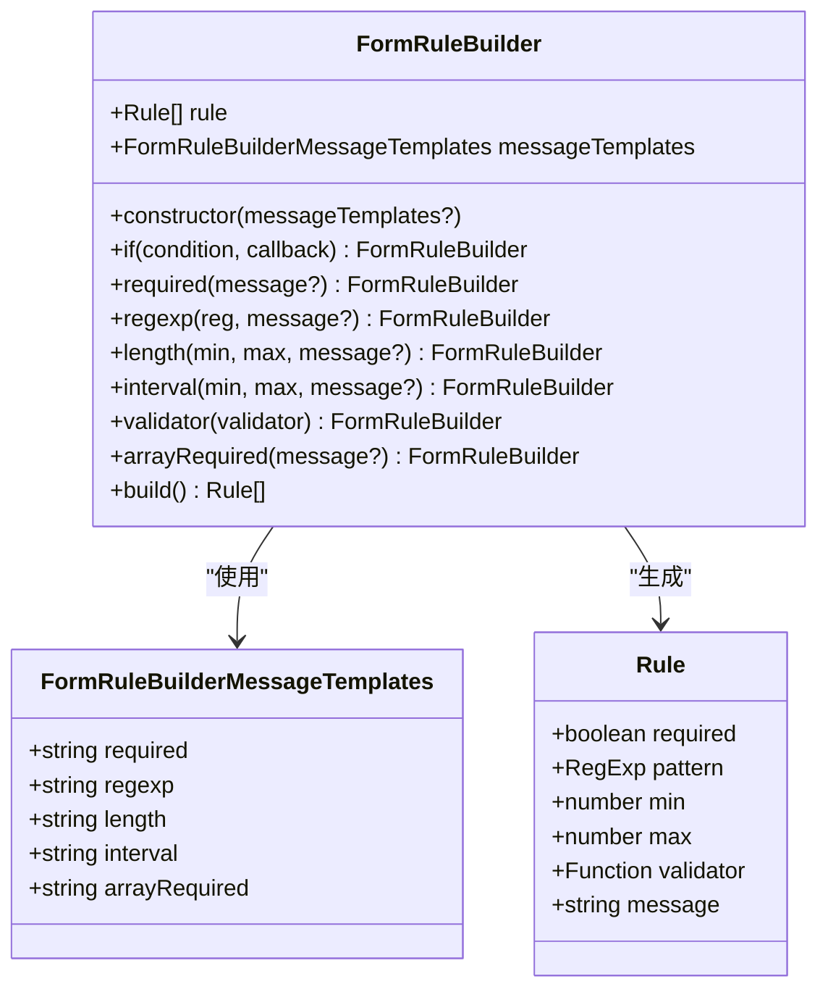
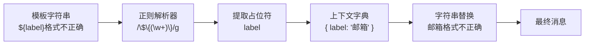
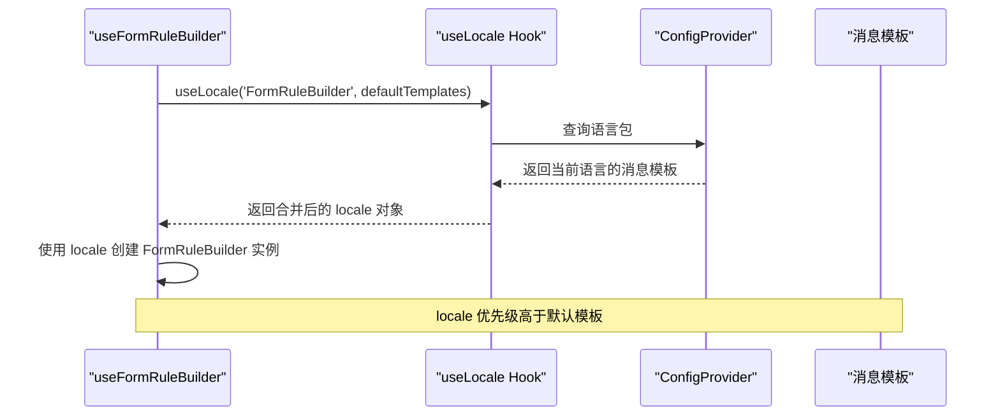
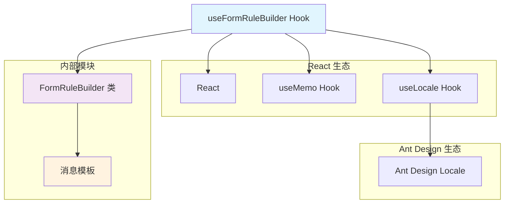
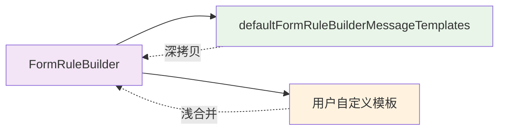

# useFormRuleBuilder - 表单规则构建器

<cite>
**本文档引用的文件**
- [useFormRuleBuilder.ts](file://src/hooks/useFormRuleBuilder.ts)
- [formRule.ts](file://src/utils/formRule.ts)
- [index.ts](file://src/hooks/index.ts)
- [package.json](file://package.json)
- [README.md](file://README.md)
</cite>

## 目录
1. [简介](#简介)
2. [项目结构](#项目结构)
3. [核心组件](#核心组件)
4. [架构概览](#架构概览)
5. [详细组件分析](#详细组件分析)
6. [依赖关系分析](#依赖关系分析)
7. [性能考虑](#性能考虑)
8. [故障排除指南](#故障排除指南)
9. [结论](#结论)

## 简介

useFormRuleBuilder 是一个专门为 Ant Design 表单验证设计的 Hook，它封装了 FormRuleBuilder 类的功能，提供了强大的链式调用 API 来构建表单验证规则。该 Hook 具备以下核心特性：

- **国际化支持**：通过集成 Ant Design 的 useLocale Hook，自动获取当前语言环境的验证消息模板
- **性能优化**：使用 useMemo 缓存 FormRuleBuilder 实例，避免重复创建带来的性能开销
- **灵活的消息定制**：支持外部传入自定义消息，具有更高的优先级
- **链式调用 API**：提供流畅的编程体验，支持复杂的验证规则组合
- **类型安全**：完整的 TypeScript 类型定义，确保开发时的类型安全

## 项目结构

该项目采用模块化的组织结构，主要包含以下关键目录：



**图表来源**
- [useFormRuleBuilder.ts](file://src/hooks/useFormRuleBuilder.ts#L1-L22)
- [formRule.ts](file://src/utils/formRule.ts#L1-L167)
- [index.ts](file://src/hooks/index.ts#L1-L2)

**章节来源**
- [package.json](file://package.json#L1-L93)
- [README.md](file://README.md#L1-L42)

## 核心组件

### useFormRuleBuilder Hook

useFormRuleBuilder 是整个表单验证系统的核心入口点，它将 FormRuleBuilder 类的功能封装为 React Hook，提供了简洁易用的 API。

#### 主要功能特性

1. **国际化集成**：通过 `useLocale` Hook 获取当前语言环境
2. **实例缓存**：使用 `useMemo` 避免不必要的重新创建
3. **消息优先级**：外部传入的消息具有更高优先级
4. **类型安全**：完整的 TypeScript 类型支持

#### 内部实现机制

Hook 的核心实现非常简洁，但包含了关键的性能优化策略：



**图表来源**
- [useFormRuleBuilder.ts](file://src/hooks/useFormRuleBuilder.ts#L9-L19)

**章节来源**
- [useFormRuleBuilder.ts](file://src/hooks/useFormRuleBuilder.ts#L1-L22)

## 架构概览

### 整体架构设计

useFormRuleBuilder 采用了分层架构设计，清晰地分离了关注点：



**图表来源**
- [useFormRuleBuilder.ts](file://src/hooks/useFormRuleBuilder.ts#L1-L22)
- [formRule.ts](file://src/utils/formRule.ts#L42-L160)

### 数据流架构

表单验证规则的构建和应用遵循单向数据流原则：



**图表来源**
- [useFormRuleBuilder.ts](file://src/hooks/useFormRuleBuilder.ts#L9-L19)
- [formRule.ts](file://src/utils/formRule.ts#L42-L160)

## 详细组件分析

### FormRuleBuilder 类分析

FormRuleBuilder 是一个功能完整的表单验证规则构建器，提供了丰富的验证方法和灵活的配置选项。

#### 核心类结构



**图表来源**
- [formRule.ts](file://src/utils/formRule.ts#L6-L13)
- [formRule.ts](file://src/utils/formRule.ts#L42-L160)

#### 验证方法详解

##### 1. 必填验证 (required)

必填验证是最常用的验证规则之一，支持自定义错误消息：

- **参数**：可选的自定义错误消息字符串
- **行为**：添加 `required: true` 规则到内部规则数组
- **消息处理**：优先使用传入的自定义消息，否则使用模板消息

##### 2. 正则表达式验证 (regexp)

用于验证字段值是否符合指定的正则表达式模式：

- **参数**：正则表达式对象和可选的自定义消息
- **行为**：添加 `pattern` 规则到内部规则数组
- **适用场景**：邮箱格式、手机号码、身份证号等

##### 3. 长度验证 (length)

针对字符串类型的长度限制验证：

- **参数**：最小长度、最大长度和可选的自定义消息
- **行为**：添加 `min` 和 `max` 属性的规则
- **消息模板**：支持 `${min}` 和 `${max}` 占位符替换

##### 4. 数值范围验证 (interval)

用于数字类型的范围限制：

- **参数**：最小值、最大值和可选的自定义消息
- **行为**：与 length 方法类似，但适用于数值类型
- **消息模板**：同样支持占位符替换

##### 5. 自定义验证器 (validator)

提供最灵活的验证方式，支持异步验证：

- **参数**：验证函数，接收规则、值和回调函数
- **行为**：直接将验证函数包装为规则
- **适用场景**：服务器端验证、复杂业务逻辑验证

##### 6. 数组必填验证 (arrayRequired)

专门用于数组类型的必填验证：

- **参数**：可选的自定义消息
- **行为**：检查数组是否为空，支持 Promise 异步验证
- **特殊处理**：针对数组类型的空值检查

**章节来源**
- [formRule.ts](file://src/utils/formRule.ts#L67-L147)

### 消息模板系统

消息模板系统提供了灵活的国际化支持和自定义能力：

#### 默认消息模板

系统提供了五种标准的验证消息模板：

| 验证类型 | 默认模板 | 占位符 | 示例 |
|---------|---------|--------|------|
| 必填验证 | `${label}为必填项` | ${label} | 用户名为必填项 |
| 正则验证 | `${label}格式不正确` | ${label} | 邮箱格式不正确 |
| 长度验证 | `${label}长度应在${min}到${max}之间` | ${label}, ${min}, ${max} | 密码长度应在6到20之间 |
| 数值范围 | `${label}应在${min}到${max}之间` | ${label}, ${min}, ${max} | 年龄应在18到65之间 |
| 数组必填 | `请至少选择一项${label}` | ${label} | 请至少选择一项标签 |

#### 消息替换机制

消息模板使用占位符语法 `${placeholder}`，通过 `replacePlaceholders` 函数进行动态替换：



**图表来源**
- [formRule.ts](file://src/utils/formRule.ts#L27-L37)

**章节来源**
- [formRule.ts](file://src/utils/formRule.ts#L15-L22)
- [formRule.ts](file://src/utils/formRule.ts#L27-L37)

### Hook 实现分析

#### 国际化集成机制

useFormRuleBuilder 通过 Ant Design 的 useLocale Hook 实现国际化支持：



**图表来源**
- [useFormRuleBuilder.ts](file://src/hooks/useFormRuleBuilder.ts#L10-L13)

#### 性能优化策略

Hook 采用了双重缓存策略来优化性能：

1. **React 缓存层**：useMemo 提供的内存缓存
2. **实例缓存层**：避免重复创建 FormRuleBuilder 实例

这种设计确保了：
- 当语言环境不变时，不会重新创建实例
- 实例状态得到保持，支持链式调用
- 减少内存分配和垃圾回收压力

**章节来源**
- [useFormRuleBuilder.ts](file://src/hooks/useFormRuleBuilder.ts#L15-L19)

## 依赖关系分析

### 外部依赖

useFormRuleBuilder 的依赖关系相对简单，主要依赖于：



**图表来源**
- [useFormRuleBuilder.ts](file://src/hooks/useFormRuleBuilder.ts#L1-L3)

### 内部模块依赖

FormRuleBuilder 类与其消息模板系统的依赖关系：



**图表来源**
- [formRule.ts](file://src/utils/formRule.ts#L46-L51)

**章节来源**
- [useFormRuleBuilder.ts](file://src/hooks/useFormRuleBuilder.ts#L1-L3)
- [formRule.ts](file://src/utils/formRule.ts#L1-L3)

## 性能考虑

### 缓存策略

useFormRuleBuilder 采用了多层次的缓存策略来优化性能：

#### React 级别缓存

通过 `useMemo` 实现的 React 级别缓存：
- **缓存键**：基于 locale 对象的引用
- **失效条件**：当 locale 发生变化时重新创建实例
- **性能收益**：避免不必要的组件重新渲染

#### 实例级别缓存

FormRuleBuilder 实例的复用：
- **状态保持**：实例内部的状态在链式调用中得以保持
- **内存效率**：减少对象创建和销毁的开销
- **执行效率**：避免重复初始化的性能损失

### 最佳实践建议

1. **顶层调用**：建议在表单组件的顶层调用 useFormRuleBuilder
2. **避免循环创建**：不要在循环或条件渲染中重复创建实例
3. **合理使用消息**：优先使用外部传入的消息以获得更好的优先级控制
4. **类型安全**：充分利用 TypeScript 类型系统确保代码质量

## 故障排除指南

### 常见问题及解决方案

#### 1. 国际化消息未生效

**症状**：表单验证消息仍然是英文或其他语言，不是预期的语言

**可能原因**：
- ConfigProvider 未正确配置语言包
- useLocale Hook 未能正确获取语言环境
- 消息模板未正确传递给 FormRuleBuilder

**解决方案**：
```typescript
// 确保 ConfigProvider 包裹应用
import { ConfigProvider } from 'antd';

const App = () => (
  <ConfigProvider locale={zhCN}>
    {/* 应用内容 */}
  </ConfigProvider>
);
```

#### 2. 自定义消息优先级问题

**症状**：外部传入的消息没有生效，仍然使用默认消息

**可能原因**：
- 消息参数传递错误
- 消息模板配置冲突

**解决方案**：
```typescript
// 正确的使用方式
const ruleBuilder = useFormRuleBuilder();
const rules = ruleBuilder
  .required('这是一个自定义的必填消息')
  .length(5, 20, '自定义长度消息')
  .build();
```

#### 3. 验证规则未触发

**症状**：设置的验证规则没有被触发或没有显示错误消息

**可能原因**：
- 表单字段未正确绑定规则
- 验证时机设置错误
- 规则配置语法错误

**解决方案**：
```typescript
// 确保正确绑定规则
const rules = ruleBuilder
  .required()
  .length(5, 20)
  .build();

// 在表单中正确使用
<Form.Item name="username" rules={rules}>
  <Input />
</Form.Item>
```

#### 4. 性能问题

**症状**：表单渲染缓慢或内存占用过高

**可能原因**：
- 在循环中重复创建 useFormRuleBuilder 实例
- 过度使用复杂的验证规则
- 缓存策略未正确应用

**解决方案**：
```typescript
// 错误的做法 - 在循环中创建
const rules = items.map(item => {
  const builder = useFormRuleBuilder(); // 每次循环都创建新实例
  return builder.required().build();
});

// 正确的做法 - 提前创建
const builder = useFormRuleBuilder();
const rules = items.map(item => {
  return builder.required().build(); // 复用同一个实例
});
```

### 调试技巧

#### 1. 检查消息模板

可以通过以下方式检查当前使用的消息模板：

```typescript
const ruleBuilder = useFormRuleBuilder();
console.log(ruleBuilder.messageTemplates); // 查看当前消息模板
```

#### 2. 验证规则构建过程

在开发环境中可以添加调试日志：

```typescript
const ruleBuilder = useFormRuleBuilder();
const rules = ruleBuilder
  .required('调试消息')
  .length(5, 20)
  .build();
console.log(rules); // 查看最终生成的规则
```

#### 3. 监控缓存效果

通过 React DevTools 监控组件的重新渲染情况，确保缓存策略有效。

## 结论

useFormRuleBuilder 是一个设计精良的 React Hook，它成功地将 Ant Design 的国际化能力和 FormRuleBuilder 的强大功能结合起来，为开发者提供了一个既易用又高效的表单验证解决方案。

### 主要优势

1. **简洁的 API**：链式调用的设计使得规则构建变得直观而流畅
2. **完善的国际化支持**：无缝集成 Ant Design 的国际化体系
3. **优秀的性能表现**：通过多层缓存策略确保高效运行
4. **灵活的定制能力**：支持外部消息覆盖和自定义验证逻辑
5. **类型安全保障**：完整的 TypeScript 支持确保开发时的类型安全

### 适用场景

- **复杂表单验证**：需要多种验证规则组合的场景
- **多语言应用**：需要支持国际化的企业级应用
- **动态表单**：需要根据条件动态生成验证规则的场景
- **企业级应用**：对性能和稳定性有较高要求的应用

### 发展建议

随着项目的不断发展，可以考虑以下改进方向：

1. **扩展验证类型**：增加更多内置的验证规则类型
2. **性能监控**：添加内置的性能监控和分析工具
3. **可视化编辑器**：提供图形化的规则配置界面
4. **插件系统**：支持第三方验证规则的扩展

总的来说，useFormRuleBuilder 为 React 应用的表单验证提供了一个优雅而强大的解决方案，值得在实际项目中广泛应用。