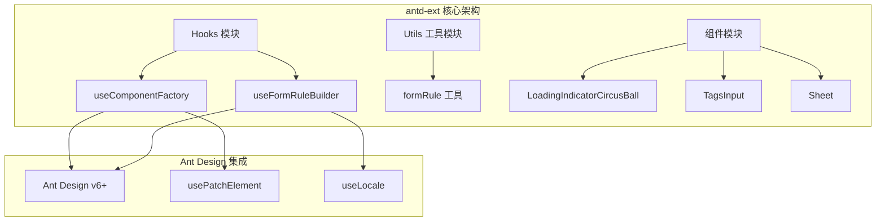
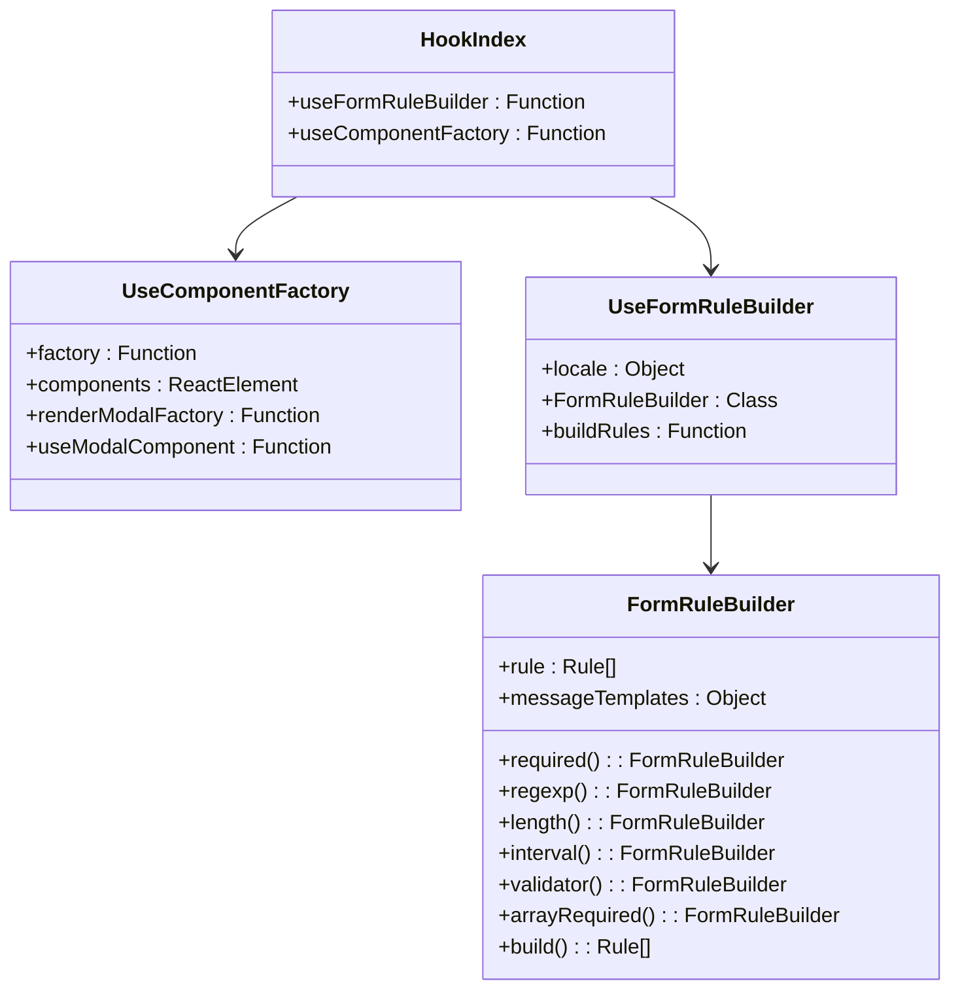
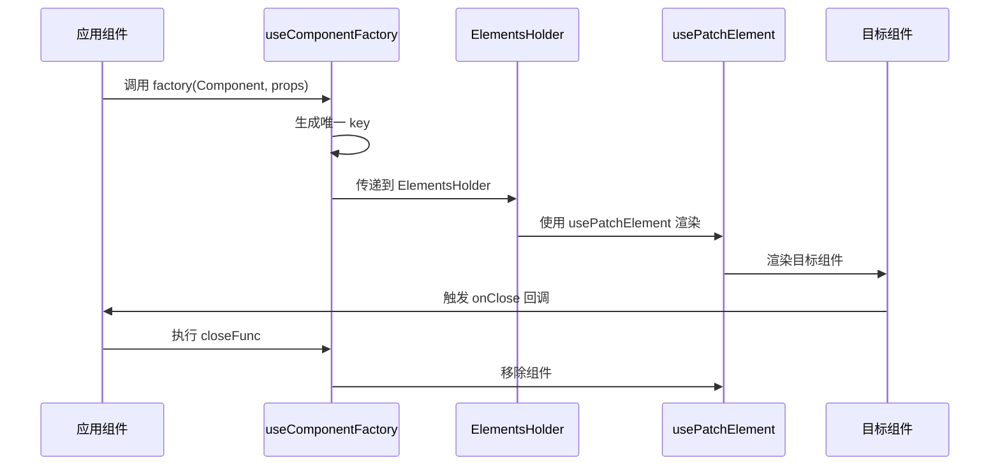
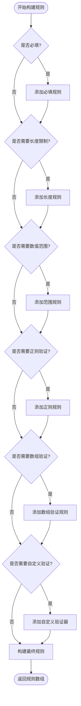
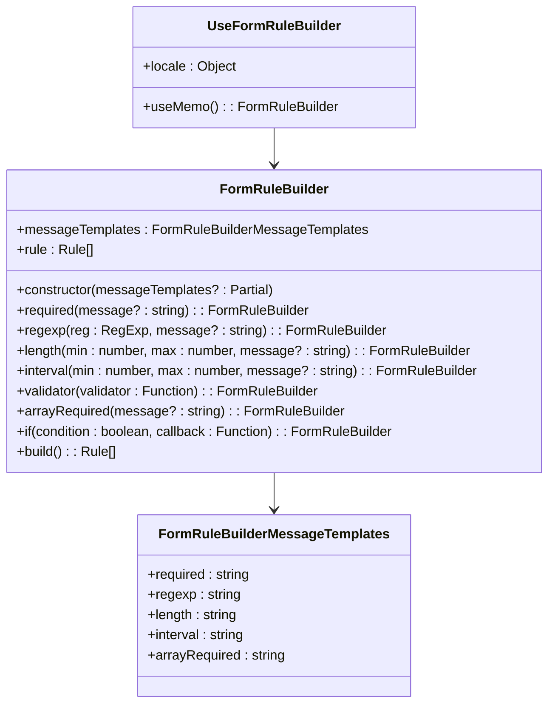
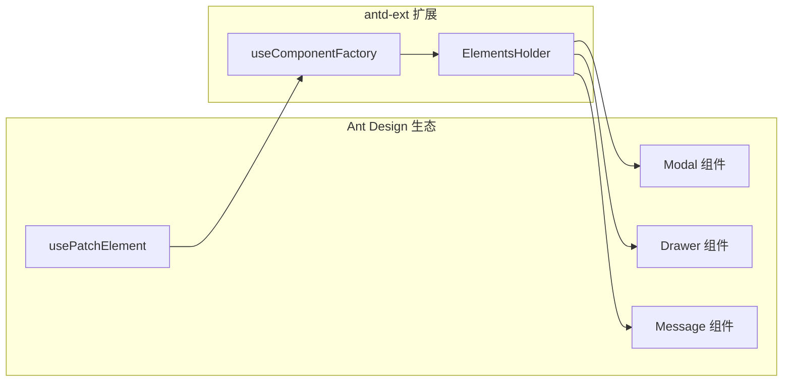
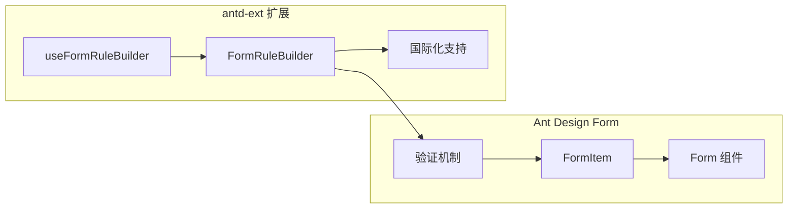
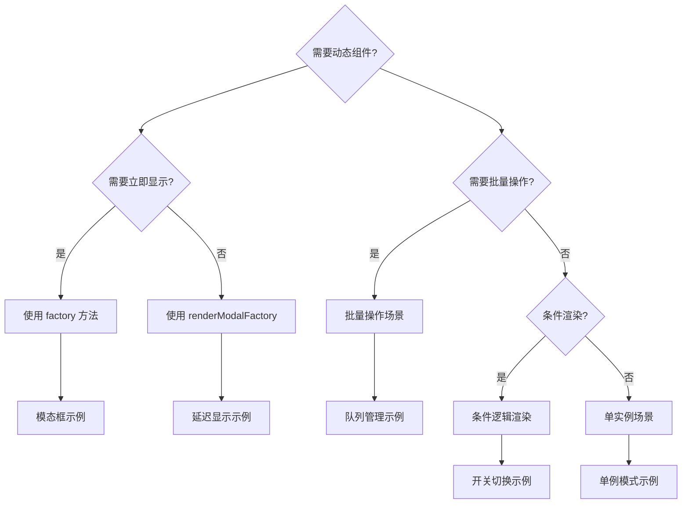
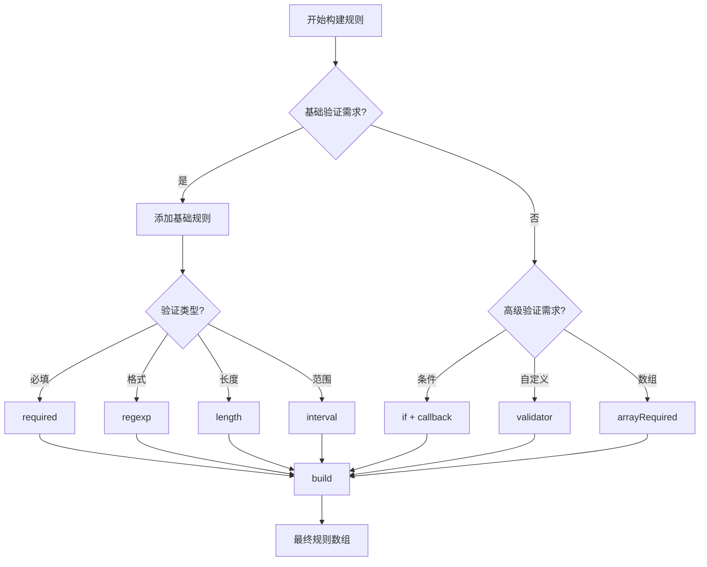

# 自定义 Hook 总览文档

<cite>
**本文档中引用的文件**
- [src/hooks/index.ts](file://src/hooks/index.ts)
- [src/hooks/useComponentFactory.tsx](file://src/hooks/useComponentFactory.tsx)
- [src/hooks/useFormRuleBuilder.ts](file://src/hooks/useFormRuleBuilder.ts)
- [src/utils/formRule.ts](file://src/utils/formRule.ts)
- [package.json](file://package.json)
- [README.md](file://README.md)
</cite>

## 目录
1. [简介](#简介)
2. [项目架构概览](#项目架构概览)
3. [核心 Hook 分析](#核心-hook-分析)
4. [useComponentFactory 工厂模式详解](#usecomponentfactory-工厂模式详解)
5. [useFormRuleBuilder 链式调用模式详解](#useformrulebuilder-链式调用模式详解)
6. [Hook 与 Ant Design 的集成](#hook-与-ant-design-的集成)
7. [使用场景与最佳实践](#使用场景与最佳实践)
8. [性能考虑](#性能考虑)
9. [故障排除指南](#故障排除指南)
10. [总结](#总结)

## 简介

antd-ext 是一个基于 dumi 构建的 React 组件库，专门针对 Ant Design 进行增强与补充。该项目提供了两个核心的开发工具类 Hook：`useComponentFactory` 和 `useFormRuleBuilder`，它们分别解决了动态组件渲染和表单验证规则构建这两个常见的开发痛点。

这些 Hook 不仅提供了简洁优雅的 API，更重要的是与 Ant Design 的原生能力深度集成，为开发者带来了更好的开发体验和更高的开发效率。

## 项目架构概览

antd-ext 采用模块化的架构设计，主要包含以下核心模块：



**图表来源**
- [src/hooks/useComponentFactory.tsx](file://src/hooks/useComponentFactory.tsx#L1-L2)
- [src/hooks/useFormRuleBuilder.ts](file://src/hooks/useFormRuleBuilder.ts#L1-L2)
- [src/utils/formRule.ts](file://src/utils/formRule.ts#L1-L2)

**章节来源**
- [src/hooks/index.ts](file://src/hooks/index.ts#L1-L3)
- [package.json](file://package.json#L80-L85)

## 核心 Hook 分析

antd-ext 提供了两个精心设计的 Hook，每个都针对特定的开发场景进行了优化：

### Hook 模块结构



**图表来源**
- [src/hooks/useComponentFactory.tsx](file://src/hooks/useComponentFactory.tsx#L29-L76)
- [src/hooks/useFormRuleBuilder.ts](file://src/hooks/useFormRuleBuilder.ts#L9-L18)
- [src/utils/formRule.ts](file://src/utils/formRule.ts#L42-L154)

**章节来源**
- [src/hooks/index.ts](file://src/hooks/index.ts#L1-L3)

## useComponentFactory 工厂模式详解

`useComponentFactory` 是一个强大的动态组件渲染 Hook，它采用了工厂模式的设计理念，为开发者提供了一种优雅的方式来处理临时组件（如 Modal、Drawer 等）的动态渲染需求。

### 核心功能特性

#### 1. 工厂模式实现



**图表来源**
- [src/hooks/useComponentFactory.tsx](file://src/hooks/useComponentFactory.tsx#L48-L61)

#### 2. API 设计特点

| 方法 | 参数 | 返回值 | 描述 |
|------|------|--------|------|
| `factory` | `Comp: React.FC \| React.ComponentClass, props?: UseComponentPropsExt` | `void` | 直接渲染组件到 DOM |
| `renderModalFactory` | `Comp: React.FC \| React.ComponentClass, props?: UseComponentPropsExt` | `() => void` | 返回延迟渲染函数 |
| `useModalComponent` | 无 | `UseComponentContextType` | 在 Provider 内使用的上下文 Hook |

#### 3. 关键技术实现

- **usePatchElement 集成**：利用 Ant Design 内置的 `usePatchElement` Hook 实现 DOM 元素的动态插入和移除
- **状态管理**：通过 `useState` 和 `useEffect` 确保组件渲染的时机控制
- **类型安全**：使用 TypeScript 泛型确保组件属性的类型安全
- **生命周期管理**：自动处理组件的挂载和卸载过程

### 使用场景分析

#### 场景一：模态框的动态显示
```typescript
// 使用 factory 直接显示
renderModal(MyModal, { title: '标题', content: '内容' });

// 使用 renderModalFactory 延迟显示
const showModal = renderModalFactory(MyModal, { title: '延迟标题' });
setTimeout(showModal, 1000);
```

#### 场景二：批量操作组件
```typescript
// 批量处理多个组件实例
const actions = [
  renderModalFactory(DeleteConfirm, { id: 1 }),
  renderModalFactory(EditForm, { id: 2 }),
  renderModalFactory(ViewDetails, { id: 3 })
];

actions.forEach(action => action());
```

**章节来源**
- [src/hooks/useComponentFactory.tsx](file://src/hooks/useComponentFactory.tsx#L29-L110)

## useFormRuleBuilder 链式调用模式详解

`useFormRuleBuilder` 是一个基于链式调用模式的表单验证规则构建器，它提供了比传统对象配置更直观、更灵活的规则构建方式。

### 核心设计理念

#### 1. 链式调用架构



**图表来源**
- [src/utils/formRule.ts](file://src/utils/formRule.ts#L67-L153)

#### 2. 规则构建器功能

| 方法 | 参数 | 功能描述 | 返回值 |
|------|------|----------|--------|
| `required()` | `message?: string` | 添加必填验证规则 | `this` |
| `regexp()` | `reg: RegExp, message?: string` | 添加正则表达式验证 | `this` |
| `length()` | `min: number, max: number, message?: string` | 添加字符串长度验证 | `this` |
| `interval()` | `min: number, max: number, message?: string` | 添加数值范围验证 | `this` |
| `validator()` | `validator: Function` | 添加自定义验证器 | `this` |
| `arrayRequired()` | `message?: string` | 添加数组非空验证 | `this` |
| `if()` | `condition: boolean, callback: Function` | 条件性添加规则 | `this` |
| `build()` | 无 | 构建最终规则数组 | `Rule[]` |

#### 3. 本地化支持



**图表来源**
- [src/utils/formRule.ts](file://src/utils/formRule.ts#L6-L22)
- [src/hooks/useFormRuleBuilder.ts](file://src/hooks/useFormRuleBuilder.ts#L9-L18)

### 实际应用示例

#### 基础表单验证规则构建
```typescript
// 创建规则构建器实例
const rules = useFormRuleBuilder();

// 构建复杂验证规则
const formRules = rules
  .required('用户名不能为空')
  .length(3, 20, '用户名长度必须在3-20个字符之间')
  .regexp(/^[a-zA-Z0-9_]+$/, '用户名只能包含字母、数字和下划线')
  .if(isAdmin, builder => builder
    .required('管理员密码不能为空')
    .length(8, 32, '管理员密码长度必须在8-32个字符之间')
  )
  .build();
```

#### 条件验证规则
```typescript
const dynamicRules = rules
  .if(isEmail, builder => builder
    .required('邮箱地址不能为空')
    .regexp(/^\S+@\S+\.\S+$/, '请输入有效的邮箱地址')
  )
  .if(isPhone, builder => builder
    .required('手机号码不能为空')
    .length(11, 11, '手机号码必须为11位数字')
    .regexp(/^1[3-9]\d{9}$/, '请输入有效的手机号码')
  )
  .build();
```

**章节来源**
- [src/hooks/useFormRuleBuilder.ts](file://src/hooks/useFormRuleBuilder.ts#L1-L22)
- [src/utils/formRule.ts](file://src/utils/formRule.ts#L1-L167)

## Hook 与 Ant Design 的集成

antd-ext 的两个核心 Hook 都深度集成了 Ant Design 的原生能力，确保了良好的兼容性和一致性。

### 技术集成点

#### 1. useComponentFactory 集成



**图表来源**
- [src/hooks/useComponentFactory.tsx](file://src/hooks/useComponentFactory.tsx#L1-L2)

#### 2. useFormRuleBuilder 集成



**图表来源**
- [src/hooks/useFormRuleBuilder.ts](file://src/hooks/useFormRuleBuilder.ts#L1-L2)
- [src/utils/formRule.ts](file://src/utils/formRule.ts#L1-L2)

### 兼容性保证

| 集成点 | 兼容版本 | 实现方式 | 优势 |
|--------|----------|----------|------|
| Ant Design 版本 | v6.x+ | 直接依赖 | 确保最新功能支持 |
| React 版本 | >=18.0.0 | 类型定义约束 | 类型安全保障 |
| 国际化系统 | 完全兼容 | useLocale Hook | 自动语言切换 |
| 主题系统 | 完全兼容 | CSS-in-JS 集成 | 主题一致性 |

**章节来源**
- [package.json](file://package.json#L80-L85)

## 使用场景与最佳实践

### useComponentFactory 最佳实践

#### 场景选择指南



#### 实践建议

1. **组件生命周期管理**
   - 确保 `onClose` 回调正确处理资源清理
   - 避免在组件内部直接调用 `closeFunc` 多次

2. **性能优化策略**
   - 对于频繁创建的组件，考虑使用 `renderModalFactory` 缓存
   - 合理使用 `useMemo` 包装复杂的组件属性

3. **错误处理**
   - 为 `useModalComponent` 设置默认错误处理
   - 在 `onClose` 中添加异常捕获

### useFormRuleBuilder 最佳实践

#### 规则构建策略



#### 实践建议

1. **规则组织**
   - 将通用规则提取为可复用的函数
   - 使用 `if` 方法处理条件验证逻辑
   - 合理使用 `build` 方法避免重复计算

2. **本地化配置**
   - 为不同语言环境提供自定义消息模板
   - 利用占位符 `${label}`、`${min}`、`${max}` 等
   - 考虑使用 `useLocale` Hook 获取当前语言设置

3. **性能考虑**
   - 使用 `useMemo` 缓存复杂的规则构建结果
   - 避免在渲染周期内重复创建规则构建器实例

**章节来源**
- [src/hooks/useComponentFactory.tsx](file://src/hooks/useComponentFactory.tsx#L100-L110)
- [src/hooks/useFormRuleBuilder.ts](file://src/hooks/useFormRuleBuilder.ts#L9-L18)

## 性能考虑

### useComponentFactory 性能优化

#### 渲染性能
- **批量更新**：通过 `actionQueue` 实现批量 DOM 操作
- **记忆化**：使用 `useCallback` 缓存工厂函数
- **组件缓存**：React.memo 包装 ElementsHolder 组件

#### 内存管理
- **引用清理**：及时清理不再需要的组件引用
- **事件监听器**：确保 `onClose` 回调正确移除事件监听器
- **副作用清理**：在组件卸载时清理所有副作用

### useFormRuleBuilder 性能优化

#### 计算性能
- **懒加载**：使用 `useMemo` 延迟规则构建计算
- **缓存机制**：基于 locale 变化的缓存策略
- **不可变性**：保持规则构建器的不可变特性

#### 内存使用
- **消息模板缓存**：避免重复创建消息模板对象
- **规则对象复用**：合理复用 Rule 对象减少内存分配

## 故障排除指南

### 常见问题及解决方案

#### useComponentFactory 相关问题

| 问题 | 症状 | 解决方案 |
|------|------|----------|
| 组件无法显示 | 调用 factory 后组件不出现 | 检查是否在 UseModalComponentContext.Provider 内使用 |
| 多次调用导致重复渲染 | 同一组件被多次渲染 | 使用 renderModalFactory 并缓存返回函数 |
| onClose 回调未触发 | 组件关闭后资源未释放 | 确保组件内部正确调用 onClose |
| 内存泄漏 | 组件卸载后内存未释放 | 检查 onClose 回调中的资源清理逻辑 |

#### useFormRuleBuilder 相关问题

| 问题 | 症状 | 解决方案 |
|------|------|----------|
| 规则构建失败 | build() 返回空数组 | 检查方法链调用顺序和参数 |
| 本地化消息无效 | 错误提示仍为英文 | 确保正确配置 messageTemplates |
| 条件规则不生效 | if() 条件判断失效 | 检查条件表达式的返回值 |
| 自定义验证器错误 | validator 方法报错 | 确保 validator 函数正确处理 Promise |

### 调试技巧

1. **组件调试**
   ```typescript
   // 添加调试日志
   console.log('Component rendered:', Comp.name);
   ```

2. **规则调试**
   ```typescript
   // 输出最终规则
   console.log('Generated rules:', rules.build());
   ```

3. **性能监控**
   ```typescript
   // 监控渲染次数
   useEffect(() => {
     console.count('Component re-rendered');
   });
   ```

## 总结

antd-ext 提供的两个核心 Hook —— `useComponentFactory` 和 `useFormRuleBuilder` —— 代表了现代 React 开发中两种重要的设计模式：工厂模式和链式调用模式。

### 主要优势

1. **开发效率提升**
   - `useComponentFactory` 提供了统一的动态组件管理方案
   - `useFormRuleBuilder` 简化了复杂表单验证规则的构建过程

2. **代码质量改善**
   - 强类型的 TypeScript 支持确保代码安全性
   - 深度集成 Ant Design 生态系统，保持一致性

3. **用户体验优化**
   - 流畅的组件动画和过渡效果
   - 智能的本地化消息提示

### 适用场景

- **企业级应用**：需要大量动态组件管理和复杂表单验证的场景
- **快速原型开发**：希望快速搭建交互原型的项目
- **大型团队协作**：需要统一开发规范和最佳实践的团队

### 发展方向

随着 React 生态系统的不断发展，这些 Hook 将继续演进，可能的改进方向包括：
- 更好的 TypeScript 类型推导
- 更丰富的预设规则模板
- 更完善的性能监控和调试工具

通过合理使用这些 Hook，开发者可以显著提升开发效率，同时保持代码的可维护性和可扩展性。